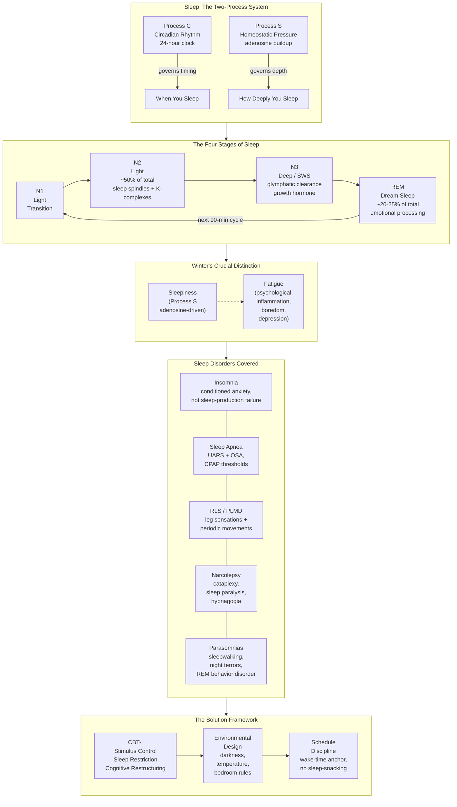

---

## Part 1: Sleep Myths and the Culture of Anxiety (Chapters 1–3)

The book opens by immediately dismantling what Winter calls the foundational myths that keep people trapped in poor sleep. His tone is wry and impatient with the self-defeating language patients bring into his clinic. Chapter 1 is a direct address: if you are alive, you sleep. Saying "I haven't slept in days" is biologically incoherent — patients who believe this are usually describing fragmented, light, anxiety-ridden sleep rather than true wakefulness. Reframing this belief is the first clinical intervention.

Chapter 2 tackles the "insomnia identity" — the way people come to define themselves as bad sleepers. Winter treats this as a form of identity condensation that becomes self-fulfilling: the patient who believes she is "someone who cannot sleep" notices every disruption, monitors the clock obsessively, and generates the physiological arousal (elevated heart rate, cortisol, racing thoughts) that directly prevents sleep onset. The chapter draws on classical conditioning: Pavlovian associations between bed and frustration are more common — and more damaging — than any neurological sleep disorder.

Chapter 3 exposes the cultural mythology around the "eight-hour rule." Winter points out that this number is an unexamined average, not a biological law. Anxiety about missing eight hours is in itself a significant cause of sleep-onset delay. He introduces the concept of **sleep efficiency** — the proportion of time in bed actually spent sleeping — as a more useful metric. People sleeping six hours with high efficiency may be better off than people in bed for nine hours with low efficiency. The cultural pressure to hit a specific number creates more than it resolves.

---

Key concept introduced here: **Insomnia is not about not sleeping — it is about being frustrated by the quality of your sleep.** Every chapter that follows works backward from this redefinition.

---

## Part 2: How Sleep Works (Chapters 4–7)

With myths dispatched, Winter builds a clinical framework for understanding sleep physiology in plain language.

### Chapter 4: The Two-Process Model

Winter explains the 1982 Borbely two-process model, the single most useful conceptual tool for understanding sleep. **Process C** is the circadian clock — a roughly 24-hour internal timer centered in the suprachiasmatic nucleus (SCN) of the hypothalamus. It governs *when* you feel alert and when you feel sleepy, largely through melatonin secretion in response to light/dark detection by the retina. **Process S** is the homeostatic sleep drive — adenosine accumulates in the brain throughout wakefulness and is cleared during sleep, creating pressure that builds and dissipates over hours.

The interaction of these two systems creates the familiar pattern: a strong circadian alerting signal in the morning (the cortisol wake-up), declining alertance toward evening as adenosine accumulates and melatonin rises, and a low point — the circadian trough — in the early morning hours (typically 3–5 AM). Understanding this model explains jet lag, shift worker fatigue, why late-night screen exposure ruins sleep, and why a consistent sleep schedule works.

Winter uses a financial analogy: sleep debt is real but managed like a bank account that earns and pays interest irregularly. Occasional late nights are manageable; chronic under-sleeping, like chronic underpaying, compounds problems that eventually become a crisis.

### Chapter 5: Sleep Architecture — Light, Deep, and REM

Winter introduces the three functional categories of sleep — light sleep (N1 and N2), deep sleep (N3 or SWS), and REM sleep — in clinical terms. N2 is the workhorse: approximately 50% of total sleep, characterized by sleep spindles and K-complexes that protect against arousal and support memory consolidation. N3 (deep slow-wave sleep) predominates in the first half of the night and is the most physically restorative stage: growth hormone release, immune system support, and tissue repair occur here. REM sleep, concentrated in the second half, supports emotional processing and cognitive integration.

Winter emphasizes that all stages matter — suppressing REM with alcohol or suppressing N3 with aging or apnea both degrade sleep quality in specific, measurable ways. Patients who subjectively feel their sleep is "fine" but report daytime fatigue often have unrecognized disruption of a specific stage.

### Chapter 6: Sleepiness vs. Fatigue — The Critical Distinction

This is arguably the book's most important conceptual contribution. Winter insists readers learn to distinguish:

- **Sleepiness**: the genuine biological drive to sleep, mediated by adenosine and Process S. Characterized by heavy eyelids, head nodding, and microsleeps. If you are sleepy, only sleep resolves it.
- **Fatigue**: the sensation of low energy, mental or physical tiredness, or lack of motivation. It can be caused by depression, boredom, inflammation, hormonal shifts, or stress. Treating fatigue with caffeine or more time in bed may not help and often makes the sleep problem worse.

Winter illustrates with case studies: the patient with sleep apnea who is constantly fatigued but not sleepy (because his fragmented sleep constantly restarts his homeostatic pressure) versus the patient with genuine Process S failure who cannot stay awake even when rested and alert. Getting the diagnosis right depends on getting this distinction right.

### Chapter 7: The GABA Connection and Neurochemistry of Sleep

A more technically detailed chapter that explains the neurotransmitter systems governing sleep. GABA (gamma-aminobutyric acid) is the brain's primary inhibitory neurotransmitter; most prescription sleep aids (benzodiazepines, Ambien, Lunesta) enhance GABA activity. Winter explains why this pharmacological enhancement is not equivalent to natural sleep: it sedates the cortex but does not generate the normal cycling through sleep stages.

He describes adenosine's role alongside the complementary role of melatonin (primarily a circadian signal, not a strong sedative). He explains why bright light exposure in the morning anchors the circadian rhythm and why evening light suppresses melatonin release. This chapter gives readers the biochemical vocabulary to understand why behavioral interventions — consistent light exposure, not screens before bed — produce real, measurable changes in sleep quality.

---

## Part 3: Common Sleep Disorders in Clinical Practice (Chapters 8–14)

Chapters 8 through 14 form the clinical heart of the book. Winter walks through each major sleep disorder using case studies drawn directly from his practice.

### Chapter 8: Insomnia — Not a Sleep-Production Disorder

Winter defines insomnia clinically: difficulty initiating sleep, difficulty maintaining sleep, or early-morning awakening that causes significant distress or impairment, persisting for at least three months at a frequency of at least twice per week. Critically, he reframes insomnia as a disorder of arousal and conditioning, not of sleep production. The patient with chronic insomnia almost certainly sleeps more than she believes — clock monitoring and sleep-state misperception are hallmarks of the condition.

He introduces stimulus control therapy — the behavioral instruction to use the bed only for sleep and sex, to leave the bed if unable to sleep within 15–20 minutes, and to return only when sleepy — as the foundational first-step intervention.

### Chapter 9: Sleep Apnea — The Silent Nighttime Thief

Winter explains obstructive sleep apnea (OSA) and upper airway resistance syndrome (UARS) as conditions where the airway collapses during sleep, causing oxygen desaturation, arousals, and autonomic nervous system disruption. He emphasizes that OSA is not just a problem of overweight middle-aged men: it occurs in thin people, women, children, and athletes. Key signs include loud snoring, witnessed pauses in breathing, morning headaches, and persistent fatigue despite adequate sleep time.

He reviews CPAP (continuous positive airway pressure) devices, oral appliance therapy, positional therapy, and surgical options with clinical realism. The chapter's central message: if you have risk factors or symptoms, get a sleep study — untreated OSA is strongly associated with cardiovascular disease, cognitive impairment, and metabolic dysfunction.

### Chapter 10 and 11: Restless Legs Syndrome and Periodic Limb Movement Disorder

RLS (Willis-Ekbom disease) and PLMD are twin conditions driven by iron dysregulation in the brain and dopaminergic dysfunction. Winter explains the diagnostic criteria — uncomfortable leg sensations, worse at rest, worse in the evening, relieved by movement — and distinguishes RLS from simple muscle cramping or neuropathy.

PLMD, often unrecognized even by patients, involves repetitive stereotyped leg movements during sleep that cause brief, frequent micro-arousals. The patient wakes fatigued and does not know why. A bed partner's observation of kicking or jerking movements is often the clue. Iron studies and dopaminergic medications, or sometimes gabapentin enacarbil, are the treatment approaches Winter describes.

### Chapter 12: Narcolepsy — When Sleep Intrudes on Wakefulness

Winter gives a clear clinical picture of narcolepsy type 1 (with cataplexy) and type 2, including the classic tetrad of excessive daytime sleepiness, cataplexy (sudden muscle weakness triggered by emotion), sleep paralysis, and hypnagogic/hypnopompic hallucinations. The pathophysiology — autoimmune destruction of hypocretin-producing neurons in the hypothalamus — is explained clearly. Treatment options covered include scheduled napping, modafinil/armodafinil, sodium oxybate (Xyrem), and pitolisant.

### Chapter 13: Sleepwalking, Night Terrors, and REM Behavior Disorder

Winter distinguishes parasomnias arising from N3 (sleepwalking, night terrors, confusional arousals — typically in children and occurring in the first third of the night) from REM behavior disorder (RBD — acting out dreams, typically in older adults, often a prodrome of neurodegenerative disease). The clinical significance: RBD in particular can precede Parkinson's disease or Lewy body dementia by many years, and patients with RBD should be monitored neurologically.

### Chapter 14: Shift Work, Jet Lag, and Circadian Mismanagement

Winter gives practical guidance for people whose schedules conflict with their circadian biology. He explains why a rotating schedule is particularly destructive, how partial sleep deprivation accumulates across a work week, and why "catching up" on weekends is physiologically inadequate. His practical methods for jet lag: timed light exposure, timed melatonin, gradual schedule adjustment before travel. For shift workers: strategic napping, creating a dark-sleep environment, and negotiating with employers for schedule stability.

---

## Part 4: Medications and the Pharmacology of Sleep (Chapters 15–17)

### Chapter 15: Sleeping Pills — What They Actually Do

Winter is direct and skeptical. Most hypnotics — Ambien (zolpidem), Lunesta (eszopiclone), Sonata (zaleplon), and over-the-counter antihistamines like diphenhydramine — work primarily by enhancing GABAergic transmission, which sedates the cortex without reproducing the normal sleep architecture. He cites evidence that these drugs produce lighter, more fragmented sleep than patients perceive, suppress deep and REM sleep, carry risks of dependence and tolerance, and cause next-day cognitive impairment (especially in older adults, who are disproportionately prescribed them).

He notes the 2012–2013 FDA warnings about zolpidem-related complex sleep behaviors (sleep-driving, sleep-eating) as medically significant. Barbiturates, while largely out of fashion for insomnia, are even more dangerous because of their narrow therapeutic window and overdose risk. The chapter's policy implication: sleeping pills should be short-term interventions, not chronic solutions.

### Chapter 16: Antidepressants Prescribed for Sleep

A sometimes-overlooked topic. Many patients — especially in Winter's experience — are prescribed low-dose trazodone, mirtazapine, or amitriptyline for sleep without a formal depression diagnosis. Winter explains why this happens: these drugs have sedating side effects that help sleep initiation, but they also suppress REM sleep (which may be therapeutically useful in depression, where REM is often dysregulated) and carry their own side effect profiles, including next-day grogginess, weight gain, and sexual dysfunction. The question he poses to patients and prescribers: are we treating the sleep problem, or just hiding it?

### Chapter 17: Over-the-Counter Sleep Aids and Supplements

Winter reviews melatonin, valerian root, magnesium, chamomile, and the common antihistamine-based OTC products. His take is even-handed: melatonin at appropriate doses (0.5–3mg, timed about 90 minutes before desired sleep onset) can help realign circadian timing, especially for jet lag or delayed sleep phase syndrome, but megadoses are not more effective. Valerian has mixed evidence. Most herbal supplements lack rigorous clinical trial data. Antihistamine-based OTC products work through sedation but have significant anticholinergic side effects that make them inappropriate for routine use, especially in older adults.

---

## Part 5: The Sleep Solution — A Behavioral Program (Chapters 18–20)

### Chapter 18: Stimulus Control

Winter's first core recommendation for chronic insomnia is stimulus control, derived directly from the CBT-I protocol. Rules: (1) Go to bed only when sleepy; (2) use the bed only for sleep and sex; (3) if unable to sleep within 15–20 minutes, get out of bed and do something quiet and boring in low light until sleepy; (4) get out of bed at the same time every morning regardless of how poorly you slept; (5) no daytime napping initially (if sleep efficiency is low enough to require sleep restriction, which it usually is for chronic insomniacs).

The logic is classical conditioning: after weeks of associating bed with frustration and wakefulness, the brain must relearn the association of bed with sleep. This requires breaking the old conditioning through whatever discomfort is necessary.

### Chapter 19: Sleep Restriction and Schedule Discipline

Perhaps the most counterintuitive recommendation: when someone is sleeping very little at night, the solution is to spend *less* time in bed, not more. Sleep restriction therapy involves deliberately limiting time in bed to match actual sleep time, then gradually expanding as efficiency improves. For example, a patient sleeping 5 hours out of 9 in bed is initially restricted to 5.5 hours. The resulting mild sleep deprivation consolidates sleep, deepens it, and rapidly improves sleep efficiency.

Winter couples this with the anchor of a fixed wake-time, seven days a week, including weekends. He argues that this single rule — no later wake-up on Saturday and Sunday — does more to stabilize circadian timing than any other behavioral change. The "social jet lag" of weekend late sleeping directly shifts the circadian clock, making Monday morning sleep onset a fresh struggle every week.

### Chapter 20: Cognitive Restructuring and The Broader Solution

The final chapter addresses the "why" behind the myths and anxieties and offers scripts for reframing. Winter teaches patients to replace catastrophic predictions ("if I don't sleep tonight, tomorrow is ruined") with realistic appraisals ("even a bad night, I will still function; my body will sleep even if my mind complains"). He addresses the role of hyperarousal from stress, PTSD, and chronic illness and recommends professional help when self-help is insufficient.

Winter's closing message is pragmatic: you may never be a perfect sleeper, but you can almost certainly sleep much better than you are sleeping now. The goal is not Olympic-level sleep performance — it is adequate, satisfying, consistent rest that supports the health and energy you need for the life you have.

---

## Reading Guide

### Sufficiency Assessment

This book summary captures Winter's core clinical model — the myth-busting opening, the two-process framework, the sleepiness/fatigue distinction, the disorder chapters, the skepticism about prescriptions, and the CBT-I toolkit. Readers who work through this summary will understand the book's central argument and its practical recommendations well enough to begin applying them.

What this summary cannot convey fully: the texture of Winter's wit and clinical storytelling; the specific patient cases that make each chapter memorable and illustrate diagnostic nuance; the depth of his discussion in the medication chapters, which is more grounded in pharmaceutical detail than summarized here; and the experiential quality of the CBT-I exercises, which require active commitment rather than passive reading.

### Recommended Reading Path

| Reader Type | Time | What to Read |
|-------------|------|--------------|
| Casual | ~25 min | This summary |
| Interested | ~3-4 hr | This summary + select chapters from Parts 2 and 5 (Chapters 4–7 and 18–20) |
| Practitioner / Chronic Insomniac | ~8-10 hr | Full book |

### Chapters to Read in Full (if not reading the whole book)

- **Chapter 6** — Sleepiness vs. Fatigue: this single concept is worth the price of the book and is worth reading in Winter's full clinical detail
- **Chapters 8–10** — If you suspect you have insomnia, apnea, or RLS, read these case-study-rich chapters for diagnostic clarity that general web searches cannot provide
- **Chapters 18–20** — The behavioral program is the actionable heart of the book; the workbook-style instructions deserve your full attention

### Chapters to Skim or Skip

- **Chapters 12–13** — Narcolepsy and parasomnias are fascinating but not directly relevant to most readers; skim unless you know someone with these conditions
- **Chapter 17** — The supplements overview is useful but readily available from other sources; the takeaway (timed melatonin helps; most others don't) is covered in this summary

### What You'll Miss by Not Reading the Full Book

Winter's voice — sardonic, generous, and clinically precise — is the book's defining quality. His patient cases contain diagnostic clues and reframing techniques that stick differently than abstract advice. The CBT-I instructions, read straight from the clinician who uses them daily, carry an authority that summaries cannot replicate. And his critique of the sleeping pill industry is grounded in specific patient outcomes, making it harder to dismiss.
