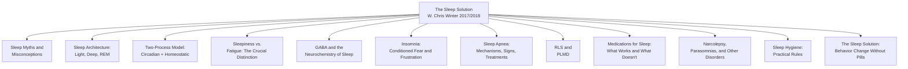

## Overview

*The Sleep Solution: Why Your Sleep Is Broken and How to Fix It* is a landmark guide to sleep from the perspective of clinical practice rather than research laboratories. Written by board-certified neurologist and sleep medicine specialist W. Christopher Winter, MD, the book was first published by Penguin Random House on April 4, 2017, and released in trade paperback by Penguin Books in 2018. It bridges the gap between popular sleep science and the day-to-day realities of patients in a sleep medicine clinic.

What distinguishes *The Sleep Solution* from contemporaneous works like Matthew Walker's *Why We Sleep* is its tone, its audience, and its grounding. Where Walker is a scholar synthesizing decades of laboratory research for a general readership, Winter is a practicing physician writing from twenty-plus years of seeing patients. The book's core governing idea is that most insomnia is not a sleep-production problem — people sleep every night whether they realize it or not — but a sleep-quality and sleep-confidence problem rooted in anxiety, poor behavioral conditioning, and widely held myths that make the problem worse. The book is at once a sleep science primer, a myth-buster, a case-study collection, and a practical CBT-I (cognitive behavioral therapy for insomnia) manual accessible to lay readers.

---

---

## Book Structure

| Section | Chapters | Core Argument |
|---------|----------|---------------|
| **Part 1: Sleep Myths** | 1–3 | Most beliefs about sleep are wrong, harmful, or both. "I haven't slept in days" is biologically impossible. Sleep problems start with a narrative, not a neurological failure. |
| **Part 2: Sleep Mechanics** | 4–7 | How sleep works: the two-process model, sleep architecture (light, deep, REM), the chemistries of sleep (GABA, adenosine, melatonin), and the critical difference between sleepiness and fatigue |
| **Part 3: Sleep Disorders** | 8–14 | Clinical presentations of insomnia, sleep apnea, restless legs syndrome, PLMD, narcolepsy, sleep paralysis, and parasomnias — told through illustrative patient cases |
| **Part 4: Medications and Fixes** | 15–17 | What sleeping pills actually do, why they often fail, how antidepressants get prescribed off-label, and why CBT-I outperforms pharmacological approaches |
| **Part 5: The Sleep Solution** | 18–20 | The actionable program: behavioral rules, environmental changes, schedule discipline, and cognitive reframing that consistently resolve insomnia |

---

## Key Takeaways

1. **"I haven't slept in days" is a myth.** If you are alive, you are sleeping. The body cannot go days without sleep — it will force sleep upon you. What people mean is that their sleep was not satisfying: they were fragmented, anxious, and unrested. Accepting that you do sleep — however badly — is the first step toward fixing it.

2. **Sleepiness and fatigue are not the same thing.** Sleepiness is the biological pressure to sleep, driven primarily by adenosine and the homeostatic system. Fatigue is a sensation of low energy that can come from stress, boredom, boredom, inflammation, or depression. Treating fatigue with naps or more time in bed often backfires; addressing the actual root cause does not.

3. **The two-process model governs sleep quality.** The interaction of the circadian clock (Process C) and the homeostatic sleep drive (Process S) determines when you feel sleepy and how restorative your sleep is. Understanding and aligning with both processes — regular schedule, appropriate light exposure — is more effective than any sleep aid.

4. **Insomnia is largely a conditioned emotional response.** It is not simply "cannot sleep"; it is "anxious about not sleeping." This anxiety triggers physiological arousal (elevated cortisol, racing thoughts) that directly opposes sleep onset. The conditioned association between bed and frustration creates a cycle that CBT-I is specifically designed to break.

5. **Sleeping pills are not natural sleep.** Most prescription and over-the-counter sleep aids sedate the brain's cortex rather than promoting natural sleep architecture. Ambien, Lunesta, Sonata, and diphenhydramine can fragment sleep architecture, suppress REM or deep sleep, carry dependence risks, and may impair next-day performance while creating the illusion of restful sleep.

6. **CBT-I outperforms sleeping pills for chronic insomnia.** Multiple clinical trials confirm that cognitive behavioral therapy for insomnia produces superior long-term outcomes to pharmacological interventions. It addresses the root behaviors and cognitions driving insomnia rather than masking symptoms, and its benefits persist after treatment ends.

7. **Sleep apnea is vastly underdiagnosed.** Winter emphasizes that anyone who snores, wakes unrefreshed, or experiences daytime sleepiness — especially if carrying excess weight — should be evaluated for obstructive sleep apnea. CPAP and oral appliances can be genuinely life-transforming, yet the condition often goes unrecognized for years.

8. **The bedroom is for sleep and sex only.** Phones, TVs, laptops, tablets, and even working in bed all create conditioned associations between the sleep environment and arousal — both the physiological kind and the screen-driven cognitive kind. This Pavlovian conditioning directly undermines sleep onset and sleep confidence.

9. **The "eight-hour rule" is not universal, and anxiety about it is harmful.** Sleep needs vary by individual, age, and genetics. The rigid cultural standard of eight hours creates unnecessary anxiety and self-diagnosis of insomnia in people who are actually sleeping adequately. What matters more than a specific number is feeling rested.

10. **A consistent wake-up time is the single most powerful sleep tool.** Rather than fixating on a bedtime (which naturally shifts), anchoring your mornings with the same wake-up time every day — including weekends — powerfully stabilizes the circadian clock, consolidates sleep, and gradually drives earlier, more efficient sleep.

---

## Who Should Read

| Reader Type | Why |
|-------------|-----|
| Chronic insomniacs | Winter is a practicing sleep physician; his advice derives from thousands of patient encounters rather than laboratory studies alone |
| Shift workers and frequent travelers | Book covers circadian disruption with practical strategies for managing jet lag and irregular schedules |
| Primary care physicians and nurse practitioners | Winter bridges sleep medicine and general practice in ways directly applicable to clinical decision-making |
| Parents of poor-sleeping children | Winter's later work *The Rested Child* expands on these themes; this book introduces the clinical framework |
| Anyone on sleeping pills | Straight talk on what pills actually do, their limitations, and when withdrawal and CBT-I are safer and more effective |
| People who feel fatigued but not sleepy | Critical distinction between fatigue and sleepiness; book teaches readers to diagnose the actual problem |

---

## Who Should Skip

- Researchers seeking detailed sleep neurophysiology — Winter keeps the science accessible and clinically oriented; scientists should look to Walker or primary literature
- Readers who have already successfully completed CBT-I — the practical sections will feel repetitive
- People looking for supplementation protocols or hormonal optimization — Winter is skeptical of supplements beyond basic melatonin and magnesium
- Extreme chronotype enthusiasts seeking validation for very late or very early schedules — Winter emphasizes regularity over natural tendency

---

## Historical Context

| Date | Event |
|------|-------|
| 1993 | W. Christopher Winter begins involvement in sleep medicine research while at the University of Virginia |
| 1999–2004 | Winter completes medical training, including residency and sleep medicine fellowship at UNC and Emory |
| 2004 | Opens Charlottesville Neurology and Sleep Medicine; begins two decades of clinical practice |
| Early 2010s | Winter coining the term "circadian advantage" through MLB performance research; advises the San Francisco Giants |
| 2013 | Winter's research links MLB player sleepiness to reduced career longevity |
| 2016 | Arianna Huffington's *The Sleep Revolution* references Winter as a key voice in the emerging sleep science movement |
| 2017 | *The Sleep Solution* published by Penguin Random House (Berkley); quickly becomes a bestseller in the sleep space |
| 2018 | *The Sleep Solution* released in Penguin Books UK trade edition; NY Magazine names it a top book for understanding sleep |
| 2021 | Winter publishes follow-up, *The Rested Child*, applying the same clinical approach to pediatric sleep |
| 2025 | Winter hosts widely-ranked medical podcast *Sleep Unplugged*; continues advising professional sports organizations |

---

## Core Themes

| Theme | Description |
|--------|-------------|
| Myth-Busting and Narrative Reframing | A persistent theme: patients suffer not from unusual biology but from harmful stories they believe about their own sleep. Replacing "I can't sleep" with "I sleep badly sometimes" is therapeutically powerful. |
| Sleepiness vs. Fatigue Differentiation | Winter repeatedly requests patients to distinguish between two sensations they often confuse. Treating the wrong one — using stimulants for fatigue, or sleeping pills for poor sleep quality — perpetuates the problem. |
| Behavioral and Cognitive Solutions Over Pharmacology | The book's therapeutic backbone is CBT-I: stimulus control, sleep restriction, cognitive restructuring, and relaxation. Winter is consistently critical of the overprescription of hypnotics. |
| Environmental and Schedule Design | Practical rules (room darkness, no screens, no late meals, wake-time anchoring) recur throughout and are presented as more reliable than any drug or supplement. |
| The Clinical Reality of Sleep Disorders | Winter's case-study style — heavy on patient stories — communicates that sleep disorders are real, often complex, but usually treatable conditions. He emphasizes that seeking professional evaluation matters. |

---

## Why This Book Matters

*The Sleep Solution* arrived at a moment when sleep science was transitioning from a niche medical specialty to mainstream public health discourse. Matthew Walker's *Why We Sleep* (published later that same year) took the science to a broad audience with sweeping biological claims; Winter's book offered what Walker did not: an insider's view of how sleep medicine actually works, what patients actually experience, and what treatments actually produce results.

The book matters because it fills a critical gap between popular science and medical advice. Too many sleep books are either research-heavy tomes inaccessible to lay readers, or self-help pamphlets stripped of scientific grounding. Winter is both credentialed and conversational. His skeptical, slightly sardonic tone dismantles the anxiety culture around sleep — particularly the "perfect sleeper" culture on social media — and replaces it with a more forgiving, evidence-based framework.

Its practical impact is real: CBT-I techniques from the book have helped thousands of chronic insomniacs reduce or eliminate their reliance on sleeping pills. Its contribution to the broader discourse is also significant: it popularized the distinction between sleepiness and fatigue, reframed insomnia as a conditioned response rather than a disease, and challenged the medical tendency to reach for prescriptions before treating the underlying behavioral and cognitive patterns.

**Rating: 8.5/10** — The best single introduction to clinically grounded sleep medicine available for a general audience. Less ambitious in scope than *Why We Sleep*, but more immediately useful for anyone actively suffering from poor sleep.
