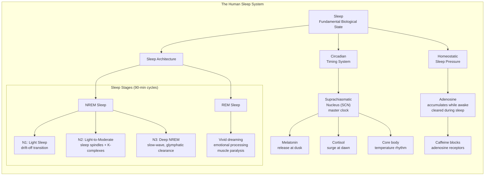
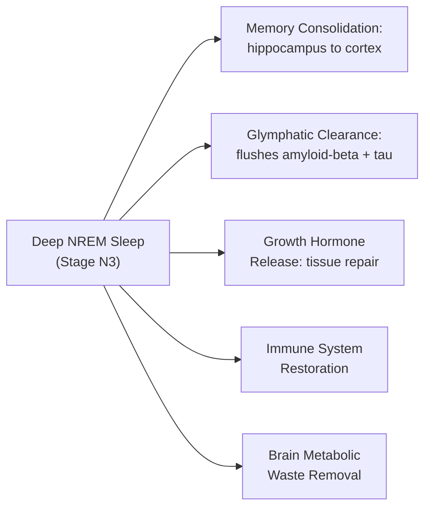
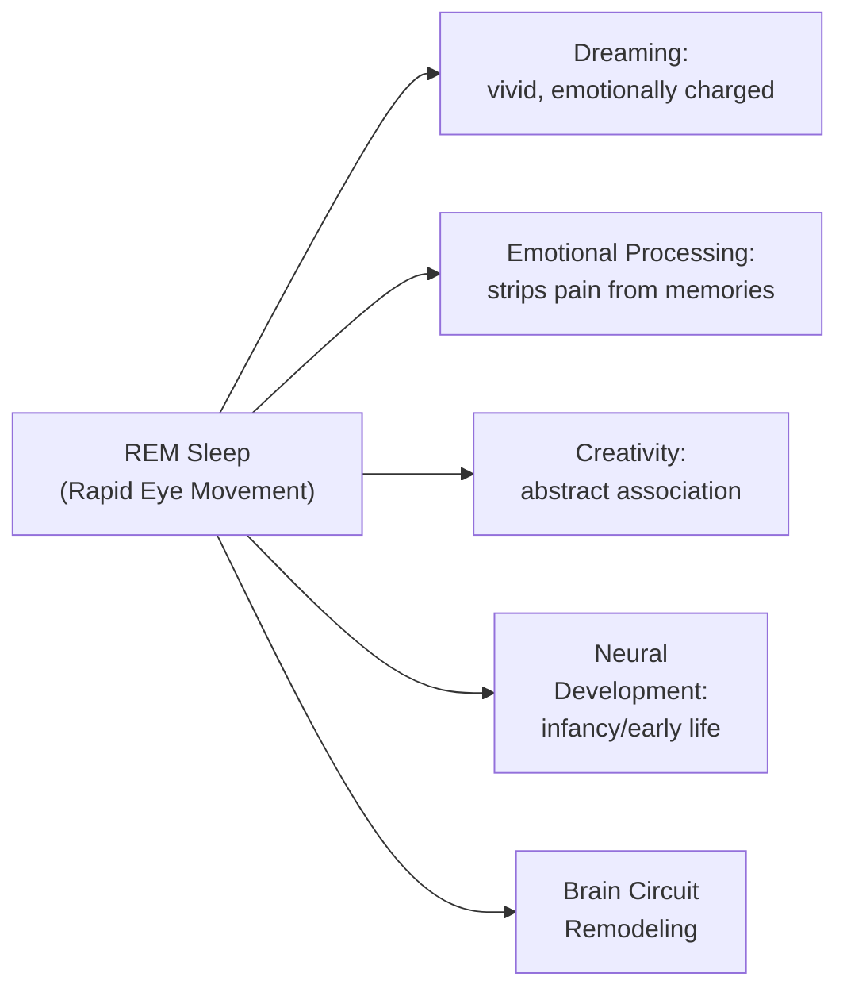
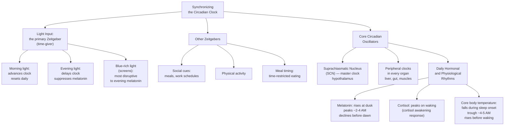
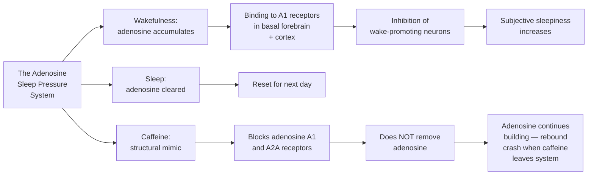
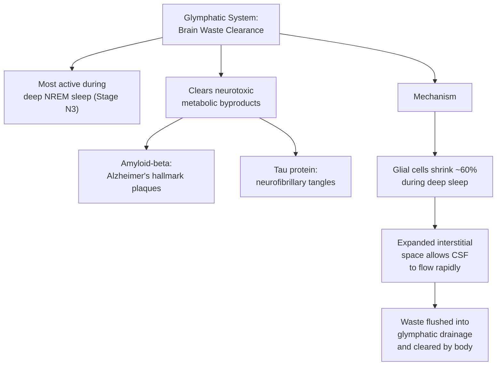

---

## Sleep Architecture: The Four Stages

Human sleep is organized into approximately ninety-minute cycles, each containing four distinct stages. These stages are not a single uniform state but a dynamic, organized progression that serves different physiological and cognitive functions.

### NREM Stage 1 — Light Sleep Transition

Stage N1 is the threshold between wakefulness and sleep. It typically lasts one to seven minutes at the beginning of the night. Brain activity begins to slow, muscles relax, and hypnic jerks — those sudden startling movements that can wake you — occur as the body transitions motor control. Eyes roll slowly. Heart rate and breathing begin to decrease. N1 is fragile: most people awakened from it will not feel like they were truly asleep.

### NREM Stage 2 — Stable Light Sleep

Stage N2 constitutes approximately fifty percent of total sleep time in healthy adults. It is characterized by two defining brainwave features:

- **Sleep spindles**: brief bursts of neural firing at twelve to fifteen hertz that protect sleep stability and appear to play a role in memory consolidation
- **K-complexes**: large, slow brainwave deflections that suppress cortical arousal in response to external stimuli

Sleep spindles correlate with intelligence and memory capacity in humans. People who generate more spindles tend to have better declarative memory performance.

### NREM Stage 3 — Deep Slow-Wave Sleep

Stage N3 — also called slow-wave sleep or deep sleep — is the most restorative stage. It predominates in the first half of the night and is characterized by slow, high-amplitude brainwaves called delta waves. This is the stage during which:

- **Memory consolidation** transfers newly learned information from short-term hippocampal storage to long-term cortical storage. It is why sleep after learning is essential for retention.
- **Glymphatic clearance**, discovered in 2012, is the brain's plumbing system — a cerebrospinal fluid wash that removes neurotoxic metabolic byproducts. It is ten to twenty times more active during deep NREM sleep than during wakefulness. This is the mechanism linking chronic sleep deprivation to Alzheimer's disease, as amyloid-beta and tau proteins accumulate when they are not flushed.

Deep NREM predominates in the first half of the night. As the night progresses, NREM becomes progressively lighter and REM becomes progressively longer in each successive cycle.

### REM Sleep — Vivid Dreaming and Emotional Processing

REM sleep accounts for approximately twenty to twenty-five percent of total sleep in adults. It is characterized by:

- Rapid eye movements behind closed eyelids
- Brainwave patterns similar to wakefulness (paradoxical sleep)
- Complete skeletal muscle atonia — the body is effectively paralyzed to prevent acting out dreams
- Vivid, emotionally intense dreaming
- Irregular heart rate and breathing
- Penile or clitoral tumescence

REM sleep is the brain's overnight therapist. Research shows that REM sleep selectively decouples the emotional "affect" from traumatic or difficult memories, retaining the factual memory while stripping away the painful emotional charge. This is why people with PTSD often fail to achieve normal REM processing — and why REM-targeted treatments are being developed for trauma.

In early life, REM sleep is far more dominant — infants spend approximately fifty percent of sleep in REM. This is thought to support the explosive brain development of the first years of life.

---

## The Circadian Rhythm: The Twenty-Four-Hour Clock

The circadian system — from the Latin circa diem, meaning about a day — is the body's internal timekeeping mechanism. It is governed by a tiny structure in the hypothalamus called the suprachiasmatic nucleus, or SCN.

The SCN receives direct light input from specialized cells in the retina called intrinsically photosensitive retinal ganglion cells, which contain the photopigment melanopsin and are most sensitive to blue-wavelength light. This anatomical pathway explains why looking at a smartphone before bed is so disruptive to sleep — the blue light suppresses melatonin release, delaying sleep onset and shifting the entire circadian clock later.

Circadian misalignment — the mismatch between the internal clock and the external environment — is not merely inconvenient. It is causally linked to metabolic dysfunction, cardiovascular disease, cancer risk, mood disorders, and cognitive impairment. Shift workers, who regularly experience circadian disruption, have significantly elevated rates of all of these conditions.

---

## Adenosine and Sleep Pressure

While the circadian clock governs the timing of sleep, a separate homeostatic system governs sleep pressure — the biological need to sleep. This system is built around a molecule called adenosine.

Adenosine accumulates in the brain during wakefulness as a byproduct of ATP metabolism. As adenosine concentrations rise, they bind to adenosine receptors in the basal forebrain, progressively inhibiting wake-promoting neurons and generating the subjective feeling of sleep pressure. During sleep, adenosine is cleared, resetting the system for the next day.

Caffeine's molecular structure closely resembles adenosine. It competes for and occupies adenosine receptors without activating them, effectively blocking the brain's ability to sense its own sleep pressure. This is why coffee does not remove tiredness — it merely mutes the signal. When caffeine eventually clears (half-life of five to six hours), the accumulated adenosine floods the receptors all at once, producing the familiar caffeine crash.

This mechanism — the caffeine rebound — explains why cutting off caffeine at noon or 1 PM is necessary for restorative sleep. A 3 PM coffee still leaves half the caffeine in the system at 9 PM, measurably degrading deep NREM sleep quality.

---

## The Glymphatic System: The Brain's Cleaning Crew

One of the most significant discoveries in neuroscience in recent decades — published in 2012 by Maiken Nedergaard and colleagues at the University of Rochester — revealed that the brain has a dedicated waste-clearance system, subsequently named the glymphatic system.

The glymphatic pathway works as follows:

- During deep NREM sleep, glial cells in the brain shrink by approximately sixty percent, creating expanded interstitial spaces
- Cerebrospinal fluid flows through these expanded spaces at a dramatically increased rate
- This fluid washes metabolic waste products — including amyloid-beta and tau proteins — out of the brain tissue and into the lymphatic system for disposal
- The process is ten to twenty times more active during deep sleep than during wakefulness

This discovery has profound implications:

The glymphatic system provides a direct mechanistic explanation for the epidemiological link between chronic sleep deprivation and Alzheimer's disease: insufficient deep NREM sleep means insufficient glymphatic clearance, leading to the accumulation of neurotoxic proteins that eventually impair neuronal function and trigger the pathological cascade of dementia.

---

## The Two-Hour Daily Sleep Need

Humans have a biologically determined sleep requirement of approximately sixteen hours of wakefulness followed by approximately eight hours of sleep per twenty-four-hour cycle. No one systematically studied — whether for weeks, months, or years — functions well on less than this. The belief that people can adapt to chronic sleep restriction of five to six hours per night without consequences is one of the most dangerous myths in modern society.

In experimental settings, when subjects are given unrestricted sleep opportunity in a distraction-free environment, they consistently sleep between eight and nine hours per night. This is the set point of human sleep biology. Anything less is chronic partial sleep deprivation, producing cumulative deficits that the individual often does not recognize.

---

## Summary

Sleep is not a homogeneous state. It is an elegant, intricately structured biological program that cycles through functionally distinct stages in a precisely choreographed sequence. Each stage has irreplaceable roles: NREM deep sleep for memory consolidation and brain cleaning, REM sleep for emotional processing and creativity. The circadian clock times when these stages occur. The homeostatic system determines how deeply and how long we sleep. Disrupting any part of this system — through caffeine, alcohol, late-night screens, or chronic sleep restriction — produces measurable, cumulative, and often unrecognized damage to cognitive performance, emotional stability, physical health, and long-term brain integrity.

(End of file)
