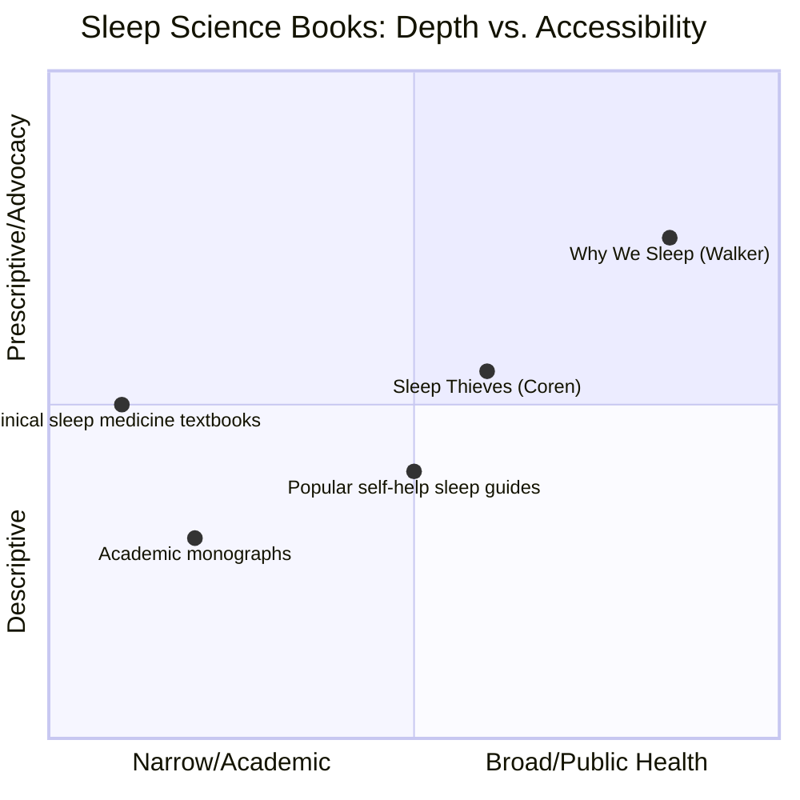
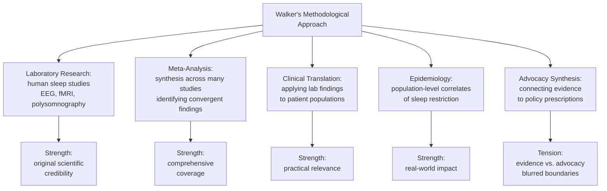
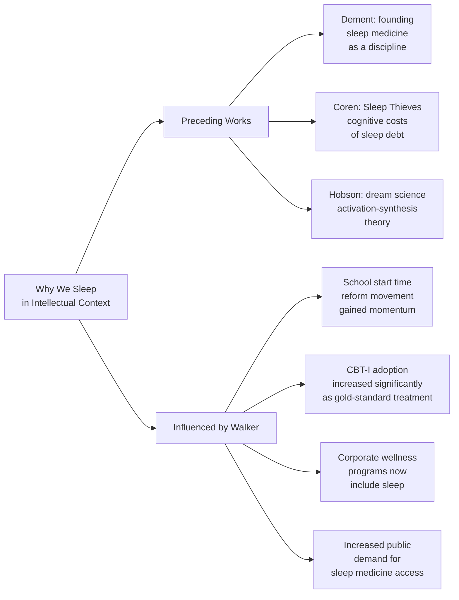

## The Scope of Walker's Argument



Matthew Walker's central ambition in *Why We Sleep* is unusually broad: he is simultaneously making a scientific argument about the nature and function of sleep, a medical argument about the costs of sleep deprivation, and a cultural and political argument about the responsibilities of individuals, institutions, and societies to prioritize sleep. This triple ambition is the source of the book's power and the source of its most significant criticisms.

---

## Scientific Methodology: Strengths

Walker's scientific grounding is genuine and deep. He trained as a neurophysiologist, spent decades in the laboratory, has published extensively in peer-reviewed journals, and directs an active research center. The chapters on sleep architecture cite genuinely current research — including the glymphatic system discovery, the link between spindles and memory, and the neural mechanisms of REM dreaming — with appropriate scientific detail for a general audience.

His integration of findings across disciplines is genuinely impressive. Walker moves fluently between molecular biology (the adenosine receptor, melatonin synthesis), neurophysiology (brainwave patterns in NREM and REM), cognitive psychology (memory consolidation protocols), clinical medicine (CPAP treatment for sleep apnea), epidemiology (population-level studies of shift workers and cancer risk), and public health (policy arguments about school start times). Few science popularizers can operate across this range competently. Walker does, and the result is a genuinely interdisciplinary account of sleep that reflects how the science actually works.



---

## The Causal Claim Problem

The most significant scientific criticism of *Why We Sleep* concerns Walker's use of causal language to describe associations between sleep and disease. Epidemiological studies consistently show that chronic sleep restriction correlates with — and in some cases prospectively predicts — a wide range of adverse health outcomes: cardiovascular disease, diabetes, obesity, immune dysfunction, cognitive decline, and Alzheimer's disease.

Correlation, however, is not causation. The same third variables that might cause poor sleep — chronic stress, low socioeconomic status, underlying illness, poor diet, sedentary lifestyle — might also cause the diseases Walker attributes to sleep loss. Walker's book often slides from "people who sleep less have higher rates of disease" to "sleep loss causes disease" without fully acknowledging this confound.

This is not a trivial problem. The National Sleep Foundation and major sleep medicine societies have been careful to distinguish between established causal mechanisms (sleep loss causes acute cognitive impairment, mood disruption, and metabolic dysregulation in controlled settings) and the more complex epidemiological claims (long-term sleep and disease rates in free-living populations). Walker's rhetorical strategy of presenting all claims with the same level of certainty has been criticized by some sleep researchers as scientifically misleading.

```mermaid
graph TD
  A["Causal Claims in<br/>Why We Sleep"] --> B["Well-Established:<br/>acute cognitive impairment<br/>after sleep deprivation"]
  B --> B1["Controlled lab studies:<br/>20h awake = BAC 0.08%<br/>reaction time, memory, judgment"]

  A --> C["Strongly Supported:<br/>chronic sleep restriction<br/>→ metabolic dysfunction"]
  C --> C1["Controlled short-term<br/>sleep restriction<br/>→ insulin resistance"]
  C --> C2["Consistent epidemiological<br/>associations:<br/>short sleep + obesity/diabetes"]

  A --> D["Epidemiological:<br/>sleep loss correlates<br/>with long-term disease"]
  D --> D1["Strong correlation data<br/>for cardiovascular disease<br/>mortality, all-cause mortality"]
  D --> D2["Third variable problem:<br/>stress, poverty, illness<br/>cause both")

  A --> E["Emerging:<br/>glymphatic clearance<br/>and Alzheimer's link"]
  E --> E1["Mechanistic plausibility:<br/>strong animal + imaging data"]
  E --> E2["Causal human evidence:<br/>still developing<br/>not yet definitive"]
```

---

## The Glymphatic Argument

Walker's most original scientific argument returns to the glymphatic system and its relationship to Alzheimer's disease. The logic is mechanistically compelling: deep NREM sleep clears amyloid-beta; amyloid-beta accumulates in Alzheimer's disease; therefore, chronic deep sleep deprivation may be a causal factor in Alzheimer's pathogenesis.

The problem, as some researchers have noted, is that the causal arrow could point in multiple directions. Amyloid-beta accumulation in the preclinical stages of Alzheimer's may itself disrupt deep sleep — meaning that the direction of causation could be the reverse of what Walker sometimes implies. Longitudinal studies tracking deep sleep, amyloid levels, and cognitive decline over years are now underway, but they are not yet mature enough to provide definitive answers. Walker presents the glymphatic-Alzheimer's argument with high confidence; the science, while promising, is still largely associational in humans.

---

## Cultural Diagnosis: The Sleep Crisis Thesis

```mermaid
graph TB
  A["Walker's Societal<br/>Diagnosis"] --> B1["Structural Factors"]
  B1 --> C1["Artificial light:<br/>disrupts circadian timing"]
  B1 --> C2["Screen technology:<br/>blue light + content stimulation"]
  B1 --> C3["School start times:<br/>7-8am for adolescents"]
  B1 --> C4["Shift work:<br/>24/7 economy demands"]
  B1 --> C5["Commute culture:<br/>long hours, early rises"]
  B1 --> C6["Work culture:<br/>sleep = laziness = weakness"]

  A --> B2["Individual Factors"]
  B2 --> D1["Caffeine culture:<br/>afternoon + evening consumption"]
  B2 --> D2["Alcohol as<br/>'"sleep aid'"]
  B2 --> D3["Smartphones in<br/>the bedroom"]
  B2 --> D4[""Sleep is optional"<br/>ideology"]
```

Walker's cultural argument is the most original and least contested part of the book. His diagnosis of modern sleep culture — the glorification of sleep deprivation as a marker of productivity, the structural assault on sleep from screen technology, shift work, and school schedules, the widespread misuse of caffeine and alcohol as sleep substitutes — is accurate and well-supported. The chapter on adolescent sleep and school start times in particular marshals compelling evidence: adolescents experience a biologically driven phase delay that shifts their natural sleep onset to approximately 11 PM. Asking them to begin school at 7:15 or 7:30 AM is the equivalent of asking an adult to begin a cognitively demanding professional role at 4 AM. Walker frames early school start times as a public health crisis affecting millions of children, and this argument has gained significant policy traction since the book's publication.

---

## The Sleeping Pills Controversy

Walker's treatment of prescription sleep medications — particularly Ambien, Lunesta, and Sonata — is among the most criticized passages in the book. He argues that these drugs produce sedation, not natural sleep; that they carry serious risks of dependence, nocturnal behaviors without memory, falls (especially in the elderly), and possibly elevated cancer and mortality risk; that they provide, on average, only modest improvements in sleep onset latency and total sleep time; and that cognitive behavioral therapy for insomnia, or CBT-I, is consistently more effective with no side effects.

The controversy here is partly about tone and partly about interpretation of evidence. Some researchers argue that Walker selectively emphasizes studies showing harm from sleeping pills while downplaying studies showing benefit, and that his language crosses from scientific evaluation into advocacy. Others, including some in the sleep medicine community, broadly agree with his clinical conclusions while wishing he had expressed them more cautiously. The American College of Physicians recommends CBT-I as first-line treatment for chronic insomnia, endorsing Walker's core clinical point even if questioning the rhetorical force with which he makes it.

---

## Strengths: Integration, Narrative, and Accessibility

The book's most admired quality is its integration. Walker has written what reads like a single coherent argument rather than a survey of disparate topics. The chapters build on each other: the neuroscience of sleep architecture in parts two and three creates the intellectual foundation for the public health and policy arguments in parts eight through eleven. The result is a book with genuine momentum and narrative arc — rare qualities in a popular science book covering this much ground.

Walker's prose style is another acknowledged strength. He writes with urgency, clarity, and occasional wit. He uses vivid analogies, memorable metaphors, and concrete clinical stories to make abstract neuroscience feel immediate. The story of his own car crash caused by sleep deprivation, which opens the book, is a masterclass in science communication: it personalizes the argument, creates narrative tension, and establishes credibility without being self-indulgent.

---

## Weaknesses and Limitations

The main limitations of the book fall into three categories:

**1. Selective use of evidence**: Walker is more confident in some claims than the peer-reviewed literature warrants. Aggregated risk estimates and some causal claims are presented with a level of certainty that surprises researchers working in the field.

**2. The self-help sections are relatively brief**: Given the book's length and ambition, the practical sleep hygiene advice — the twelve tips at the end — feels compressed relative to the scientific exposition. Readers seeking a step-by-step practical guide will find this frustrating.

**3. International scope is narrow**: The book is almost entirely focused on sleep science as developed in the Western research context, largely American and European laboratories. It says very little about sleep patterns in non-Western cultures, cross-cultural differences in sleep norms, or sleep research conducted outside North America and Europe.

---

## Intellectual Context and Legacy



Walker's book arrived during a period of rapid growth in sleep science. The discovery of the glymphatic system (2012), the expansion of epidemiological evidence linking sleep to chronic disease, and the growing recognition of sleep disorders as major contributors to morbidity had been building for years. *Why We Sleep* was the first major popular science book to synthesize all of these developments into a single accessible volume aimed at the general public rather than specialists or patients.

Its legacy is substantial. The book is widely credited with accelerating the policy movement to delay school start times, which has now been adopted in dozens of US school districts and several states. It contributed to the growing workplace wellness movement's inclusion of sleep alongside diet and exercise. And it significantly increased public demand for sleep medicine services, putting pressure on the specialty to expand capacity.

---

## Conclusion

*Why We Sleep* is an ambitious, impressive, and occasionally flawed book. Its scientific core — the description of sleep architecture, the glymphatic system, sleep and memory, REM and emotional processing — is accurate and well-presented. Its diagnosis of sleep culture is incisive and largely uncontroversial within the sleep science community. Its public health and policy arguments are compelling and backed by serious, if not always conclusive, evidence.

The weaknesses of the book are real but do not undermine its overall significance. Walker's tendency to overstate some causal claims, his compressed self-help sections, and his limited international scope are genuine limitations. But readers who engage with the book critically — noting where Walker makes associative claims and where he makes causal ones, distinguishing between the solid science and the more speculative extrapolations — will find it enormously valuable.

(End of file)
