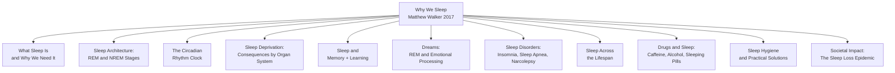

## Overview

*Why We Sleep: The New Science of Sleep and Dreams* is a landmark work by neurophysiologist Matthew Walker that distills two decades of sleep research into a compelling, accessible, and urgent argument: sleep is the single most powerful thing we can do to reset our brain and body health every day. Published in 2017 by Scribner, the book draws on Walker's position as a professor of neuroscience and psychology at UC Berkeley, where he directs the Center for Human Sleep Science.

What distinguishes *Why We Sleep* from earlier sleep books is its scope and scientific authority. Walker covers the full architecture of sleep — from the cycling of REM and NREM stages, to the circadian clock, to how sleep underpins memory, learning, emotional regulation, immune function, and even gene expression. He then extends the argument from individual health to societal catastrophe: chronic sleep deprivation, he argues, is a silent public health epidemic that is eroding productivity, mental health, road safety, and even democratic decision-making. The book is part science textbook, part public health manifesto, and part self-help guide for sleep hygiene.

---

---

## Book Structure

| Section | Chapters | Core Argument |
|---------|----------|---------------|
| **I: To Sleep** | 1–3 | Sleep is not passive downtime — it is an active, essential biological state. Walker establishes that humans are the only species that deliberately deprive ourselves of sleep without benefit. |
| **II: This Is Your Brain… on Sleep** | 4–6 | Sleep architecture: NREM slow-wave sleep consolidates memories and clears metabolic waste via the glymphatic system. REM sleep processes emotional experience and creativity. Both are irreplaceable. |
| **III: Too Exhausted to Sleep** | 7–9 | Sleep disorders (insomnia, sleep apnea, narcolepsy) are widespread and often undiagnosed. The medical profession has historically dismissed sleep problems as secondary. Walker argues sleep medicine must become central. |
| **IV: Across Your Lifetime** | 10–12 | Sleep needs change from infancy through old age. Walker examines why infants sleep so much, why adolescents experience a phase delay, and how sleep deteriorates in aging and dementia. |
| **V: Nap Time** | 13 | Napping is biologically natural and cognitively restorative — not laziness. |
| **VI: Disorders and Death** | 14–15 | Sleep deprivation causes measurable cognitive impairment comparable to intoxication. It contributes to car crashes, medical errors, and industrial accidents. |
| **VII: Schizophrenia, Mood, and Children** | 16–17 | Sleep disruption is both a symptom and a cause of mental illness. Treating sleep can treat psychiatric conditions. |
| **VIII: Society Out of Sync** | 18–19 | Modern culture — shift work, screen time, early school start times, long commutes — is structurally hostile to sleep. The result is a population-wide deprivation epidemic. |
| **IX: Drugs, Pills, and More** | 20–22 | Caffeine blocks adenosine receptors. Alcohol fragments sleep. Prescription sleeping pills have serious risks and provide minimal benefit compared to CBT-I (cognitive behavioral therapy for insomnia). |
| **X: Sleep to Stay Alive** | 23–24 | Sleep deprivation causally links to cardiovascular disease, diabetes, obesity, immune dysfunction, and cancer. Walker makes the case that sleep disruption is a public health crisis comparable to smoking. |
| **XI: A New Vision for Sleep** | 25–26 | Practical sleep hygiene, the twelve tips for better sleep, and a call for societal change — from schools to workplaces to the medical establishment. |

---

## Key Takeaways

1. **Sleep is the single most effective thing we can do to reset brain and body health each day.** Walker's central thesis is that sleep is not optional downtime — it is an active biological necessity as fundamental as eating or breathing.

2. **NREM sleep consolidates memory; REM sleep processes emotion and creativity.** These are two functionally distinct states, and both are required. You cannot substitute one for the other, and modern lifestyles systematically reduce both.

3. **The glymphatic system — discovered in 2012 — cleans the brain during deep NREM sleep.** Amyloid-beta and tau proteins (associated with Alzheimer's disease) are flushed out during slow-wave sleep. Chronic sleep deprivation causes these toxins to accumulate.

4. **Sleep deprivation impairs cognition as severely as alcohol intoxication.** After 20 hours awake, performance equals a blood alcohol concentration of 0.08 percent — the legal drunk driving limit in most countries.

5. **Caffeine is a powerful adenosine blocker with a half-life of 5 to 6 hours.** An afternoon cup of coffee at 3 PM still leaves 50 percent of the caffeine in your system at 9 PM, directly degrading deep sleep quality.

6. **Alcohol is not a sleep aid.** While it may sedate you, alcohol fragments sleep, suppresses REM, and causes mid-night awakenings and lighter, less restorative sleep overall.

7. **Prescription sleeping pills do not produce natural sleep.** Ambien, Lunesta, and similar drugs sedate the cortex but do not generate the restorative brainwave architecture of natural sleep. They carry serious risks of dependence, falls, and cancer.

8. **CBT-I — Cognitive Behavioral Therapy for Insomnia — is the gold-standard treatment.** It is more effective than sleeping pills, has no side effects, and addresses the root behavioral and psychological causes of insomnia.

9. **Adolescents have a biologically delayed circadian rhythm.** Asking teenagers to start school at 7 or 8 AM is the equivalent of asking an adult to start work at 4 AM. Early school start times are causing measurable cognitive, emotional, and physical harm.

10. **Sleep loss is a societal problem, not just an individual one.** Shift workers face elevated risks of cancer, heart disease, and diabetes. Medical residents working 30-hour shifts make dramatically more errors. The 24/7 culture of modern capitalism is producing a sleep-deprived population.

11. **Napping is biologically natural and restorative.** A 20 to 30 minute nap restores alertness, alertness, memory, and learning capacity. The siesta is not laziness — it is evolutionary design.

12. **Dreaming during REM sleep provides emotional first aid.** Walker argues that REM sleep strips the painful, emotional charge from difficult experiences, allowing us to wake with emotional distance and psychological resilience.

13. **Sleep disruption precedes and contributes to almost every major psychiatric illness.** Depression, anxiety, bipolar disorder, schizophrenia, and ADHD are all associated with abnormal sleep patterns. Treating sleep can be a first-line intervention for mental health.

14. **Sleep is the third pillar of health — alongside diet and exercise — and it is the one we neglect most.** You can dramatically improve your diet, but if you are chronically sleep-deprived, you will still suffer cognitive, emotional, and physiological consequences.

15. **The sleep revolution requires both individual action and systemic change.** Better sleep hygiene helps, but we also need societal shifts: later school start times, reduced night shift prevalence, limits on work hours, and a cultural reframing of sleep from laziness to health.

---

## Who Should Read

| Reader Type | Why |
|-------------|-----|
| Healthcare professionals | Walker is a rigorous scientist making a public-health case for sleep as medicine; every physician, nurse, and public health worker should understand the evidence |
| Parents and educators | Chapters on childhood and adolescent sleep have immediate practical implications for school scheduling and family health |
| Anyone struggling with insomnia | Walker explains both the science and the evidence-based treatment — CBT-I — in accessible terms |
| Shift workers and executives | The sections on circadian disruption and sleep deprivation's cognitive costs are directly applicable to workplace and safety decisions |
| Students and lifelong learners | The memory consolidation research explains how cramming and all-nighters are counterproductive |
| Public health advocates | The epidemiological case for sleep loss as a population-level crisis provides ammunition for systemic change |
| General readers interested in neuroscience | Walker writes at the intersection of hard science and popular science with unusual clarity and narrative energy |

---

## Who Should Skip

- Readers seeking a pure academic reference — Walker writes for a general audience; scientists should consult the primary literature directly
- Anyone looking for a quick self-help pamphlet — this is a substantial science book, not a tips-only guide
- Readers who already practice excellent sleep hygiene and have no interest in the deeper neuroscience — the middle chapters on sleep architecture are thorough and technical
- Anyone ideologically committed to the myth that sleep deprivation is a virtue or a sign of productivity — Walker systematically dismantles this assumption with overwhelming evidence

---

## Historical Context

| Date | Event |
|------|-------|
| 1953 | REM sleep discovered by Eugene Aserinsky and Nathaniel Kleitman at the University of Chicago |
| 1968 | Rechtschaffen and Kales establish the standardized sleep scoring manual — still the standard today |
| Early 1990s | Matthew Walker begins sleep research as a PhD student at Newcastle University, UK |
| 1999 | Walker joins Harvard Medical School and begins the research that would underpin *Why We Sleep* |
| 2007 | Walker moves to UC Berkeley and founds the Center for Human Sleep Science |
| 2012 | Discovery of the glymphatic system — the brain's waste-clearance system, most active during NREM deep sleep |
| 2017 | *Why We Sleep* published by Scribner; quickly becomes a global bestseller translated into over 40 languages |
| 2018 | The book wins numerous science book awards and sparks widespread public and policy discussion about sleep |

---

## Core Themes

| Theme | Description |
|--------|-------------|
| Sleep as Active Brain State | Walker's foundational argument: sleep is not downtime but a highly active, organized state with distinct functional stages required for specific physiological and cognitive processes |
| Memory and Learning | NREM slow-wave sleep transfers memories from short-term hippocampal storage to long-term cortical storage — effectively "saving" what you learned during the day |
| Emotional Regulation | REM sleep acts as an overnight therapist, decoupling the emotional charge from traumatic or difficult memories so they can be stored without pain |
| The Glymphatic System | The brain's waste-clearance pathway, active during deep NREM sleep, flushes neurotoxic proteins including amyloid-beta and tau |
| Circadian Dysrhythmia | Modern life — screens, shift work, constant light exposure — systematically disrupts the twenty-four-hour biological clock, with cascading health consequences |
| Sleep Deprivation as Epidemic | Chronic sleep restriction of even one to two hours per night produces measurable deficits across every major health domain |
| Sleep Disorders as Public Health Crisis | Insomnia, sleep apnea, and RLS are massively underdiagnosed; sleep medicine must be integrated into standard medical training and practice |
| Caffeine Culture | Caffeine's five-to-six-hour half-life means many people are effectively perpetually under-slept; its cultural acceptance masks its genuine physiological impact |
| Alcohol and Sedation | Alcohol is a suppressant, not a sleep aid — it fragments sleep architecture and reduces restorative NREM and REM sleep |
| The Sleep Revolution | Walker calls for both individual behavioral change and systemic reform: later school start times, workplace sleep policy, medical professional education, and cultural revaluation of sleep |

---

## Why This Book Matters

*Why We Sleep* arrived at exactly the right moment. The mid-2010s saw growing public awareness of sleep science, but there was no single authoritative yet accessible synthesis that connected the laboratory findings to everyday life. Walker's book filled that gap with scientific rigor and genuine storytelling energy — driven partly, he has said, by his own near-fatal car crash caused by sleep deprivation early in his career, which gave him a personal stake in the message he was conveying.

The book's impact has been extraordinary for a science book: it spent years on bestseller lists, was translated into dozens of languages, and became a touchstone in public debates about school start times, workplace health, shift work regulations, and the role of sleep in mental health policy. Scientists have debated some of Walker's more sweeping claims — particularly about sleep's role in specific disease mechanisms — but the core argument that sleep is essential, underappreciated, and underprioritized has become the scientific consensus.

What makes *Why We Sleep* genuinely important is that it is simultaneously a work of original science communication, a practical health guide, and a work of advocacy. Walker does not shy from policy implications. He argues that early school start times are a public health emergency for adolescents, that shift work should be regulated like any other occupational health hazard, that medical training must include sleep medicine, and that society should treat chronic sleep deprivation with the seriousness now accorded to smoking. This is rare territory for a science popularizer — most stop at explaining the science and leave the prescriptions to others. Walker's willingness to go from the lab to the policy arena is part of what made the book so influential and, for some readers, so controversial.

---

## Related Books

| Book | Author | Connection |
|------|--------|-----------|
| **The Promise of Sleep** | William C. Dement | Dement is a founding father of modern sleep medicine; his earlier book frames many of the same debates Walker enters |
| **Sleep Thieves** | Stanley Coren | Coren's 1996 book on the cognitive costs of sleep deprivation anticipated many of Walker's arguments about societal impact |
| **The Circadian Code** | Satchin Panda | Panda's work on time-restricted eating and circadian biology complements Walker's circadian arguments from a complementary angle |
| **Rest** | Alex Soojung-Kim Pang | Pang's exploration of the science and history of deliberate rest provides cultural and historical depth to Walker's biological arguments |
| **Entwined Lives** | Nancy Segal | While focused on twins, Segal's work touches on the genetics and biology of sleep patterns that Walker explores more broadly |
| **The Emotional Brain** | Joseph LeDoux | LeDoux's work on the neuroscience of emotion provides foundational context for Walker's chapter on dreaming and emotional processing |
| **The Brain That Changes Itself** | Norman Doidge | Doidge's popularization of neuroplasticity touches on many of the same mechanisms Walker describes in sleep's role in brain remodeling |
| **Awakenings** | Oliver Sacks | Sacks' clinical stories of sleep and neurochemistry provide a complementary human narrative to Walker's laboratory science |

---

## Final Verdict

*Why We Sleep* is not a perfect book, and it has attracted legitimate criticism. Some sleep scientists have argued that Walker overstates some causal claims — particularly around sleep loss and specific disease mechanisms like dementia, where the evidence is suggestive but not yet conclusive in the way Walker sometimes presents it. The chapter on sleeping pills has been criticized for being selectively negative about newer agents. The self-help sections are sometimes brief relative to the scientific depth elsewhere. And Walker's tendency to make strong normative claims about policy has drawn pushback from researchers who prefer to let the evidence speak for itself.

And yet: it is an extraordinary book. Walker writes with the rare combination of genuine expertise and genuine urgency. He tells stories from the lab — a sleep-deprived surgeon, a shift-working nuclear reactor operator, an insomniac patient whose life was transformed by CBT-I — that make the science feel alive and consequential. The glymphatic discovery alone would make the book worth reading; the synthesis of sleep, memory, emotion, and disease across the lifespan is genuinely comprehensive; and the call to action at the end is grounded in hard science rather than vague self-help platitudes.

**Rating: 9/10** — Essential reading for anyone who sleeps, which is to say everyone. It will change how you think about your own sleep, your children's sleep schedules, your workplace culture, and your own long-term brain health. Few science books achieve both intellectual depth and genuine practical impact at this scale.
