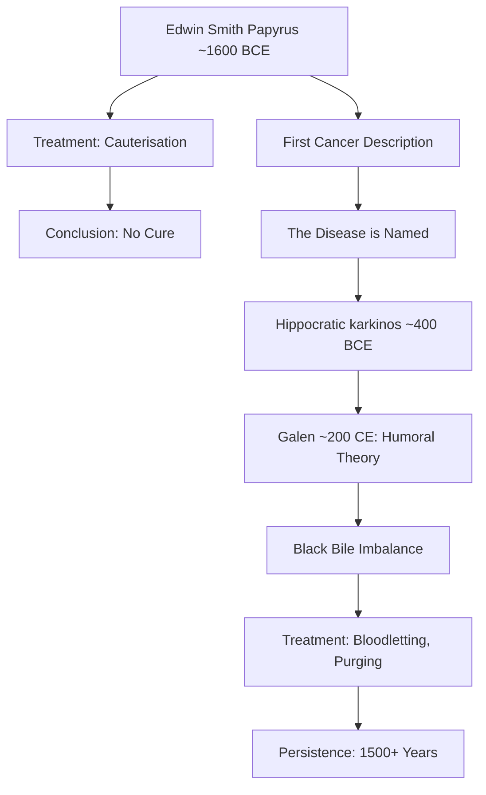
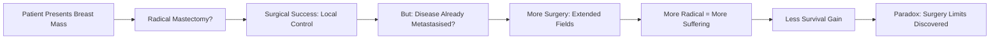
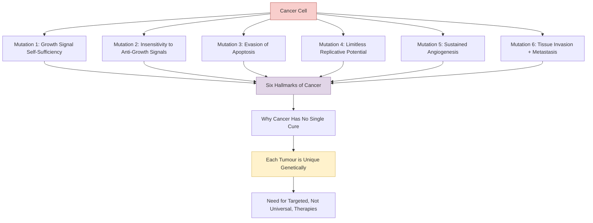
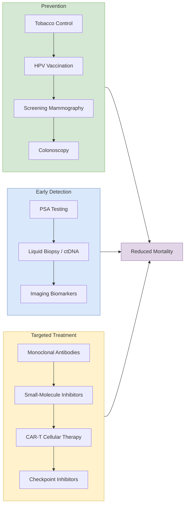

```mermaid
timeline
title The History of Cancer Medicine ~5000 Years
~
3000 BCE : Egyptian Edwin Smith Papyrus : "First written description of cancer; cauterisation; no cure"
~400 BCE : Hippocratic Corpus : "Cancer named karkinos (crab); humoral theory of black bile"
~200 CE : Galen : "Systematic theory; cancer as systemic humour imbalance; treatment by purging"
1689 CE : Dutch pathologist Regnier de Graaf : "First microscopic description of cancer cells"
1778 CE : Percivall Pott : "Chimney-sweep scrotal cancer; occupational carcinogen identified"
1809 CE : Ephraim McDowell : "First successful abdominal tumour removal — ovarian cancer; without anaesthesia"
1846 CE : Ether anaesthetic introduced : "Surgery transforms from torturous amputation to controlled intervention"
1890 CE : William Stewart Halsted : "Radical mastectomy; surgical philosophy of 'more is better'"
1896 CE : Wilhelm Roentgen discovers X-rays : "Radiation used therapeutically within weeks of discovery"
1900 CE : The "fertile crescent" of cancer science begins : "Peyton Rous,一缕 virus,染色体 inheritance"
1930s–1940s : Chemotherapy begins : "Nitrogen mustard from WWII mustard gas; Sidney Farber's leukaemia remissions"
1971 CE : National Cancer Act signed : "War on Cancer declared; Richard Nixon; $1.6 billion research initiative"
1982 CE : Ras oncogene discovery : "First human oncogene identified; molecular revolution begins"
1983 CE : p53 tumour suppressor : "Guardian of the genome discovered; most mutated gene in cancer"
2001 CE : Imatinib (Gleevec) approved : "First targeted molecular cancer drug; CML transformation"
2013 CE : Cancer Genome Project : "Broad tumour genome mapping; immunotherapy revolution begins"
Present : Liquid biopsies, CAR-T, AI diagnosis : "Non-invasive detection; cellular therapy; analytical oncology"
```

---

## Part I: "Da Capo" — The Ancient Recognition

### The First Name for Cancer

The story begins not in a modern laboratory but in an ancient Egyptian papyrus.
The Edwin Smith Papyrus, dated to ~1600 BCE but likely copying texts from
3000 BCE, contains the first known written reference to a disease recognisable
as cancer: a breast tumour treated by cauterisation with a "fire drill." The
scribe described the condition — a "bulging mass" that is "spreading to the
surface" — and concluded, then as now, that there is no cure.

### The Crab and the Humours

The Greek physician Hippocrates, around 400 BCE, gave cancer its oldest
medical name: _karkinos_, meaning crab. The name was not whimsical. A physician
running fingers across the surface of a breast tumour would feel the veins
radiating outward — like the legs of a crab spreading across a seabed.
Hippocrates' explanation of origin (and treatment) relied on the dominant
medical theory of the age: the humours. The body was governed by four fluids —
blood, phlegm, yellow bile, and black bile. Cancer was understood as an
accumulation of black bile in a specific organ, producing the hardening mass.

Galen, the 2nd-century CE physician to Roman gladiators, extended this theory.
He distinguished between cancers of the uterus (considered curable because
they would "fall away" with menstruation) and cancers of other organs (fatal
by their very nature). This distinction — curable versus incurable — would
echo down through medical history, embedding fatalism into the very language
of oncology.

The humoral theory was not overturned; it simply withered. Treatments changed
little for nearly two millennia.

---

## Part II: "The Root and the Branch" — The Surgical Revolution

### When Anatomy Becomes Possible

The surgical age of cancer began not from an idea but from a method: the
systematic, post-mortem dissection of human bodies. Andreas Vesalius'
_De humani corporis fabrica_ (1543) shattered Galen's authority — Galen had
dissected monkeys, not humans, and got the human body systematically wrong.
With cadaveric anatomy established as reliable, surgeons could map cancer's
terrain with their eyes.

### The Breast as Theatre

The breast became the defining battleground of cancer surgery. In the 17th
and 18th centuries, surgeons performed increasingly aggressive mastectomies.
Anaesthesia (ether, 1846) transformed what had been a race against — and
usually a loss to — patient agony and shock into a measured procedure.
Antisepsis (Lister, 1860s) transformed wound infection from a routine death
sentence into a manageable risk.

Together, anaesthesia and antisepsis released surgery from its physical
constraints. The result was sheer surgical ambition.

### Halsted and the Logic of More

William Stewart Halsted, a brilliant American surgeon at Johns Hopkins,
developed the "radical mastectomy" in the 1880s. His reasoning seemed
compelling: cancer spread locally. If it appeared in the breast, it must have
already seeded the surrounding nodes. If the nodes were involved, the chest
wall was involved. His operation removed the breast, underlying chest muscle,
and all axillary lymph nodes — a devastating anatomical assault.

Halsted's results were genuinely impressive: before his operation, most women
with breast cancer died within a year or two of diagnosis. After it, a
significant fraction — perhaps 30–40% — survived for five years or more. He
became a medical celebrity. His logic became dogma. "More is better" drove
surgery in every direction: prostatectomy, hysterectomy, gastrectomy for
gastric cancer, pneumonectomy for lung cancer, and the internal mammary-node
 dissections that followed breast surgery like shadow pathogens.

The paradox, which would take half a century to resolve, was that the same
surgical ambition that produced those five-year survivors also led surgeons to
demolish the body in search of a disease that had already spread beyond what
any surgeon could reach.

### The Limits of the Scalpel

The turning point came in 1981. Bernard Fisher and the National Surgical
Adjuvant Breast and Bowel Project (NSABP) published results comparing radical
mastectomy with total mastectomy (no muscle removal) and with lumpectomy
(breast-conserving surgery). The results were unambiguous: survival rates were
identical. The more extensive operation caused more suffering without saving
more lives. Cancer had already spread via the bloodstream before it appeared in
the axillary nodes. Surgery could not reach those microscopic metastases.

Jerome Urban's sword metaphor from the 1940s now read differently: "The sword
of surgical excision is the most potent weapon in the surgeon's armamentarium
against cancer." It remained potent — but only against disease already in its
kill zone.

---

## Part III: "Ghost Soldiers" — Radiation and Early Chemistry

### Rays from a New Element

Within weeks of Roentgen's discovery of X-rays in 1896, physicians in France
and the United States were using radiation to treat cancer. Marie Curie's
isolation of radium in 1902 provided a more powerful and portable radioactive
source. By the 1930s, radiation oncologists were achieving remissions in
cervical cancers, lymphomas, and some skin cancers.

But radiation had its own autobiography: it not only killed cancer cells; it
damaged healthy tissue and, cumulatively, caused its own cancers. The
radiation oncologist's task, and the book dwells on this, is a careful
negotiation with a toxic ally.

### The Dawn of Systemic Therapy

Surgery and radiation were, and remain, local treatments. They could cure a
tumour that could be seen or felt. They could not reach cancer that had
already escaped into the bloodstream — the metastatic disease responsible
for 90% of cancer deaths.

The idea of systemic treatment — a drug that could travel through the body
killing cancer cells wherever they had drifted — was a conceptual leap.
It arrived, accidentally, from chemical warfare.

### Mustard Gas and the Chemotherapy Catastrophe

During World War II, the Yale School of Medicine received reports from
battlefields: survivors of the German air raid on Bari (where an American
ship carrying mustard gas was bombed) had near-zero white blood cell counts.
Two Yale pharmacologists, Alfred Gilman and Louis Goodman, reasoned in 1942
that if mustard gas destroyed white blood cells, it might destroy other fast-
dividing cells too — including leukemic ones.

Their first patient, a man with lymphosarcoma, experienced a stunning,
if temporary, remission. His tumour masses melted. He left the hospital in
apparent remission — and relapsed weeks later and died. The Yale group had
demonstrated two things: that cancer could be attacked systemically, and that
systemic treatment had limitations no one had previously imagined.

### Sidney Farber and the Hope of Remission

The true godfather of chemotherapy was Sidney Farber, a pathologist at
Harvard's Children's Hospital. In 1948, Farber gave aminopterin (a folic acid
antagonist) to children dying of acute lymphoblastic leukaemia (ALL). Their
blood counts recovered. Bone marrow remissions could be maintained for weeks
or months. Some children lived years.

Farber became the most visible and vocal proponent of chemotherapy. He founded
the Dana–Farber Cancer Institute. He helped lead the national lobbying campaign
that culminated in the National Cancer Act of 1971. And he understood
something that his critics often missed: a temporary remission, even partial,
was not a dead end. It was a foothold. You could build on it.

---

## Part IV: "The Wind and the Sea" — The Chemotherapy Expansion

### Building the Arsenal

The 1950s and 1960s saw the systematic development of cytotoxic chemotherapy.
Nitrogen mustard gave way to methotrexate, 5-fluorouracil, cyclophosphamide,
doxorubicin, vincristine, and dozens more. Each drug killed dividing cells —
but dividing cells include hair follicles, gut epithelium, and bone marrow as
well as cancer cells. The side effects — baldness, vomiting, bone marrow
suppression, immunosuppression — were brutal and universal.

Parallel to the drug discovery was the formalisation of combination therapy.
The reasoning borrowed from antibiotics: if bacteria develop resistance to
single agents, combine drugs with non-overlapping mechanisms and timelines.
The model was ABVD for Hodgkin lymphoma, CHOP for non-Hodgkin lymphomas,
CMF for breast cancer. Results improved; toxicity compounded. Cure rates for
some cancers (testicular cancer, Hodgkin lymphoma, childhood ALL) rose from
zero to 80–90% — a genuine transformation.

### Testing a Drug War

The architecture of proof was as important as the drugs themselves. The
randomised clinical trial — assigning patients to treatment or control by
chance rather than physician preference — became the gold standard for
evaluating therapy. Mukherjee shows how this methodology evolved from ad hoc
comparisons to multistage, cooperative group trials involving hundreds of
institutions. It was slow, expensive, and sometimes controversial, but it
gave oncology its most reliable tool.

The oft-quoted statistic that cancer mortality rose from the 1930s to the
1990s reflects not a failure of treatment but a success of diagnosis: as
autopsy became routine and imaging appeared, cancers were found earlier that
would historically have gone undetected — inflating incidence statistics while
saving lives. The omission of this statistical artefact from early accounts of
the "war on cancer" contributed to the narrative of therapeutic failure.

---

## Part V: "The Mutagenic Hypothesis" — Molecular Biology Entered the Arena

### From Virus to Gene

Peyton Rous's 1911 discovery of the Rous sarcoma virus — a virus that caused
cancer in chickens — was initially dismissed. When the Nobel committee
eventually recognised Rous in 1966, he was in his late eighties; fifty-five
years had elapsed. Rous's finding proved that cancer could have an infectious
cause, and it seeded an idea: if a virus could carry a "cancer gene," perhaps
cancer was fundamentally a genetic disease.

The molecular biology revolution of the 1960s and 1970s made it possible to
ask the right questions. The raf oncogene, discovered in 1982, was the first
human cancer gene identified through molecular cloning. The mechanism was
startlingly specific: a single base substitution in the _raf_ gene — a
missense mutation — transformed a normal growth-regulation protein into a
constitutively active kinase that drove continuous cell division.

### The Two-Hit Hypothesis and Tumour-Suppressor Genes

If cancer could be caused by gain-of-function mutations in proto-oncogenes,
it could also be caused by loss-of-function mutations in the genes that
normally restrain growth. Knudson's "two-hit hypothesis," originally proposed
to explain why retinoblastoma in children followed a simple inheritance
pattern while in adults it did not, generalised into a profound statement: a
cell must accumulate mutations in both copies — at least two events — of a
tumour-suppressor gene before it loses the brake on its growth. The first hit
might be inherited (in the germline); the second is typically somatic.

Alfred Knudson's work laid the conceptual groundwork for the entire tumour-
suppressor field. p53, discovered in 1979, is the most commonly mutated gene
in human cancer — present in its wild-type form as "the guardian of the
genome" — and its loss releases cells from the apoptosis checkpoint that
normally eliminates damaged cells.

### Genetic Instability as a Cancer Engine

One of the most profound late-20th-century insights was that cancer cells do
not merely accumulate mutations — they become _genetically unstable_, creating
an ongoing supply of new variants that evolve under selective pressure. A
tumour, in this view, is not a mass of identical cells but a heterogeneous
ecosystem undergoing Darwinian evolution within the body. Some cells acquire
resistance to chemotherapy. Some acquire the ability to invade blood vessels
and metastasise. The therapeutic challenge, in evolutionary terms, is not to
eliminate every cell in one shot, but to change the selective environment
well enough that resistant clones cannot take over.

---

## Part VI: "The Paradigm Shift" — Targeted Therapy and the Molecular Future

### Gleevec: The Poster Child

The story of imatinib (Gleevec) is the book's origin myth of targeted
therapy. Brian Druker, Nicholas Lydon, and Charles Sawyers worked with
Ciba-Geigy (later Novartis) to develop a drug that specifically inhibited the
BCR-ABL fusion protein — the aneuploid chimeric tyrosine kinase created by
the Philadelphia chromosome translocation in CML. In 1999, they delivered
STI571 (imatinib) into a phase I trial with dramatic results: blood counts
normalised, cytogenic remission was achieved in 53 of 54 patients whose bone
marrow originally harboured the translocation.

The drug was approved in 2001. It transformed a disease with a median
survival of 3–5 years into one in which most patients take a pill indefinitely
and live normal lifespans. For oncology, this was the moment the paradigm
shifted: from "kill all dividing cells" to "silence a specific molecular
signal in a specific cell type."

### Beyond CML

The Gleevec model has been harder to replicate for most cancers. Solid tumours
(SBRT, breast, colorectal, lung, pancreatic) are molecularly more
heterogeneous than CML. They do not depend on a single driver oncogene.
They build redundant pathways. They evolve resistance.

But the principle — that understanding a tumour's molecular profile enables
rational, targeted therapy — is now established practice. HER2-targeting
antibodies (trastuzumab) transformed HER2-amplified breast cancer from a
poor-prognosis subtype into one of the best-managed. EGFR and ALK inhibitors
have done the same for subsets of lung cancer.

### Immunotherapy: The Third Revolution

The book appeared just as the first checkpoint inhibitors (ipilimumab for
melanoma, 2011) were beginning to show genuine promise — signalling a third
revolution in cancer therapy after surgery/radiation and chemotherapy.
Mukherjee sensed the shift but the data were thin when he wrote; the full
impact of PD-1 and PD-L1 blockade, CAR-T cell therapy, and bispecific
antibodies would emerge in the decade following publication.

---

## Part VII: "The Invisible Enemies" — Prevention, Detection, and Survivorship

### The Unspoken Front

Mukherjee dedicates substantial space to prevention and early detection, noting
that the war on cancer has unevenly funded treatment over prevention —
despite prevention's potential to affect far more people. Tobacco control, the
single most effective cancer-prevention strategy, was delayed and contested
within oncology for decades: in 1954, only 9% of oncologists surveyed by the
American Cancer Society accepted that smoking caused lung cancer.

### Surrogates of Mortality

Cancer statistics are routinely misread. The apparent five-year survival rate
of prostate cancer rose dramatically in the 1990s not because treatment
improved but because PSA screening detected many cancers that would never
have caused symptoms. Lead-time bias and overdiagnosis inflate survival curves
without extending lives. Mukherjee explains this with the care of a clinician
teaching a medical student.

### The Survivors' Century

As treatment improves, the population of cancer survivors grows — but so does
the complexity of survivorship. Relapse anxiety, treatment-related chronic
illnesses (cardiotoxicity from anthracyclines, second malignancies from
radiation, fertility loss), and the psychological identity of "the person who
had cancer" are largely unaddressed topics in oncology training.

---

## Key Patient Stories

The book's structure is interwoven with extended case studies. Three anchor
the narrative:

**Carla (the Patton family patient)** — A woman with a decades-old history of
leukaemia and multiple relapses; her body becomes a walking case study in
genetic instability and the limits of cumulative chemotherapy.

**Leonard Shatzkin** — A man who refused treatment for breast cancer, choosing
palliative surgery over radical surgery; his patient-led decision forced his
physicians to confront what "noncompliance" actually means.

**Junyuan "June"** — A young physician-scientist and patient with acute
leukaemia; his own illness becomes, in the final chapters, a study in the gap
between what medicine can do and what medicine can promise.

These cases do the work of literary fiction: they make the epidemiological
and molecular abstractions viscerally real.

---

---

## The Emotional Core

What distinguishes _The Emperor of All Maladies_ from medical history is its
insistence on emotional truth. Mukherjee does not shy from describing the
doctor's experience: the diagnostic uncertainty, the paternalism that
privileges the physician's frame over the patient's, the moment of delivering
a terminal diagnosis, and the quiet awfulness of watching young patients die
despite all available treatments.

The book's subtitle — "A Biography" — turns out to be double-edged. It is a
biography of cancer, yes. But it is also a biography of the medical
profession's long, painful, and sometimes heroic effort to understand what
its longstanding enemy actually _is_ — which means, in part, the profession
had to learn to see it differently. That process of seeing, and re-seeing,
is the book's real subject.
