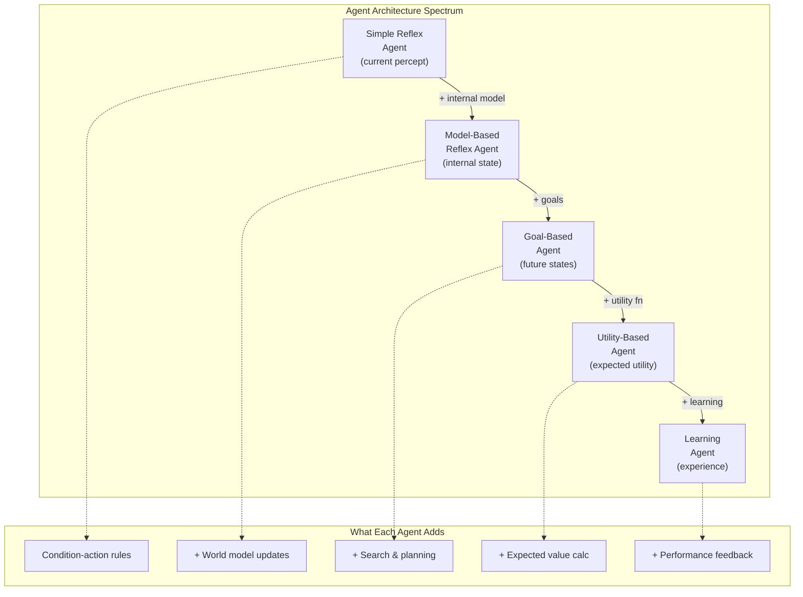

## The Rational Agent Framework

AIMA's unifying idea is the **intelligent agent**: any entity that perceives
its environment through sensors and acts upon it through actuators. The goal
is not to mimic human cognition but to act *rationally* — to do the right
thing given what the agent knows.

Russell and Norvig define rationality in terms of **performance measure**:
an agent is rational if it selects actions expected to maximize its
performance given its percept sequence and built-in knowledge. This framing
unifies everything from a simple thermostat (react to temperature) to a
self-driving car (integrate vision, planning, control).

### Agent Types by Complexity

AIMA classifies agents along a spectrum of capability:

1.  **Simple reflex agents** — act solely on current percept via condition-
    action rules. Fast but blind to unobserved state. Example: a
    thermostat.

2.  **Model-based reflex agents** — maintain an internal model of how the
    world evolves. Handle partial observability by tracking state not
    directly sensed.

3.  **Goal-based agents** — select actions that achieve a desired state.
    Requires search and planning. Example: a route planner.

4.  **Utility-based agents** — choose actions that maximize expected
    happiness (utility). Handle trade-offs and uncertainty gracefully.
    Example: a financial trading bot.

5.  **Learning agents** — improve their performance over time through
    experience. Combine all previous components with a learning element
    that updates the knowledge base.

Each layer adds representational power at the cost of computational
complexity. The learning agent represents the most general and most
difficult case — and the one most relevant to modern AI.

---

## Problem Solving as Search

The second part of AIMA treats problem solving as **search through state
spaces**. An agent with a goal but no direct action sequence must explore
possible sequences until it finds one that works.

### Uninformed Search

When the agent has no domain knowledge, it uses blind search:

| Algorithm | Strategy | Space | Complete? |
|-----------|----------|-------|-----------|
| Breadth-First | Expand shallowest | O(b^d) | Yes |
| Uniform-Cost | Expand cheapest path | O(b^d) | Yes |
| Depth-First | Expand deepest | O(bm) | No |
| Depth-Limited | DFS with depth cap | O(bl) | No |
| Iterative Deepening | DFS iteratively | O(bd) | Yes |
| Bidirectional | Two simultaneous BFS | O(b^(d/2)) | Yes |

### Informed Search

With domain knowledge (a **heuristic** function h(n) estimating cost-to-
goal), informed search is dramatically more efficient:

- **Greedy Best-First**: expands the node closest to the goal by h(n).
  Fast but not optimal.
- **A\***: expands nodes by f(n) = g(n) + h(n), where g(n) is cost-so-far.
  Optimal if h(n) is admissible (never overestimates). A* is one of the
  most important algorithms in AI.

### Adversarial Search

When multiple agents compete (games), standard search is insufficient
because opponents actively foil your plan. **Minimax** computes the optimal
move assuming the opponent also plays optimally. For large games (chess,
Go), **alpha-beta pruning** cuts the search tree by ignoring branches the
opponent would never let you reach.

Modern game-playing AI combines minimax search with deep neural networks
that evaluate board positions — AlphaGo and Stockfish are direct
descendants of this framework.

---

## Knowledge Representation and Reasoning

A central theme: intelligence requires knowledge, and knowledge must be
represented in a form machines can manipulate.

### Logic as Representation Language

- **Propositional logic** — statements like A ∧ B → C. Decidable but
  exponentially large knowledge bases.
- **First-order logic (FOL)** — variables, quantifiers, relations. Far
  more expressive. "All humans are mortal" becomes ∀x Human(x) → Mortal(x).
- **Inference algorithms** — forward chaining (data-driven), backward
  chaining (goal-driven), resolution (refutation proofs).

### Beyond Logic: Handling Uncertainty

Pure logic fails when information is incomplete or noisy — which is almost
always in the real world. AIMA introduces **probability theory** as the
correct framework:

- **Bayesian networks** — directed acyclic graphs where nodes are random
  variables and edges represent conditional dependencies. A compact
  representation of joint probability distributions.
- **Inference in Bayes nets** — variable elimination, Markov chain Monte
  Carlo, approximate inference.
- **Hidden Markov Models and Kalman filters** — track state over time in
  the presence of noisy observations.

---

## Machine Learning: From Classical to Deep

The 4th edition devotes five chapters to learning, reflecting the shift
from knowledge-engineered AI to data-driven AI.

### Supervised Learning

Given labeled examples (x, y), learn a function f: x → y:

- **Decision trees** — simple, interpretable. ID3, C4.5.
- **Support vector machines** — maximize margin between classes.
- **Neural networks** — universal function approximators. Each layer learns
  progressively more abstract features.

### Deep Learning

The breakthrough: stacking many layers allows networks to learn hierarchical
representations directly from raw data:

- **Convolutional Neural Networks (CNNs)** — exploit spatial locality via
  shared weights. Dominant in vision.
- **Recurrent Neural Networks (RNNs/LSTMs)** — handle sequential data by
  maintaining hidden state. Used for time series, speech, text.
- **Transformers** — attention-based architecture that processes all
  positions in parallel. The foundation of GPT, BERT, and modern NLP.

### Reinforcement Learning

An agent learns by interacting with an environment, receiving rewards and
punishments. No explicit supervisor — the agent discovers optimal behavior
through trial and error:

- **Markov Decision Processes (MDPs)** — formalize the RL problem: states,
  actions, transition probabilities, rewards.
- **Q-Learning** — learn the expected value of each action in each state
  without a model of the environment.
- **Deep Q-Networks** — use a deep neural network to approximate the Q-
  function. DQN achieved human-level play on 49 Atari games.
- **Policy gradient methods** — directly optimize the policy (action-
  selection strategy) rather than the value function.

---

## Natural Language Processing

AIMA covers NLP from the ground up: from n-gram language models and part-
of-speech tagging to modern transformer-based architectures.

Key milestones traced in the book:
- Statistical MT (1990s-2010s)
- Sequence-to-sequence models with attention
- The transformer revolution (Vaswani et al., 2017)
- Large language models and few-shot learning

Most NLP content was substantially rewritten for the 4th edition to reflect
the dominance of deep learning.

---

## Computer Vision

Vision is treated as an inverse problem: the 3D world projects to a 2D
image, and the agent must reconstruct the 3D structure. Key topics:

- Image formation (geometry, lighting, color)
- Feature detection (edges, corners, SIFT)
- Recognition (CNNs, object detection, semantic segmentation)
- Structure from motion and 3D reconstruction

AIMA emphasizes that vision is not a solved problem — robustness to
adversarial examples, distribution shift, and novel viewpoints remain open.

---

## Multi-Agent Systems

When multiple AI agents interact, the complexity shifts from individual
decision-making to **game theory**:

- **Nash equilibrium** — each agent's strategy is optimal given the others'
  strategies.
- **Cooperative vs. competitive** — agents may share goals (robotic
  swarm) or oppose each other (poker, auctions).
- **Mechanism design** — how to design rules of interaction so that
  rational agents produce socially desirable outcomes.

---

## AI Ethics and Safety

The book closes with a substantial treatment of AI ethics — a topic that
received far more attention in the 4th edition than any previous one:

- **The alignment problem** — ensuring AI systems pursue the goals we
  actually intend, not what we literally specify.
- **Value alignment** — how to encode human values into AI decision-making
  when values are diverse and context-dependent.
- **Transparency and explainability** — black-box models must produce
  explanations humans can verify.
- **Fairness and bias** — ML models can perpetuate and amplify societal
  biases present in training data.
- **Robustness** — AI systems must perform reliably under distribution
  shift and adversarial attack.

Russell's own research on **provably beneficial AI** is reflected in this
section, arguing that AI systems should have uncertainty about human
preferences and defer to humans when uncertain.

---

## Key Lessons

-  **The rational agent framework unifies all of AI** — perception,
   reasoning, learning, and action are components of a single design
   problem.
-  **Search is the universal substrate** — planning, game playing, and
   optimization all reduce to search through structured spaces.
-  **Knowledge representation determines what an agent can know** — the
   right representation makes problems tractable; the wrong one makes
   them impossible.
-  **Probability is the language of uncertainty** — real AI must operate
   with incomplete, noisy, and conflicting information.
-  **Learning replaces engineering** — instead of programming intelligence,
   we build systems that discover it from data.
-  **Deep learning is a tool, not a solution** — it excels at perception
   but struggles with reasoning, causality, and common sense.
-  **Ethics is an engineering problem** — safe AI requires the same rigor
   as correct AI: formal verification, testing, and monitoring.
