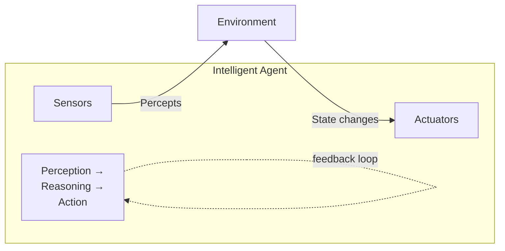
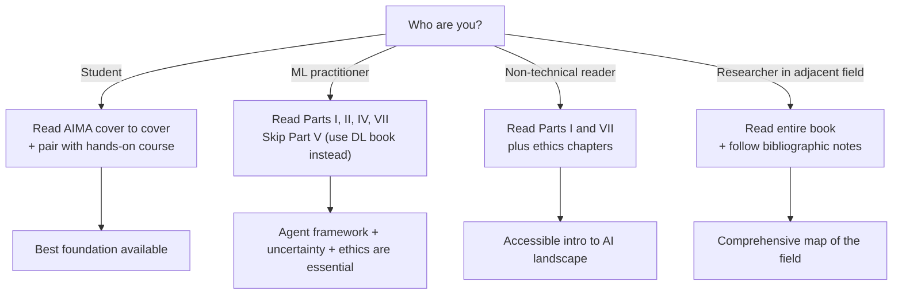

## Introduction

Welcome to BookAtlas. Today: *Artificial Intelligence: A Modern Approach*
by Stuart Russell and Peter Norvig. 4th edition, 2020. Prentice Hall. 1136
pages. Over 1500 universities. 59,000 citations. The most popular AI
textbook in the world.

This is a book that changed how an entire field teaches itself. But can a
textbook really be useful outside the classroom? We brought two voices:
a university professor who has taught from AIMA for fifteen years, and
an ML engineer who learned from it a decade ago and wonders if it's still
relevant in the age of ChatGPT.

Let's get into it.

---

## The Setup: What Is AIMA?

The book's title tells you exactly what it is: a survey of artificial
intelligence from a *modern* perspective — though "modern" is doing a lot
of heavy lifting when you've been updating the same book since 1995.

**Professor:** AIMA is the textbook that unified AI. Before it, AI was
scattered — one book on expert systems, another on logic, another on
neural networks. Russell and Norvig said: all of these are about designing
agents that act rationally. That one insight organized the entire field.

**Engineer:** I respect that. But here's the thing — when I was a student,
AIMA was great for exams. But my first job required PyTorch, Docker, MLOps,
and deploying models to production. AIMA doesn't help with any of that.

**Professor:** That's fair. AIMA isn't a vocational manual. It's a
conceptual foundation. If you understand the material in AIMA — the
difference between admissibility and consistency in heuristics, the
structure of Bayes nets, the exploration-exploitation trade-off — then
everything else is applied variation. But if you skip the foundation,
you're just gluing libraries together.

---

## The Agent Framework: Still the Best Mental Model

The core of AIMA is the **rational agent** concept. An agent perceives,
reasons, and acts. Everything else is detail.

**Professor:** This framing is more useful now than ever. When you're
building an LLM-based application, what are you doing? You're designing an
agent: it perceives user input, reasons about it (possibly using tools,
retrieval, chain-of-thought), and acts by generating a response. Every
modern AI product is an instance of this architecture.

**Engineer:** I can buy that. The agent framework is flexible enough to
describe a chatbot, a self-driving car, or a factory robot. But is it
practical? Does knowing about agent types help me build a better RAG
pipeline?

**Professor:** Yes — because it forces you to think about what your agent
knows and doesn't know. A simple reflex agent (just prompt → response)
will fail on complex queries. A model-based agent that maintains state
across turns will do better. A utility-based agent that weighs response
cost against information value will do best. The framework gives you a
vocabulary for architectural decisions.

---

## Search: The Unsung Workhorse

AIMA devotes its entire second section to search algorithms. To a
machine learning engineer, this can feel like ancient history.

**Engineer:** Honestly, I skipped those chapters. Who implements A* from
scratch? There's a library for that.

**Professor:** You use A* every time you use a GPS navigation app. Every
time something finds the shortest path. But more importantly, search is the
conceptual core of planning, scheduling, game playing — and even LLM
inference. LLMs use beam search at generation time. AlphaGo used Monte
Carlo tree search. Adversarial search describes the behavior of foundation
models competing with each other.

**Engineer:** OK, that's a fair point. I didn't realize search was still so
central.

**Professor:** The techniques evolve but the framework doesn't. Search is
just: define a state space, define transitions, find a path. That's as
fundamental as it gets in AI.

---

## The Deep Learning Gap

This is where the conversation gets interesting. AIMA's 4th edition added
substantial deep learning content, but it was published in 2020 — before
GPT-3, before ChatGPT, before diffusion models, before Claude.

**Engineer:** This is my biggest issue. The book's deep learning chapters
are already history. They cover CNNs and RNNs well, but transformers get
maybe twenty pages. There's nothing about large language models, RLHF,
constitutional AI, retrieval-augmented generation. In a field that changes
every six months, a textbook with a five-year revision cycle cannot keep
up.

**Professor:** And it shouldn't try. A textbook's job is not to be the
latest preprint. Its job is to be the stable foundation that lets you
understand the latest preprint. If you understand the transformer
architecture (which AIMA covers), you can read the GPT-4 paper. If you
understand supervised and reinforcement learning (which AIMA covers in
depth), you can understand RLHF. The book gives you the *grammar* of AI.
The papers are the current news.

**Engineer:** That's a generous framing. But I've seen students who read
AIMA cover to cover and still can't train a neural network. They know what
backpropagation is mathematically, but they can't debug a vanishing
gradient or tune a learning rate schedule. That's a real gap.

**Professor:** I don't disagree. AIMA should be paired with a hands-on
resource. Think of it as theory + practice: AIMA for the theory, then
Fast.ai or the Deep Learning book or Hugging Face tutorials for the
practice. One without the other is incomplete.

---

## The Ethics Section: Finally Taken Seriously

The 4th edition devotes two full chapters to AI ethics, safety, and the
future of the field — a major expansion from earlier editions.

**Professor:** This is the most important addition. Every AI practitioner
needs to understand the alignment problem, value specification, fairness,
and transparency. Ten years ago these were philosophical curiosities. Today
they are engineering constraints. If you deploy an AI system without
considering these, you are being negligent.

**Engineer:** I agree that ethics matters. But reading about it in a
textbook and dealing with it in practice are very different things. AIMA
lays out the problem space well but doesn't give you tools. How do I audit
my model for bias? How do I implement a feedback loop for when the system
does something harmful? What's the incident response protocol?

**Professor:** That's fair. A textbook can't replace organizational
processes. But it can give you the conceptual framework so that when your
manager says "just add a safety filter," you can explain why that's
insufficient — why alignment is deeper than a regex.

---

## The Verdict: Do You Need This Book?

**Professor:** If you are a student, yes. This is still the best single-
volume introduction to AI. Read it alongside a practical course.

**Engineer:** If you are a practitioner who learned from online courses and
bootcamps, maybe. The agent framework, search taxonomy, and uncertainty
material are worth your time. But you can skip the neural network chapters
and read Goodfellow et al. for depth. And be honest about what AIMA is: a
foundation, not a toolkit.

**Professor:** One more thing. AIMA is also worth reading for its
bibliographic notes. Each chapter ends with a guide to the original
literature. If you want to go deep on any topic, those notes are a
treasure map.

**Engineer:** I'll concede that. The bibliographic notes are genuinely
excellent. I've discovered half a dozen seminal papers from those notes
that I would never have found otherwise.

---

## Final Thoughts

AIMA is a remarkable book that has aged better than it had any right to.
Its core framework — the rational agent — is more relevant than ever as AI
systems become autonomous, multi-modal, and agentic. Its breadth is
unmatched. Its clarity is exceptional.

But it is not sufficient. The field moves too fast. AIMA from 2020 cannot
teach you about LLM alignment, diffusion models, or AI agents — the very
things dominating the headlines in 2026. That's not a failure of the book.
That's a feature of the field. AIMA gives you the stable intellectual
architecture. You fill in the current details from papers, blogs, and
repositories.

Read it for the foundations. Keep it on your shelf as a reference. But
never mistake it for a complete education.

This has been a BookAtlas narration of *Artificial Intelligence: A Modern
Approach* by Stuart Russell and Peter Norvig. Thanks for listening.
