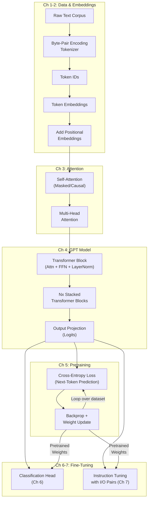

## The LLM Pipeline at a Glance

Before diving into code, it helps to see the full journey. The diagram
below maps every stage the book covers — from raw text to a functioning
chatbot — and shows how each chapter feeds into the next.

---

## Chapter 1: Understanding Large Language Models

The opening chapter provides a high-level mental model. Raschka defines
LLMs as neural networks trained on massive text corpora to predict the
next token. He traces the lineage from early recurrent neural networks
through the 2017 Transformer paper ("Attention Is All You Need") to
modern decoder-only architectures like GPT-2 and GPT-3.

Key distinction: the book uses a **decoder-only** transformer (GPT style),
not encoder-decoder (original Transformer) or encoder-only (BERT). The
decoder-only design with causal (masked) self-attention is what enables
autoregressive text generation — the model produces one token at a time,
conditioned on all previous tokens.

Raschka also sets expectations: the finished model will be comparable to
GPT-2 (124M parameters), not GPT-3 (175B). The goal is understanding,
not scale.

---

## Chapter 2: Working with Text Data

This is where the code begins. The chapter covers three critical
preprocessing steps:

**Tokenization.** Raw text must be converted into numbers. Raschka
implements a **byte-pair encoding (BPE)** tokenizer, which splits text
into subword units. Unlike word-level tokenization (which produces huge
vocabularies) or character-level (which produces long sequences), BPE
strikes a balance by merging the most frequent character pairs
iteratively. The final vocabulary typically contains 50k-100k tokens.

**Token Embeddings.** Each token ID is mapped to a dense vector via an
embedding layer. This is effectively a lookup table where each token
learns a high-dimensional representation. The book uses 768-dimensional
embeddings, matching GPT-2's configuration.

**Positional Embeddings.** Since self-attention processes all tokens in
parallel (no inherent notion of order), position information must be
added. The book uses learned absolute positional embeddings — a separate
embedding matrix indexed by position — which are added to the token
embeddings before passing them to the transformer.

The chapter also covers creating input-target pairs for training: given
a sequence `[t1, t2, t3, t4]`, the input is `[t1, t2, t3]` and the
target is `[t2, t3, t4]`. Every position predicts the next token.

---

## Chapter 3: Coding Attention Mechanisms

The heart of the transformer. Raschka builds attention in four stages:

**Simplified self-attention.** A naive implementation where each token
computes a weighted sum of all other tokens. The weights are determined
by a dot product between query and key vectors (attention scores),
softmax-normalized, then used to aggregate value vectors. This captures
the core idea before adding complications.

**Scaled dot-product attention.** The attention scores are divided by
`sqrt(d_k)` (the square root of the key dimension). Without scaling,
high-dimensional dot products can produce extreme softmax outputs that
saturate and kill gradients.

**Causal (masked) attention.** For autoregressive generation, each token
must only attend to itself and previous tokens. The solution is a causal
mask: set attention scores for future positions to negative infinity
before softmax, so their attention weights become zero.

**Multi-head attention.** Instead of one attention computation, the model
runs multiple attention "heads" in parallel, each operating on a
different projection of the input. GPT-2 uses 12 heads (for the 124M
parameter variant). Each head learns to focus on different types of
relationships — syntax, semantics, co-reference, etc. The outputs are
concatenated and projected back to the model dimension.

---

## Chapter 4: Implementing a GPT Model from Scratch

This chapter assembles the full GPT-2-style model architecture:

1. **Transformer block.** A block consists of multi-head attention
   followed by a feed-forward network (two linear layers with a GELU
   activation in between), each surrounded by residual connections and
   layer normalization. GPT-2 uses **pre-layer normalization**
   (normalization applied before each sub-layer), which stabilizes
   training better than post-norm.

2. **GELU activation.** The Gaussian Error Linear Unit — a smooth
   approximation of ReLU — is the standard activation in GPT models.
   It introduces non-linearity while avoiding the sharp zero transition
   of ReLU.

3. **Residual connections & layer norm.** Residual (skip) connections let
   gradients flow directly through the network, solving the vanishing
   gradient problem in deep transformers. Layer norm stabilizes
   activations by normalizing across the feature dimension.

4. **Output head.** The final layer norm is followed by a linear
   projection mapping from hidden dimension to vocabulary size,
   producing logits for every token in the vocabulary. A softmax over
   these logits gives the probability distribution for the next token.

By the end of chapter 4, you have a complete (untrained) GPT model that
can generate random-looking text from any input.

---

## Chapter 5: Pretraining on Unlabeled Data

Pretraining is where the model learns language. The chapter covers:

**Loss computation.** Cross-entropy loss between the predicted logits
and the target token IDs. The average loss per token is the training
objective.

**Data loading.** The book uses a small public-domain text (a short
story) to make training fast on a laptop. A PyTorch DataLoader creates
random batches of fixed-length sequences from the tokenized corpus.

**Training loop.** Standard PyTorch training: forward pass, compute
loss, backward pass, optimizer step. The book uses AdamW (Adam with
weight decay), which is the standard optimizer for transformer training.

**Text generation.** After each epoch, the model generates text by
feeding in a start token and iteratively sampling from the predicted
distribution. Early epochs produce gibberish; later epochs show
recognizable structure.

**Loading pretrained weights.** This is a highlight of the book:
Raschka shows how to download OpenAI's GPT-2 weights and load them into
your model. Overnight, your toy model becomes a real LLM that generates
coherent English. This section demystifies how open-weight models are
distributed and consumed.

The chapter also introduces temperature scaling for generation — higher
temperature produces more random output; lower temperature produces more
deterministic output — and top-k sampling, which restricts sampling to
the k most likely tokens.

---

## Chapter 6: Fine-Tuning for Classification

Fine-tuning adapts a pretrained model to a specific task. Chapter 6
focuses on **classification fine-tuning** — for example, classifying
text messages as spam or not spam.

The key insight: you don't train a new model. You take the pretrained
LLM and replace the output head with a small classification head (a
linear layer mapping from hidden dimension to class labels). Then you
fine-tune only the classification head (or the full model) on labeled
data.

Raschka explains the crucial difference between classification
fine-tuning and the pretraining objective: classification uses the
representation of the **last token** (or pooled sequence), not the
next-token prediction. The model learns to map the sequence
representation to class labels using cross-entropy loss over classes.

The chapter also discusses **dropout** as a regularization technique
and shows how to evaluate classification performance on a held-out test
set.

---

## Chapter 7: Fine-Tuning to Follow Instructions

The final chapter builds an instruction-following chatbot — the type of
model that powers applications like ChatGPT. This is called
**instruction fine-tuning** or supervised fine-tuning (SFT).

The dataset format: input-output pairs where the input is a prompt
(e.g., "Explain what a transformer is") and the output is the desired
response. The model is trained to generate the output given the input,
using the same next-token prediction loss as pretraining — but now on
carefully curated prompt-response data.

A critical technique covered is **prompt formatting**: wrapping inputs
in a consistent template (e.g., `### Instruction: ... ### Response: ...`)
so the model learns the structural pattern of a conversation.

The chapter concludes with evaluation: using another LLM (Llama) to
score the quality of the model's responses, introducing the concept of
LLM-as-judge for automated evaluation.

---

## Key Lessons

- **LLMs are not magic — they are engineered systems.** Every component
  (tokenization, attention, training) is implementable in a few hundred
  lines of PyTorch.
- **Understanding requires building.** Reading about attention is not
  the same as coding it. Raschka's approach ensures you debug through
  shape mismatches and dimension arithmetic — the fastest path to
  genuine understanding.
- **Scale changes behavior but not fundamentals.** A 124M-parameter
  model trained on a short story follows the same principles as GPT-4.
- **Fine-tuning is where most practitioners live.** Pretraining your own
  model is educational; loading pretrained weights and fine-tuning is
  practical. The book covers both.
- **The architecture is modular.** You can swap attention mechanisms,
  change activation functions, add LoRA adapters — the code structure
  makes experimentation natural.

---

## Practical Applications

### For ML Engineers
Implement RAG (retrieval-augmented generation) by understanding exactly
where and how the model processes context. The book's detailed attention
implementation clarifies how long-context models work.

### For AI Educators
Use the chapter-by-chapter build as a curriculum for teaching LLM
internals. The free YouTube companion series by Raschka makes it
suitable for flipped classrooms.

### For Hobbyists
Run a small GPT model on a laptop, generate text, and experiment with
hyperparameters. The appendices on LoRA and training tricks extend the
experimentation playground.

### For Researchers
The from-scratch implementation is a clean baseline for testing new
architecture ideas without library abstractions getting in the way.
