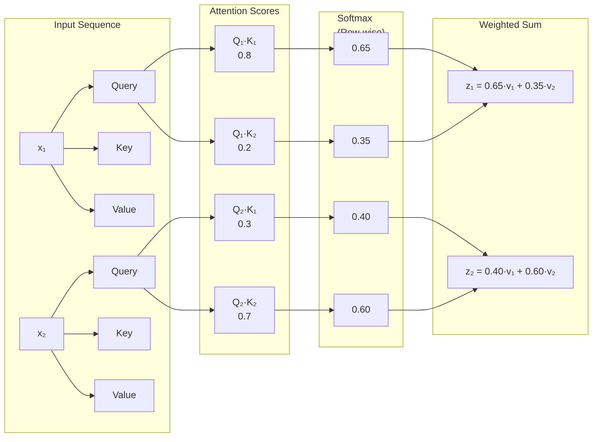
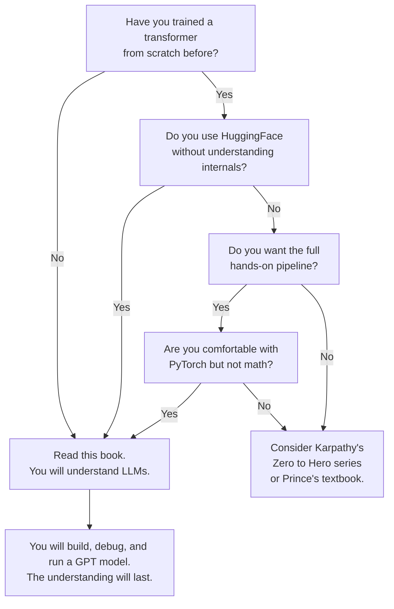

## Introduction

Welcome to BookAtlas. Today: *Build a Large Language Model (From Scratch)*
by Sebastian Raschka. Published 2024 by Manning Publications. 368 pages.
Over 96,000 GitHub stars on the companion repository. A free 48-part
live-coding video series. Translated into eight languages.

This is widely considered the definitive hands-on guide to understanding
LLM internals. But who should actually read it — and what will you get
out of it? We're going to settle that with two voices. On one side, a
machine learning engineer who learned transformers from this book. On the
other, a researcher who thinks code is not enough — you need the math.

Let's get into it.

---

## The Setup: What Are We Building?

**Engineer:** The premise is simple: build a GPT-style LLM from first
principles using Python and PyTorch. No HuggingFace. No Keras. No
abstractions. You write the attention mechanism line by line. You
implement the tokenizer yourself. You build the transformer blocks,
the training loop, the generation function — everything.

The model you end up with is ~124 million parameters, roughly equivalent
to GPT-2 small. It runs on a laptop. By the end, you have a chatbot
that follows instructions. Not ChatGPT-level, obviously. But real.

**Researcher:** And that's genuinely impressive for a single book. But
let's be clear about the trade-off. The book controls complexity by
keeping everything small: small model, small dataset, small training
run. What you build is a *demonstration* of LLM principles, not a
production system. The gap between this toy model and GPT-4 is not just
scale — it's data quality, RLHF, distributed training, infrastructure,
and a dozen other things the book doesn't touch.

**Engineer:** That's fair, but it's also the point. The book's subtitle
is literally "From Scratch." The goal is understanding, not production.
And for understanding, a toy model that fits in your head is better than
a production system that requires a datacenter.

---

## The Attention Mechanism: Where the Magic Happens

Chapter 3 is the book's centerpiece. The attention mechanism.

**Engineer:** This is where the book really shines. Raschka builds
attention in four clean stages. First, a naive version where each token
computes a weighted sum of all other tokens. Then he adds scaling
(divide by sqrt of dimension). Then he adds the causal mask so tokens
can only see previous positions. Then he extends to multi-head.

Each stage is a Jupyter notebook. You run the code. You see the shapes.
You understand. I had been "using" transformers for two years through
HuggingFace pipelines. After chapter 3, I actually understood what they
were doing.

**Researcher:** The code is clean, I'll grant you. But what's missing is
*why* this particular mechanism. Why dot-product attention instead of
additive? Why scaling by sqrt(d_k)? Why softmax and not something else?
The book implements it correctly but doesn't explore the design space.
You could finish chapter 3 and think "attention is the only way" when
in fact there are many alternatives — and the choice of dot-product is
a specific engineering trade-off.

**Engineer:** I get that critique, but remember the audience. This book
is for people who want to *build* LLMs, not design new architectures.
For builders, knowing *that* scaled dot-product attention works and
*how* to implement it is the right level. The theoretical exploration
belongs in research papers.

---

## Pretraining: The Most Educational, Least Practical Chapter

**Engineer:** Chapter 5 is where the rubber meets the road. You write a
training loop in PyTorch, feed in a short story from the public domain,
and watch your model go from gibberish to recognizable text. It's slow.
It's repetitive. It's absolutely necessary.

But the real payoff comes in the middle of the chapter: loading OpenAI's
GPT-2 weights. Suddenly, your toy model generates coherent paragraphs.
This is the moment that makes the entire book worth it.

**Researcher:** Here's my problem with this chapter. The pretraining
section trains on a *single short story* for a few epochs. That's not
pretraining — that's the world's most expensive way to memorize a text.
Real pretraining involves billions of tokens, weeks of GPU time, and
careful data curation. The book's version is useful for understanding
the mechanics but gives a completely distorted picture of what real
pretraining looks like.

**Engineer:** Every ML book does this. You train a small model on a small
dataset to learn the mechanics. It doesn't distort understanding — it
scaffolds it. And Raschka is transparent about the limitations. He says
explicitly: "If you want a real LLM, load the pretrained weights." The
pretraining code is there to teach the *process*, not to produce a
product.

---

## Fine-Tuning: Where Most Practitioners Actually Live

**Engineer:** Chapters 6 and 7 are where the book delivers its highest
practical value. Classification fine-tuning: turn your LLM into a spam
detector in a few lines of code. Instruction fine-tuning: train it to
follow prompts using supervised pairs.

The insight that changed how I work: fine-tuning for classification
uses the *last token's* hidden state, not the next-token prediction head.
I had been wrong about this for months. One chapter fixed my mental
model.

**Researcher:** The instruction fine-tuning chapter is well done for its
scope. But the omission of RLHF and DPO is significant. Supervised
fine-tuning alone does not produce the kind of instruction-following
behavior that makes ChatGPT impressive. The alignment step — RLHF or
DPO — is where the magic happens. The book ends with SFT, which is like
teaching someone to write without teaching them what *good* writing
looks like.

**Engineer:** That's a fair gap. But Raschka has published follow-up
articles on DPO and preference tuning on his blog. The book covers the
foundation. And honestly, SFT is the right stopping point for a
single-volume print book. Adding RLHF would double the length.

---

## The Verdict: Do You Need This Book?

**Engineer:** If you want to genuinely understand how LLMs work — not at
the API level, not at the theory level, but at the *code level* — this
book is the best path. It demands effort: you need to type the code,
run it, debug it, and think about it. But the payoff is real. After this
book, you will never look at a transformer as a black box again.

**Researcher:** I'd qualify that. This book is ideal for a specific
person: an experienced Python developer with some ML exposure who wants
to understand LLM internals. It's not for beginners. It's not for
researchers who need mathematical depth. And it's not for practitioners
who want production deployment guides. Within that sweet spot — the
coder who wants to peek inside — it's excellent.

**Engineer:** One thing we haven't mentioned: the ecosystem. The GitHub
repo has 96,000 stars. There's a 48-part free YouTube series. There's
a free 170-page exercise book. The book is surrounded by so much
supporting material that even if a chapter doesn't click, another format
probably will. That matters.

---

## Final Thoughts

**Engineer:** *Build a Large Language Model (From Scratch)* is the book
I wish existed when I started working with LLMs. It cuts through the
hype and the black-box abstractions and shows you what's actually
happening inside the model. It made me a better engineer, not because
I learned a new framework, but because I understood the foundation that
all frameworks are built on.

**Researcher:** And I'd say: read it *before* you read the math-heavy
papers, not instead of them. This book gives you the mechanical
understanding. The papers will give you the theoretical depth. Together,
they form a complete education.

**Engineer:** Fair. One final thought: the book's legacy may be less
about its content and more about its method. By showing that a single
person can build an LLM on a laptop, Raschka has democratized
understanding. In an industry that increasingly treats AI as a
managed service, books like this keep the hacker spirit alive. That's
worth celebrating.

This has been a BookAtlas narration of *Build a Large Language Model
(From Scratch)* by Sebastian Raschka. Thanks for listening.
