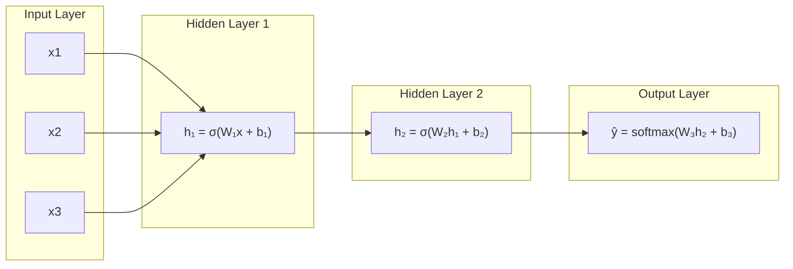
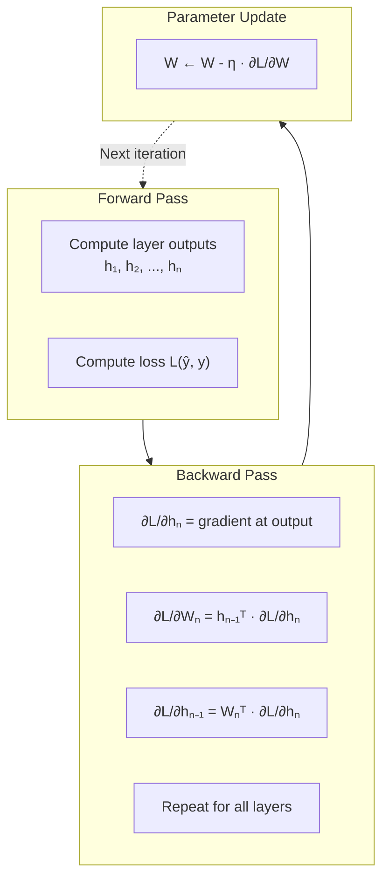
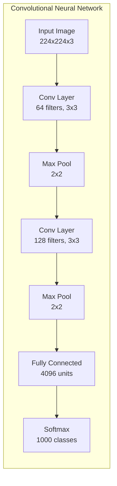
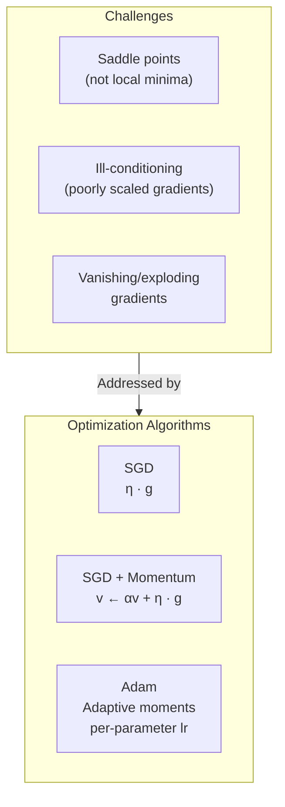
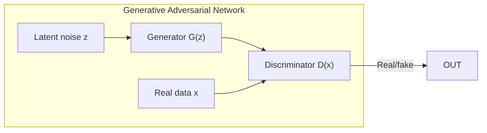

## Deep Feedforward Network Architecture

A deep feedforward network learns a composition of functions. Each
layer applies an affine transformation followed by a nonlinear
activation function (ReLU, sigmoid, tanh). The depth of the network
allows it to learn hierarchical representations.

---

## The Backpropagation Algorithm

Backpropagation applies the chain rule to compute gradients through
the computation graph. It is the foundation on which all deep learning
optimization is built.

---

## Convolutional Networks

CNNs exploit three key ideas: sparse connectivity (local receptive
fields), parameter sharing (same filter across spatial locations), and
equivariant representation. These properties make them highly
efficient for image and grid-structured data.

---

## The Optimization Landscape

Neural network optimization is non-convex. Saddle points are far more
common than local minima in high-dimensional spaces. Adaptive methods
(Adam) handle ill-conditioned problems better than plain SGD.

---

## Generative Models

GANs frame generation as a game between a generator and a
discriminator. The generator learns to produce realistic samples; the
discriminator learns to distinguish real from fake. The result is a
generative model that can produce remarkably realistic images, audio,
and text.

---

## Key Lessons

- **Representation learning is the essence of deep learning.** Each
  layer transforms the representation to make the task easier.
- **Depth matters.** Deeper networks can represent certain functions
  exponentially more efficiently than shallow ones.
- **The gradient tells you where to go, not where you are.**
  Optimization dynamics are complex; monitoring learning curves is
  essential.
- **Generalization in deep learning is not well understood.** The
  classical bias-variance tradeoff does not fully explain why
  overparameterized networks generalize well.

---

## Practical Applications

- **Computer vision:** CNNs are the standard architecture for image
  classification, object detection, segmentation, and face recognition
- **Natural language processing:** RNNs, transformers, and attention
  mechanisms power translation, summarization, and question answering
- **Speech recognition:** Deep networks replaced traditional
  Gaussian mixture models in production systems
- **Reinforcement learning:** Deep Q-networks and policy gradient
  methods achieve superhuman performance in games
