## Introduction

Welcome to BookAtlas. Today: *Deep Learning* by Ian Goodfellow,
Yoshua Bengio, and Aaron Courville. Published 2016 by MIT Press.
800 pages. The textbook that became the bible of the deep learning
revolution.

The book has an unusual status. It is a textbook, yet it was written
during a revolution — the field was changing so fast that the authors
were racing to keep up. It is theoretically rigorous, yet praised by
industry leaders like Elon Musk. It is free online, yet sold tens of
thousands of copies.

---

## Why This Book Exists

**Engineer:** Before 2016, there was no single source that covered
deep learning comprehensively. You had to piece together knowledge
from research papers, blog posts, and lecture notes. Goodfellow,
Bengio, and Courville decided to write the book they wished they had
had as students.

**Skeptic:** But it is 800 pages. Who actually reads it cover to
cover?

**Engineer:** Few people. Most use it as a reference. You read
chapters relevant to your work. Chapter 6 on feedforward networks.
Chapter 9 on CNNs if you work with images. Chapter 10 on RNNs for
sequence data. The book is designed for selective reading.

---

## The Three Parts

```mermaid
flowchart LR
    subgraph Part1["Part I: Foundations"]
        P1A["Linear Algebra"]
        P1B["Probability"]
        P1C["Numerical Computation"]
        P1D["ML Basics"]
    end

    subgraph Part2["Part II: Modern Practice"]
        P2A["Feedforward Networks"]
        P2B["Regularization"]
        P2C["Optimization"]
        P2D["CNNs"]
        P2E["RNNs"]
        P2F["Practical Methodology"]
    end

    subgraph Part3["Part III: Research"]
        P3A["Autoencoders"]
        P3B["Representation Learning"]
        P3C["Structured Models"]
        P3D["Monte Carlo Methods"]
        P3E["Generative Models"]
    end

    Part1 --> Part2 --> Part3
```

**Engineer:** Part I gets you to the starting line. Part II covers
everything you need to build modern deep learning systems. Part III
launches you into the research frontier — this is where the book is
most valuable and most quickly dated.

---

## The Missing Code

**Skeptic:** I read the chapter on convolutional networks. Lots of
math. No code. How do I actually build one?

**Engineer:** That is the book's biggest gap and a deliberate choice.
The authors wanted to write a reference that would outlast any
particular framework. TensorFlow had just been released. PyTorch did
not yet exist. Any code would have been obsolete within months.

**Skeptic:** So what is the point of reading it?

**Engineer:** Understanding. When you read Chapter 9 on CNNs, you
learn why convolutions work, not just how to call
`Conv2D(filters=64)`. That understanding transfers across frameworks
and years.

---

## GANs and the Goodfellow Effect

**Engineer:** Chapter 20 on deep generative models includes GANs —
Generative Adversarial Networks — which Ian Goodfellow invented in
2014. The chapter provides the best single explanation of how GANs
work.

**Skeptic:** Does the book overrepresent GANs because one of the
authors invented them?

**Engineer:** Yes, but deservedly so. GANs were a breakthrough.
The book's coverage of GANs is excellent. It also covers VAEs,
Boltzmann machines, and autoregressive models. The bias is
acknowledged and the overall coverage is balanced.

---

## The Verdict

**Engineer:** Deep Learning is not a book you read; it is a book you
study. It demands work. But it repays that work with a foundational
understanding that no other resource provides.

**Skeptic:** Is it still relevant in 2026? Transformers, diffusion
models, large language models — none of that is in there.

**Engineer:** The research chapters have aged. But Parts I and II are
timeless. The math has not changed. The architectures described —
CNNs, RNNs, feedforward networks — remain foundational. The
practical methodology chapter is more relevant than ever.

---

## Final Thoughts

Deep Learning by Goodfellow, Bengio, and Courville is a landmark
publication — the right book at the right time. It is not for
everyone. But for those who make the investment, it provides a
foundation that blog posts and tutorials cannot match.

This has been a BookAtlas narration of Deep Learning by Goodfellow,
Bengio, and Courville. Thanks for listening.
