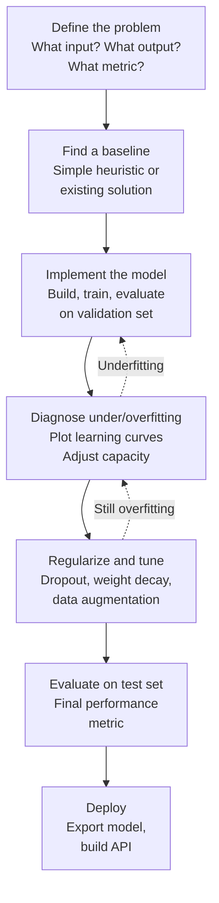
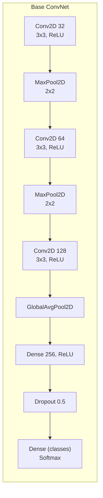
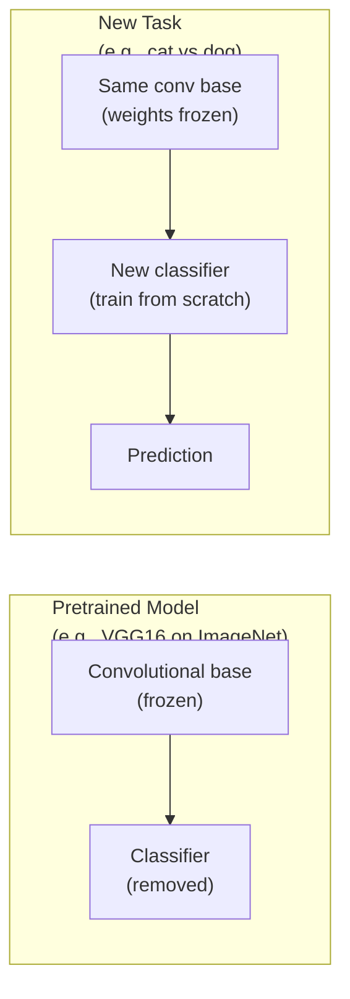
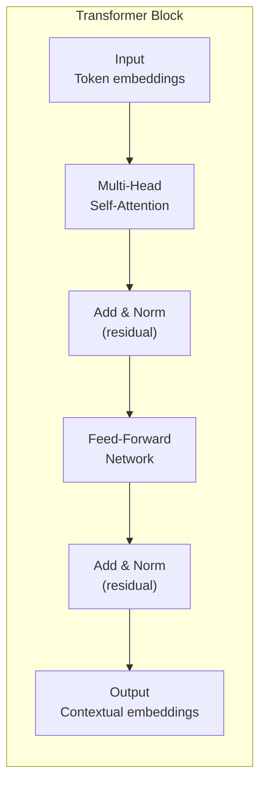

## The Universal Workflow of Machine Learning

Chollet's universal workflow is a repeatable process for any machine
learning project. Start simple, establish a baseline, and iterate.

---

## Convolutional Network Architecture

The pattern: progressively increase filter count as spatial dimensions
decrease. Each convolution extracts more abstract features.

---

## Transfer Learning

Transfer learning is the single most impactful technique in practical
deep learning. A pretrained model's feature extraction layers transfer
to new tasks, requiring far less data and training time.

---

## The Transformer Architecture

The Transformer replaced RNNs for sequence tasks. Self-attention
processes all tokens simultaneously, enabling parallel computation
and long-range dependencies. The residual connections and layer
normalization stabilize training of very deep networks.

---

## Key Lessons

- **Start simple, then iterate.** The universal workflow prevents
  wasted effort on complex models before understanding the problem.
- **Always visualize learning curves.** Training loss vs validation
  loss tells you immediately whether you are underfitting or
  overfitting.
- **Data is more important than architecture.** Better data beats
  better models. Data augmentation multiplies your dataset.
- **Transfer learning is not optional.** Unless you have a truly novel
  problem domain, start from a pretrained model.

---

## Practical Applications

- **Image classification:** Use a pretrained ConvNet (ResNet, Xception)
  with transfer learning. Fine-tune the last few layers.
- **Text classification:** Start with a simple bag-of-words model.
  Only use transformers if the simple model underperforms.
- **Time series forecasting:** Dense or convolutional models often
  outperform LSTMs on forecasting tasks.
- **Image segmentation:** Use the U-Net architecture with a pretrained
  encoder backbone.
- **Text generation:** Fine-tune a pretrained language model on your
  specific domain data.
