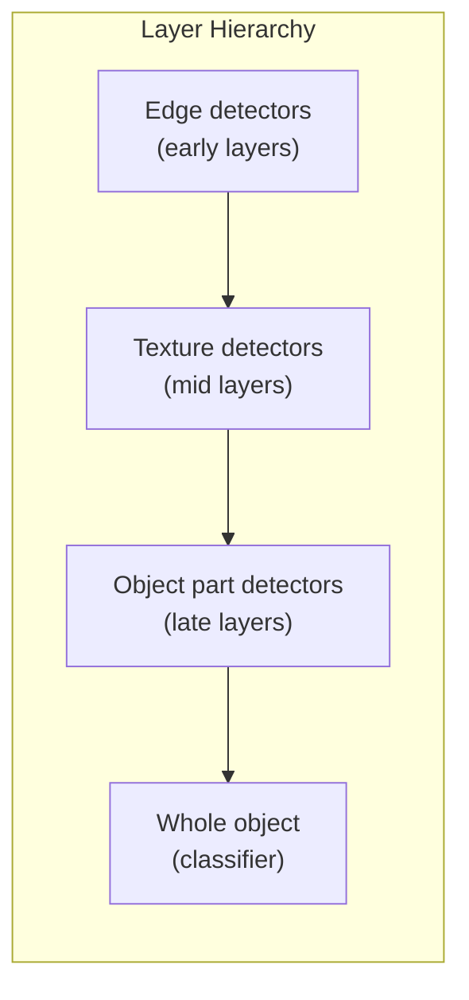

## Introduction

Welcome to BookAtlas. Today: *Deep Learning with Python* by Francois
Chollet. Second edition, 2021, Manning Publications. The book that has
taught more people to do deep learning than any other.

This is not the Goodfellow textbook. That book is theory. This book is
practice. Chollet wrote it because he believed deep learning should be
accessible to anyone who can write Python.

---

## The Keras Philosophy

**Engineer:** Keras, the library Chollet created, is built on a simple
idea: deep learning frameworks should be pleasant to use. Not powerful
first. Pleasant first. Because if a framework is pleasant, people will
use it, iterate faster, and ultimately build better models.

**Skeptic:** But PyTorch is more popular now. Is Keras still relevant?

**Engineer:** Keras was integrated into TensorFlow and then became
multi-backend. In 2024, Keras 3 supports TensorFlow, PyTorch, and JAX
as backends. Chollet's vision of a high-level, user-friendly API has
been vindicated. The ideas in this book — progressive disclosure of
complexity, good defaults, readable code — are now standard in the
industry.

---

## The Universal Workflow

**Engineer:** Chapter 6 is the heart of the book. Chollet defines a
universal workflow for machine learning that applies to any problem:

1. Define the problem and the metric
2. Establish a simple baseline
3. Implement and overfit a small model
4. Regularize
5. Evaluate on test data
6. Deploy

**Skeptic:** That sounds obvious.

**Engineer:** It is obvious. That is the point. Most beginners skip
step 2 — they go straight to a complex model. The universal workflow
is a discipline. Follow it, and you will waste less time.

---

## ConvNets and What They See

**Engineer:** One of the book's best sections shows what convolutional
networks actually see. Early layers detect edges and colors. Middle
layers detect textures and patterns. Late layers detect object parts.
The final layer combines these into object classifications.

**Skeptic:** This is the interpretability chapter?

**Engineer:** Yes. Chollet shows how to visualize activations, filter
patterns, and class heatmaps (Grad-CAM). Understanding what your model
sees is essential for debugging and trust.

---

## The Transformer Revolution

**Engineer:** The 2nd edition added a chapter on Transformers, which
was prescient. Transformers — introduced in 2017's "Attention Is All
You Need" — have since become the dominant architecture in NLP and
are now challenging CNNs in vision.

**Skeptic:** But the chapter covers only text. What about vision
transformers?

**Engineer:** The 3rd edition, released in 2025, addresses that. The
2nd edition was a snapshot of the state of the art in 2021. It got
the direction right even if some details have evolved.

---

## The Verdict

**Engineer:** Deep Learning with Python is the best first book on deep
learning. Read it, run the code, and you will be able to build working
models. Then read Goodfellow's textbook for theory.

**Skeptic:** Do I need both?

**Engineer:** If you want to be truly competent, yes. Chollet teaches
you how. Goodfellow teaches you why. Together, they form the
foundation of deep learning education.

---

## Final Thoughts

Deep Learning with Python by Francois Chollet is a remarkable book —
practical, clear, and authoritative. It has launched thousands of
careers in AI. For anyone starting their deep learning journey, this
is the book to read first.

This has been a BookAtlas narration of Deep Learning with Python by
Francois Chollet. Thanks for listening.
