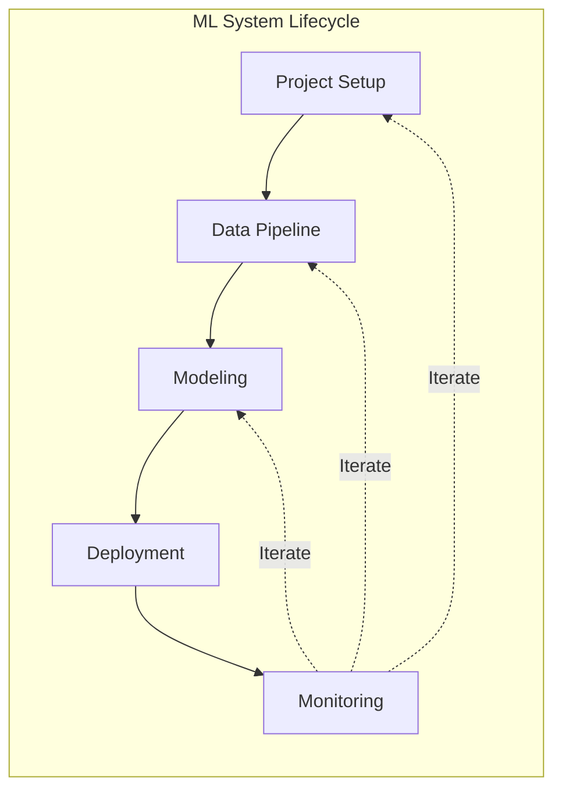
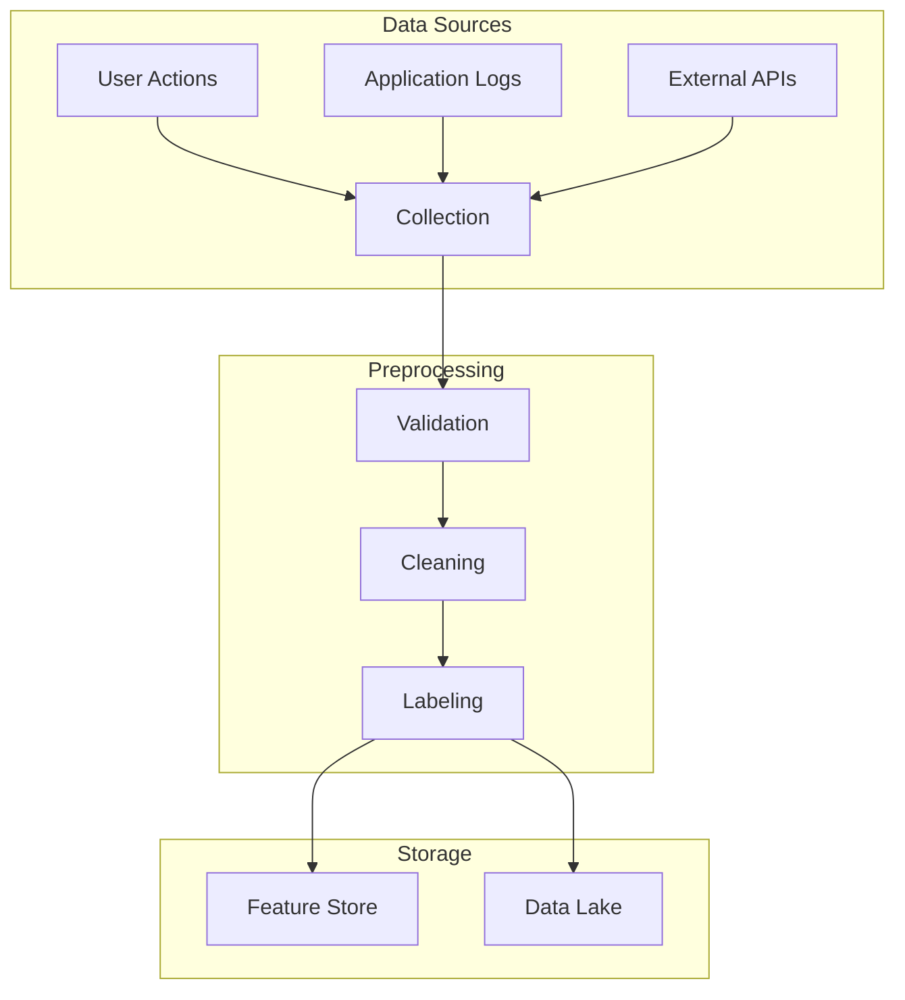
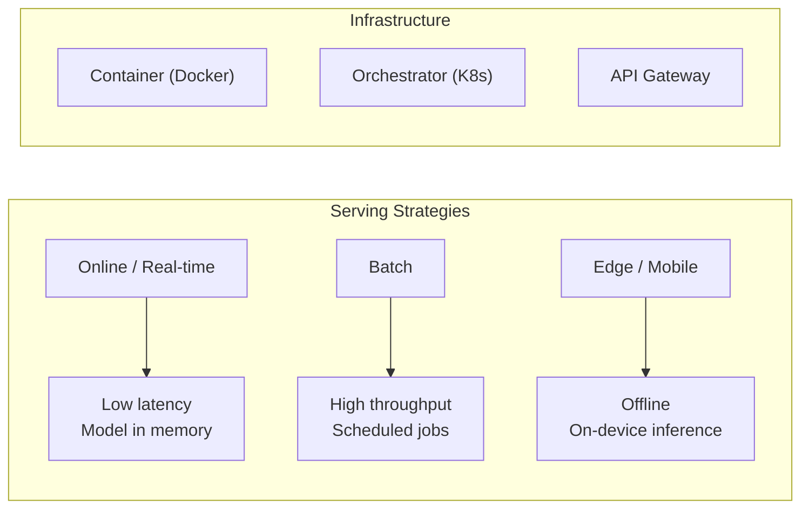
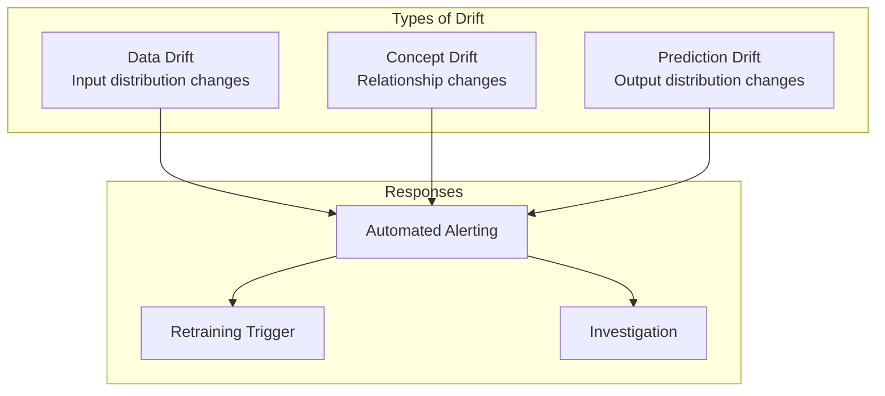

## The ML Project Lifecycle

Unlike traditional software, ML systems have a tight feedback loop
between deployment and earlier stages. Model degradation triggers
data re-collection, re-labeling, and re-training.

---

## Project Setup

### Problem Definition

ML projects fail most often at the framing stage, not the modeling
stage. Huyen emphasizes:

- **Business goal != ML metric.** Revenue, engagement, and retention
  are the real metrics. Model accuracy is a proxy.

- **Success criteria before modeling.** Define what "good enough"
  means in business terms before writing any ML code.

- **Feasibility check.** Is ML the right solution? Sometimes a simple
  heuristic outperforms a complex model.

### Stakeholder Mapping

ML systems involve diverse stakeholders: product managers, engineers,
data scientists, legal, compliance, users. Each has different
priorities and incentives.

---

## The Data Pipeline

### Data Engineering Fundamentals

- **Data is messy.** Real-world data has missing values, outliers,
  label errors, and distribution shifts.

- **Data validation is critical.** Use schema validation, statistical
  tests, and anomaly detection at ingestion time.

- **Label quality matters more than label quantity.** Invest in
  labeler training, inter-rater agreement, and label auditing.

### Feature Engineering

Features encode domain knowledge. A feature store provides a shared
repository of curated features, ensuring consistency between training
and serving:

| Capability | Benefit |
|------------|---------|
| Feature sharing | Across teams, avoid duplicate work |
| Point-in-time correctness | Prevent data leakage in training |
| Consistency | Same logic in training and serving |
| Monitoring | Track feature drift over time |

---

## Modeling

### Model Selection

Huyen categorizes model choices:

| Factor | Research | Production |
|--------|----------|------------|
| Primary goal | Benchmark accuracy | Business value |
| Data available | Fixed dataset | Growing, changing |
| Latency requirement | None | Often < 100ms |
| Interpretability | Optional | Often required |
| Compute budget | Variable | Fixed cost |

### Training and Debugging

ML debugging is harder than software debugging because:

- Errors don't crash — they degrade silently
- The problem may be in data, not code
- Non-deterministic training makes reproduction difficult

Debugging workflow: start with a simple baseline, overfit a single
batch, then add complexity while validating each step.

### Hyperparameter Tuning

Manual tuning is common but inefficient. Automated approaches include
grid search, random search, Bayesian optimization, and population-
based training.

---

## Deployment

### Deployment Strategies

| Strategy | Use Case |
|----------|----------|
| Shadow deployment | Test in production without affecting users |
| Canary deployment | Gradual rollout to detect issues |
| Blue-green deployment | Instant rollback capability |
| A/B testing | Compare model versions on live traffic |

### Model Compression

Production constraints often require smaller models:
- Pruning, quantization, distillation
- Trade-off: size vs. accuracy
- Essential for edge and mobile deployment

---

## Monitoring

### What to Monitor

| Category | Metrics | Action |
|----------|---------|--------|
| Prediction | Distribution, confidence | Retrain if shifted |
| Model performance | Accuracy, precision, recall | Need labels (delayed) |
| Data quality | Schema, missing values, range | Alert on anomalies |
| Serving | Latency, throughput, errors | Scale infrastructure |
| Business | Revenue, engagement, retention | Re-evaluate model value |

---

## The Iterative Loop

The key insight: ML systems are never done. They require continuous
iteration:

1. Deploy a minimal useful model quickly
2. Monitor for degradation
3. Diagnose the root cause (data drift, concept drift, infrastructure)
4. Improve the component that needs it most
5. Repeat

---

## Key Lessons

- **Data quality over model complexity** — a simple model on clean
  data outperforms a complex model on noisy data
- **Feature stores are essential infrastructure** — they prevent
  training-serving skew
- **Monitor everything** — silent degradation is the most dangerous
  failure mode
- **Deploy early, improve often** — get something useful into
  production and iterate
- **Think holistically** — ML is not just the model; it is the
  entire system that produces and consumes predictions

---

## Action Plan

1. **Audit your data pipeline.** Where is data quality at risk?
   Implement validation at each stage.

2. **Adopt a feature store.** Ensure feature consistency between
   training and serving.

3. **Set up model monitoring.** Track prediction distributions,
   data drift, and serving metrics from day one.

4. **Implement experiment tracking.** Version models,
   hyperparameters, and datasets for reproducibility.

5. **Build a deployment pipeline.** Automate model serving with
   canary releases and rollback capability.

6. **Establish a retraining policy.** Define when and how models
   are retrained based on monitoring signals.
