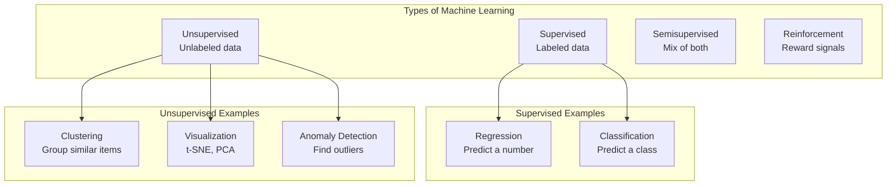
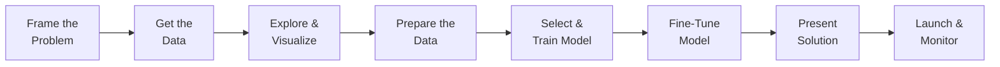
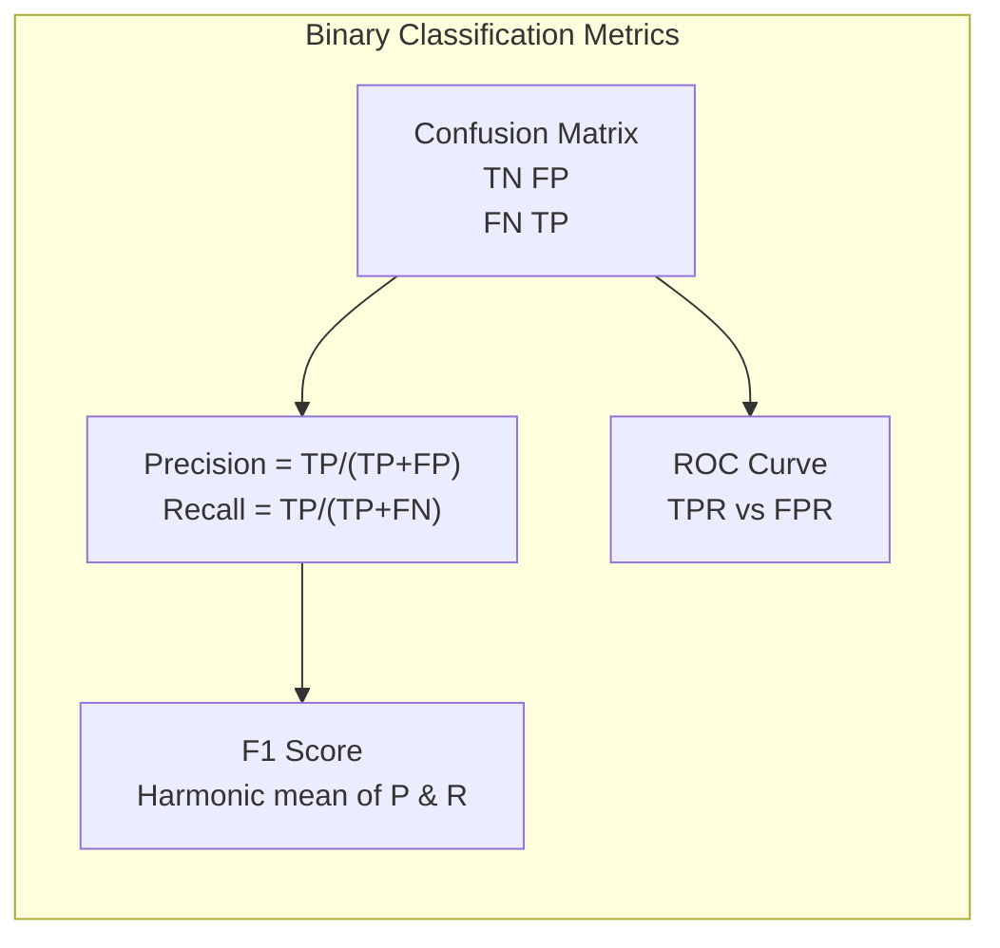
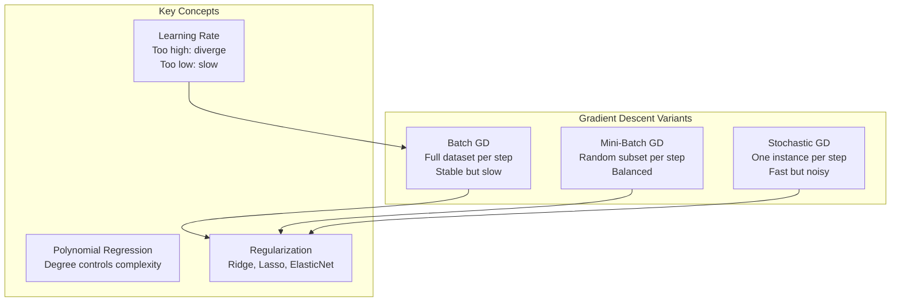
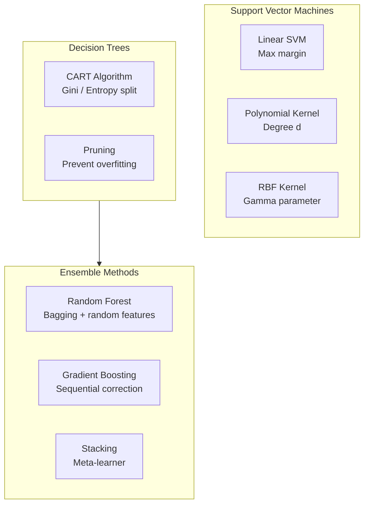
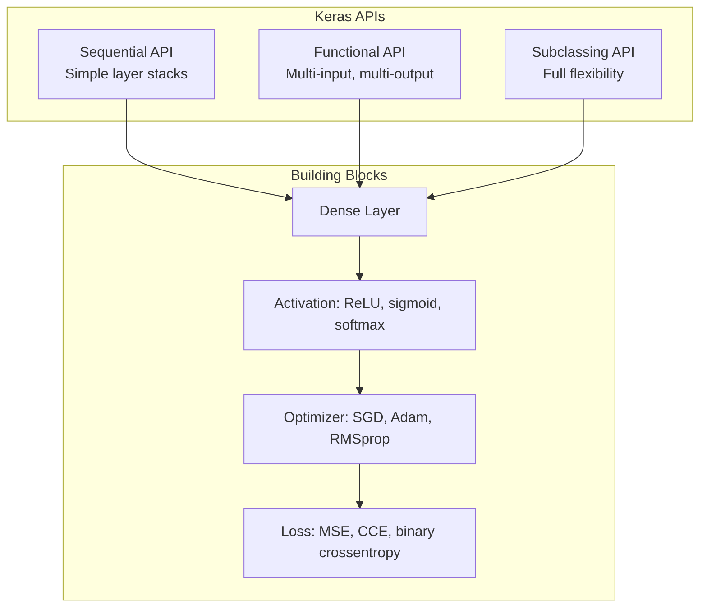
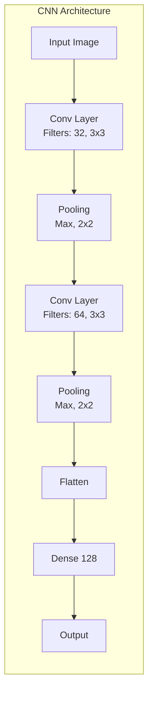
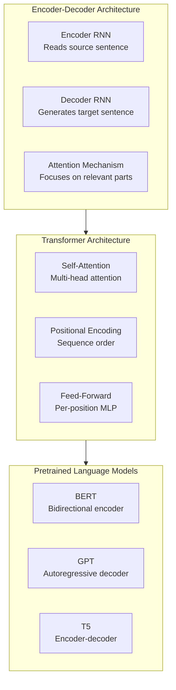
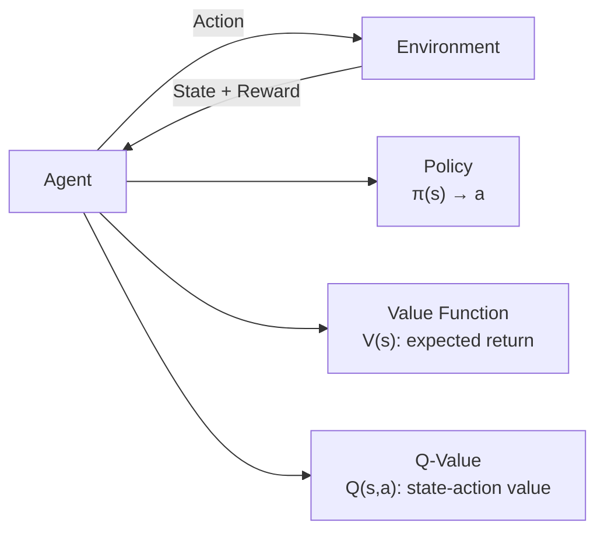

## Part I: The Fundamentals of Machine Learning

### Chapter 1 — The Machine Learning Landscape

Géron defines ML as the science (and art) of programming computers
to learn from data. The chapter establishes the taxonomy every
practitioner needs:

Key challenges: insufficient data, nonrepresentative data, poor
quality, irrelevant features, overfitting, underfitting.

---

### Chapter 2 — End-to-End Machine Learning Project

The book's signature chapter. Géron works through the California
housing dataset from start to finish:

The pipeline includes: `ColumnTransformer` for mixed numeric/
categorical features, `Pipeline` for composable transforms,
`GridSearchCV` and `RandomizedSearchCV` for hyperparameter tuning,
and cross-validation for honest evaluation.

---

### Chapter 3 — Classification

MNIST digit classification as the "hello world" of ML. Covers:

- **Binary classifiers** (SGDClassifier, confusion matrix,
  precision/recall trade-off, ROC curve)
- **Multiclass strategies** (OvR, OvO)
- **Error analysis** via confusion matrix visualization
- **Multilabel and multioutput classification**

---

### Chapter 4 — Training Models

The most mathematical chapter. Derives linear regression via the
Normal Equation, then gradient descent:

Also covers Logistic Regression for classification, the bias-variance
trade-off, and learning curves as diagnostic tools.

---

### Chapters 5–7 — SVM, Decision Trees, Ensemble Methods

SVM chapter explains the kernel trick clearly: mapping inputs to a
high-dimensional feature space without computing the coordinates.
Decision Trees introduce impurity measures (Gini, entropy). Ensemble
chapter is the highlight — Random Forests bag hundreds of trees,
Gradient Boosting builds additive trees, and XGBoost is introduced
as a production-grade implementation.

---

### Chapter 8 — Dimensionality Reduction

The curse of dimensionality: as dimensions increase, data becomes
sparse, and distance metrics lose meaning. PCA is the workhorse:

- Finds the axis of maximum variance
- Projects data onto top-k principal components
- Explained variance ratio tells you how much information is kept

Also covers t-SNE (visualization), LLE (local linear embedding), and
incremental PCA for large datasets.

---

### Chapter 9 — Unsupervised Learning Techniques

Adds clustering (K-Means, DBSCAN), Gaussian Mixture Models, and
anomaly detection. K-Means is demonstrated for image segmentation
and semi-supervised learning.

---

## Part II: Neural Networks and Deep Learning

### Chapter 10 — ANN with Keras

Géron introduces the three Keras APIs and shows how to build,
compile, fit, evaluate, and predict. Callbacks (ModelCheckpoint,
EarlyStopping, TensorBoard) are introduced early.

---

### Chapter 11 — Training Deep Neural Networks

The hardest practical chapter. Vanishing/exploding gradients are
tackled with:

- **Weight initialization:** He (ReLU) vs. Glorot (tanh)
- **Batch Normalization:** Normalize activations, enable higher
  learning rates
- **Gradient Clipping:** Cap gradient values
- **Dropout:** Randomly drop neurons during training
- **Optimizers:** Momentum, Nesterov, AdaGrad, RMSProp, Adam, Nadam

Also covers learning rate scheduling, self-normalizing nets (SELU),
and Monte-Carlo Dropout for uncertainty estimation.

---

### Chapters 12–13 — Custom TensorFlow and Data Pipelines

Chapter 12 descends into TF's lower-level API: writing custom loss
functions, metrics, layers, and training loops. TF Functions and
AutoGraph convert Python into optimized graph operations.

Chapter 13 covers the `tf.data` API for efficient input pipelines:
`Dataset.from_tensor_slices`, `map`, `batch`, `prefetch`,
`cache`. Also introduces TFRecords for serialization and Keras
preprocessing layers.

---

### Chapter 14 — Convolutional Neural Networks

Covers convolutional and pooling layers, common architectures
(LeNet-5, AlexNet, VGG-16, GoogLeNet, ResNet, Xception, SENet),
transfer learning with pretrained Keras models, object detection
(YOLO), and semantic segmentation.

---

### Chapter 15 — Processing Sequences (RNNs and CNNs)

Time series and sequential data. The chapter covers:

- **Simple RNNs** — suffer from vanishing gradients
- **LSTM and GRU** — gating mechanisms solve long-range dependencies
- **1D CNNs** — faster alternative for sequences
- **WaveNet** — dilated causal convolutions
- **ARMA models** for time series forecasting

The example uses Chicago transit ridership data.

---

### Chapter 16 — NLP with RNNs and Attention

The most forward-looking chapter in the 3rd edition:

Builds an English-to-Spanish translation model, first with RNN +
attention, then with a Transformer. Also introduces: Switch
Transformers, DistilBERT, T5, PaLM with chain-of-thought, vision
transformers (ViT, DeiT), and large multimodal models (CLIP, DALL·E,
Flamingo, GATO).

---

### Chapter 17 — Autoencoders, GANs, and Diffusion Models

Three generative paradigms:

- **Autoencoders:** compress then reconstruct; used for anomaly
  detection and denoising
- **GANs:** generator vs. discriminator adversarial training;
  DCGANs, ProGANs, StyleGANs
- **Diffusion Models** (new in 3rd ed): gradually add noise then
  learn to reverse the process. Includes a DDPM implementation from
  scratch.

---

### Chapter 18 — Reinforcement Learning

Covers policy gradients, Deep Q-Networks (DQN), Double DQN, Dueling
DQN, Prioritized Experience Replay, and TF-Agents for scalable RL.

---

### Chapter 19 — Training and Deploying at Scale

Production ML: TF Serving for model serving, TFLite for mobile/edge,
GPU acceleration with CUDA, distributed training with Distribution
Strategies (mirrored, multi-worker, parameter server), and
Vertex AI for cloud deployment.

---

## Key Lessons

- **Start simple, then iterate.** Always establish a baseline before
  reaching for complex models.
- **Cross-validation is your friend.** Never trust a single train/test
  split.
- **Scale your features.** Tree-based models are invariant to scale;
  most others are not.
- **Prefer Adam as the default optimizer.** It combines momentum and
  adaptive learning rates. Switch to SGD with momentum for
  generalization.
- **Batch Normalization accelerates training.** Use it by default
  in deep networks.
- **Transfer learning beats training from scratch.** Always check if
  a pretrained model exists for your task.
- **Deployment is the hard part.** The model is a small fraction of a
  production ML system.

---

## Practical Applications

### For Regression

- Linear Regression for simple baselines
- Ridge/Lasso for regularization
- Random Forest for non-linear relationships

### For Classification

- Logistic Regression for probabilistic baselines
- SVM with RBF kernel for medium datasets
- Random Forest / XGBoost for tabular data
- Fine-tuned neural net for images or text

### For Computer Vision

- Pretrained ResNet or EfficientNet as feature extractor
- YOLO for real-time object detection
- Data augmentation with Keras layers

### For NLP

- Pretrained transformers (BERT, T5) via Hugging Face
- Embeddings + bidirectional LSTM for smaller datasets
- Beam search for sequence generation

### For Time Series

- ARMA for simple forecasting
- LSTM/GRU for complex temporal patterns
- 1D CNN + RNN hybrid architectures

---

## Action Plan

1. **Read chapters 1–4** to understand ML fundamentals. Run every
   code cell.

2. **Complete the Chapter 2 project** end-to-end with your own
   dataset. This is the single most valuable exercise in the book.

3. **Build classifiers (Ch 3)** and diagnose errors with confusion
   matrices and ROC curves.

4. **Study the ensemble chapter (Ch 7)** — Random Forests and Gradient
   Boosting win most tabular-data competitions.

5. **Switch to Part II** and build a neural net with Keras (Ch 10).
   Modify architecture, add layers, observe the effect.

6. **Apply transfer learning (Ch 14)** to a custom image dataset.
   Fine-tune a pretrained model.

7. **Build a translation or text generation model (Ch 16)** using
   Hugging Face transformers.

8. **Deploy a model (Ch 19)** with TF Serving or a REST API.

9. **Write your own custom training loop (Ch 12)** to understand
   what Keras does under the hood.

10. **Revisit Chapter 11** whenever you encounter training stability
    issues. The techniques there solve 90% of deep learning problems.
