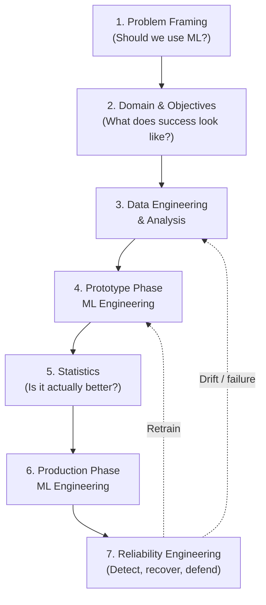
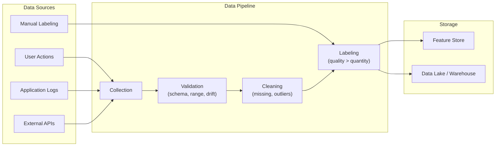
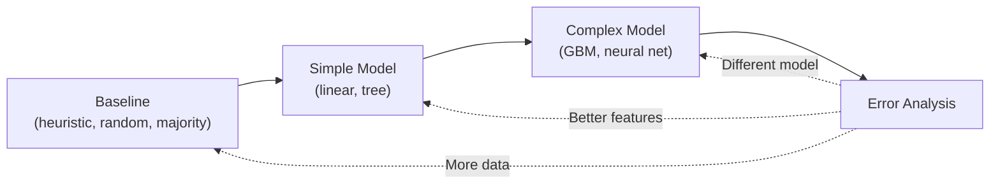
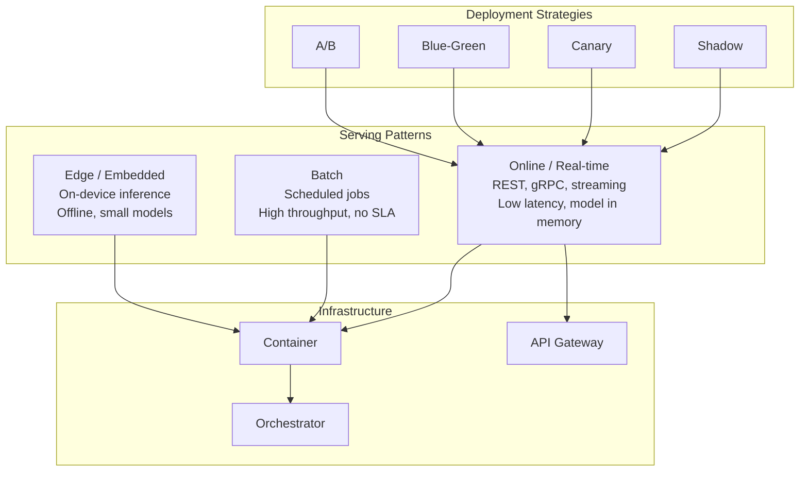
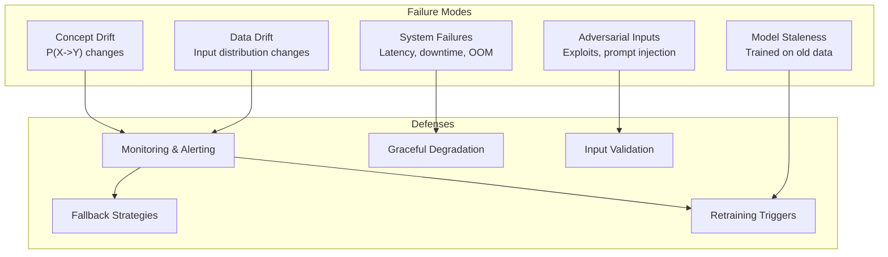

## The ML Project Lifecycle

The book's organizing idea is the lifecycle: a successful ML project
must execute the phases in a specific order, and skipping or
reordering them is the most common cause of failure.

Cassie Kozyrkov's foreword summarizes the book in culinary terms:
figure out what to cook (decision-making), understand the
suppliers and customers (domain), process ingredients at scale
(data), try combinations quickly (prototyping), check quality
(statistics), serve millions of dishes (production), and stay
top-notch when the truck brings the wrong delivery (reliability).

---

## Phase 1 — Problem Framing

The first decision is whether to use ML at all. Burkov enumerates
cases where ML is and is not the right tool:

**Use ML when:**

- The problem is perceptive (image, speech, video) — humans
  recognize patterns in high-dimensional inputs that no hand-coded
  rule captures
- The problem is an unstudied phenomenon with observable examples
  (personalized medicine, log anomaly detection, content
  recommendation)
- The objective is simple (yes/no, a number) and there are
  sufficient examples

**Avoid ML when:**

- Every decision must be explainable in human terms (regulatory
  environments often forbid this)
- The cost of an error is unacceptably high and unrecoverable
  (life-critical systems, irreversible financial actions)
- The marketing value of "AI" exceeds the engineering value — a
  common trap that Burkov calls out explicitly

The framing chapter's signature move: define success in business
terms *before* defining it in model terms. Revenue, retention,
time saved — not accuracy, F1, or AUC.

---

## Phase 2 — Domain Expertise and Business Acumen

ML does not eliminate the need for domain knowledge; it amplifies
it. The engineer who understands the domain will:

- Choose features that encode real signal, not noise
- Recognize label leakage before it ruins a model
- Set baseline targets that a simple heuristic might already
  exceed
- Identify the edge cases that the test set will miss

Burkov argues that domain expertise is the single hardest
capability to hire for. A strong modeler with weak domain
knowledge will build a model that wins benchmarks and loses
customers. A weak modeler with strong domain knowledge will at
least build a system that solves the right problem.

---

## Phase 3 — Data Engineering and Analysis

> "The greatest challenges must be solved before you type
> `from sklearn.linear_model import LogisticRegression`, and the
> rest of the problem is solved after you type `model.fit(X, y)`."
> — Andriy Burkov

Key engineering concerns:

| Concern | What it means | Why it matters |
|---|---|---|
| Data quality | Missing values, label errors, duplicates, schema drift | Garbage in, garbage out — a model trained on bad data cannot recover |
| Labeling strategy | Who labels, how disagreements are resolved, what the ground truth actually is | The label defines the objective; ambiguous labels produce ambiguous models |
| Train/serve skew | The features the model sees in production differ from those in training | The single most common cause of production model failure |
| Data versioning | Datasets are versioned and reproducible alongside code | Without it, you cannot debug, audit, or roll back |
| Privacy and consent | PII handling, retention policies, regulatory compliance (GDPR, HIPAA) | Legal and ethical exposure, especially under European and US state laws |

Burkov devotes particular attention to the cost of labeling. Active
learning, weak supervision, and crowdsourcing each have trade-offs
that the engineer must understand before committing a budget.

---

## Phase 4 — Prototype Phase ML Engineering

The prototype phase exists to answer one question quickly: *can a
model beat a strong baseline on this problem?*

The progression is deliberate. Each step exists to be either
accepted or rejected cheaply:

1. **Baseline first.** A simple rule, a random predictor, or a
   majority-class classifier. If a model cannot beat this, the
   project is not ready for ML.
2. **Simple model second.** Linear regression, logistic regression,
   a small decision tree. These train in seconds, are easy to
   debug, and often beat a complex model in production.
3. **Complex model only if justified.** Gradient boosting, deep
   learning. Justified by measured lift over the simple model, not
   by fashion.
4. **Error analysis at every step.** Confusion matrices, residual
   plots, segment-level performance. The errors are the most
   informative output of the prototype phase.

Burkov emphasizes that the prototype is a *means*, not a deliverable.
The deliverable is a credible answer to "can ML solve this?", not a
Jupyter notebook.

---

## Phase 5 — Statistics

A model that beats a baseline on a single test set has not been
proven better. The statistics chapters cover:

- **Significance testing.** Is the improvement over the baseline
  larger than what random variation would produce? Burkov walks
  through the common tests (paired t-test, McNemar's test for
  classifiers, bootstrap confidence intervals) and the common
  pitfalls (multiple comparisons, peeking at test results).
- **Effect size vs. statistical significance.** A 0.1% accuracy
  improvement can be statistically significant at scale but
  operationally meaningless. Burkov insists on translating
  statistical results into business terms.
- **Confidence intervals for production metrics.** Latency,
  throughput, error rate — all should be reported with
  intervals, not point estimates.
- **A/B testing for production rollouts.** The model that wins in
  offline evaluation is not guaranteed to win with live users.
  The book covers sample size calculation, interleaving, and
  the long list of A/B test anti-patterns.

The recurring message: an engineer who cannot speak the language
of statistics cannot honestly ship a model.

---

## Phase 6 — Production Phase ML Engineering

### Serving Patterns

| Pattern | Latency | Throughput | Use case |
|---|---|---|---|
| Online / real-time | ms | lower | Recommendations, fraud, search ranking |
| Batch | hours | very high | Reporting, nightly personalization, scoring |
| Streaming | ms-seconds | medium | Time-sensitive features, real-time features |
| Edge / embedded | ms | very low | Mobile keyboards, on-device vision |

### Deployment Strategies

- **Shadow deployment.** The new model receives production traffic
  but its outputs are not served to users. The team compares
  shadow predictions to live predictions offline.
- **Canary release.** A small percentage of traffic is routed to
  the new model. Roll forward or roll back based on monitored
  metrics.
- **Blue-green deployment.** Two identical production
  environments; switch traffic atomically. Best for instant
  rollback.
- **A/B testing.** Random assignment of users to model variants
  for statistical comparison. The book is firm: A/B testing is a
  *measurement* tool, not a *deployment* tool — use it to learn,
  then use canary to ship.

### Reproducibility and Versioning

Every artifact in the production pipeline must be versioned and
reproducible:

- Code (Git)
- Data (DVC, lakeFS, or a feature store with snapshots)
- Model artifacts (MLflow, Weights & Biases, or a model registry)
- Environment (Docker images, lock files)
- Configuration (feature flags, hyperparameters)

Burkov's framing: if you cannot reproduce the model that is
running in production right now, you cannot debug it, audit it,
or roll it back.

---

## Phase 7 — Reliability Engineering

The book's strongest section. Reliability treats the ML system
the way Site Reliability Engineering treats any production service:
assume it will fail, design for detection and recovery.

### Monitoring Categories

| Category | What to watch | When to alert |
|---|---|---|
| Input data | Distribution, schema, missingness | Drift beyond historical range |
| Output | Prediction distribution, confidence | Sudden shift, mass class collapse |
| Model performance | Accuracy, precision, recall (when labels are available) | Degradation vs. baseline |
| System | Latency, throughput, error rate, memory | SLO breach |
| Business | Conversion, revenue, engagement | Untied to model performance |
| Adversarial | Suspicious input patterns, abuse signals | Anomalous rate spikes |

### Fallback Strategies

When the model is wrong, unavailable, or under attack, the system
must do something sensible:

- **Default to a heuristic.** If the model is unavailable, fall
  back to a hand-coded rule (e.g. "most popular item").
- **Default to a simpler model.** If a deep model is too slow, a
  smaller model or a cached prediction can carry the load.
- **Refuse to predict.** Sometimes the correct action is to show
  no recommendation rather than a bad one.
- **Human-in-the-loop.** Route low-confidence or high-stakes
  predictions to a human reviewer.

### Adversarial Considerations

Burkov devotes space to adversaries — users who intentionally
craft inputs to make the model misbehave. Recommendations include
input validation, rate limiting, anomaly detection on input
features, and treating model outputs as untrusted inputs to
downstream systems.

---

## Communication and Stakeholder Management

A chapter many reviewers cite as underrated: the engineering
work is half technical and half organizational. The book covers
how to:

- Set realistic expectations with product and business stakeholders
- Communicate model performance in business terms
- Write an ML project plan that survives contact with a product
  roadmap
- Handle disagreement between modelers, engineers, and
  domain experts
- Decide when *not* to deploy a model

---

## Key Lessons

- **Order matters.** The seven phases must happen roughly in
  sequence. A project that begins with model selection before
  data engineering will be redone; a project that begins with
  data engineering before problem framing will optimize the
  wrong thing.
- **The model is the small part.** Data engineering, statistics,
  production, and reliability consume most of the effort and
  most of the failures.
- **Mistakes are inevitable; design for them.** The model will be
  wrong, the pipeline will break, the input distribution will
  shift. The engineering question is not *whether* but *how
  fast can we detect and recover*.
- **Simple models win in production.** A logistic regression that
  is interpretable, cheap to serve, and easy to debug beats a
  deep network on most business problems.
- **Reproducibility is non-negotiable.** If you cannot rebuild the
  model that is running in production, you cannot maintain it.
- **Domain expertise is non-substitutable.** The ML engineer who
  understands the domain will outbuild one who does not, every
  time.

---

## Action Plan

1. **Frame the problem first.** Before writing code, write a
   one-page document answering: what decision is this model
   supporting, what does success look like in business terms,
   and what is the baseline we need to beat?

2. **Audit your data pipeline.** Where is data quality at risk?
   What happens when the schema changes? How are labels
   collected, audited, and versioned?

3. **Build a baseline before a model.** A heuristic, a simple
   rule, a majority-class predictor. If a model cannot beat
   this, the project is not ready for ML.

4. **Establish a model registry.** Every trained model is
   versioned, reproducible, and linked to the code, data, and
   config that produced it.

5. **Design for rollback from day one.** Every deployment
   strategy (canary, blue-green, shadow) must include a tested
   path back to the previous version.

6. **Instrument the system for reliability.** Monitor inputs,
   outputs, system health, and business metrics. Alert on
   drift, not just on crashes.

7. **Plan for the failure modes.** For each phase, enumerate the
   ways it can fail and the fallback for each. Hope is not a
   strategy.

8. **Read *The Hundred-Page Machine Learning Book* alongside
   this one.** One teaches the *what*; this one teaches the
   *how*.
