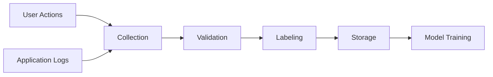
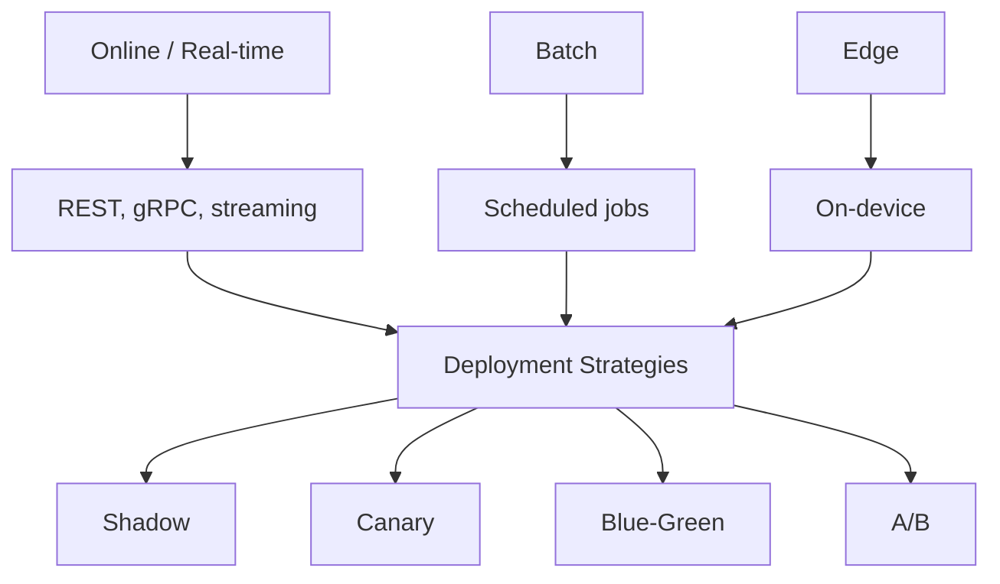

## Introduction

Welcome to BookAtlas. Today: *Machine Learning Engineering* by
Andriy Burkov. Published September 2020 by True Positive Inc.,
the author's own publishing imprint, distributed through Leanpub
under a read-first-pay-later model. 310 pages. Endorsed by Cassie
Kozyrkov, Google's Chief Decision Scientist, and Karolis Urbonas,
Head of Machine Learning at Amazon. 4.32 stars on Goodreads across
135 ratings.

This is the book that tells you what happens after you have
trained the model. Tonight we have two perspectives. On one
side, a senior ML engineer who has shipped a dozen models to
production. On the other, a data scientist who has spent years
in notebooks and is finally being asked to put something live.
Let us get into it.

---

## Why This Book Exists

**ML Engineer:** Most ML books stop at the point where the work
actually gets hard. They teach you gradient descent,
backpropagation, transformer architectures. They show you a
Jupyter notebook with a clean dataset and a 95% accuracy score.
Then you go to work and discover that getting the data clean
takes three months, the model degrades in production within
weeks, and nobody knows whose job it is to fix any of it.

**Data Scientist:** That has been my experience exactly. I have
a stack of ML books on my desk. None of them prepared me for the
question my manager actually asks: "Why is the model wrong?"

**ML Engineer:** That is the gap Burkov is filling. He is not
trying to teach you machine learning. He assumes you already
know that. He is teaching you machine learning *engineering* —
the work of taking a model from a notebook to a system that
runs at scale, in production, without silently breaking.

---

## The Structure: Order Matters

**Data Scientist:** The first thing I noticed is that the book
is organized by project phase, not by algorithm. Phase 1:
problem framing. Phase 2: domain expertise. Phase 3: data
engineering. Phase 4: prototyping. Phase 5: statistics. Phase
6: production. Phase 7: reliability.

**ML Engineer:** Yes. And Cassie Kozyrkov's foreword says this
is the most important thing to learn from the book — not the
content of the chapters, but the *order*. She says if you
internalize the table of contents, you will save yourself from
the most common failure mode in ML: doing steps out of order.

**Data Scientist:** What does "out of order" look like?

**ML Engineer:** Picking a model before you have clean data.
Deploying before you have a baseline. Optimizing accuracy
before you have defined success in business terms. Every ML
team has done at least one of these. Burkov's argument is that
if you follow the seven phases in sequence, you avoid most of
the common ways these projects die.

---

## Phase 1: Problem Framing

The first chapter is the one I wish every product manager would
read. Burkov spends it on a question most ML books ignore: should
we use ML at all?

**Data Scientist:** I have been in kickoff meetings where the
answer is "of course we use ML — that is why we are building
this." The framing has already been done before the team is
hired.

**ML Engineer:** That is exactly the failure mode. Burkov lists
the cases where ML is the wrong tool: when every decision must
be explainable, when the cost of an error is unacceptably high,
when the problem can be solved with a simple rule. He is not
anti-ML. He is anti-ML-by-default.

**Data Scientist:** And the cases where ML is right?

**ML Engineer:** Perceptive problems (image, speech, video),
unstudied phenomena with observable examples, problems with
simple objectives and lots of data. Notice that none of these
include "we have a great new transformer model and we want to
use it." The problem picks the technique, not the other way
around.

---

## Phase 2: Domain Expertise

**Data Scientist:** This is the chapter I did not expect from
a book on engineering. Burkov spends a whole chapter on domain
expertise. What does the customer actually need? What are the
edge cases the test set will miss?

**ML Engineer:** This is the most underrated chapter. The
thesis is that the modeler with weak domain knowledge will
build a model that wins benchmarks and loses customers. The
modeler with strong domain knowledge will at least solve the
right problem. Domain knowledge is the hardest thing to hire
for and the hardest thing to fake.

**Data Scientist:** I will confess: I have built models where
the features were technically correct and the predictions were
operationally useless. Because I did not understand what the
downstream user actually needed.

**ML Engineer:** Exactly. The book's argument is that every
model sits inside a domain with its own jargon, constraints,
and history. The ML engineer's job is to translate that
domain into features, labels, and success criteria. You cannot
delegate that to a model.

---

## Phase 3: Data Engineering

This is the longest section, and for good reason.

**Data Scientist:** Burkov has a quote I want to put on my
wall: "The greatest challenges must be solved before you type
`from sklearn.linear_model import LogisticRegression`, and the
rest of the problem is solved after you type `model.fit(X, y)`."

**ML Engineer:** That is the book in one sentence. The
challenge is the data — getting it, cleaning it, labeling it,
keeping it versioned, ensuring that the features at training
time match the features at serving time. That last one —
train/serve skew — is, in my experience, the single most
common cause of production model failure.

**Data Scientist:** What does skew look like in practice?

**ML Engineer:** You train on data from January through June.
The model learns that "user_age" is a useful feature. By
October, your production feature pipeline is passing through
ages as strings, or as zero-padded integers, or with a slightly
different definition of "age." The model still receives
something called "user_age" but it is not the same distribution
it was trained on. The predictions degrade. The team spends
two weeks debugging. The root cause was a feature pipeline
change nobody documented.

**Data Scientist:** And Burkov's prescription?

**ML Engineer:** Versioned feature pipelines, point-in-time
correctness, ideally a feature store. The book does not insist
on any specific tool, but it is firm on the discipline: if you
cannot reproduce the data the model was trained on, you cannot
debug, audit, or roll back the model.

---

## Phase 4: Prototyping

**Data Scientist:** This is the part I am good at. Try a
baseline, then a simple model, then a complex model. Look at
the errors. Iterate.

**ML Engineer:** The book's contribution here is the *order*.
Start with a heuristic. If a model cannot beat the heuristic,
the project is not ready for ML. Start with linear models. If
logistic regression gets within 2% of the deep network's
accuracy, ship the logistic regression.

**Data Scientist:** Why?

**ML Engineer:** Because logistic regression is interpretable,
debuggable, cheap to serve, and easy to retire. A deep network
that is 2% more accurate on your test set might be 10x more
expensive to serve, 10x harder to debug, and impossible to
explain to a regulator. The book's anti-fashion stance is one
of its best features.

---

## Phase 5: Statistics

**Data Scientist:** I will admit I learned things in this
chapter. Burkov covers significance testing — paired t-test,
McNemar's test for classifiers, bootstrap confidence
intervals. The book is firm: a model that beats the baseline
on a single test set has not been proven better. You need to
show the improvement is larger than what random variation
would produce.

**ML Engineer:** And effect size, not just significance. A
0.1% accuracy improvement can be statistically significant at
scale but operationally meaningless. The book insists on
translating statistical results into business terms. A 0.5%
lift in click-through rate at a billion impressions per day is
worth more than a 5% lift at a hundred thousand.

**Data Scientist:** He also covers A/B testing in the
production section, which most engineering books either skip
or do badly.

**ML Engineer:** Yes, and his framing is sharp: A/B testing is
a *measurement* tool, not a *deployment* tool. Use it to
learn. Use canary to ship.

---

## Phase 6: Production

**Data Scientist:** This is where I have the most to learn.
Serving patterns, deployment strategies, infrastructure. The
book covers online vs. batch vs. streaming vs. edge, and the
trade-offs between them.

**ML Engineer:** And reproducibility. Every artifact in the
production pipeline must be versioned: code, data, model,
environment, configuration. If you cannot rebuild the model
that is running in production right now, you cannot debug it,
audit it, or roll it back. This is the discipline that
separates a research notebook from a production system.

---

## Phase 7: Reliability

**ML Engineer:** This is the strongest section. Burkov treats
the ML system the way Site Reliability Engineering treats any
other production service: assume it will fail, design for
detection and recovery.

**Data Scientist:** What does that look like for ML?

**ML Engineer:** Monitoring for data drift, concept drift, and
adversarial inputs. Fallback strategies when the model is
wrong: default to a heuristic, default to a simpler model,
refuse to predict, route to a human. Graceful degradation
when the system is unavailable. The book is unusually strong
on adversarial considerations — users who intentionally craft
inputs to make the model misbehave.

**Data Scientist:** The closing argument is "mistakes are
inevitable; hope is not a strategy." It is a remarkable
closing line for a 2020 ML book.

**ML Engineer:** It is the line I remember. And the book
earns it by working through every failure mode in detail
rather than waving at them.

---

## The Verdict

**Data Scientist:** I came in expecting a checklist. I got
something more useful: a *map*. The book does not go deep on
any single phase, but it gives me the shape of the whole work.
I know what I do not know, and I know what book to read next
for each phase.

**ML Engineer:** The book's greatest achievement is the
ordering. Reading it before your first production model will
save you from most of the common mistakes. Reading it after
your fifth production model will be a useful consolidation
even if the specifics feel familiar.

**Data Scientist:** I will pair it with the author's other
book, *The Hundred-Page Machine Learning Book*, on the
modeling side, and with Chip Huyen's *Designing Machine
Learning Systems* for the data and deployment depth.

**ML Engineer:** That is exactly the right reading list. Burkov
for the map, Huyen for the territory, Géron for the code.

The book's limitations are real — code-light, breadth-over-depth,
no companion repository. But for a 310-page book published
under a pay-what-you-want model, it punches well above its
weight. It is the book I would hand to a new ML engineer on
their first day.

---

## Final Thoughts

*Machine Learning Engineering* is the book that closes the
loop between ML research and ML operations. It is not the
deepest book in any single phase, but it is the only one
you can hand to a new ML engineer and have them understand
the full shape of the work in a week.

Five years after publication, its prescriptions are still
the industry standard: framing before modeling, baselines
before models, statistics before claims, production before
celebration, reliability before scaling. Few 2020 technical
books have aged this well.

**Rating: 8/10** — The best concise end-to-end guide to ML
engineering, and the natural second book after Burkov's own
*Hundred-Page Machine Learning Book*.

This has been a BookAtlas narration of *Machine Learning
Engineering* by Andriy Burkov. Thanks for listening.
