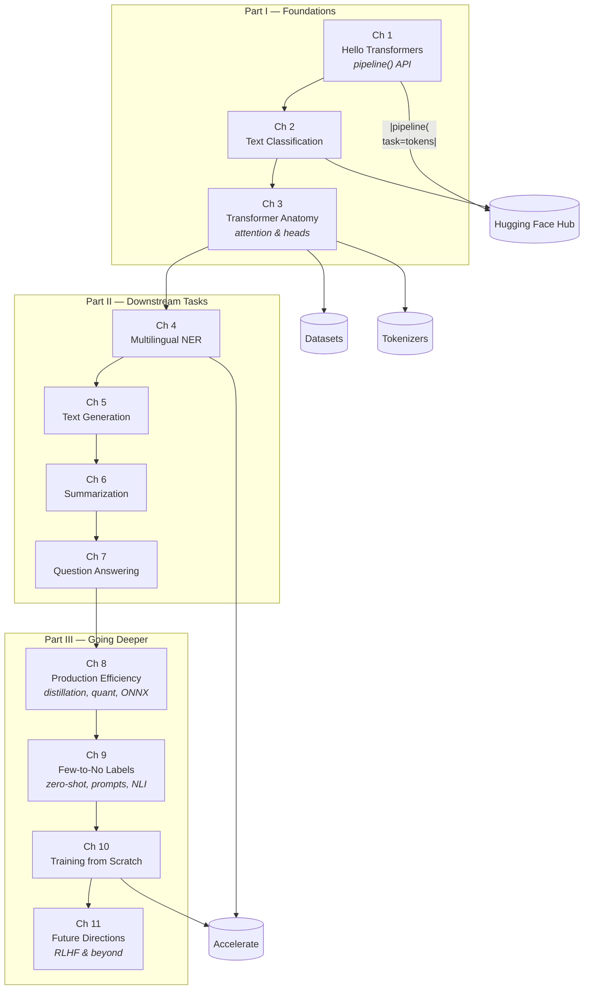

## The Journey at a Glance

The book is a layered curriculum. Each chapter assumes the previous one
and layers a new capability on top. The diagram below maps the
progression from a one-line API call to a custom-trained, RLHF-tuned
model.

The four libraries — `transformers`, `datasets`, `tokenizers`, and
`accelerate` — are the spine of the book. Each appears in the chapter
where it first becomes useful, then keeps showing up in deeper contexts.

---

## Chapter 1: Hello Transformers

The opening chapter is a tour de force of compression. In under twenty
pages it gets a reader from `pip install transformers` to running
sentiment analysis, named entity recognition, text generation, and
masked language modeling — all through the `pipeline()` abstraction.

The pedagogical move is deliberate: by showing how much you can do
without understanding anything, the book earns the right to spend the
next three hundred pages teaching you what is happening underneath. The
authors are explicit that `pipeline()` is not a toy — it is the same
abstraction they use in production for many tasks.

The chapter also introduces the Hugging Face Hub: a centralized registry
of pretrained models, datasets, and metrics. The reader is taught to
filter the Hub by task, language, and dataset, and to load any model
with `AutoModel.from_pretrained("model-id")`.

---

## Chapter 2: Text Classification

The first real task. The chapter uses the `AutoModel` API directly,
introducing the three mental models every transformer practitioner
needs:

- **Tokenizers** convert strings to model-ready tensors.
- **Models** map inputs to hidden states and logits.
- **Heads** (e.g., `AutoModelForSequenceClassification`) turn logits
  into task-specific outputs.

The dataset is the IMDb movie reviews corpus, a 50k-example benchmark
for binary sentiment. The book walks through a from-scratch PyTorch
training loop, then contrasts it with the `Trainer` API — a high-level
training wrapper that handles mixed precision, gradient accumulation,
logging, evaluation, and checkpointing for free.

Key techniques introduced:

| Technique | Why It Matters |
|-----------|----------------|
| Dynamic padding | Cuts training time 30-50% by batching variable-length sequences |
| Learning rate schedules | Linear warmup followed by linear decay is the transformer default |
| Weight decay | Applied to all parameters except biases and LayerNorm |
| Mixed precision (`fp16`/`bf16`) | Doubles throughput on modern GPUs with negligible accuracy loss |

By the end of the chapter, the reader has trained a custom sentiment
classifier that matches the reported benchmark accuracy, then pushed it
to the Hub for others to use.

---

## Chapter 3: Transformer Anatomy

The deepest theoretical chapter. The book opens the black box and
explains each component of the encoder-only transformer:

1. **Self-attention.** Each token produces a query, key, and value
   vector. Attention scores are computed as scaled dot products, then
   softmax-normalized. The output is a weighted sum of values.

2. **Multi-head attention.** Multiple attention heads run in parallel,
   each learning a different relationship (syntactic, semantic, coreferent).
   Outputs are concatenated and projected.

3. **Feed-forward layers.** Position-wise two-layer MLPs expand the
   hidden dimension (typically 4x) and project back, applying GELU
   activations.

4. **Layer normalization and residual connections.** Pre-norm
   (applied before each sub-layer) is the modern standard; it trains
   more stably than post-norm at scale.

5. **Positional embeddings.** The book explains learned absolute
   position vectors and notes that rotary (RoPE) and relative schemes
   are alternatives used in more recent models.

Crucially, the chapter shows how to *inspect* a model: extracting
attention weights, probing hidden states, and using the
`transformers-interpret` and `BertViz` libraries to visualize what
each head has learned. This is the tooling that turns transformers
from black boxes into analyzable systems.

The chapter closes with a from-scratch PyTorch implementation of an
encoder block, then contrasts it with the optimized CUDA kernels Hugging
Face ships. The point: knowing the math lets you debug the fast path.

---

## Chapter 4: Multilingual Named Entity Recognition

The book pivots to a harder problem: NER on a multilingual corpus
(here, the XTREME cross-lingual transfer benchmark). The challenge is
that the CoNLL-2003 dataset the chapter uses is in English, and the
authors want a model that generalizes to German, Dutch, and Spanish.

The solution is **XLM-RoBERTa**, a transformer pretrained on 100
languages using masked language modeling. The chapter demonstrates
that a model fine-tuned on English XTREME data performs nearly as well
on German, Dutch, and Spanish — without seeing a single non-English
training example.

The technical hook is **subword tokenization**: XLM-R uses a
SentencePiece tokenizer that learns from script-agnostic Unicode bytes.
The book walks through tokenization edge cases (how is `Schöne
Grüße` split?) and shows that the tokenizer's quality is what makes
cross-lingual transfer work in the first place.

A second technical hook is the **word-level label alignment problem**:
NER labels are per-word, but the tokenizer produces subwords. The book
shows the standard solution — only label the first subword of each
word, mask the rest — and explains why it works.

---

## Chapter 5: Text Generation

The book moves from understanding to generation. The chapter uses the
`generate()` method to explore the major decoding strategies:

| Strategy | Behavior | Best For |
|----------|----------|----------|
| Greedy | Always pick the highest-probability token | Deterministic tasks (arithmetic) |
| Beam search | Track the top-k sequences | Translation, summarization |
| Random sampling | Sample from the full distribution | Creative text |
| Top-k | Sample from the top k tokens | Balanced creativity |
| Top-p (nucleus) | Sample from the smallest set with cumulative prob ≥ p | Most natural language |
| Temperature | Reshapes the distribution before sampling | Controlling "creativity" |

The dataset is a small corpus of restaurant reviews; the task is
auto-completion. The book shows that decoding strategy matters more
than model size for the perceived quality of generated text, and walks
through the common pitfalls of `generate()` (max length, repetition
penalties, attention masks for prompts longer than the model context).

The chapter also introduces **prompt engineering** in a controlled way:
the model can be coerced into different behaviors through few-shot
examples embedded in the prompt itself, foreshadowing chapter 9.

---

## Chapter 6: Summarization

Two flavors of summarization are contrasted:

- **Extractive** — pick the most important sentences verbatim.
- **Abstractive** — generate new text that condenses the source.

The chapter focuses on the abstractive approach using the CNN/DailyMail
dataset and the BART model, an encoder-decoder transformer. The
encoder reads the article; the decoder writes the summary. Training
follows the same fine-tuning pattern as chapter 2, but with the
sequence-to-sequence loss (cross-entropy on the decoder's output
tokens).

The chapter introduces **ROUGE** (Recall-Oriented Understudy for
Gisting Evaluation), the standard metric for summarization. The book
is honest about its limitations — ROUGE rewards lexical overlap, not
factual accuracy — and briefly introduces BERTScore as a more
semantic alternative.

A practical discussion of **evaluation challenges** rounds out the
chapter: a summary can be factually wrong (hallucinated) yet still
score high on ROUGE. The book recommends human evaluation for
high-stakes applications and shows how to set up lightweight human
review pipelines.

---

## Chapter 7: Question Answering

The chapter focuses on **extractive QA**: given a context passage and a
question, return a span of text that answers the question. The model
is the `QuestionAnswering` pipeline; the dataset is SQuAD.

The technical core is understanding the **head** architecture. For
extractive QA, the head takes the encoded sequence and produces two
logits per token: one for the start of the answer span, one for the
end. The answer is the span `(i, j)` maximizing `start[i] * end[j]`
with `i <= j`. This is a beautifully simple head on top of the same
encoder the book has been using throughout.

The chapter extends to **long-context QA** with a practical trick:
when the context is longer than the model's max length (typically 512
tokens), split it into overlapping windows, score each window, and
take the highest-confidence answer. This is the basis of retrieval-
augmented generation systems that came to dominate 2023-2024.

The chapter closes with a candid discussion of **the limits of
extractive QA**: not every question has a span-shaped answer. Open-
domain QA, multi-hop reasoning, and conversational QA all need
different architectures.

---

## Chapter 8: Making Transformers Efficient in Production

The book's pivot from research to engineering. The chapter surveys the
toolkit for serving transformer models under real-world constraints:

**Performance targets.** Latency budgets (e.g., p99 < 200ms), throughput
targets (e.g., 1000 req/s/GPU), and memory ceilings. The book
emphasizes that these targets should be set *before* you start
optimizing, not after.

**Inference optimization techniques.**

| Technique | Speedup | Notes |
|-----------|---------|-------|
| `generate()` batching | 2-10x | Most impactful; many users skip it |
| Half precision (`fp16`/`bf16`) | 2x | Free on modern GPUs |
| INT8 quantization | 2-4x | Requires `bitsandbytes` or ONNX runtime |
| Knowledge distillation | 3-10x | Train a small model to mimic a large one |
| ONNX export | 1.5-3x | Hardware-agnostic; bypasses PyTorch overhead |
| TensorRT | 2-5x | NVIDIA-specific; great for production |

The book implements a case study: distill a question-answering model
to 60% of its size while retaining 95% of its F1 score. The reader
follows the full workflow — generate soft labels from a teacher,
train a student, benchmark the result.

A second case study: **benchmarking in `optimum-benchmark`**, the
Hugging Face tool for standardized performance comparison. The book
argues that reproducibility of performance claims is the single
biggest gap in published ML research.

---

## Chapter 9: Dealing with Few to No Labels

The most pragmatic chapter. The book acknowledges that most real
applications do not have millions of labeled examples. The toolkit:

- **Zero-shot transfer.** Use a model pretrained on a task similar to
  yours. NLI-based zero-shot classification (a la BART-MNLI) is
  surprisingly strong.
- **Few-shot learning.** Add examples to the prompt. The model's
  in-context learning ability often beats fine-tuning at low data
  volumes.
- **Weak supervision.** Programmatically generate noisy labels using
  heuristics, then train on the noisy data with label-cleaning
  techniques (Snorkel-style).
- **Active learning.** Have the model request labels for the examples
  it is most uncertain about.
- **Unsupervised domain adaptation.** Self-training: use the model to
  label unlabeled data, then fine-tune on the most confident labels.

The book is refreshingly honest: no single technique always wins. The
right choice depends on data volume, label cost, task similarity, and
how much compute you can spend. Decision trees and worked examples
help the reader navigate the trade-offs.

---

## Chapter 10: Training Transformers from Scratch

The book earns its title by training a transformer from scratch —
specifically, a small causal language model on the CodeParrot dataset
of Python code. The model is small (billions of tokens are infeasible
on a laptop), but the full pipeline is real:

1. **Dataset preparation.** Stream a multi-gigabyte corpus, tokenize it
   in parallel with the `tokenizers` library, pack it into fixed-length
   blocks.
2. **Model initialization.** Pick a small GPT-2-like configuration
   (6 layers, 12 heads, 768 hidden), or scale up if hardware permits.
3. **Training loop.** Use the `Trainer` API with custom data collation,
   or write a `accelerate`-powered loop for finer control.
4. **Distributed training.** `accelerate` abstracts over single-GPU,
   multi-GPU, mixed precision, and TPU environments.
5. **Evaluation.** Perplexity on a held-out validation set, plus
   qualitative code-completion samples.

The book also covers **custom data collators** — the often-overlooked
component that batches variable-length sequences with appropriate
padding and masking. A good collator can be the difference between a
training run that works and one that silently produces garbage.

The takeaway: training from scratch is rare in practice, but knowing
how to do it lets you debug every other part of the stack. When
`from_pretrained` fails, you have somewhere to look.

---

## Chapter 11: Future Directions

The closing chapter surveys the frontier at publication time (2022)
and previews what came next. Topics include:

- **Reinforcement learning from human feedback (RLHF).** The book
  introduces the three-stage process: SFT, reward modeling, and
  PPO-based policy optimization. It does not implement RLHF end-to-end
  (the tooling was still maturing) but explains the math and the
  failure modes well enough to read later papers with confidence.
- **Scaling laws and emergent abilities.** Why bigger models unlock new
  capabilities unpredictably, and what the Chinchilla scaling law
  implies for compute-optimal training.
- **Cross-modal models.** CLIP, Whisper, and vision transformers as
  examples of the same architecture applied beyond text.
- **Tool use and retrieval augmentation.** How the LLM stack is
  evolving beyond pure language modeling.

The chapter is honest about the speed of the field: any specific
prediction in a 2022 book is likely to be wrong by 2024. The
enduring lessons are architectural and methodological, not product-
specific.

---

## Key Lessons

- **The Hugging Face ecosystem is the modern NLP toolkit.** Anyone
  shipping NLP in production is either using it or rebuilding a
  worse version of it. Learn it once.
- **Most NLP work is data work.** Tokenization, alignment, label
  quality, evaluation — all of these matter more than picking the
  right model.
- **Encoder vs. decoder is the most important decision.** Get this
  wrong and you will spend weeks fighting architecture limitations.
- **Generation is more than sampling.** Decoding strategy, repetition
  penalties, context length, and prompt formatting all shape output
  quality more than most beginners expect.
- **Production efficiency is its own discipline.** The same model can
  be 5x faster with quantization, batching, and runtime selection.
  These are not afterthoughts.
- **RLHF is the new SFT.** The book's final chapter is the right
  forward-looking primer; readers should follow it with the
  InstructGPT paper, the trl library docs, and recent DPO work.
