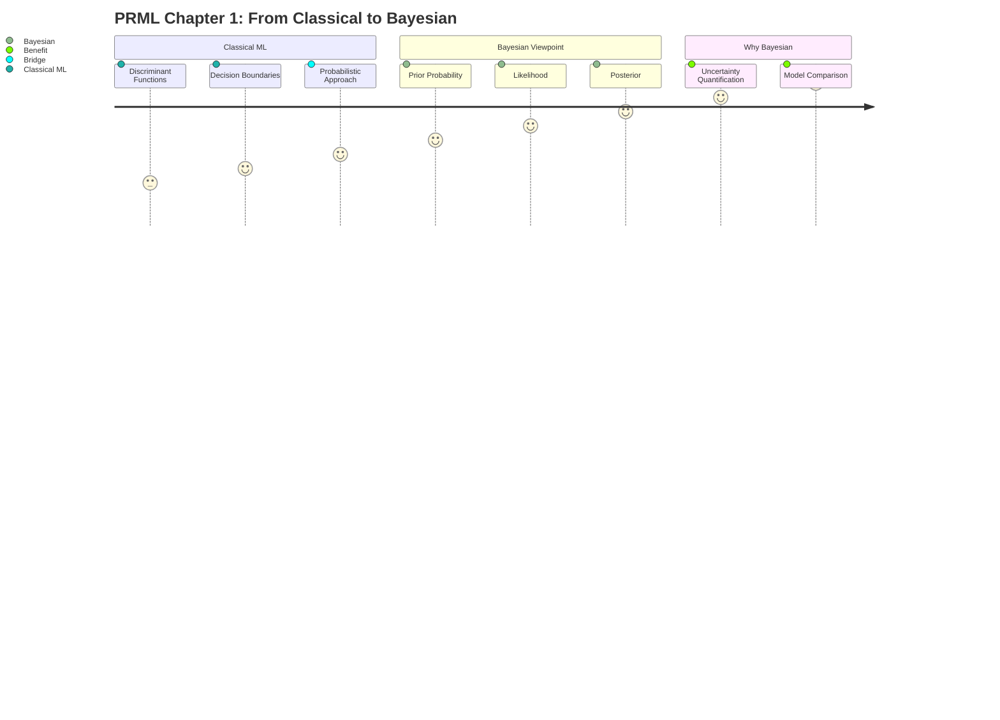
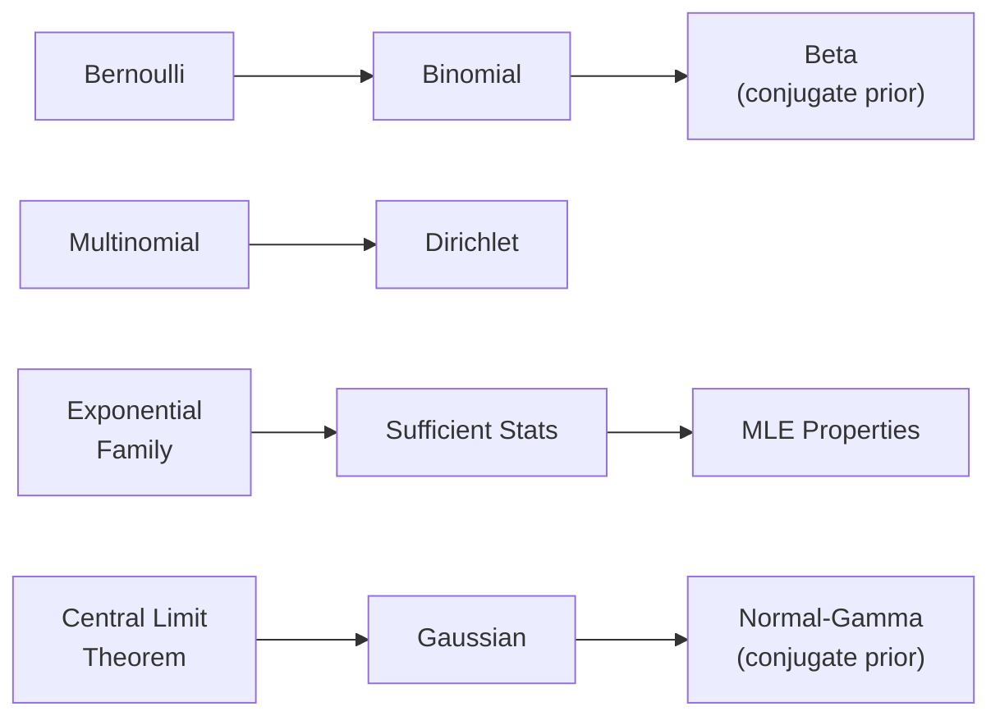
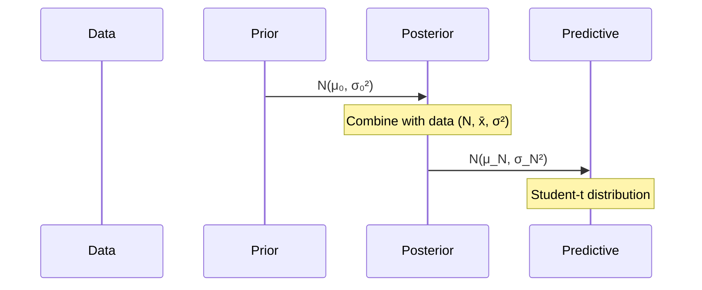

# Chapter 01 — Introduction



## 1.1 Example: Polynomial Curve Fitting

The book opens with the **polynomial curve fitting** problem as a running motivator. Given a dataset `{(x_n, t_n)}`, fit a polynomial `y(x, w) = sum(w_j * x^j)` of degree `M`. The squared-error loss leads to the **least-squares solution**, revealing overfitting (high `M`) and underfitting (low `M`).

## 1.2 Probability Theory as a Unifying Framework

Bishop argues that probability theory — specifically **Bayesian probability** — is the correct framework for handling uncertainty in machine learning.

| Approach | Characteristic |
|----------|---------------|
| **Frequentist** | Parameters are fixed; data varies |
| **Bayesian** | Parameters are random variables; express uncertainty via distributions |

The Bayesian formula:

```
P(w | D) = P(D | w) * P(w) / P(D)
           ↑            ↑       ↑
      likelihood   prior   evidence
```

## 1.3 Decision Theory

Decision theory connects probabilities to actions:

1. **Inference**: compute `P(C_k | x)` — posterior class probabilities
2. **Decision**: choose class that minimizes expected loss

The **reject option** is introduced for cautious classification, and **loss matrices** formalize asymmetric misclassification costs.

## 1.4 Information Theory Overview

The book defines **entropy**, **cross-entropy**, and **Kullback-Leibler divergence** as measures of information:

```
KL(q || p) = ∫ q(x) ln(q(x)/p(x)) dx
```

Cross-entropy links to log-loss (`-ln P(t | x)`) — the first connection between information theory and training objectives later used heavily in neural networks.

## 1.5 Exercises (Selected)

| # | Topic |
|---|-------|
| Ex 1.1 | Sum of two dice probability |
| Ex 1.2 | Beta distribution mean/variance derivation |
| Ex 1.3 | Loss matrix plotting |

---

# Chapter 02 — Probability Distributions



## 2.1 Binary Variables — Bernoulli and Beta

The **Bernoulli distribution** models a single binary trial:

```
Bern(x | μ) = μ^x * (1-μ)^(1-x)
```

Its conjugate prior is the **Beta distribution**:

```
Beta(μ | a, b) = Gamma(a+b)/(Gamma(a)Gamma(b)) * μ^(a-1) * (1-μ)^(b-1)
```

## 2.2 The Exponential Family

The **exponential family** unifies most common distributions:

```
p(x | η) = h(x) * exp[η^T * T(x) - A(η)]
```

where `η` is the natural parameter, `T(x)` the sufficient statistic, and `A(η)` the log-partition function.

Bernoulli, binomial, Gaussian, gamma, and Dirichlet are all members.

## 2.3 Multinomial and Dirichlet

The **multinomial** distribution generalizes Bernoulli to `K` categories. Its conjugate prior is the **Dirichlet**:

```
Dir(μ | α) = Gamma(Σα_k)/(Π Gamma(α_k)) * Π μ_k^(α_k-1)
```

## 2.4 The Gaussian Distribution

The **univariate Gaussian**:

```
N(x | μ, σ²) = 1/√(2πσ²) * exp(-(x-μ)²/(2σ²))
```

Key properties:

- Sum of independent Gaussians is Gaussian (convolution)
- Marginal and conditional of joint Gaussian are Gaussian (closure properties)

Also covers the **Central Limit Theorem** — explains why Gaussian distributions appear so frequently in nature.

## 2.5 Conjugate Priors for the Gaussian



- Known variance: Gaussian prior → Gaussian posterior
- Unknown mean & variance: **Normal-Gamma** prior
- Predictive distribution: **Student-t** distribution (heavier tails than Gaussian)

## 2.6 Nonparametric Methods

Brief introduction to **kernel density estimation** (Parzen windows) and **nearest-neighbor** methods as alternatives to fully parametric modeling.

## 2.7 Exercises (Selected)

| # | Topic |
|---|-------|
| Ex 2.1 | Bernoulli MLE and MAP |
| Ex 2.12 | SU-L distribution derivation |
| Ex 2.27 | Student-t distribution as infinite mixture |
