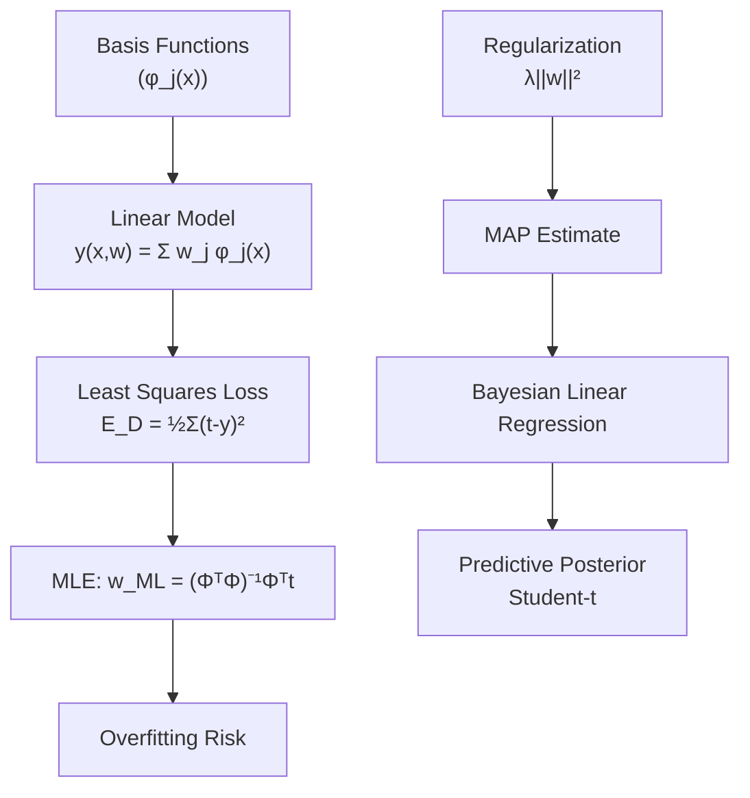
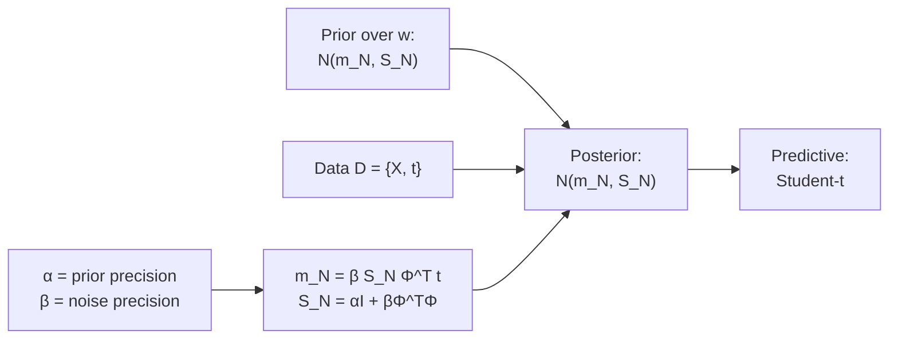

# Chapter 03 — Linear Models for Regression



## 3.1 Linear Basis Function Models

A general linear model applies fixed nonlinear **basis functions** `φ_j(x)` to the input:

```
y(x, w) = Σ_{j=0}^{M-1} w_j φ_j(x) = w^T φ(x)
```

Common basis functions:

| Basis | Formula |
|-------|---------|
| Polynomial | `φ_j(x) = x^j` |
| Gaussian | `φ_j(x) = exp(-(x-μ_j)²/(2s²))` |
| Sigmoidal | `φ_j(x) = σ(x - μ_j)` |
| Fourier | `φ_j(x) = sin/cos(ω_j x)` |

## 3.2 Maximum Likelihood and Least Squares

Assuming Gaussian noise `N(t | y(x,w), β⁻¹)`:

```
E(w) = ½ Σ (t_n - w^T φ_n)²
w_ML = (Φ^T Φ)^(-1) Φ^T t
```

**Bias-variance dilemma**: as `M` (basis functions) increases, variance of `w_ML` increases while bias decreases.

## 3.3 Regularized Least Squares (Ridge Regression)

Adding a **quadratic regularizer** (equivalent to Gaussian prior on `w`):

```
E(w) = ½ ||t - Φw||² + (λ/2) ||w||²
w_MAP = (λI + Φ^T Φ)^(-1) Φ^T t
```

This is **ridge regression**. The parameter `λ` controls model complexity. Bishop also discusses **automatic relevance determination** (ARD) as a Bayesian alternative to choosing `λ` by cross-validation.

## 3.4 Bayesian Linear Regression



The Bayesian approach places a prior over `w` (usually zero-mean Gaussian with precision `α`), then computes the posterior `p(w | D)`. The predictive distribution for a new input `x` integrates over `w`:

```
p(t | x, D) = ∫ p(t | x, w) p(w | D) dw = St(t | μ, σ², ν)
```

The predictive distribution is a **Student-t** distribution — robust to outliers.

## 3.5 Evidence Framework

The **evidence function** `p(D | α, β)` is maximized to set hyperparameters `α` and `β`, without cross-validation:

```
ln p(D | α, β) = -E_D - E_W + const
```

where `E_D` is the data-fit term and `E_W` is the complexity penalty controlled by the effective number of parameters `γ`.

**Effective number of parameters**: `γ = Σ_i λ_i / (λ_i + α)`, where `λ_i` are eigenvalues of `β Φ^T Φ`.

## 3.6 Limitations and Extensions

- Linear in parameters, but nonlinear via basis functions
- Scaling to large `M` requires iterative methods (N-gradient)
- **Sparse Bayesian Learning** (Tipping 2001) automatically drives some `α_j → ∞` to prune irrelevant basis functions

## 3.7 Exercises (Selected)

| # | Topic |
|---|-------|
| Ex 3.1 | Polynomial curve fitting by hand |
| Ex 3.5 | Effect of basis function width |
| Ex 3.10 | Bayesian linear regression derivation |
