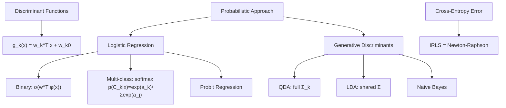

# Chapter 04 — Linear Models for Classification



## 4.1 Discriminant Functions

Linear discriminant: `g_k(x) = w_k^T x + w_k0`. The decision boundary `g_k(x) = g_j(x)` is a hyperplane. For `K` classes, at most `K(K-1)/2` pairwise boundaries.

The **least-squares classification** approach (mapping class labels to one-hot targets) is shown to be suboptimal for classification because it is sensitive to outliers and violates class distribution assumptions.

## 4.2 Probabilistic Generative Models

For generative models, model `p(x | C_k)` and `p(C_k)`, then apply Bayes' theorem:

```
p(C_k | x) = p(x | C_k) * p(C_k) / p(x)
```

For Gaussian class-conditional densities:

| Model | Shared Σ? | Decision Boundary |
|-------|-----------|-------------------|
| **QDA** | No | Quadratic |
| **LDA** | Yes | Linear |
| **Naive Bayes** | Diagonal Σ | Axis-aligned |

## 4.3 Logistic Regression (Discriminative)

No explicit model of `p(x | C_k)`. Directly model `p(C_k | x)`:

```
p(C_1 | x) = σ(w^T x) = 1/(1 + exp(-w^T x))
```

For `K > 2` classes, use the **softmax**:

```
p(C_k | x) = exp(w_k^T x) / Σ_j exp(w_j^T x)
  = softmax_k(w^1, ..., w^K; x)
```

**Cross-entropy error function** and its gradient:

```
E(w) = -Σ_n Σ_k t_{nk} ln y_{nk}
∇E = Φ^T (y - t)
```

**Iterative Reweighted Least Squares (IRLS)**: Newton-Raphson update where at each step a weighted least-squares problem is solved. The Hessian is `H = Φ^T R Φ` where `R` is diagonal with entries `y_k(1-y_k)`.

## 4.4 Probit Regression

Replace logistic sigmoid with **probit function** `Φ(a) = ∫_{-∞}^{a} N(u | 0,1) du`. Useful for Bayesian treatment — more efficient to integrate over a latent Gaussian.

**Bayesian logistic regression** uses Laplace approximation. The posterior `p(w | D)` is approximated as `N(w | w_MAP, A^(-1))` where `A` is the Hessian at `w_MAP`. No exact conjugate prior exists.

## 4.5 Bayesian Treatment of Generalized Linear Models

The framework generalizes:

```
p(t | w) = N(t | y(x, w), σ²)   →  regression
p(t | w) = Bern(t | y(x, w))     →  classification
log(y) = w^T φ(x)                →  logistic regression
Φ^(-1)(y) = w^T φ(x)             →  probit regression
```

For the Bayesian treatment of logistic/probit, the Laplace approximation and MCMC are used (MCMC covered in Chapter 11).

## 4.6 Exercises (Selected)

| # | Topic |
|---|-------|
| Ex 4.1 | LDA vs. logistic regression decision boundary |
| Ex 4.3 | IRLS derivation |
| Ex 4.5 | Probit link function properties |
