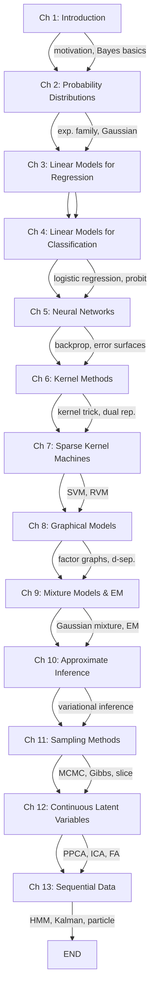
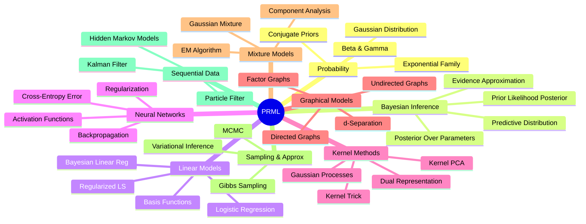

# Pattern Recognition and Machine Learning

**Christopher M. Bishop · Springer, 2007 · ISBN 9780387310732 · 738 pp.**

---
{}
---

## Chapter Map

---

## Prerequisites

| Topic | Requirement |
|-------|-------------|
| Linear algebra | Essential — matrix calculus used throughout |
| Multivariate calculus | Essential — gradients of log-likelihoods |
| Probability theory | Essential — Bayes' theorem, distributions, expectation |
| Basic statistics | Helpful — MLE, sufficient statistics |
| Programming | Helpful — exercises reference MATLAB/Octave |

---

## Key Concepts

