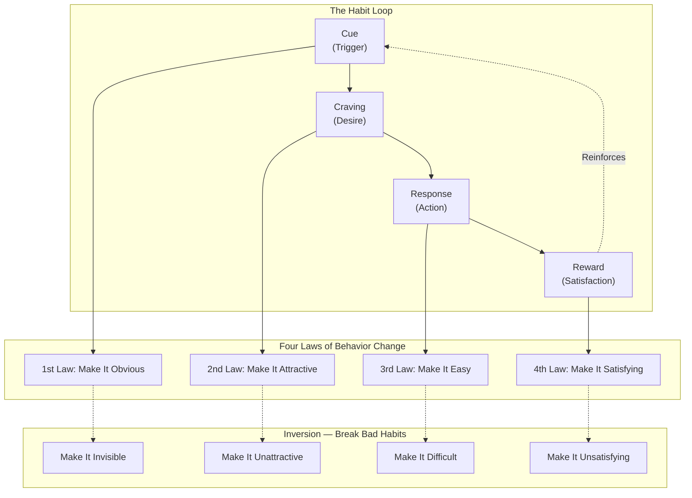
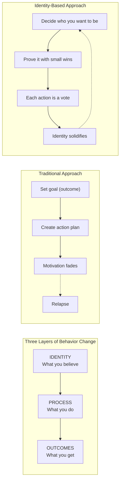
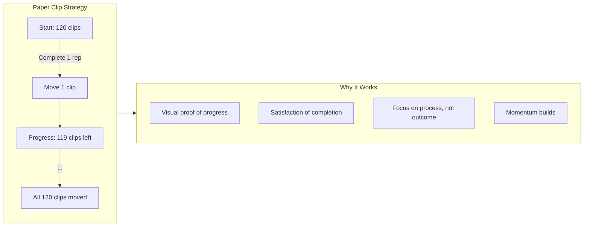
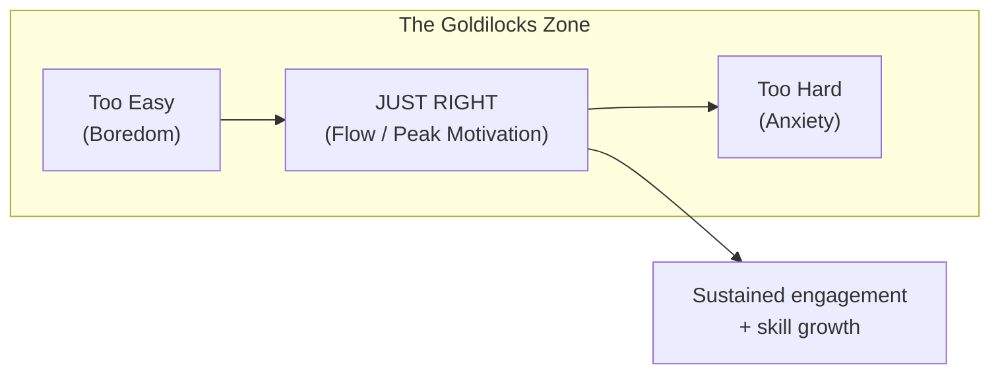

## The Habit Loop

Every habit — good or bad — follows the same four-stage neurological
feedback loop identified by Charles Duhigg and refined by Clear:

### Stage 1: Cue
The trigger that initiates the behavior. It predicts a reward. Your brain
runs a cost-benefit calculation below conscious awareness: is this
opportunity worth acting on?

### Stage 2: Craving
The motivational force behind every habit. You don't crave the habit
itself — you crave the *change in internal state* it delivers. Smoking
isn't the reward; the relief from nicotine craving is.

### Stage 3: Response
The actual habit. Whether it occurs depends on how motivated you are
(craving strength) and how much friction stands in your way (ability).

### Stage 4: Reward
The end goal of every habit. The reward satisfies the craving and teaches
your brain to associate the cue with the reward, closing the feedback
loop.

---

## Identity-Based Habits

Clear's most influential framework shift: lasting change comes not from
chasing outcomes but from adopting a new identity.

### The Two-Step Process to Changing Your Identity

1. **Decide the type of person you want to be.** Not "I want to run a
   marathon" but "I am a runner." Not "I want to write a book" but "I am a
   writer."

2. **Prove it to yourself with small wins.** Each habit is a vote for your
   identity. You don't need 100% of votes — you just need enough to shift
   the majority.

The key insight: **every action is a vote for the type of person you wish to
become.** A single vote doesn't decide the election. But cast enough votes in
one direction and the outcome becomes inevitable.

---

## The Four Laws of Behavior Change

### 1st Law: Make It Obvious

#### Habit Scorecard
Write down your current habits and label each as + (good), - (bad), or =
(neutral). Awareness precedes change. You cannot fix a habit you don't know
exists.

#### Implementation Intention
The simplest habit-formation formula:

> **I will [BEHAVIOR] at [TIME] in [LOCATION].**

Example: "I will exercise for 20 minutes at 6 AM in my living room."

This connects the behavior to a specific time and place, making the cue
unambiguous.

#### Habit Stacking
Anchor a new habit to an existing one:

> **After [CURRENT HABIT], I will [NEW HABIT].**

Examples:
- After I pour my morning coffee, I will meditate for one minute.
- After I sit down at my desk, I will write one sentence.

#### Environment Design
The most powerful strategy in the 1st Law. Design your surroundings so the
cue for good habits is impossible to miss:

- Want to play guitar more? Leave it in the middle of the room.
- Want to read more? Put the book on your pillow.
- Want to eat healthier? Put fruit on the counter, junk food in the back
  of the pantry.

The inverse also works: reduce exposure to the cue for bad habits. Leave
your phone in another room while working. Uninstall social media apps.

#### Pointing-and-Calling
A Japanese railway safety practice: say aloud what you are about to do. "I
am about to eat this bag of chips — is this the action I want to perform?"
Verbalizing disrupts automaticity and forces conscious evaluation.

---

### 2nd Law: Make It Attractive

#### Temptation Bundling
Pair an action you *want* to do with an action you *need* to do:

> **After [HABIT I NEED], I will [HABIT I WANT].**

Examples:
- Listen to your favorite podcast only while exercising.
- Watch Netflix only while on the treadmill.
- Drink a fancy latte only while writing.

#### Join a Culture
Habits are contagious. We imitate the behavior of three groups:
1. The close (family and friends)
2. The many (the tribe)
3. The powerful (those with status and respect)

Join a culture where your desired behavior is the normal behavior. If
everyone around you reads, reading becomes easier.

#### Motivation Ritual
Create a short ritual that associates a cue with a craving. Before doing
something difficult, do something you enjoy:

- Take three deep breaths before a big meeting.
- Listen to a specific high-energy song before your workout.
- Smell a specific essential oil before studying.

This primes your brain to expect pleasure from the forthcoming behavior.

#### Reframe Your Mindset
Highlight the benefits of a behavior rather than its difficulty:
- Instead of "I have to wake up early," think "I get to start my day before
  the world distracts me."
- Instead of "I must do this boring spreadsheet," think "This is how I get
  clarity on my business."

---

### 3rd Law: Make It Easy

#### The Law of Least Effort
Human behavior follows the path of least resistance. Energy is precious;
your brain conserves it. If a habit requires significant effort, you will
find reasons to skip it.

#### Reduce Friction
Decrease the number of steps between you and the good habit:
- Lay out workout clothes the night before.
- Pre-pack your gym bag.
- Keep your meditation cushion set up.

#### Increase Friction for Bad Habits
Add steps between you and the bad habit:
- Put the TV remote in a drawer.
- Leave your phone in the car during dinner.
- Block distracting websites with app filters.

#### The Two-Minute Rule
Every new habit should take less than two minutes to start:

| Aspiration | Two-Minute Version |
|------------|-------------------|
| Run a marathon | Tie your running shoes |
| Write a book | Write one sentence |
| Meditate for 30 minutes | Sit quietly for two minutes |
| Study Spanish | Open the textbook |
| Do yoga | Unroll the yoga mat |

The goal is to master the habit of *showing up*. Once the behavior is
automatic, you can scale it up. You cannot improve a habit you haven't
established.

#### Prime the Environment
Prepare your space so the next action is effortless:
- Charge devices in specific spots.
- Set up your workspace the night before.
- Pre-measure ingredients for tomorrow's meals.

#### Automation
Lock in future behavior through one-time decisions:
- Automatic bill payments
- Automatic savings transfers
- Meal delivery subscriptions
- App blockers that expire at set times

Automation removes the need for ongoing willpower.

---

### 4th Law: Make It Satisfying

#### The Cardinal Rule of Behavior Change
What is immediately rewarded is repeated. What is immediately punished is
avoided. The human brain prioritizes instant gratification over delayed
reward.

#### Habit Tracking
Track your habit completion with a simple visual record. The act of tracking
is itself satisfying — it provides proof of progress.

Clear recommends the **Paper Clip Strategy**: start with 120 paper clips in
one jar. Every time you complete a repetition, move one clip to the other
jar. The visual accumulation of clips is deeply motivating.

#### Never Miss Twice
Perfection is not the goal. Missing one workout is an accident. Missing two
is the start of a new habit — a bad one. The rule: never miss twice.

#### Habit Contract
Create a social contract with consequences. Write down your commitment,
identify an accountability partner, and define a penalty for non-compliance.
Make the cost of inaction greater than the cost of action.

#### Commitment Device
Lock in good behavior by making bad behavior costly in advance:
- Pre-pay for gym sessions.
- Use apps that charge you if you fail.
- Tell a friend your deadline and ask them to hold you accountable.

---

## Advanced Concepts

### The Goldilocks Rule

Peak motivation occurs when you work on tasks at the **edge of your current
ability**. Not too easy (you get bored). Not too hard (you get anxious).
Just manageable difficulty — where the challenge is ~4% beyond your current
capacity.

The sweet spot shifts as you improve. Continuous recalibration — making
habits slightly harder as you get better — is the key to long-term
motivation.

### The Plateau of Latent Potential

Results are a lagging measure of habits. You work for weeks or months with
no visible progress. Then — suddenly — a breakthrough.

Clear uses the analogy of an ice cube melting: it stays solid at 25°F, 26°F,
... all the way to 31°F. At 32°F it melts. The preceding degrees were not
wasted — they were building toward the phase transition. Habits work the
same way. You must trust the process through the boring plateau.

### The Downside of Good Habits

Once a habit becomes automatic, you stop paying attention to the feedback
that originally guided it. You can drift into complacency. The solution:
**reflection and review**. Schedule periodic reviews to audit your habits
and ensure they are still serving you.

---

## Key Lessons

- **Motivation is unreliable; environment is reliable.** Stop trying to be
  more motivated. Start making good habits easier to do.
- **Identity is the deepest lever of change.** Don't ask "what do I want to
  achieve?" Ask "who do I want to become?"
- **Small habits compound invisibly.** Trust the math: 1% daily improvement
  is 37x annual improvement. Ignore the valley of latent potential.
- **Friction is the silent killer of habits.** Reduce it for what you want.
  Increase it for what you don't.
- **Immediate rewards beat delayed outcomes.** The brain evolved for the
  short term. Design your reward system accordingly.
- **Never miss twice.** Don't let a single slip become a streak.
- **Habit tracking is addictive because it makes progress visible.** The
  measurement itself becomes the motivation.

---

## Practical Applications

### At Work
- **Habit stack** your most important task: "After I open my laptop, I will
  write one sentence of my project." The sentence becomes a paragraph, the
  paragraph becomes a page.
- **Prime the environment** by closing all browser tabs except the one you
  need. Make distraction harder; make focus easier.
- **Use a commitment device** by telling a colleague your deadline. The
  social cost of missing it becomes the friction that keeps you honest.

### For Health & Fitness
- **Reduce friction** for exercise: sleep in workout clothes; keep your gym
  bag packed in the car.
- **Increase friction** for junk food: don't buy it. If it's not in the
  house, you can't eat it.
- **Use habit stacking**: "After I brush my teeth, I will do 10 pushups."

### For Learning
- **The Two-Minute Rule**: open the textbook. Read one page. That's success.
  Momentum does the rest.
- **Design the environment**: keep a book on your nightstand, an audiobook
  in your commute app, a notepad in your pocket.
- **Goldilocks Rule**: if a chapter is too hard, find a beginner
  introduction. If it's too easy, skip to the next section.

### For Breaking Bad Habits
- **Make it invisible**: delete apps, unsubscribe from emails, unfollow
  triggers.
- **Make it unattractive**: reframe the craving. "I don't need this
  cigarette — I need a break. A walk gives me the same relief."
- **Make it difficult**: leave your credit card at home if you're trying to
  curb spending. Add 20 steps to the bad habit.
- **Make it unsatisfying**: create a habit contract with a financial penalty
  for each violation.

---

## Action Plan

1. **Write a Habit Scorecard** — List your current daily habits. Label each
   +, -, or =. Identify 2-3 that matter most.

2. **Design an Implementation Intention** — "I will [BEHAVIOR] at [TIME] in
   [LOCATION]" for one new habit you want to start tomorrow.

3. **Stack It** — Find an existing habit to anchor the new one to.
   "After I [CURRENT], I will [NEW]."

4. **Prime Your Environment** — Rearrange your space so the cue for the
   desired habit is front and center. Remove the cue for the bad habit.

5. **Apply the Two-Minute Rule** — If your new habit takes more than two
   minutes to start, downscale it until it does.

6. **Create a Habit Tracker** — Use a calendar, notebook, or app. Mark an X
   every time you complete the habit. Don't break the chain.

7. **Set a Habit Contract** — Tell someone your commitment. Set a penalty
   for non-compliance. Make skipping more painful than doing.

8. **Schedule a Quarterly Review** — Audit your habits. Which are still
   serving you? Which have drifted into auto-pilot mediocrity?

9. **Recalibrate the Goldilocks Zone** — As your habit becomes automatic,
   increase difficulty slightly to stay at the edge of your ability.

10. **Celebrate Small Wins** — The feeling of success is not indulgent; it
    is the dopamine hit that wires the habit into your neural circuitry.
