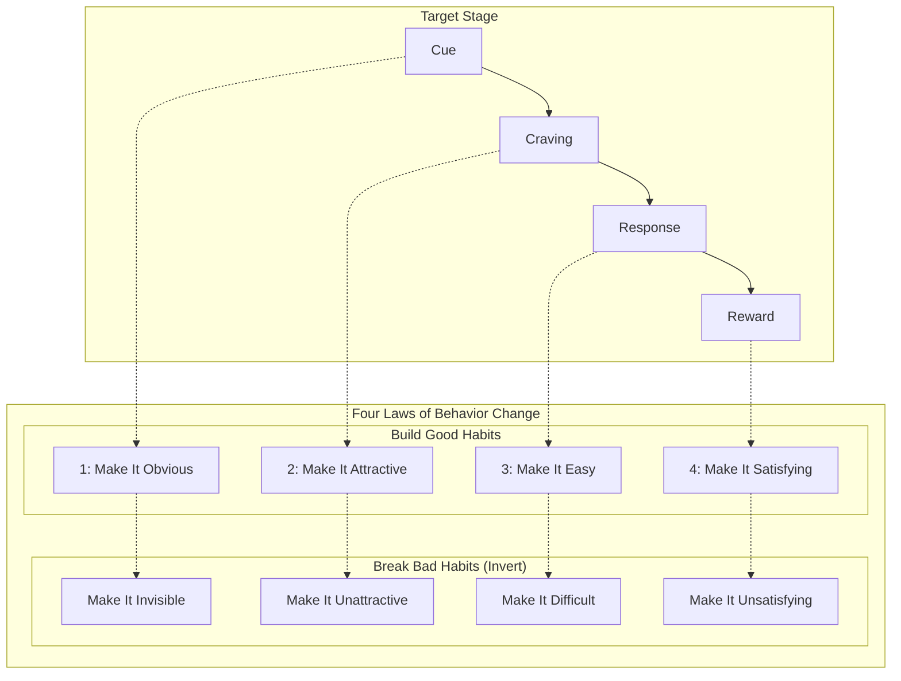
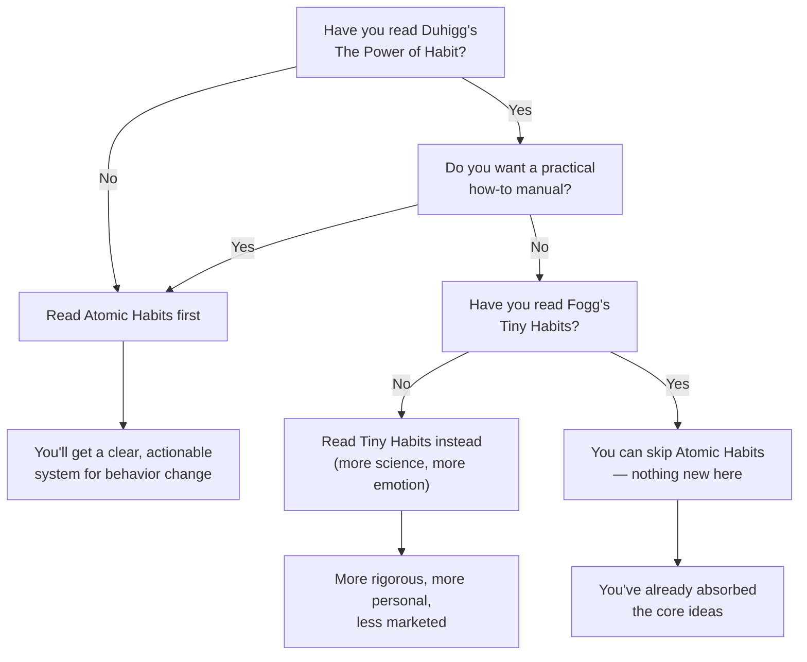

## Introduction

Welcome to BookAtlas. Today: *Atomic Habits: An Easy & Proven Way to Build
Good Habits & Break Bad Ones* by James Clear. Published 2018, Avery (Penguin
Random House). 320 pages. 25 million copies sold. 60+ languages. Over 200
weeks on the New York Times bestseller list.

This is the most popular self-help book of the last decade. But is it the
most *useful*? We're going to settle that with two voices. On one side, a
habit coach who has built their entire practice around Clear's framework.
On the other, a skeptic who thinks Atomic Habits is just "Duhigg for dummies."

Let's get into it.

---

## The Setup: What Are Atomic Habits?

The title comes from a physical metaphor. Atoms are the building blocks of
matter — tiny, invisible, but foundational. Atomic habits are the same:
small routines that seem insignificant in the moment but compound into
remarkable results over time.

Clear opens with the story of his own life as an example. He took a baseball
bat to the face during college, was badly injured, and had to reconstruct
his life from scratch. He couldn't rely on talent or big gestures. He had
to rely on tiny, consistent improvements — getting 1% better every day. By
the time he graduated, he was the ESPN Academic All-American of the Year.

The core philosophy: you do not rise to the level of your goals. You fall
to the level of your systems.

**Skeptic:** That's a good line, I'll give him that. But "systems over
goals" is a false choice. You need both. And he's not the first person to
say it — this idea has been floating around business books for decades.

**Coach:** But no one said it this clearly. No one packaged it with specific
*tools* — habit stacking, the Two-Minute Rule, implementation intentions.
Other books told you to change your habits. Clear tells you exactly how.

---

## The Four Laws: Practical Tool or Repackaged Behaviorism?

The heart of the book is the Four Laws of Behavior Change:

**Coach:** This is exactly why the book works. Each law maps to a specific
stage of the habit loop. You know *which* lever to pull for *which*
problem. If a habit isn't sticking, ask yourself: is the cue invisible?
Is the behavior too hard? Is the reward too delayed? The framework
diagnoses the failure mode.

**Skeptic:** But this framework is just behaviorism with better marketing.
"Make it obvious" is a discriminative stimulus from operant conditioning.
"Make it satisfying" is positive reinforcement. B.F. Skinner was doing this
with pigeons in the 1950s. Charles Duhigg made the habit loop famous in
2012. Clear's contribution is giving each stage a command — and attaching
a mnemonic. That's packaging, not science.

**Coach:** I don't care if it's repackaged. I care if it works. And it
works. I've had clients who struggled for years with exercise finally
start working out consistently not because I told them to be more
disciplined, but because I had them lay out their gym clothes the night
before. That's Law 3: Make It Easy. It's simple. It's evidence-based. And
it works.

---

## Identity-Based Habits: Clear's Best Idea

Clear's most distinctive contribution is identity-based habits. Most
behavior-change advice focuses on outcomes: lose 20 pounds, write a book,
run a marathon. Clear says that's backward. Instead of focusing on what
you want to *achieve*, focus on who you want to *become*.

- Don't say "I want to quit smoking." Say "I'm not a smoker."
- Don't say "I want to run a marathon." Say "I'm a runner."
- Every action is a vote for your identity. You don't need 100% of votes —
  you just need enough to shift the majority.

**Skeptic:** I'll give him this one. The identity framing is genuinely
useful. It connects to something deeper than willpower. But it's not
entirely original either — Ted Talk speakers have been saying "be the
person who does X, not the person who wants to do X" for years. And there's
a risk: what happens when you fail? If every missed workout is a vote
*against* your identity as a runner, that failure carries more weight than
it should.

**Coach:** That's why Clear includes the "never miss twice" rule. One
missed workout is an accident. Two is the start of a new identity — a bad
one. The rule gives you permission to fail once, but builds a hard boundary
at two. It's compassionate *and* demanding.

---

## Environment Design: The Real Superpower

**Coach:** Here's where the book is most underrated. Environment design.
Clear argues that motivation is overrated. What matters is your
surroundings. Want to read more? Put the book on your pillow. Want to eat
healthier? Put fruit on the counter, junk food in the basement. Want to
stop checking your phone? Leave it in another room.

This is the single most impactful thing most people can do — and almost no
one does it. We're all trying to be more *motivated* when we should be
making better behavior *easier*.

**Skeptic:** That advice is genuinely good. But it's also not original.
Temptation bundling, reducing friction, the path of least resistance —
these are staples of behavioral economics. Nudge theory (Thaler and
Sunstein, 2008) is entirely about environment design. The difference is
Clear made it personal instead of policy-oriented, which made it
accessible.

---

## The Two-Minute Rule and Habit Tracking

**Coach:** Two more tools I use constantly with clients. The Two-Minute
Rule: any new habit should take less than two minutes to start. Don't try
to meditate for 30 minutes. Meditate for two minutes. Don't try to write a
chapter. Write one sentence. The goal is to master the habit of *showing
up*. You can scale up later.

And habit tracking — the Paper Clip Strategy. Move a paper clip from one
jar to another for each rep. Watch the stack grow. The visual progress is
addictive. It turns abstract long-term goals into tangible daily wins.

**Skeptic:** The Two-Minute Rule is practically Fogg's "tiny habits" word
for word. And habit tracking has been around since Benjamin Franklin's
virtue chart in 1790. I've also noticed that for some personality types,
tracking backfires. If you miss a day and break your streak, the shame can
make you abandon the habit entirely. "Never miss twice" helps, but the
tracking mechanism itself can become a source of anxiety rather than
motivation.

**Coach:** That's why Clear says the measurement should be for *you* — not
for performance, but for awareness. The purpose is not to judge yourself.
The purpose is to notice. "I missed three days this week" is data, not
condemnation.

---

## The Biggest Criticisms: A Fair Hearing

Let's be honest about the book's limitations:

1. **It's derivative.** The core ideas are not new. Duhigg, Fogg,
   Baumeister, Skinner, Gollwitzer — Clear stands on all their shoulders.
   If you've read deeply in this space, Atomic Habits will feel like a
   highlight reel.

2. **It oversimplifies.** The Four Laws imply behavior change is
   mechanical — just adjust cue, craving, response, reward. For simple
   behaviors, sure. For complex ones involving trauma, depression, or
   addiction? The model breaks down. Clear doesn't address these edge
   cases adequately.

3. **Survivorship bias.** The examples are remarkable — Olympic cyclists,
   world-class artists, top CEOs. These aren't representative. The system
   works for elite performers who already have resources and support.
   Would it work for a single parent working two jobs? Maybe. But the
   book doesn't test that case.

4. **The evidence chain can be weak.** The *If Books Could Kill* podcast
   traced one of Clear's most compelling stories — British Cycling's
   marginal gains — to a book whose author heard it at a conference in
   1973. No primary source. The story may be true, but it's not
   well-sourced.

**Coach:** Fair criticisms. But here's the thing: Atomic Habits is not a
scientific paper. It's a practical guide. The question isn't "is every
claim rigorously sourced?" The question is "does applying this framework
improve people's lives?" For millions of readers, the answer is yes.

---

## The Verdict: Do You Need This Book?

**Coach:** If you haven't read any habit book, read Atomic Habits first.
It's the best entry point. It's clear, it's practical, and it will change
how you think about your daily behavior. It's the book I recommend most
often to new clients.

**Skeptic:** If you've already read The Power of Habit and especially Tiny
Habits, you don't need this book. You've absorbed the core ideas. Atomic
Habits is an excellent remix — but a remix nonetheless. Your time is better
spent applying what you already know than reading the same ideas in
different packaging.

**Coach:** One final point. The fact that this conversation exists — that
we're even debating the originalit — proves the book's impact. We don't
debate whether obscure books are original. Atomic Habits has entered the
canon. It has changed how millions of people think about habits. And
whatever you think of its academic merits, that's a genuine achievement.

---

## Final Thoughts

Atomic Habits is a book about tiny changes that produce remarkable results.
The irony is that the book itself is a tiny change — a small shift in
framing — applied to an existing body of knowledge. And it produced
remarkable results.

Whether you see that as brilliant synthesis or clever repackaging depends
on what you value. But the outcome is hard to dispute: millions of people
are brushing their teeth differently, exercising more, reading more, and
showing up for themselves — all because a writer in Ohio figured out how
to make behavior science stick.

This has been a BookAtlas narration of Atomic Habits by James Clear.
Thanks for listening.
