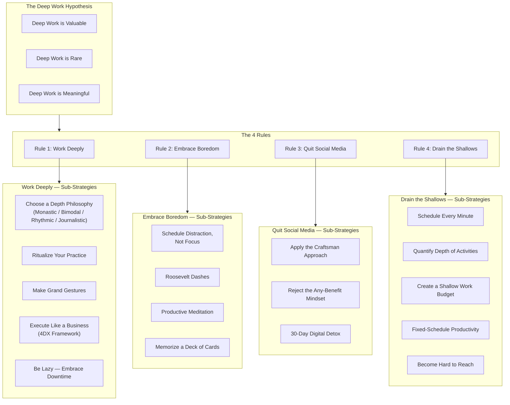

## Deep Work vs. Shallow Work

Newport's foundational distinction:

| | Deep Work | Shallow Work |
|---|---|---|
| Definition | Professional activities in a state of distraction-free concentration that push cognitive capabilities to their limit | Non-cognitively demanding, logistical-style tasks, often performed while distracted |
| Value | Creates new value, improves skill, hard to replicate | Creates little new value, easy to replicate |
| Examples | Writing a book, coding a complex algorithm, analyzing data, strategic planning | Email, meetings, scheduling, social media, status reports |
| Cognitive Demand | High, near limit of ability | Low, can be done while distracted |
| Optimal Environment | Uninterrupted blocks, minimal switching | Can survive interruptions |

---

## The Deep Work Hypothesis

> The ability to perform deep work is becoming increasingly rare at exactly
> the same time it is becoming increasingly valuable in our economy. As a
> consequence, the few who cultivate this skill, and then make it the core of
> their working life, will thrive.

Newport defends this hypothesis along three dimensions:

- **Valuable**: The economy increasingly rewards those who can master hard
  things quickly and produce at an elite level — both require deep work.
- **Rare**: Open offices, instant messaging, social media, and a culture of
  busyness actively erode the conditions for depth.
- **Meaningful**: Attention management is the sine qua non of a good life.
  Flow states — the psychological experience of deep work — are among the
  most rewarding experiences humans can have.

---

## Attention Residue

Sophie Leroy's research at the University of Minnesota revealed that when
you switch from Task A to Task B, a residue of your attention remains stuck
on the original task. This residue degrades performance on the subsequent
task. The more frequent the switching, the thicker the residue. This is why
checking email every 10 minutes is devastating to cognitive performance —
each check leaves residue that takes time to clear.

The implication: working on a single hard task for extended periods
minimizes attention residue and maximizes performance. This explains how
Wharton professor Adam Grant can publish far more papers than his peers
while maintaining high quality — he batches his deep work into uninterrupted
multi-day stretches.

---

## The 4 Rules Framework

---

## Mental Models

| Model | Explanation |
|---|---|
| The Deep Work Hypothesis | Rare + valuable = thriving |
| Attention Residue | Task-switching leaves cognitive lag that degrades performance |
| Law of Productivity | High-Quality Work = Time Spent × Intensity of Focus |
| Principle of Least Resistance | In the absence of feedback, people default to the easiest behavior |
| Busyness as Proxy for Productivity | When measurable output is unclear, visible activity substitutes for real progress |
| The Any-Benefit Mindset | Flawed reasoning: "this tool has some benefit, therefore I should use it" |
| Metric Black Hole | The lack of measurement for distraction's cost allows distraction to persist |
| Fixed-Schedule Productivity | Set a firm end to your workday and work backward to prioritize |

---

## Key Lessons

### 1. Good intentions are insufficient
The pull toward shallow work is structural, not personal. You need systems
and rituals — not motivation — because willpower is a finite resource that
depletes with use.

### 2. Your brain must be trained for depth
Constant phone-checking during idle moments rewires your brain to crave
distraction. The ability to tolerate boredom is a prerequisite for sustained
focus.

### 3. Social media's costs exceed its benefits
The "any benefit" justification is flawed logic. Every tool has an
opportunity cost. The question is not "does this help?" but "does this help
more than the deep work it displaces?"

### 4. Shallow work expands to fill available time
Without explicit boundaries, shallow obligations crowd out depth completely.
You must budget shallow work like a scarce resource.

### 5. Downtime is productive
Systematic idleness recharges directed attention, enables subconscious
insight, and the work it replaces is usually not that important anyway.

---

## Practical Applications

### Scheduling Deep Work

1. Choose a depth philosophy that matches your life:
   - **Monastic**: Eliminate all shallow obligations (for novelists,
     researchers with schedule freedom)
   - **Bimodal**: Alternate between deep days and shallow days (for
     consultants, academics)
   - **Rhythmic**: Same deep block every day, typically morning (most
     practical for most knowledge workers)
   - **Journalistic**: Snatch deep moments whenever gaps appear (hardest,
     requires practiced focus)

2. Ritualize your practice — decide in advance where you'll work, for how
   long, what specific output you'll produce, and how you'll support your
   concentration (coffee, silence, etc.)

3. Track your deep work hours with a visible scoreboard — Newport uses an
   index card where he tallies deep hours and circles milestones

### Evaluating Digital Tools (The Craftsman Approach)

Ask two questions about every tool:

- Does this tool significantly support my core professional and personal
  goals?
- Do the benefits substantially outweigh the costs in time and attention?

If the answer to either is no, eliminate or drastically reduce the tool. For
marginal cases, try a 30-day break and assess whether your life was
notably worse without it.

### Batching Shallow Work

- Reserve a specific time window each day (e.g., 4-5 PM) for email and
  administrative tasks
- Use email autoresponders to set expectations about response times
- Implement the "process" approach to email — end each message so the
  conversation doesn't continue (answer, decide the next step, and close the
  loop)
- Block distracting websites during deep work sessions

---

## Examples

| Person | Deep Work Strategy |
|---|---|
| **Carl Jung** | Built a stone tower in Bollingen, Switzerland for solitary retreats; practiced bimodal philosophy |
| **J.K. Rowling** | Checked into a five-star hotel in Edinburgh to finish *Deathly Hallows* — a grand gesture |
| **Bill Gates** | Famous "Think Weeks" — twice-yearly retreats to a cabin to read and think |
| **Peter Shankman** | Bought a round-trip business class flight to Japan to get 30 hours of uninterrupted writing time |
| **Adam Grant** | Batches teaching and advising into semesters, protecting multi-day writing blocks |
| **Neal Stephenson** | Monastic approach — does not respond to email, has no public social media |
| **Cal Newport** | Rhythmic approach — writes/does deep work in morning blocks; caffeinates; ends day at 5:30 PM sharp |

---

## Action Plan

1. **Pick your philosophy** — Start with rhythmic (same time, same place,
   every day, 1-3 hours)

2. **Design your ritual** — Specify location, duration, output goal, and
   support structure for daily deep work

3. **Perform a 30-day social media detox** — Don't announce it; just stop
   using. Assess afterward whether your life was worse without each platform

4. **Schedule your day in 30-minute blocks** — Use a notebook, not a digital
   tool. When interrupted, revise the schedule for remaining time

5. **Implement a shutdown ritual** — Review incomplete tasks, capture plans
   for tomorrow, say "shutdown complete" aloud, and stop work entirely

6. **Set a shallow work budget** — Aim for no more than 30-50% of your time
   on shallow tasks. Track and adjust

7. **Practice productive meditation** — During walks, commutes, or chores,
   direct your mind to a single well-defined professional problem

8. **Execute Roosevelt dashes** — Set an aggressive but achievable deadline
   for a task, then work with sprint-level intensity to beat it

9. **Train boredom tolerance** — When waiting, resist the phone. Let your
   mind idle. Rebuild your comfort with unstructured mental time

10. **Create a compelling scoreboard** — Track hours of deep work daily.
    Review weekly. Celebrate milestones
