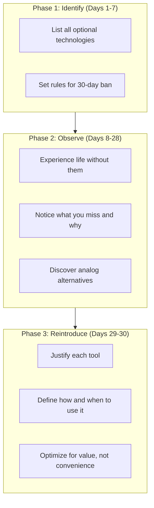
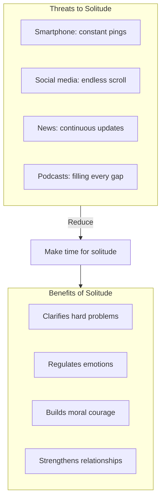

## The Digital Declutter

Newport's signature process: a 30-day break from optional
technologies.

The key principle: after the declutter, only reintroduce a technology
if you can justify how it supports something you deeply value.

---

## Solitude

Solitude is defined as the subjective state of having no one
communicating with you and no external stimuli demanding your
attention.

Newport argues solitude deprivation is one of the most damaging
side effects of constant connectivity. Without solitude, you lose
access to your own mind.

---

## Conversation vs. Connection

One of the book's strongest arguments: digital communication is
not conversation but mere "connection."

| Dimension | Conversation | Connection |
|-----------|-------------|------------|
| Medium | Face-to-face | Text, likes, comments |
| Richness | Full bandwidth | Low bandwidth |
| Bonding | Deep | Shallow |
| Satisfaction | High | Low |
| Effort | High | Low |

People report higher life satisfaction when they spend more time
on conversation and less on connection. The solution is not more
efficient digital communication but more real conversation.

---

## Intentional Leisure

Social media fills a void left by the decline of community-based
leisure. Newport recommends replacing digital consumption with:

| Activity Type | Examples | Why It Works |
|---|---|---|
| Craft-based | Woodworking, knitting, cooking | Tangible creation |
| Physical | Running, hiking, team sports | Health + endorphins |
| Social | Board games, dinner parties | Real conversation |
| Skill-building | Learning an instrument, language | Growth mindset |
| Volunteering | Community service | Purpose + connection |

The key: high-quality leisure is effortful. That is the point.

---

## Key Lessons

- **Technology should serve your values, not shape them.** Start
  with what matters and ask which tools support it.
- **The digital declutter works.** A 30-day break reveals how much
  of your technology use is habitual rather than valuable.
- **Solitude is not loneliness.** It is a positive state of
  autonomous thought.
- **You cannot outsource happiness to apps.** Screen-based
  satisfaction is fleeting.
- **Boredom is not an emergency.** The urge to reach for your
  phone is a conditioned response you can unlearn.

---

## Action Plan

1. **Start a 30-day digital declutter today.** Define your rules
   (which apps are banned, which are essential) and begin.

2. **Schedule solitude.** Block 30-60 minutes daily with no screens
   and no external input. Walk, think, reflect.

3. **Prioritize conversation.** Replace one text-based interaction
   per week with a phone call or in-person meeting.

4. **Reclaim leisure.** Identify one analog activity to start.
   Join a club, take a class, pick up a craft.

5. **Conduct a technology audit.** For each app, ask: what value
   does this provide that I cannot get any other way?
