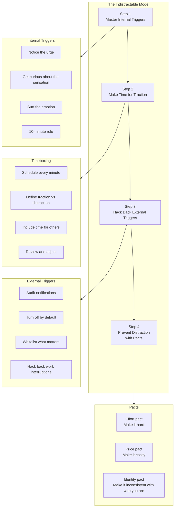
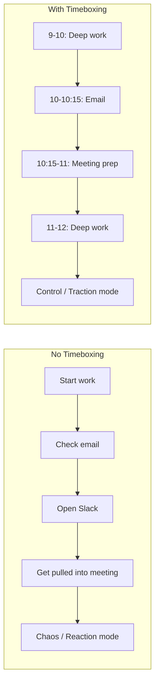

## The 4-Step Indistractable Model

Eyal's framework for becoming indistractable is a sequence of four steps,
each building on the previous one:

---

## Traction vs Distraction

The master distinction of the book is between two kinds of action:

| | Traction | Distraction |
|---|---|---|
| Definition | Actions that move you toward what you *want* to do | Actions that move you away from what you *want* to do |
| Intent | Present (you chose this) | Absent (you're pulled away) |
| Examples | Focused work, quality time with family, exercise | Mindless scrolling, compulsive email checking, procrastination |
| Outcome | Aligns with values | Misaligns with values |

The crucial insight: **both traction and distraction are powered by the
same psychological machinery.** The urge to check your phone during a
meeting is neurologically similar to the urge to focus on a challenging
problem. What differs is whether the action serves your intent.

---

## Step 1: Master Internal Triggers

Eyal's most original contribution is the argument that distraction begins
**inside** — not with the phone or the notification, but with the internal
state the phone helps us escape.

### The Internal Trigger Sequence

Every distraction follows the same pattern:

1. An internal trigger arises — boredom, fatigue, uncertainty, loneliness,
   anxiety, discomfort
2. You seek a external relief — check email, open Instagram, grab a snack
3. The relief is temporary
4. The trigger returns, often stronger

### The Four Strategies

#### 1. Look for the Emotion Behind the Urge

When you feel the pull to distract yourself, stop and ask: **What internal
discomfort am I trying to escape?** Boredom is the most common culprit.
But so are uncertainty ("I don't know how to start this"), fear of failure
("What if this is bad?"), fatigue ("I'm too tired for this"), and loneliness
("Maybe someone texted me").

#### 2. Write Down the Trigger

In the moment of distraction, note:
- What is the trigger?
- What is the sensation in my body?
- What is the story I'm telling myself?

Externalizing the trigger — writing it down — creates distance between
you and the impulse. You move from *being* the urge to *observing* the
urge.

#### 3. Explore the Sensation with Curiosity

Eyal draws on acceptance and commitment therapy (ACT) and the work of
Steven Hayes. Instead of fighting the urge or obeying it, **observe it**
with the curiosity of a scientist. Where do you feel it? Is it hot or cold?
Sharp or dull? Does it change as you breathe? This practice, known as
**urge surfing**, reduces the power of the impulse.

#### 4. The 10-Minute Rule

When an urge to distract yourself strikes, tell yourself: "I can do this
in 10 minutes." Use those 10 minutes to work on what you intended. In most
cases, the urge passes. If it doesn't, you've at least built the muscle of
choice.

### The Reimagine the Task Technique

When the internal trigger is task avoidance — the discomfort of starting
a hard or boring task — Eyal suggests reimagining the task:
- See it as a challenge rather than a burden
- Focus on the process, not the outcome
- Connect it to a deeper value ("This report helps my team make better
  decisions")

---

## Step 2: Make Time for Traction

Step 1 helps you manage the urge to distract. Step 2 gives you a positive
alternative: **designed time**.

### Timeboxing

Timeboxing is the practice of scheduling every minute of your day —
including time for meals, breaks, exercise, relationships, and yes, even
distraction.

The key principles:
- **Decide in advance** what you will do and when
- **Use a calendar**, not a to-do list. To-do lists are aspirational;
  calendars are commitments
- **Include everything** — work blocks, family time, exercise, reading,
  even "time to distract myself"
- **Honor the blocks** as you would a meeting with your CEO

### Why Timeboxing Works

If you haven't decided what to do with your time, distraction is the
default. The phone's notification, the colleague's tap on the shoulder,
the email that just arrived — these fill the vacuum. Timeboxing provides
a intentional structure:

### Include Time for Values

Eyal emphasizes that timeboxing should cover all domains of life, not just
work. Schedule:
- **You time**: exercise, reading, hobbies
- **Relationship time**: partner, children, friends
- **Work time**: deep work, meetings, admin
- **Distraction time**: yes, deliberately schedule time to check social
  media or browse the web

When distraction is scheduled, it stops being guilt-inducing — it becomes
intentional.

---

## Step 3: Hack Back External Triggers

Once you've mastered internal triggers and designed your time, the next
step is to fix the environment. External triggers are cues in the world
that pull your attention — notifications, ringtones, popups, even other
people.

### The Two Kinds of External Triggers

| Type | Definition | Examples |
|---|---|---|
| **Useful** | Triggers that serve your values | Calendar reminder for a doctor's appointment, call from your child's school |
| **Useless** | Triggers that hijack your attention | Instagram like notification, newsletter reminder, sales push alert |

### The Default: No Notifications

Eyal's rule: **turn off all notifications by default.** Then whitelist
only what is truly important. For most people, the whitelist is very short:
phone calls from family, calendar alerts, perhaps messages from a specific
person.

### Hacking Back the Most Common Triggers

#### Email
- Check on a schedule, not when notifications arrive
- Use an autoresponder to set expectations
- Process to inbox zero at each check
- Unsubscribe from everything nonessential

#### Chat / Messaging
- Set status to "Do Not Disturb" during deep work blocks
- Disable read receipts
- Batch responses

#### Apps
- Delete apps from your phone; use the web version instead
- Put time-wasting apps behind a friction wall (e.g., in a folder
  that requires multiple taps)
- Use app blockers: Freedom, Cold Turkey, Screen Time

#### People
- Schedule "office hours" for colleagues
- Close your door (literally)
- Remove chairs from your desk so people don't settle in
- Use headphones as a visual do-not-disturb signal

#### News / Feeds
- Unfollow, mute, and unsubscribe aggressively
- Schedule one time per day for news (e.g., 30 min after lunch)
- Use dedicated news readers, not social media feeds

### The 3-Step Audit Process

1. **Track**: for one week, note every external trigger that pulls you
   away from traction
2. **Analyze**: which triggers are useful? Which are useless?
3. **Eliminate**: remove or redesign the useless triggers

---

## Step 4: Prevent Distraction with Pacts

The final step is precommitment: make it harder to betray your future self
by locking in good behavior in advance.

### The Three Types of Pacts

#### Effort Pact

Increase the friction of unwanted behavior. Make distraction costly in
terms of effort:

- Delete apps from your phone
- Keep your phone in another room during work hours
- Use a site blocker that requires a password to bypass
- Turn off your Wi-Fi for a set period
- Use a dumb phone or a phone with limited apps

#### Price Pact

Attach a financial cost to distraction. Make it painful in the wallet:

- Use apps like StickK or Beeminder that charge you for failing
- Bet a friend: "If I check social media before 5 PM, I owe you $50"
- Pre-pay for a coworking space for the month

The price pact works because loss aversion is a powerful motivator — we
hate losing money more than we enjoy gaining it.

#### Identity Pact

Align your behavior with your self-image. Make distraction inconsistent
with who you believe you are:

- "I'm not the kind of person who checks their phone at dinner"
- "I'm a writer — writers write, they don't scroll"
- "I value deep relationships over shallow likes"

Identity pacts are the most powerful because they tap into intrinsic
motivation. Once a value is internalized, violating it feels like a
betrayal of self.

### How to Design a Pact That Sticks

| Step | Question | Example |
|---|---|---|
| 1. Identify the weak point | When do you regularly fail? | "I always reach for my phone during afternoon slumps" |
| 2. Choose pact type | Which mechanism fits? | Effort pact: put phone in drawer |
| 3. Add accountability | Who will know? | Tell a colleague: "If you see me on my phone between 2-4, call me out" |
| 4. Remove escape routes | Can you override the pact? | Use a timer lockbox for the phone |

---

## Preventing Distraction in Work, Relationships, and Parenting

### At Work

- **Timebox your calendar** — enforce deep work blocks
- **Hack back meetings** — decline, delegate, or shorten
- **Create a distraction-free zone** — physical or temporal
- **Batch shallow work** — consolidate email, Slack, admin into set windows

### In Relationships

- **Together time**: schedule device-free periods with your partner daily
- **Phone-free conversations**: when someone is speaking, the phone is away
- **Set expectations**: tell people you care about that your attention will
  be fully with them

### In Parenting

- **Model the behavior**: you cannot tell your child to put down their
  phone while holding yours
- **Set tech rules for the household**, not just for kids
- **Create phone-free zones**: dinner table, bedrooms, car rides
- **Explain the "why"**: help children understand internal triggers too

---

## Key Lessons

- **Distraction is a symptom, not the disease.** The underlying disease is
  discomfort. Treat the discomfort, and distraction loses its power.
- **Willpower is unreliable; structure is reliable.** Timeboxing and pacts
  work because they don't depend on momentary motivation.
- **You are not your urges.** Urges are biological signals, not commands.
  You can surf them without obeying them.
- **Design for your future self.** You know that future you will be tired,
  hungry, and tempted. Design your environment today for that version of
  you.
- **Attention is the only thing you truly own.** Guard it accordingly.
- **Traction is not just about work.** Being indistractable means being
  fully present with your family, friends, and yourself.

---

## Action Plan

1. **Identify your top three internal triggers.** For one week, every time
   you feel the urge to distract yourself, write down what you're feeling.
   Look for patterns: boredom? anxiety? fatigue?

2. **Start timeboxing.** Tomorrow morning, open your calendar and schedule
   every hour from 8 AM to 10 PM. Include work, breaks, meals, exercise,
   relationships, and even distraction time.

3. **Perform a notification audit.** List every app that sends you
   notifications. For each one, ask: "Does this serve me?" Turn off all
   nonessential notifications.

4. **Design an effort pact.** Identify one distraction you want to reduce.
   Make it harder to do. Delete the app. Move the phone. Install a blocker.

5. **Make a price pact.** Pick one distraction and attach a financial cost.
   Use StickK or make a bet with a friend. Make losing money worse than
   the distraction's pull.

6. **Try the 10-minute rule.** When the urge strikes, say "I can do this
   in 10 minutes." Redirect to your intended task. Watch the urge fade.

7. **Schedule together time.** Block 30 minutes today with your partner or
   child — no screens, no distractions, just presence.

8. **Adopt one identity pact.** Choose a statement: "I'm not the kind of
   person who _____." Write it down. Let it guide your choices.

9. **Audit your external triggers weekly.** Spend 10 minutes every Sunday
   reviewing your notification settings, your app list, and your calendar.
   Remove what doesn't serve you.

10. **Review your traction ratio.** At the end of each day, estimate: what
    percentage of my time was traction? What percentage was distraction?
    Don't judge. Just observe. Adjust tomorrow.
