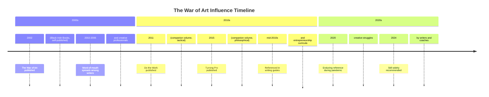

import { getBook } from '../../_data/books'

export const book = getBook('the-war-of-art-steven-pressfield')!

export const sections = [
  {
    id: 'about',
    title: 'About This Book',
    items: [
      { href: '#at-a-glance', label: 'At a Glance' },
      { href: '#the-author', label: 'Steven Pressfield' },
      { href: '#legacy', label: 'Legacy & Impact' },
    ],
  },
  {
    id: 'core-concepts',
    title: 'Core Concepts',
    items: [
      { href: '#resistance', label: 'Resistance' },
      { href: '#turning-pro', label: 'Turning Pro' },
      { href: '#the-primitive', label: 'The Primitive' },
      { href: '#the-desk', label: 'The Desk Is Your Battleground' },
      { href: '#amateur-vs-pro', label: 'Amateur vs Professional' },
    ],
  },
  {
    id: 'content',
    title: 'Book Content',
    items: [
      { href: '#manifestations', label: 'Manifestations' },
      { href: '#the-pocket', label: 'Staying in the Pocket' },
      { href: '#loving-mean', label: 'Loving the Mean' },
    ],
  },
  {
    id: 'resources',
    title: 'Resources',
    items: [
      { href: '#further-reading', label: 'Further Reading' },
    ],
  },
]

import BookLayout from '../../components/BookLayout.astro'
import Content from './01-content.mdx'
import Analysis from './02-analysis.mdx'

<BookLayout
  book={book}
  sections={sections}
  coverSrc={book.coverImage}
  coverAlt={`Cover of ${book.title}`}
>

## At a Glance

The War of Art: Break Through the Blocks and Win Your Inner Creative Battles (2002, Black Irish Books) is a short, dense, fiercely practical book about the single problem that prevents every writer, artist, entrepreneur, and creator from doing the work they were put on earth to do.

Steven Pressfield names that problem **Resistance** — a universal, impersonal force that rises up anytime you attempt to do work that matters, that grows stronger the closer you get to something meaningful, and that always lies. It never admits its existence. It dresses up as procrastination, fear, self-sabotage, addiction, rationalisation, or busy-work. But underneath every disguise, Resistance is the same thing: the part of you that does not want to change.

```mermaid
mindmap
  root((The War of Art))
  Resistance
    Procrastination
    Fear
    Self-sabotage
    Rationalisation
    Addiction
  Turning Pro
    Show up every day
    No waiting for inspiration
    Stay in the pocket
  The Desk
    Your battleground
    Establish a routine
  Professional
    Loves the mean
    Does not wait for muse
    Treats art as work
  Amateur
    Waits for lightning
    Talks more than does
    Needs validation
```

| Detail | Value |
| ------ | ----- |
| **Author** | Steven Pressfield |
| **Published** | 2002 (Black Irish Books) |
| **Pages** | ~190 |
| **ISBN** | 9781591840127 |
| **ISBN-13** | 978-1-59184-012-7 |
| **Language** | English |
| **Subject** | Creativity, Resistance, Professionalism |

<hr />

## Steven Pressfield

Steven Pressfield is a novelist and screenwriter born in 1943 in Port of Spain, Trinidad, while his father was stationed there as a U.S. Navy officer. He grew up in Brooklyn and graduated from Brown University in 1965. Before becoming a full-time writer, he worked a long string of jobs — advertising copywriter, schoolteacher, tractor-trailer driver, fruit picker, screenwriter in Hollywood — all while writing novels in the margins of his life.

He published his first novel, *The Ocean Is Against Us*, in 1973, to minimal attention. For the next two decades he struggled. He worked in Hollywood trying to sell screenplays. He wrote daily, often in public libraries, while supporting himself through odd jobs. In his early forties, believing his career was over, he wrote what became *The Legend of Bagger Vance* (1995), a novel about a young golfer and his mysterious caddie, set during a fictional 1931 match against Bobby Jones and Walter Hagen. The novel found a wide audience and was adapted into a film starring Matt Damon and Will Smith.

His best-known work is *Gates of Fire* (1998), a historical novel about the Battle of Thermopylae told through the eyes of a squire to King Leonidas. It is widely taught in military academies and on Marine Corps reading lists, praised for its unflinching depiction of duty, fear, and professional ethos under extreme pressure. He followed it with *The Afghan Campaign* (2006), set during Alexander the Great's conquests, *Killing Rommel* (2008), a military novella, and *The Virtues of War* (2004), told from Alexander's perspective.

Pressfield's work is consistently concerned with the warrior ethos. The War of Art distilled that lifelong preoccupation into a short non-fiction manual aimed not at soldiers but at artists. His later companion volume, *Do the Work* (2011), followed up with a more overtly tactical approach, urging readers to take the first step before they think they are ready.

He lives in Los Angeles and continues to write fiction and non-fiction under his own imprint, Black Irish Books.

<hr />

## Legacy & Impact

The War of Art is one of those rare books that becomes an underground gospel. It did not arrive with a major marketing campaign or a publisher's catwalk. It was published by Pressfield's own imprint. Yet it spread — by word of mouth, by writers passing it to writers, by entrepreneurs carrying it in their bags — until it appeared on professional shelves in every field where people create under conditions of fear and self-doubt.

It has been endorsed and quoted by writers as diverse as Stephen King, who referenced it in *On Writing*, and Seth Godin, who built a similar-but-expanded version of the same argument in *The Practice*. The book's terminology — *Resistance*, *Turning Pro*, *the Desk* — has entered the shared vocabulary of creative professionals in a way that no other productivity or creativity book has managed.

The book's model — confront the internal enemy, show up whether or not you feel like it, treat your art as a profession rather than a hobby or a gift — has influenced not only writers but startup founders, designers, musicians, filmmakers, and athletes. Its structural simplicity (roughly 190 pages in short chapters) makes it a book most people read in a single sitting, return to repeatedly, and leave out on their desk.



<hr />

## Core Concepts

The War of Art is short enough that almost every page introduces or reinforces a central idea. The following sections distil its most important concepts without replacing the original text.

<Content />

<hr />

## Further Reading

- [Do the Work](https://www.amazon.com/Do-Work-Steven-Pressfield/dp/1936891020) — Steven Pressfield's tactical follow-up to The War of Art.
- [Turning Pro](https://www.amazon.com/Turning-Pro-Steven-Pressfield/dp/1936891039) — Steven Pressfield's companion volume on the philosophical shift from amateur to professional.
- [The Artist's Way](https://juliacameronlive.com/artists-way/) — Julia Cameron's 12-week creativity recovery system, a more structured path to the same goal.
- [On Writing](https://www.stephenking.com/library/non_fiction/on_writing.html) — Stephen King's memoir and guide to craft, which echoes Pressfield's insistence on daily discipline.
- [The Practice](https://sethgodin.com/books/the-practice/) — Seth Godin's book shipping creative work as a practice, not a pursuit of inspiration.

<Analysis />

</BookLayout>
