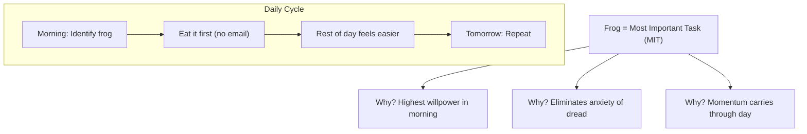
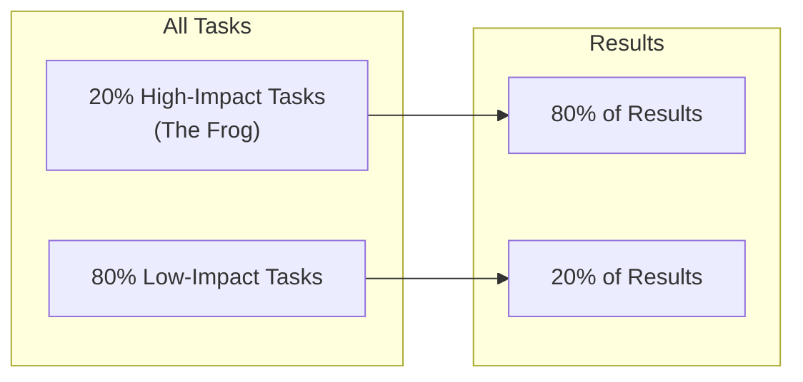

## The Frog Metaphor

Tracy's central idea: your "frog" is your biggest, most important
task — the one you are most likely to procrastinate on. Eat it
first, every day.

The rule: if you have to eat two frogs, eat the ugliest one first.
If you have to eat a live frog, it does not pay to sit and look at
it for very long.

---

## The ABCDE Method

A simple prioritization system for any list of tasks:

| Priority | Label | Rule |
|----------|-------|------|
| Must do | A | Serious consequences if not done |
| Should do | B | Mild consequences if not done |
| Nice to do | C | No consequences either way |
| Delegate | D | Someone else can do it |
| Eliminate | E | Not worth doing at all |

Never do a B task when an A task is unfinished. Never do a C task
when a B task is pending.

---

## The 80/20 Rule Applied

The implication: most people spend 80% of their time on tasks that
produce 20% of results. The solution is to identify the 20% and do
those tasks first.

---

## 21 Techniques (Abbreviated)

| # | Technique | Core Idea |
|---|-----------|-----------|
| 1 | Eat That Frog | Do the hardest task first |
| 2 | Plan Every Day | 10 minutes of planning saves hours |
| 3 | Apply 80/20 | Focus on the 20% that matters |
| 4 | Long-Term Thinking | Consider future consequences |
| 5 | Creative Procrastination | Do not do low-impact tasks |
| 6 | ABCDE Method | Rank tasks by priority |
| 7 | Key Result Areas | Identify must-do outcomes |
| 8 | Law of Three | Three most important goals |
| 9 | Prepare Thoroughly | Set up for success |
| 10 | Single-Handling | One task at a time |
| 11 | Chunk It Down | Break large tasks into pieces |
| 12 | 10/90 Rule | Plan first, then execute |
| 13 | Leverage Technology | Use tools to stay organized |
| 14 | SLAP Method | Single, Limited, Aligned, Personal goals |
| 15 | Motivational Triggers | Set rewards for completion |
| 16 | Technology Detox | Limit distractions |
| 17 | Maintain Focus | Work in time blocks |
| 18 | Deadlines | Set and communicate them |
| 19 | Pressure Yourself | Work as if you had one hour |
| 20 | Take Action | Stop waiting for perfect conditions |
| 21 | Repeat Daily | Build the habit |

---

## Key Lessons

- **The frog is whatever you fear most.** The task you avoid is
  usually the one that matters most.
- **Multitasking is a trap.** Focused, single-task work produces
  higher quality in less time.
- **Perfectionism is procrastination.** Done is better than perfect.
- **Written goals are magnetic.** Goals written with a deadline
  trigger the subconscious to work on them.
- **Discipline is a skill.** Like any muscle, it strengthens with
  use.

---

## Action Plan

1. **Identify your frog tonight.** Before you leave work or go to
   sleep, decide what your most important task is tomorrow.

2. **Do not check email first.** Block the first 60-90 minutes of
   your day for your frog. No interruptions.

3. **Apply the ABCDE method.** Take your task list and label every
   item A through E. Do the A's first.

4. **Practice single-handling.** Pick one task. Work on it until
   it is done. No switching.

5. **Build the habit.** Do this for 21 days. By day 22, it will be
   automatic.
