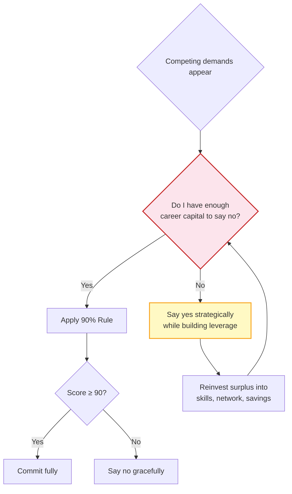

**Alex**: Welcome back to Book Dialogue. I'm Alex.

**Jamie**: And I'm Jamie. Today we're talking about *Essentialism: The Disciplined Pursuit of Less* by Greg McKeown. Alex, you read this a few years ago. I just finished it last week.

**Alex**: And I'm curious what you thought, because I remember loving it the first time and then feeling more complicated about it on reread.

**Jamie**: That's exactly why I wanted to talk about this one. Because I went in expecting a productivity book and came out… conflicted. On one hand, the core idea is brilliant — "less but better" is maybe the most useful three-word philosophy I've ever encountered. On the other hand, I kept thinking "this is written for someone who has way more power over their life than I do."

**Alex**: Let's start with what works. What grabbed you?

**Jamie**: The **90% Rule**. Score every opportunity 0 to 100 on your single most important criterion. If it's below 90, treat it as zero. That's brutal. I immediately thought of three clients I should have fired months ago.

**Alex**: And did you fire them?

**Jamie**: I fired one. The other two I'm phasing out. It's hard because they pay reliably. But they drain me. McKeown's point — which I now believe — is that average clients don't just take your time, they take the time you could be spending on great clients.

**Alex**: That's the **trade-off** argument. Most people think "I can do both." McKeown says no, you can't. Every yes is a no to something else. The question isn't whether you'll make trade-offs — it's whether you'll make them by design or by default.

**Jamie**: But here's where I struggled. He says "if you don't prioritize your life, someone else will." True. But I'm a freelancer. I don't have a team. I don't have an assistant. When a client with a tight deadline calls, I can't always say "let me get back to you" and spend a week applying the 90% Rule.

**Alex**: That's the **privilege critique** — and it's valid.

---

**Jamie**: Let's talk about **essential intent**. McKeown says you need one single decision that makes a thousand later decisions. Both inspirational and concrete. My question is: what if you don't know your essential intent yet? What if you're still figuring out what you want?

**Alex**: That's one of the book's real limitations. Essentialism assumes you already have clarity about what matters. But most people — especially earlier in their careers — don't. They need to *explore* before they can *eliminate*. McKeown actually recommends exploration in the first phase, but the whole framework leans toward cutting, not discovering.

**Jamie**: There's a scene where he describes the "paradox of success." You get good at something, you get more opportunities, you get spread thin, you lose the clarity that made you good. That hit hard. But what's missing is: how do you prevent that from happening in the first place? The book is better at getting you *out* of a hole than keeping you from falling in.

**Alex**: That's a fair read. I think the answer McKeown would give is: **escape**. Carve out space before you need it. He talks about Bill Gates's Think Weeks, Steve Jobs's walks. But again — that assumes you have the autonomy to do that.

---

**Jamie**: Let's get to the hardest part of the book: **saying no**.

**Alex**: The most powerful line for me was from Tom Friel, the former CEO — "Learn the slow yes and the quick no."

**Jamie**: It's great in theory. In practice, I've been burned. I said no to a small project from a past client to focus on a bigger one. The bigger one fell through. Now I've got neither. McKeown doesn't address that scenario.

**Alex**: He would say that's a trade-off you made deliberately, not by default. And that over a long enough timeline, saying no to the wrong things is a winning strategy even when it hurts short-term.

**Jamie**: That's a comfortable argument for someone who can absorb short-term loss.

**Alex**: It is. And that's the conversation we need to have. Essentialism isn't wrong — but it's easier to practice when you have a safety net. I think the book would be better if it acknowledged that and helped readers figure out how to **build** the safety net first.

---

---

**Alex**: Let's end with what I think is the book's most underrated contribution: **the idea that sleep, play, and escape are not optional**. They are inputs to your ability to discern what's essential.

**Jamie**: That's genuinely countercultural. Every productivity culture tells you to grind. McKeown says the opposite: to make the highest contribution, you need rest. You need white space. You need to not be constantly doing.

**Alex**: And that's accessible to everyone, not just executives. Anyone can protect sleep. Anyone can build a 15-minute buffer into their day. Anyone can say "I need to think about that before I commit."

**Jamie**: Not everyone can say "no" to their boss without cost. But everyone can pause.

**Alex**: That's the essentialist move. Not the grand gesture — the small, repeated act of choosing deliberately.

---

**Jamie**: Final verdict?

**Alex**: Essentialism is a 7/10 book that's worth reading, worth arguing with, and worth adapting to your own context. Take the framework. Ignore the pretension. Apply what fits.

**Jamie**: And never forget the three-word philosophy that started it all.

**Alex**: Less but better.

**Jamie**: Less but better.

**Alex**: Thanks for listening. If this resonated, pick up the book — or better yet, spend the time you would have spent reading it applying the 90% Rule to your calendar.

**Jamie**: See you next time.
