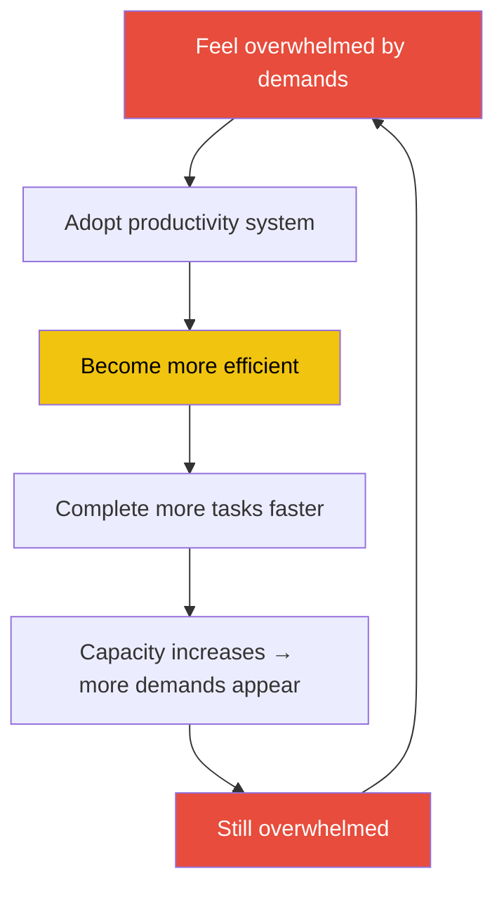
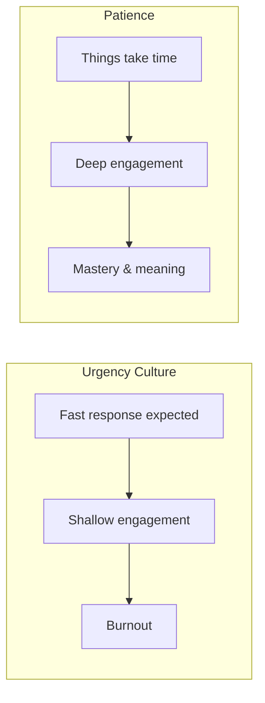
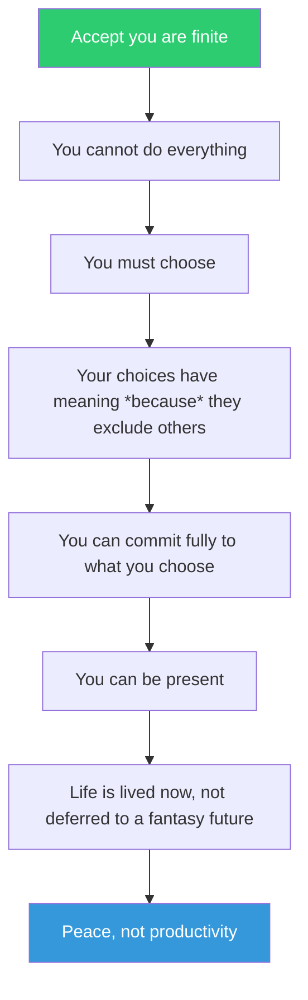

## The Efficiency Trap

The core concept of the book. Burkeman argues that becoming more efficient does not lead to a sense of having enough time. It leads to the opposite: the more you do, the more there is to do. Demands expand to fill available time (Parkinson's Law). Efficiency is a snare, not a solution.

The way out is not to climb harder. It is to step off the treadmill entirely — to accept that you *cannot* do everything and to choose what you *will not* do.

---

## The Productivity Paradox

Modern productivity culture treats time as a resource to be *used*, *spent*, or *invested*. But this metaphor is catastrophically wrong. Time is not separate from life — time *is* life. When you say "I don't have time for that," you are really saying "I have chosen not to do that." The language of productivity lets us pretend otherwise.

> "The trouble with attempting to master your time... is that time ends up mastering you."

---

## The Average 4,000 Weeks

80 years × 52 weeks = 4,160 weeks. If you are 30, you have already used roughly 1,560 of them. If you are 40, roughly 2,080. The number is not meant to depress you. It is meant to wake you up.

Consider:

| Age | Weeks lived | Weeks remaining (est.) |
|-----|-------------|------------------------|
| 20  | 1,040       | 3,120                  |
| 30  | 1,560       | 2,600                  |
| 40  | 2,080       | 2,080                  |
| 50  | 2,600       | 1,560                  |
| 60  | 3,120       | 1,040                  |
| 70  | 3,640       | 520                    |

Burkeman does not say these numbers to induce panic. He says them because we spend our lives acting as if we are infinite. We defer, postpone, and delay. We tell ourselves we will read that book, have that conversation, start that project *later*. Later is a lie. Later does not exist.

---

## Patience vs. Urgency

Our culture worships speed. Immediate responses. Same-day delivery. Speed-reading. 2x playback speed. But the most valuable things — mastery, love, creativity, depth — cannot be hurried.

Burkeman draws on the German concept of *Eigenzeit* — the idea that things have their own proper time. A baby takes nine months. A friendship takes years. A skill takes practice. To demand otherwise is to fight reality.

---

## The Joy of Missing Out (JOMO)

FOMO (Fear of Missing Out) drives much of modern anxiety. We scroll. We say yes. We overcommit. But Burkeman flips this: **missing out is not a bug of choice; it is the entire point.**

Every yes is a thousand noes. If you say yes to your child's piano recital, you miss the party. If you say yes to writing a book, you miss TV, travel, and time with friends. That is not an unfortunate side effect. That is what makes the yes meaningful. You *must* miss out. There is no other way to live.

> "If you see that the structure of our situation — the reality of being human — is that you're definitely going to be missing out on things, it becomes less of a worry."

JOMO is not about pretending not to care. It is about embracing the truth that a finite life is necessarily a life of loss — and that loss is the price of meaning.

---

## Attention as Life

Burkeman's most arresting argument: **your attention is your life**. Where you direct your attention is where you are actually living. You are not "multitasking" when you check your phone during a conversation. You are choosing to not live through that conversation.

This is not a guilt trip. It is a redescription. If you check email while your child tells you about their day, you are not living through that moment with your child. You are living through email. That is a choice, not a necessity.

> "Pay attention to every moment, no matter how mundane."

Burkeman is not arguing for hyper-vigilance. He is arguing that the small moments *are* your life. The waiting room. The commute. The five minutes before sleep. A life well lived is not a life of grand accomplishments. It is a life where you have paid attention.

---

## The Examined Life

Burkeman draws heavily on philosophy — especially Stoicism and Buddhism.

From **Stoicism** (Seneca, Marcus Aurelius): Memento mori. Contemplate death not to be morbid, but to clarify what matters. The Stoic "negative visualization" — imagining losing what you have — is a direct path to gratitude and presence. Seneca's *On the Shortness of Life* is an unspoken companion text to the entire book.

From **Buddhism**: The problem of time is the problem of desire. We constantly reach for the next thing, never satisfied with the present. Letting go of the craving for "enough time" is a kind of enlightenment.

From **existentialism**: We are "thrown" into a finite existence with no guarantee of meaning. It is up to us to create it — not *despite* our limits but *through* them.

---

## The "Big Five" Regrets

Burkeman references Bronnie Ware's *The Top Five Regrets of the Dying* to underscore his thesis:

1. **I wish I'd had the courage to live a life true to myself, not the life others expected of me.**
2. **I wish I hadn't worked so hard.**
3. **I wish I'd had the courage to express my feelings.**
4. **I wish I had stayed in touch with my friends.**
5. **I wish I had let myself be happier.**

Note what none of the dying say: "I wish I had answered more emails." "I wish I had optimized my morning routine." "I wish I had been more productive." The regrets are all about *being* — not *doing*.

---

## Cosmic Insignificance Therapy

One of Burkeman's most liberating ideas. When you feel paralyzed by a decision or crushed by pressure, zoom out. Way out. To the cosmic scale.

From a cosmic perspective, your presentation, your deadline, your awkward conversation — none of it matters in the slightest. The Earth is a speck. Your life is a blink. The universe is vast and indifferent.

This sounds like nihilism, but Burkeman means it as therapy. Cosmic insignificance is not depressing — it is **freeing**. If nothing ultimately matters, then you are free to matter about what you choose. The pressure to "get it right" evaporates because there is no cosmic scorecard.

> "The universe doesn't care what you do, which means you get to decide what's worth caring about."

---

## Embracing Finitude

---

## Key Lessons

1. **Keep a "done" list** — Not just a to-do list. At the end of the day, write down what you actually accomplished. It is usually more than you think.

2. **Closed to-do list** — Max 10 items. You cannot add a new task until one is completed. Makes finitude concrete and forces real prioritization.

3. **Strategic underachievement** — Decide in advance which areas of life you will be mediocre in. You cannot be excellent at everything. Choose what matters.

4. **Fixed-volume scheduling** — Give each project a fixed time budget. When it runs out, stop. Constraints breed creativity.

5. **Originality emerges from copying** — Don't wait for inspiration. Do the work. Copy the masters. Originality comes from deep immersion, not waiting for a flash of genius.

6. **Instantaneous generosity** — When you feel the impulse to compliment, thank, or help someone, do it immediately. Don't defer it. You won't.

7. **Do nothing** — Schedule time to simply be. No phone, no book, no podcast. Just sit. The discomfort of doing nothing is a mirror for your soul.

---

## Action Plan

| Step | Action | Time |
|------|--------|------|
| 1 | Calculate your remaining weeks at *waitbutwhy.com* | 5 min |
| 2 | Audit where your attention went this week | 30 min |
| 3 | Create a "someday list" then archive it | 15 min |
| 4 | Reduce to-do list to 10 items max | 10 min |
| 5 | Schedule one atelic activity this week | 5 min |
| 6 | Remove one productivity app from your phone | 5 min |
| 7 | Practice doing nothing for 10 minutes | 10 min |
