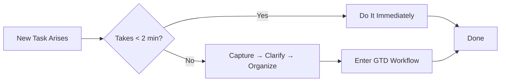
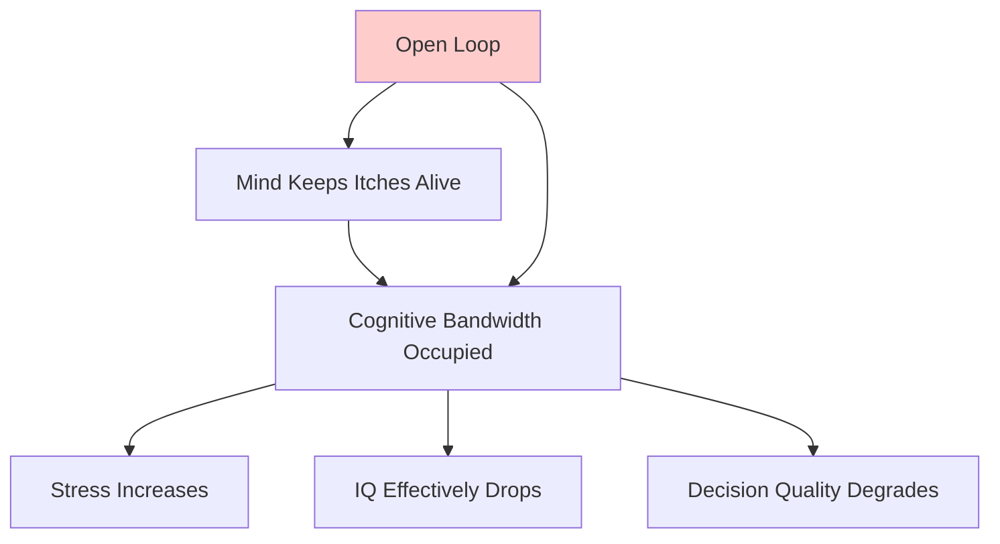
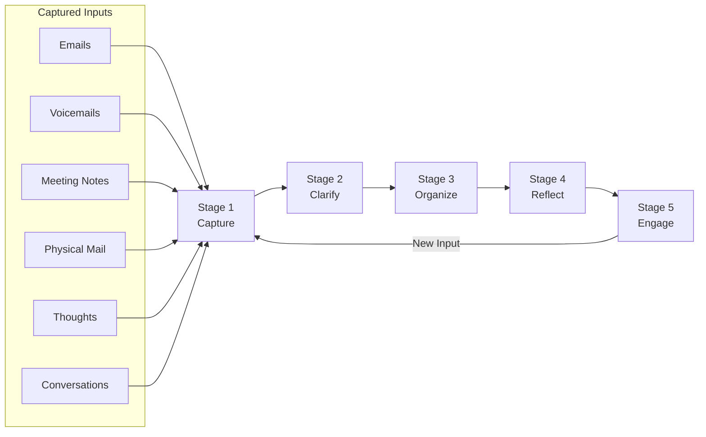
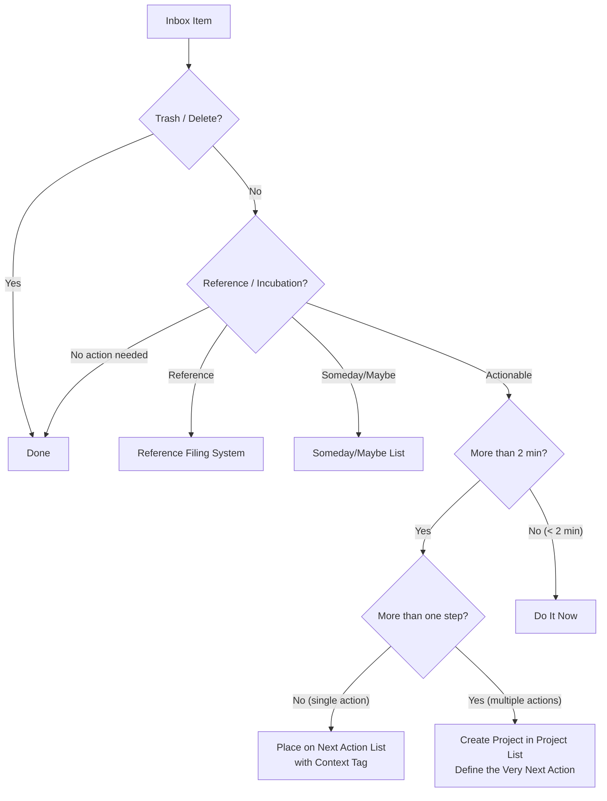
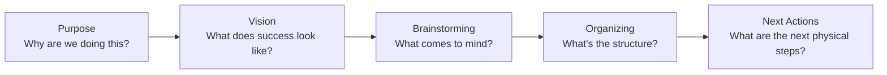
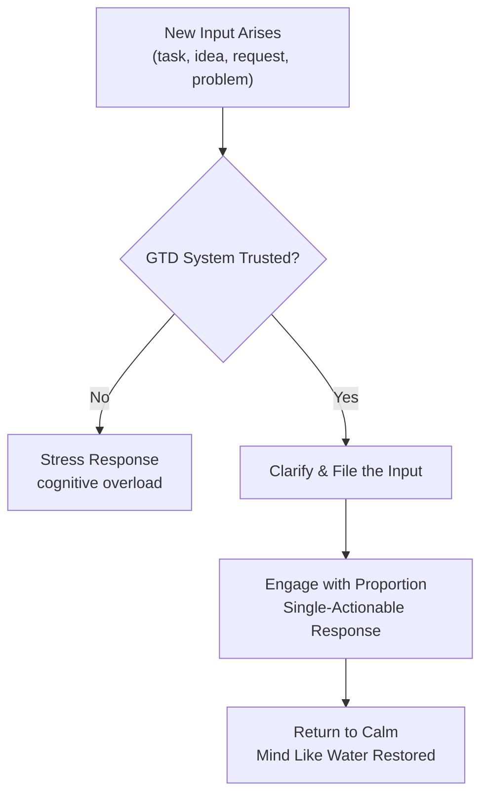
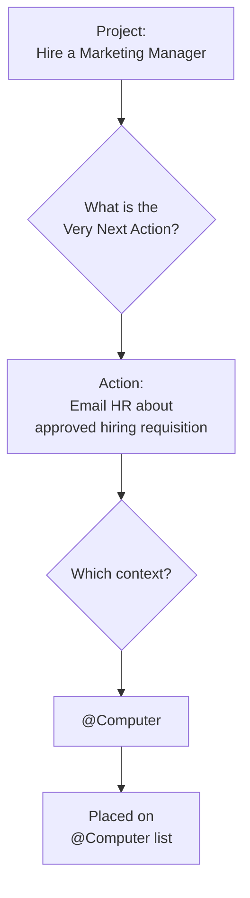

## The Two-Minute Rule Theorem

Any task. Two minutes or less. Do it now.

This rule sounds simple, but it is the single most important optimization in the entire system. Allen's logic is airtight: the time to track a two-minute task in your system — capture it, clarify it, file it, remind yourself of it, retrieve it, do it — exceeds the time to just do it. Every near-term threshold you set creates a processing cost. Two minutes is the practical break-even point.



---

## The Open Loop Problem

An **open loop** is any unfinished commitment that has not been processed into a concrete outcome and next action. Allen argues that open loops generate a background hum of cognitive overhead — a persistent, low-grade anxiety that most people accept as "normal work life" and do not recognize as a solvable problem.

### Why Open Loops Persist

- Tasks were captured but never clarified (just written down, never resolved into an action)
- A project was identified but its very next physical action was never defined
- An item was processed but not placed in an unconditionally trusted system
- The system that holds the action was not reviewed recently enough to feel trustworthy

When your mind cannot trust that something is being handled, it keeps a copy of it in working memory — and working memory has a fixed, small capacity. Open loops eat that capacity silently and continuously.



---

## The GTD Five-Stage Workflow

The entire GTD methodology is rendered as a five-stage workflow. Allen emphasizes that these stages are not arbitrary divisions — they reflect a natural planning method that every human being uses implicitly when undertaking any project.



### Stage 1 — Capture

Capture everything that has your attention into a trusted external inbox. The key constraint: **the collection bucket must be absolutely trusted**. If you write things down in a place you will not review, you have not captured them — you have simply given yourself permission to forget them guiltily.

Capture tools must be:

| Requirement | Why |
|---|---|
| Always accessible | You must be able to record anything, anywhere, at any time |
| Fast to use | Friction in capture means items leak back into the mind |
| Physically separate from reference | The inbox is for incoming items only; reference is a destination |
| Processed regularly | An overflowing inbox is a failed system |

The physical inbox is central to GTD's design. Digital capture works (email inbox, notes app, recorder), but physical objects require a physical inbox.

### Stage 2 — Clarify

The Clarify stage is where most productivity systems collapse. Every item that enters the inbox must pass through this question: **What is the next physical, visible action?**



The clarifying question tree:

- **Is this trash?** → Delete and forget immediately.
- **Is this reference material?** → File in a reference system indexed for easy retrieval.
- **Is this an idea for a possible future action?** → Add to Someday/Maybe list.
- **Is there an action required?**
  - **Can it be done in under two minutes?** → Do it immediately.
  - **Does it require more than one action?** → It is a **project** — add it to the Projects list and define its next action.
  - **Does it require one action only?** → Define the *exact next physical action* and place it on a context-based action list.

Getting to the "next action" is the hardest and most important step in GTD. "Set up new website" is not a next action. "Email Jake about what hosting provider he recommends" is.

### Stage 3 — Organize

Organize the clarified outputs into trusted, reviewable categories that match where and when you can act on them:

```
GTD Organizing System
├── Projects List (outcomes needing >1 action)
├── Next Actions (one list per context)
│   ├── @Computer
│   ├── @Phone
│   ├── @Errands
│   ├── @Office
│   ├── @Home
│   ├── @Anywhere
│   └── @Waiting For
├── Calendar (time-specific hard landscape)
│   ├── Appointments
│   ├── Deadline reminders
│   └── Tickler file deferred items
├── Someday/Maybe List
├── Reference Filing System
└── Tickler File (43 folders: 12 months + 31 days)
```

**Context-based lists** replace priority lists. Allen's argument: more important than priority is *eligibility* — can I actually do this action *right now*? If you are sitting at your computer, only items tagged @Computer are eligible. This reduces decision fatigue by eliminating unactionable items from consideration entirely.

The **Tickler File (43-folders system)** works as a physical (or digital) delivery system to future you. Each folder is numbered 1 through 43: folders 1–31 represent the days of the month; folders 32–42 represent the months January–December; folder 43 holds overflow reference or project-related notes. Placing an item in the "April 15" folder means it will be visible and actionable on that specific date — and only on that date. This allows you to defer duties confidently without fear they will be lost.

### Stage 4 — Reflect

The **Weekly Review** is the single most important maintenance ritual in GTD. Allen calls it "the backbone of the system" and schedules it as a recurring appointment every Friday afternoon — or every Monday morning, whichever the practitioner prefers.

The Weekly Review checklist:

| Review Area | Action |
|---|---|
| Collect loose papers | Gather all stray notes, receipts, business cards |
| Process notes inbox | Clear any notes still in the inbox |
| Review previous calendar | Check what came up last week, catch any open loops |
| Review upcoming calendar | Preview the next 1–2 weeks for time- and action-requiring items |
| Review project list | For each project, ask: what is the very next action? Add it |
| Review next action lists | Any items deferred, waiting for, or out of context? Update |
| Review someday/maybe | Promotions to actionable, or still future? |
| Review tickler file | What comes up in the next week that needs readiness |
| Get clear and current | Do all this until your mind is empty and the system is honest |

The purpose of the weekly review: **re-establish the validity of your system.** When you walk in on Monday morning, your system should say to you, with complete honesty: "I have everything. You can trust me. Here is what is actionable now."

### Stage 5 — Engage

When the first four stages are clean, engagement is straightforward. Allen provides three models for deciding what to do:

**The Four-Criteria Model:**
1. **Context** — Where am I? What's available? (@Computer, @Phone, etc.)
2. **Time Available** — How long do I have?
3. **Energy Available** — High energy → tackle harder tasks; low energy → handle shallow actions
4. **Priority** — What has the most value, given the above constraints?

**The Natural Planning Model** (for planning any project or outcome):



This five-step planning model is always running implicitly. GTD's contribution is to make it *explicit* — so you can bring it to any situation and trust that it covers all important steps.

---

## The Mind Like Water Model

The metaphor comes from karate. When you throw a rock into a calm body of water, the water responds proportionally — a small splash, then calm again. It does not overreact (splash wildly) or underreact (ignore it). This is the state GTD aims to achieve cognitively.



The practical upshot: every time something comes in — email, phone call, interruption, new idea — your response is calibrated, not reflexive. There is no backlog of "I should do something about that" lowering your baseline mental temperature.

---

## Defining Projects and Next Actions

### What Is a Project?

Allen's definition: **anything that requires more than one physical action to complete.** Most people dramatically underestimate the number of projects they are carrying because they never name them as such.

| Label | Actually Means |
|---|---|
| "Fix the website" | Project with 15+ steps |
| "Handle that client complaint" | Project — needs investigation, response, follow-up |
| "Plan summer vacation" | Project — bookings, itinerary, reservations |
| "Renew passport" | Project — gather documents, fill forms, appointment, payment |

Unnamed projects are the most dangerous form of open loop. They lurk in the back of your mind without their true scope being visible, generating diffuse anxiety without a motor for resolution.

### The Next Action

The next action is the **very next physical, visible thing you would need to do to move the project forward.** It must be specific enough that you could execute it the moment you read the item. "Work on report" is not a next action. "Draft the Q2 revenue section of the report" is.



---

## The Someday/Maybe List and Reference Filing

**Someday/Maybe** items are ideas and intentions that are not yet actionable but you do not want to forget. Adding them to a normal action list clutters current work. A dedicated Someday/Maybe list honors the intention while keeping it out of the immediate system.

Examples:
- "Learn to play piano"
- "Take the family to Japan"
- "Write a novel"
- "Organize the attic"

When a Someday/Maybe item becomes actionable, *promote* it — define the first project and its next action, then move it into the Projects list.

**Reference filing** is separate from action tracking. Reference material — manuals, notes, research, receipts — does not require action. It requires retrieval. Mixing it with action items creates the worst of both worlds: the list becomes noisy (hard to scan for actions) and the reference becomes buried inside a context filter it does not fit.

Allen's recommendation for reference: any system that allows retrieval by a keyword in seconds is sufficient —whether physical file cabinet, digital search, or a tags-based system.

---

## The Weekly Review Process (Detailed)

Allen prescribes a standing calendar appointment, typically Friday afternoon, with a minimum duration of 2 hours. The exact checklist:

1. **Gather Loose Papers** — desk, bag, car, home office; collect all unprocessed notes and materials
2. **Process the Notes Inbox** — clear every note captured during the week
3. **Review Past Calendar** — go through the last 2 weeks of your calendar; what was supposed to happen? Are there open loops from meetings, action items, or undefined follow-ups?
4. **Review Upcoming Calendar** — look 1–2 weeks ahead; what needs preparation? Add pre-meeting actions
5. **Review Projects and Next Actions** — for each project: define or update next action; check all action lists for stale, deferred, or waiting-for items
6. **Review Waiting For** — for items pending from others: is it still outstanding? Do you need to follow up?
7. **Review Someday/Maybe** — anything becoming real? Anything that should be retired?
8. **Review Tickler File** — what papers or items come up this week?
9. **Get Clear, Current, and Creative** — the mental state Allen wants you to reach: everything handled, nothing outstanding, mind free

The weekly review is the moment you re-negotiate the contract between you and your system. It is the only moment in the system designed to address drift — the slow accumulation of untrusted items that gradually make the whole system fail.
