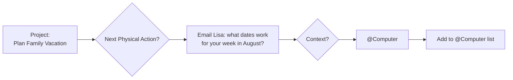

## 🎙️ Introduction

Welcome to BookAtlas. Today: *Getting Things Done: The Art of Stress-Free Productivity* by David Allen. Originally published 2001, revised edition 2015. Viking / Penguin. Three hundred and fifty-two pages. David Allen, founder of the Getting Things Done Academy and one of the most influential productivity consultants of the last half-century, spent three decades consulting with Fortune 500 companies before distilling everything he learned into a single, systematic method for managing all the things that demand your attention.

If you've ever carried a low-grade sense of guilt about unfinished tasks — things you said you'd handle, emails you haven't replied to, projects you haven't started, obligations floating somewhere behind your awareness — this book was written for you. Allen's answer to that chronic background anxiety is not "try harder." It is "build a trusted system, then let your mind off the hook."

---

## 🎙️ The Open Loop Problem

Allen begins with a psychological diagnosis, not a technique. He calls it **the overhead of mind management**: the hidden cost of trying to remember and track things without a reliable external system. Your brain, he argues, was not designed to store and retrieve unfinished tasks on demand. It was designed to *have* ideas — not to *hold* them. When you attempt the latter, working memory gets overloaded, decision quality drops, stress rises, and effective IQ declines.

The culprit: **open loops**. Any unfinished commitment, unresolved item, or unclear project that has not been processed into a concrete next action. Allen's insight, echoing research in cognitive load theory and the Zeigarnik effect, is that open loops persist in your mind even when you are not consciously thinking about them. They occupy bandwidth invisibly and continuously.

The solution to open loops is not more discipline. It is a **trusted external system** — a reliable, reviewable set of tools and processes that captures everything, clarifies it, organizes it, and keeps it current. When the system works, your mind is free.

---

## 🎙️ The Two-Minute Rule

One of the most elegant and immediately applicable insights in the book. Here is the logic: if a task will take under two minutes to complete, the time spent capturing it, filing it, and retrieving it later exceeds the time to do it now. The two-minute rule creates a filter at the moment of capture — anything short, handle immediately. Anything longer, enter the GTD workflow.

What this actually does in practice is prevent the accumulation of tiny, low-value overhead items that would otherwise choke your system. And psychologically, it makes the system feel responsive rather than bureaucratic — every two-minute task is a small moment of completion and momentum.

---

## 🎙️ The Five-Stage Workflow

The structural backbone of the entire system. Allen describes these as a natural planning method — any time you decide to do anything whatsoever, you go through these stages even if you skip them mentally:

**Stage 1: Capture.** Collect everything that has your attention into a trusted inbox. Not the things you think you should care about — the things that actually occupy your attention right now. The inbox could be physical, digital, or a combination. The gold standard Allen sets: every capture bucket must be in a place you positively look at regularly and empty.

**Stage 2: Clarify.** This is the work. Every item in the inbox gets asked one question: What is the next physical, visible action? If you cannot answer that, you have not processed the item — you have only collected it. And collected items without a next action remain open loops.

The clarifying decision tree: trash, reference, someday/maybe, or actionable? If actionable with one step under two minutes — do it. If actionable with one step over two minutes — place on the appropriate context-based Next Action list. If actionable with multiple steps — name it a *Project* and define its very next action.

**Stage 3: Organize.** Place the clarified items into their correct homes: the Projects list, appropriate context lists for actions, the Someday/Maybe list, the tickler file, and the reference filing system. The most critical organizing principle: context over priority. You act based on where you are and how much time you have, not on an abstract importance ranking.

**Stage 4: Reflect.** The weekly review — Allen's backbone of the entire GTD system. A standing 2-hour appointment, typically Friday afternoon or Monday morning, where you: gather all loose materials, clear the notes inbox, review last week's and next week's calendar, walk through every project on your list to ensure its next action is current, check the Waiting For list, review Someday/Maybe, and scan the tickler file. The goal: when you finish, you can open any action list at any time with confidence that it reflects reality.

**Stage 5: Engage.** Execute — using context, available time, available energy, and priority as your four filters for choosing what to do right now. When the first four stages are clean, execution is not a matter of willpower. It is a matter of honest scanning.

---

## 🎙️ Context-Based Lists vs. Priority Lists

Allen's insight: most people organize their to-do lists by priority — high, medium, low. But when you are sitting at your computer, "high priority" is meaningless if all high-priority items require a phone call that must be made when you are away from your desk. The real constraint on action is not priority; it is *eligibility*.

Context lists answer a single question: what can I do right now, given where I am and what's available? The contexts Allen defines — @Computer, @Phone, @Errands, @Office, @Home, @Waiting For, and a catch-all @Anywhere — let you filter instantly.

This matters because the number one cause of task-list failure is not inadequate motivation. It is staring at a mixed-priority list and not knowing where to start. Context lists eliminate that paralysis.

---

## 🎙️ The 43-Folders Tickler File

One of GTD's most iconic artifacts. The tickler file is a physical (or digital equivalent) system of 43 folders organized as follows: 31 folders labeled 1 through 31 (for the days of each month) and 12 folders labeled 1 through 12 (for January through December), plus one folder for overflow.

When you need to defer something to a future date — pay a bill on the 15th, send a reminder on the 8th — you physically place it in the day number or month number corresponding to when it needs to surface. Each day, you check the folder for today's date and process its contents. Each month, you refile the month's folder to prepare for the next cycle.

The result: you never have to trust your memory for date-bound items. You defer with confidence. The tickler file is the external memory for time-specific obligations, and it makes promises to future self reliably without generating anxiety in present self.

---

## 🎙️ Defining Projects and Next Actions

Probably the most underrated skill GTD teaches. Allen defines a **project** simply and powerfully: anything that requires more than one physical action to complete. Huge numbers of obligations that people carry around unwittingly are projects, but they never get named as projects, so they never get broken down into next actions.

Consider: "Renew the passport." That's a project with maybe eight to ten discrete physical steps — find the form, gather documents, fill in details, get photos, make an appointment, travel to the appointment, pay the fee, wait for delivery. Without naming it as a project and defining its very next action, this item floats indefinitely as an open loop.

The **very next action** is the smallest unit: the *immediately doable*, physically executable step you could take right now with the information you have. "Work on the project proposal" is not a next action. "Draft the objectives section of the Q2 project proposal" is. Precision at this level is what separates an actionable list from a hopeless wish list.

---

## 🎙️ Someday/Maybe and Reference Filing

GTD draws an explicit distinction between things you could act on right now and things you intend to act on at some unspecified point in the future. **Someday/Maybe items** — "Learn to play piano," "Organize the attic," "Take the family to Japan" — represent real intentions. They should not be mixed into current action lists because they pollute the current landscape with items you cannot act on.

Instead, a dedicated Someday/Maybe list holds these items in trust. When an item becomes real — a date is set, a budget is confirmed — you promote it: name the project, define its first next action, and move it into the Projects and action tracking system.

**Reference filing** operates on a separate axis entirely. Reference material — manuals, research, receipts, notes — is information you need to *retrieve*, not *act on*. It does not belong in your action system. Allen's principle is ruthless: action items and reference material must live in separate systems, or the distinguishing work of identification becomes ambiguous every time you look at a mixed list.

---

## 🎙️ Weekly Review: The Backbone of GTD

Allen is emphatic: the weekly review is not optional. It is the primary mechanism ensuring your system remains trustworthy. Without it, the GTD system drifts — old actions get deferred or forgotten, new items accumulate, project definitions go stale, context lists lose their fidelity to reality.

The weekly review, in Allen's practice, is a standing appointment Friday afternoon, two hours minimum. It touches every component of the system:

- Gather and process all loose papers, business cards, notes, receipt
- Process any items still sitting in the notes inbox
- Review the past 2 weeks of calendar for any open loops created by meetings or commitments that week
- Review the next 1 to 2 weeks of calendar for anything requiring preparation
- Walk through every project on the Projects list and verify: does each have a current next action?
- Review Waiting For list — follow up on anything long-outstanding
- Review Someday/Maybe — promote any items that have become real
- Scan tickler file for the next 1–2 weeks
- Get clear, current, and creative

The outcome Allen wants: after the weekly review is complete, your mind should be completely empty. Nothing outstanding. You are current. Your system reflects reality with precision. The result: you can open your action list and act from a position of full and honest information.

---

## 🎙️ Mind Like Water

The central metaphor of the book, borrowed from Gichin Funakoshi and the philosophy of karate. A calm body of water reflects perfectly and absorbs a thrown stone proportionally — a small splash, then returning entirely to stillness. It does not overreact (spray everywhere) or underreact (absorb the stone silently, no ripple).

Your mind, in GTD's ideal state, behaves the same way. Every incoming item — email, interruption, request, new idea — is evaluated and placed in the appropriate bucket. Nothing lingers unprocessed as an open loop. The mind responds proportionally to every input, and returns to calm.

What interrupts mind-like water? A system you do not trust. Every time you capture something but do not process it, your confidence in the system erodes. The mind begins keeping a backup copy of the item — a redundant internal note — and gradually you are back in open-loop territory.

GTD is not primarily about getting more done. It is about getting the mind *off* everything that is already being tracked — so you can be present, responsive, and creative instead of haunted.

---

## 🎙️ Final Assessment

Getting Things Done has two audiences. The first audience reads it as a methodology and wants to know: does it work? The second audience reads it and says: I already feel this way about my life, and Allen has finally given me the language for it. Both audiences are right.

The genuine contribution of the book is threefold. First, it accurately diagnoses a real cognitive problem — open loops — and gives it a name people can recognize. Second, it provides a complete, coherent system for resolving that problem. Third, it is not dependent on any particular technology, tool, or personality type.

The practical challenge GTD faces is consistent across reviews and practitioner accounts: partial implementation is worse than honest assessment. A system that captures but does not clarify, that lists but does not review, is a false safety net. Allen is direct about this: you must commit to processing and reviewing, or you are better off without the system entirely.

The 2015 revised edition tightens the workflow, clarifies the Clarify stage, refines the two-minute rule, and presents the Natural Planning Model more prominently. For a first-time reader, the revised edition is the right place to start.

And on the central question — can you achieve high output without the stress that normally accompanies it? Allen's answer, supported by two decades of practitioner accounts and by the underlying cognitive science, is: yes, but only with a system you trust completely. *Getting Things Done* tells you exactly how to build one.

**Rating: 9.0/10** — The most consequential personal productivity book ever written. Read it. Implement it. The results depend entirely on that second step.
