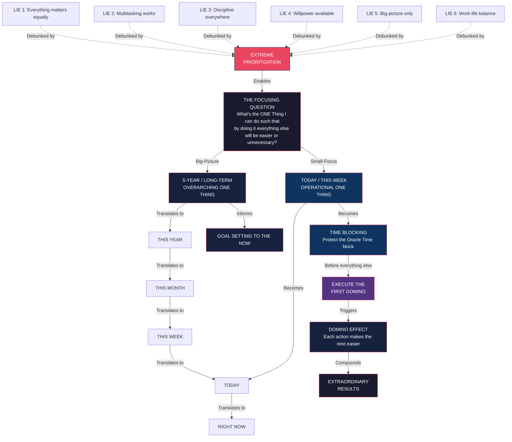

# Core Concepts

## The Focusing Question

The book's intellectual spine is a single question more than a framework. Keller presents it as the ultimate tool for cutting through noise and identifying what actually matters:

> **"What's the ONE Thing I can do such that by doing it everything else will be easier or unnecessary?"**

The question has two dimensions, each applying at a different timescale:

**Big-Picture Question**: Applied annually, quarterly, or at any long-horizon checkpoint. "What's the ONE Thing I can do in the next five years such that by doing it everything else will be easier or unnecessary?" This pins your highest-level priority — your "hedgehog concept" in Jim Collins's language — the one area where extraordinary effort will yield outsized results.

**Small-Focus Question**: Applied weekly, daily, or in any moment. "What's the ONE Thing I can do right now such that by doing it everything else will be easier or unnecessary?" This is the daily operational filter. Every hour of the day, you return to it.

The power of the question is its built-in elimination mechanism: if one action makes everything else easier or unnecessary, then every other action is, by definition, less valuable. You do not have to rank 20 tasks — you have to find the one that dominates.

---

## The Domino Effect

Keller uses the domino metaphor throughout to illustrate how extraordinary results compound from small, focused actions. The physics is literal: a small domino can tip a larger one, which tips a larger one, and so on. The size ratio can multiply — a domino just 1/50th larger than the previous one, if lined up in sequence, can eventually be large enough to topple something the size of the Empire State Building.

**The First Domino** is the ONE Thing you do today that creates momentum for tomorrow. Two rules govern it:

1. It can be extremely small. Keller's own story: the first domino for Keller Williams was not a national expansion — it was getting one salesperson to work at Keller's first office on a Sunday afternoon. That single person attracted others.
2. It does not need to feel proportional to the final result. The relationship between today's action and next year's outcome is not linear — it is multiplicative through the domino sequence.

The domino effect reframes the productivity problem: you are not trying to do many things well. You are trying to identify the sequence of things where each one makes the next possible or easier.

---

## The Six Lies Between You and Extraordinary Results

Each lie is presented as a widely accepted but counterproductive belief. Keller structures each chapter around the lie and its replacement truth.

### Lie 1: Everything Matters Equally

**The belief**: All tasks are roughly equally important. If I work harder and do more, I will succeed.

**The truth**: Equal effort on unequal tasks produces mediocre results across the board. The Pareto Principle (80/20 rule) is not a suggestion — it is an iron law. A small handful of activities generate the vast majority of results. Keller amplifies this: in extra-ordinary success, not even 20/80 is strong enough. The ratio is closer to 1/99 or 0.1/99.9. One thing drives almost everything.

**Practical implication**: You must identify the 1% of activities that drive 99% of your results and invest nearly all your energy there. The rest — emails, meetings, routine work — should be minimized, automated, or eliminated.

---

### Lie 2: Multitasking Works

**The belief**: Juggling multiple tasks at once is an efficient use of time. It feels productive and is culturally admired.

**The truth**: Multitasking is a neurological impossibility for any task requiring cognitive effort. The brain cannot hold two simultaneous focuses. What people call multitasking is rapid task-switching — and each switch carries a "goal-switching cost" in lost focus and time. Research estimates the reset time at up to 25 minutes per switch, meaning heavy multitaskers spend the majority of their day regaining concentration they never fully lost.

**Keller's framing**: Multitasking produces the illusion of progress while degrading the quality of every task involved. It also fragments your ability to enter the deep, extended focus required for your ONE Thing.

---

### Lie 3: A Disciplined Life Is Required

**The belief**: To achieve extraordinary results, you must be disciplined in every area of your life constantly.

**The truth**: Discipline is not a lifestyle — it is a tool, used selectively. You only need discipline for your ONE Thing. Once you have built a habit or system around that ONE Thing, the discipline required decreases. Keller argues against the stereotype of the hyper-disciplined "perfect" person. In fact, trying to be disciplined everywhere spreads your willpower thin and ensures failure in all areas.

**The framing**: Build your discipline around the ONE Thing that matters most. Let the rest be. You do not need a perfectly organized home, a regimented workout schedule, or a flawless inbox to achieve extraordinary results in your priority domain.

---

### Lie 4: Willpower Is Always Available

**The belief**: You can summon willpower whenever you need it. If you have enough desire, enough motivation, willpower will be there.

**The truth**: Willpower is a finite, exhaustible resource — Roy Baumeister's ego depletion model. It behaves like a muscle: it tires with use, and it recovers with rest. If you spend your morning willpower resisting snacks, managing emails, and forcing yourself through routine tasks, you will have less left for your ONE Thing in the afternoon.

**Implication**: Do not rely on willpower to execute your ONE Thing. Design your environment so that the ONE Thing happens by default, before your willpower is depleted. Keller's recommendation: do your ONE Thing first — first hours of the day, first days of the week, first months of the year.

---

### Lie 5: Big-Picture Thinking Is Enough

**The belief**: Vision, strategy, and big thinking are what produce results. If you have a compelling vision, execution takes care of itself.

**The truth**: Big-picture thinking is starting fuel — not engine fuel. A vision without action is a fantasy. What produces results is not the vision itself, but the narrow, daily, fiercely focused execution of the smallest action in the right sequence. The smallest action matters more than the grandest vision if it is in the right domino chain.

**Keller's correction**: Think big about your ONE Thing. But think small about the ONE Thing you will do *this hour*. Big vision, small focus, consistently applied.

---

### Lie 6: Work-Life Balance Is Possible (and Desirable)

**The belief**: We should strive for equal time and energy across work, family, health, and personal interests. Balance between all life areas is the ideal.

**The truth**: Extraordinary anything — extraordinary results, extraordinary relationships, extraordinary health — requires extraordinary imbalance. If you spread your attention equally, nothing gets extraordinary attention. Keller reframes the problem: instead of balance, aim for *harmonic imbalance*. Push hard in your ONE Thing for a period, then recover intentionally. The periods of imbalance should be intentional and bounded, not perpetual.

**The reality for most people**: Life demands creates its own imbalance. The question is not whether you are balanced — it is whether you are *intentionally* misplaced in your priorities, or unintentionally scattered.

---

## Goal Setting to the Now

Keller's contribution to the goal-setting literature is not a new set of categories — it is the backward chain that connects a distant vision to this morning's action. Most goal-setting systems ask you to set a target and then plan toward it. Keller asks: what is the one thing you must do today to be on track to hit that target five years from now?

**The chain**:

- **5-year (or longer) goal**: What is the ONE Thing I want to be true about my life/work in five years?
- **This year**: What is the ONE Thing I can do this year that will put me on track?
- **This month**: What is the ONE Thing this month?
- **This week**: What is the ONE Thing this week?
- **Today**: What is the ONE Thing I can do today?
- **Right now**: What is the ONE Thing I can do right now?

Each level is not independent — it is a translation of the highest level into present action. The power is in the chain: there is no gap between dream and execution. You are always working on the ONE Thing that makes the future domino fall.

---

## Time Blocking

The book's primary execution system. Keller argues that to-do lists fail because they organize tasks without protecting time. You can have 20 items on a to-do list and still not have time for any of them if your day is already booked with meetings and trivialities.

**Time blocking** solves this by putting the ONE Thing first — blocking time for it before the day's demands encroach.

Keller proposes four levels of time blocking:

1. **Block your day** — reserve your peak hours (for most people, morning) for the ONE Thing. Do not allow meetings, emails, or interruptions during this block.
2. **Block your week** — designate a theme or primary focus for each day, giving each day a dominant ONE Thing.
3. **Block your month** — calendar blocking at this scale ensures your long-term priorities (the 5-year vision translated) get dedicated attention.
4. **Block your year** — strategic retreats, quarterly reviews, and blocked days for thinking about the bigger picture.

The discipline is in protecting the block — saying no to anything that encroaches on your ONE Thing time, even when the request seems reasonable or urgent.

---

# Frameworks

---

# Mental Models

| Model | Application |
|-------|-------------|
| **The Focusing Question** | Every decision — from the strategic to the mundane — is filtered through a single test: "Will this make everything else easier or unnecessary?" If the answer is no, eliminate or delegate. |
| **The Domino Sequence** | Success is not linear. It is a chain reaction. Identify the first domino, make it fallable (small enough), and start. You do not need to see the whole sequence to begin. |
| **80/20 to the Extreme** | Keller pushes Pareto to its limit. In extraordinary results, one activity dominates all others. Find it and protect it ferociously. |
| **Time Blocking over To-Do Lists** | To-do lists organize tasks without protecting time. Time blocking meets intention with execution. If it's not on the calendar, it's not going to happen. |
| **Goal Setting to the Now** | A dream without a connection to today is a fantasy. Every long-term goal must be reverse-engineered down to what you will do right now. |
| **Harmonic Imbalance** | Extraordinary results require periods of intentional imbalance — pushing hard in one area while allowing other areas to stabilize. Recovery is not the same as balance. |
| **Willpower as a Debit Card** | Willpower has a daily balance. Spend it wisely on your ONE Thing first. Reduce low-value decisions (clothing, breakfast, routine tasks) to conserve willpower for what matters. |
| **The One-Focus Practice** | The core execution rule: in any given period, you can pursue ONE thing with extraordinary intensity, or many things with ordinary results. Choose. |

---

# Key Lessons

1. **The question changes everything.** Most people spend their days answering questions they were never asked. The Focusing Question forces you to stop and select before you act.

2. **Everything does not matter equally.** The biggest productivity lie is that "all my tasks are important." They are not. The task list is a field of near-tasks; one is central. Find it.

3. **Multitasking is a myth that costs you your best hours.** Every task switch costs 15–25 minutes to regain full focus. Heavy multitaskers never enter deep work states. They accomplish their ONE Thing in their best hours only if they protect those hours.

4. **Willpower should be spent, not exhausted on trivia.** Design your environment — your morning routine, your workspace, your calendar — to reduce trivial decision-making so your willpower is preserved for its highest-value use.

5. **A little every day compounds enormously.** One small domino knocked over every day, in the right sequence, builds a lifetime of extraordinary results. This is why the first action matters more than it appears.

6. **Goal-setting-to-the-now closes the intention-action gap.** Most people never connect their grandest ambitions to today's to-do list. Each day, ask: what is the ONE Thing I can do today that makes me on track for my five-year goal?

7. **Work-life balance is the wrong goal.** Pursue harmonic imbalance: push intentionally in your ONE Thing domain, recover intentionally in other domains, but do not aim for equal weight. Equal weight produces nothing extraordinary.

8. **The first domino can be incredibly small.** Keller's own trajectory began with a single salesperson deciding to work a Sunday. That small action built a real estate empire. Do not wait for a big first move.

---

# Practical Applications

**Running a small business**: At the start of each quarter, identify the ONE Thing that, if the business accomplished nothing else, would make the quarter a success. Block every morning for four hours on that ONE Thing. Delegate or defer everything else.

**Growing your career**: Identify your ONE Thing for the year — the project, skill, or relationship that will create more opportunity than all other activities combined. Block three hours before noon every day exclusively for that ONE Thing.

**Writing a book or creative work**: Block your best creative hours (usually morning) for writing. Before checking email or Slack, write for 90 minutes. The rest of the day can handle noise. Your best cognitive state is reserved for creation.

**Real estate sales (Keller's domain)**: The ONE Thing is not listing appointments or open houses — it is building a pipeline of listings. Every activity that does not directly or indirectly generate listing leads should be minimized. Time block prospecting before admin.

**Personal productivity**: Spend 10 minutes each evening identifying tomorrow's ONE Thing. Write it on a sticky note or in a dedicated spot. First thing tomorrow, before checking email or messages, spend 60 minutes on that ONE Thing.

**Overcoming overwhelm**: When there is too much to do, stop everything. Use the Focusing Question to find the ONE Thing that, if completed, makes everything else lighter. Do that. Ignore the rest until it is done.

**Building a habit**: For each new habit you want to build, identify the first domino — the smallest possible version of the habit. Write one sentence. Do five pushups. Make one call. Build the sequence from there.

---

# Examples

**Gary Keller's own story**: Keller Williams began with a single office in Austin, Texas. Keller's ONE Thing at the start was not to build a franchise empire — it was simply to find one person who would commit to working at the office on a Sunday. That first domino created a culture of work ethic that attracted others, then markets, then a national brand. The ONE Thing principle was operational even before Keller wrote the book.

**The real estate agent aiming for $1M**: Keller shares the story of a Keller Williams agent who set a $1 million annual goal. Her ONE Thing, identified through backward planning, was to meet 10 new people per week — calling past clients, attending community events, generating referrals. That ONE Thing was small and nonintimidating. But 10 meetings per week, sustained, built a database that generated the referrals needed to hit the number.

**The author's writing process**: Keller credits the book itself as an exercise in the ONE Thing principle. Facing a mountain of ideas and research, he and co-author Papasan used the Focusing Question to narrow the manuscript: what is the ONE thing this chapter must convey? Each chapter became a single domino; the sequence built the book.

**The split-focused manager**: A manager who checked email every 10 minutes while managing a team saw team performance plummet. Using Keller's framework, she protected one two-hour block each morning before touching email. In that block, she did her ONE Thing — strategic planning and one-on-ones. Email was handled in a single afternoon block. Team performance recovered within a quarter.

**The entrepreneur who burned out**: An entrepreneur who worked 80-hour weeks across dozens of projects hit a performance ceiling. After reading *The ONE Thing*, he identified the ONE product that generated 90% of revenue. He sold or paused all other products. His work hours dropped to 40, revenue increased, and his team grew.

---

# Action Plan

1. **Tonight, answer the Focusing Question for your life** — what is the ONE Thing you can do in the next five years such that by doing it everything else will be easier or unnecessary? Write it down in one sentence.

2. **Tomorrow morning, before anything else**, spend 60 uninterrupted minutes on your ONE Thing. No email. No messages. No meetings. Just your ONE Thing.

3. **Set up your time-blocking calendar** — block your highest-value hours for your ONE Thing for the next 30 days. Treat that block as unmovable.

4. **Identify your current biggest lie** — from the six lies above, which one is governing your daily behavior right now? Name it. Write one sentence on how you will counter it this week.

5. **Find your first domino** — for your 12-month goal, what is the smallest action you can take today that makes tomorrow easier? Do that action now.

6. **Practice the 4-hour workday for your ONE Thing** — most people are not even moderately focused for four hours a day. Measure it. If you are not, protect those hours first.

7. **Conduct a weekly ONE Thing review** — every Sunday, answer: what was my ONE Thing this week? Did I protect time for it? What is my ONE Thing next week?

8. **Reduce decision fatigue** — eliminate three small, recurring decisions from your day (what to wear, what to eat for breakfast, how to start your morning). Automate them. Direct the saved willpower toward your ONE Thing.
