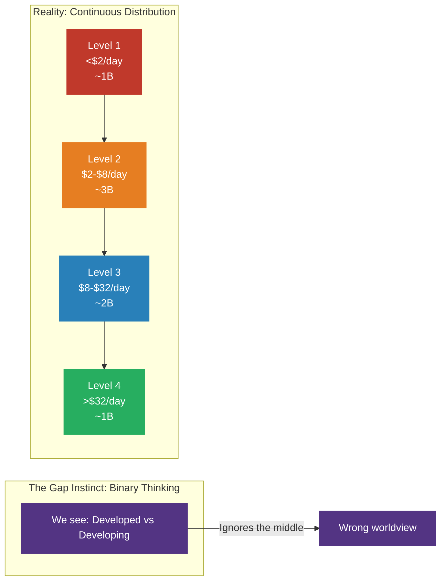
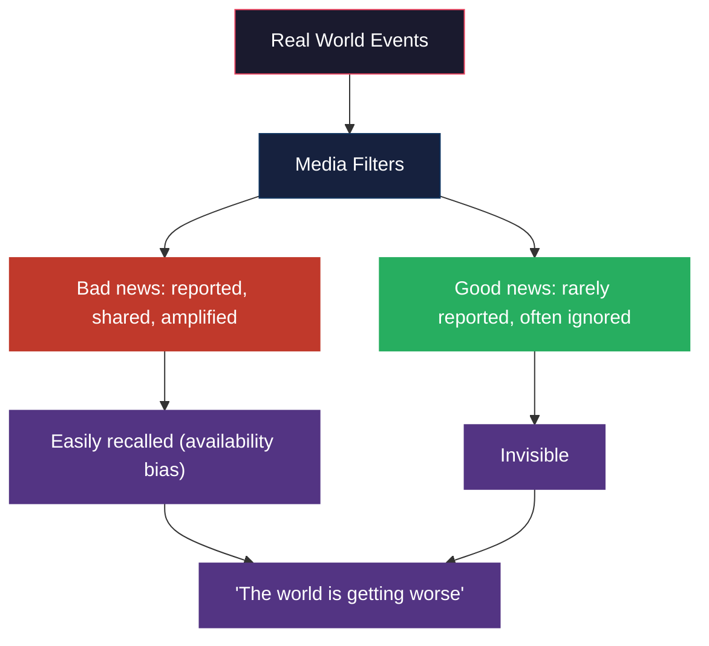
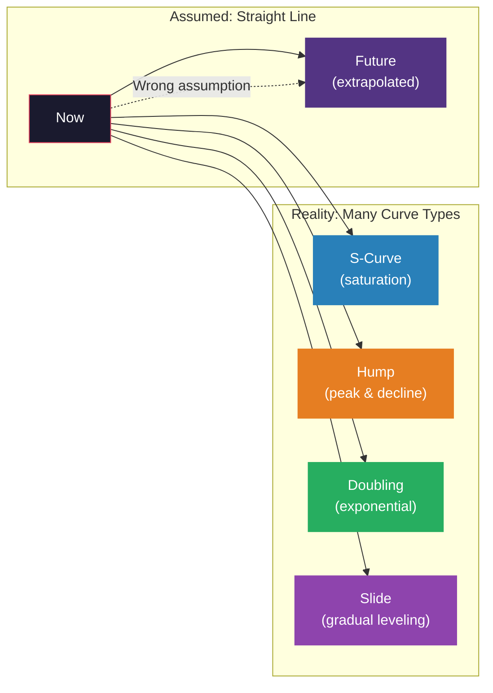
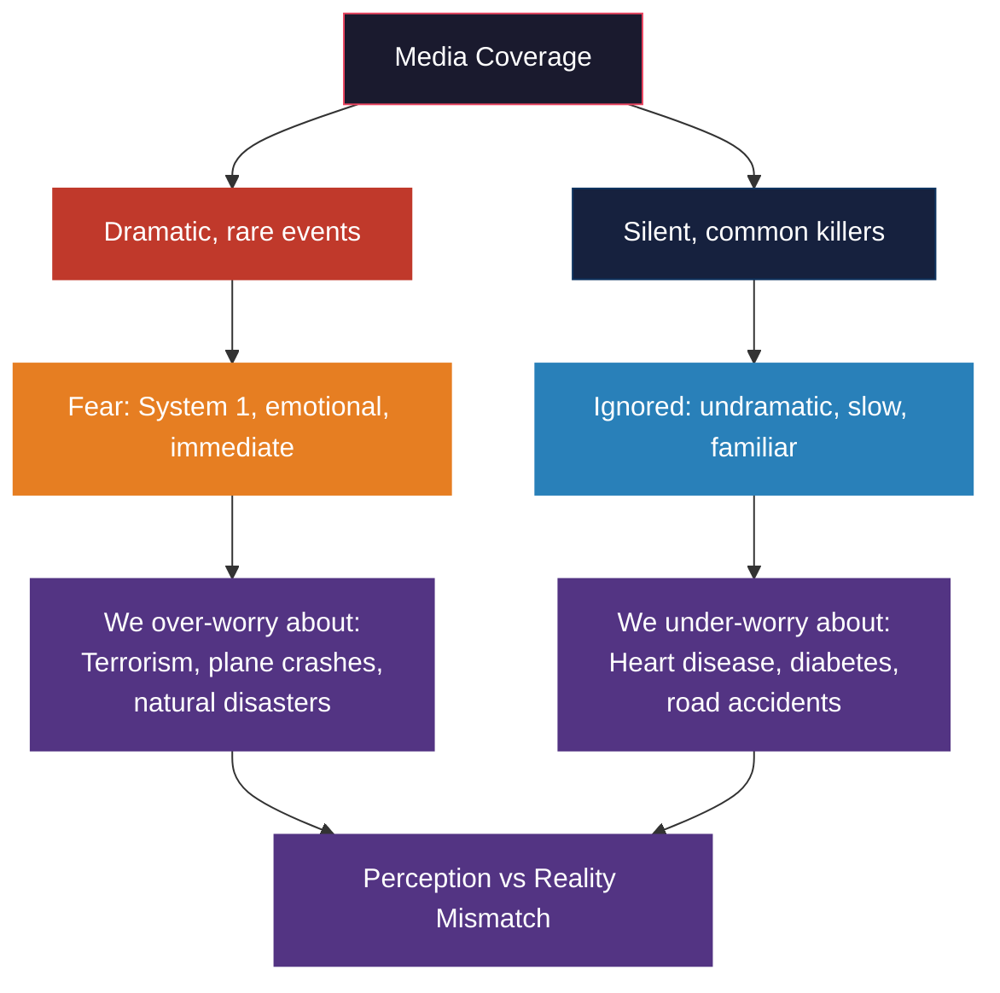
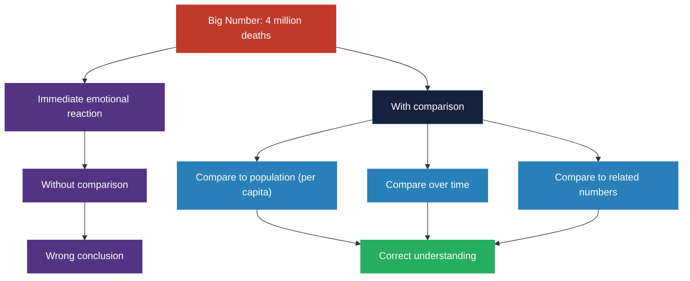
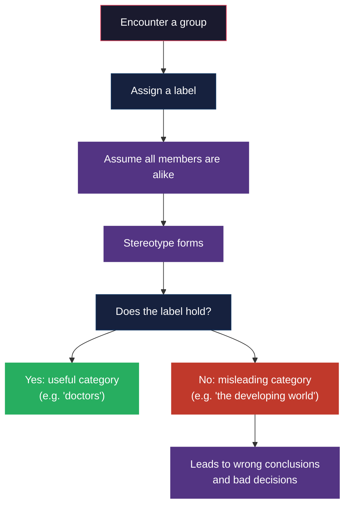
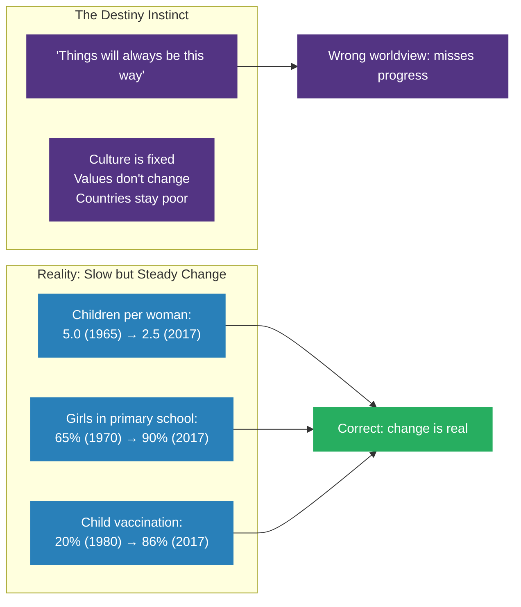
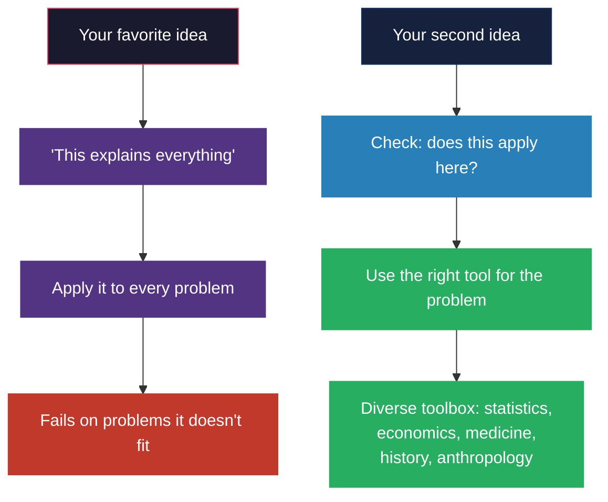
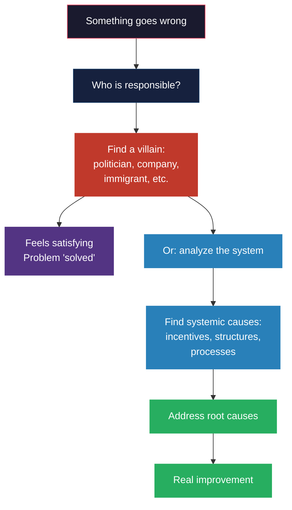
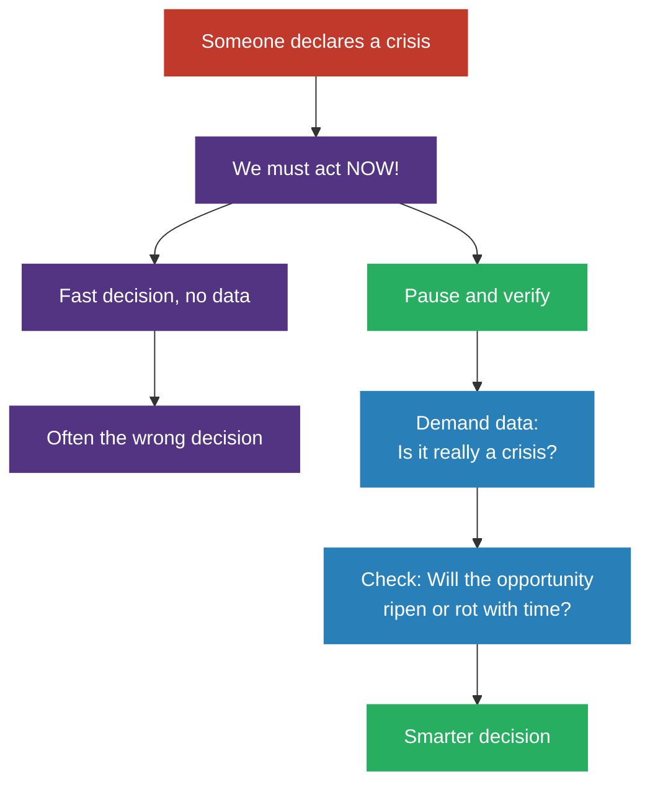

# The Ten Instincts

## The Gap Instinct

The tendency to split things into two distinct, often opposing groups --
"us and them," "developed and developing," "rich and poor" -- and to see a
gap between them where none exists. Rosling argues this is our most
fundamental distorting instinct.

Most people live in the middle. The "developing world" is not a separate
category but a continuous spectrum. Rosling illustrates this with the
four income levels framework: Level 1 (extreme poverty, ~$2/day), Level 2
(~$2-8/day), Level 3 (~$8-32/day), Level 4 (>$32/day). Most of humanity
is on Levels 2 and 3. The antidote: look at the distribution, not the
average; look at the overlap, not the gap.

---

## The Negativity Instinct

Our tendency to notice bad news more than good news, and to believe the
world is getting worse even when most indicators are improving.

Rosling shows that across nearly every metric -- child mortality, poverty,
literacy, life expectancy, vaccination coverage -- the world has improved
dramatically. But progress is silent, incremental, and not newsworthy. A
plane landing safely (millions daily) is not reported. A plane crash (rare)
is front-page news. Antidote: expect bad news; ask if equally positive news
would have reached you.

---

## The Straight Line Instinct

The assumption that current trends will continue in a straight line, when
in reality most trends curve.

Rosling gives the example of population growth: many assume it will
continue exploding in a straight line. In reality, the number of children
per woman has already halved globally (from 5 to 2.5), and total population
will likely level off around 10-11 billion. Other examples: the spread of
cell phones followed an S-curve; HIV prevalence followed a hump. Antidote:
remember that lines can curve.

---

## The Fear Instinct

Our tendency to overestimate dramatic, rare risks while underestimating
mundane, persistent dangers.

Rosling shows that deaths from natural disasters have dropped 75% over the
past century, yet fear of them is higher than ever. Plane crashes kill
fewer than 1,000 people per year globally; road accidents kill 1.2 million.
We fear terrorism more than falling, but falling kills 30 times more people
in the US alone. Antidote: calculate the actual risk before reacting.

---

## The Size Instinct

The tendency to judge the importance of a number without putting it in
context.

Example: 4 million babies die in their first month every year. This is a
terrible number. But in 1950, it was 14 million. In 1800, more than 40%.
The size instinct makes us react to the absolute number without comparing.
Antidote: always put big numbers in perspective: per capita, over time, or
against a relevant benchmark.

---

## The Generalization Instinct

The tendency to categorize people or things into groups and assume
everything in that group is the same.

Rosling uses the "developing world" label as his prime example. It lumps
dozens of countries at vastly different income levels, health outcomes,
and cultural contexts into one meaningless category. Most "developing
countries" have higher life expectancy than the US had in 1950. The
antidote: question every category; look for variation within groups; ask
whether the average is representative or if the spread tells the real
story.

---

## The Destiny Instinct

The belief that innate, fixed characteristics determine the fate of
countries, cultures, or religions -- that slow change means no change.

The key insight: cultural values change across generations, not centuries.
The same values we associate with "Western" culture -- gender equality,
democracy, individualism -- existed in all cultures at various points.
Sweden had patriarchal values 60 years ago that look similar to parts of
Afghanistan today. Economic development changes values. Antidote: track
gradual improvements; update your mental map; remember that slow change
is still change.

---

## The Single Perspective Instinct

The tendency to believe that all problems have a single cause or a single
solution -- and that applying your favorite tool will fix everything.

Doctors see medical solutions. Economists see market solutions. Activists
see political solutions. Each sees the world through their trained lens.
Rosling gives the example of the US healthcare debate: market advocates
and single-payer advocates both think their one solution will fix
everything. In reality, every country's system is a mix. Antidote: be
humble about the limits of your expertise. Collect diverse tools. Test
your favorite idea against reality.

---

## The Blame Instinct

The search for a clear, guilty individual when something goes wrong,
rather than examining the system that allowed it.

The blame instinct is satisfying but counterproductive. When we identify
a villain, we stop looking for causes. Rosling argues that blaming
individuals often prevents us from fixing the underlying system. A corrupt
politician exists because of a system that allows corruption. A company
that pollutes does so because regulations or incentives permit it. The
same applies to good outcomes: giving credit to a single hero obscures
the system that made their success possible. Antidote: resist pointing
fingers. Look for causes in the system.

---

## The Urgency Instinct

The tendency to react to perceived threats with immediate action, without
pausing to think.

The urgency instinct is exploited by politicians, activists, and
marketers who declare a "crisis" to bypass careful thinking. Rosling
offers a framework: when someone says "act now or it's too late," ask
whether the opportunity will ripen or rot with time. Most "urgent"
problems have been developing for years and will benefit from measured
analysis. The few true emergencies (an impending natural disaster, a
sudden epidemic) are better handled by prepared systems than panicked
reactions. Antidote: take a breath. Demand data. Beware of action bias.

---

## The Four Income Levels Framework

Rosling's central alternative to the outdated "developed/developing"
binary. Instead of two categories, he proposes four levels based on daily
income per person (PPP-adjusted):

| Level | Daily Income | Population (2017) | Characteristics |
|-------|-------------|-------------------|-----------------|
| Level 1 | Less than $2 | ~1 billion | Extreme poverty: no electricity, no running water, food is the main concern |
| Level 2 | $2 to $8 | ~3 billion | Has electricity, a stove, a refrigerator; children go to school |
| Level 3 | $8 to $32 | ~2 billion | Has hot water, a car, a computer; most children complete secondary school |
| Level 4 | More than $32 | ~1 billion | The "rich world": flights, savings, higher education, long vacations |

The key insight: most people are on Level 2 or 3 -- not in extreme
poverty, not in Western affluence, but in the vast middle. The world is
not divided; it is a continuously improving continuum.

---

## Dollar Street

Anna Rosling Rönnlund's photographic project that visualizes the four
income levels through images of homes worldwide. Over 264 homes in 50+
countries, each photographed with consistent framing of the same objects:
the family's toothbrushes, their stove, their bed, their shoes. The homes
are then ordered by income on a virtual street. The result is stunning:
a family on Level 2 in Bangladesh has the same toothbrushes and stove as a
family on Level 2 in Nigeria. A family on Level 4 in the US looks similar
to a family on Level 4 in South Africa. Culture explains far less than
income.

---

## The Gapminder Bubble Charts

Rosling's signature visualization method, powered by the Trendalyzer
software built by Ola Rosling. Countries are plotted as bubbles on an
X-Y axis (typically income per person on X, life expectancy on Y), with
bubble size representing population. When animated over time, the bubbles
move from the bottom-left (poor, sick) toward the top-right (rich,
healthy). The key finding: nearly every country is moving in the same
direction -- toward better health and higher income -- and the gaps
between them are shrinking. The bubbles converge.

---

## Key Lessons

1. **Most things are improving** -- but progress is slow, silent, and
   undramatic, so it goes unnoticed.
2. **The world cannot be divided into two groups** -- the majority sits
   in the middle of a continuous distribution.
3. **Fear and danger are different** -- what we fear most is rarely what
   threatens us most.
4. **Numbers need context** -- a big number without a denominator or
   comparison is meaningless.
5. **Categories lie** -- every group contains huge variation; never assume
   the label tells the whole story.
6. **Change is slow but real** -- cultures and economies evolve across
   generations, not centuries.
7. **No single solution solves everything** -- the more tools you have,
   the better your judgment.
8. **Systems matter more than heroes or villains** -- blame the process,
   not the person.
9. **Urgency is a trap** -- most crises have been unfolding for years
   and deserve reflection.
10. **You can be both hopeful and honest** -- acknowledging progress does
    not mean ignoring problems.

---

## Practical Applications

**For Media Consumers**: When you see alarming news, ask: what is the
base rate? Has this been getting better or worse over 10, 50, 100 years?
Is this a dramatic exception or part of a trend?

**For Educators**: Use Gapminder's free tools and Dollar Street to teach
students about global development. The four income levels framework is
more accurate and less patronizing than "developed vs developing."

**For Leaders**: Before declaring a crisis, demand data. Ask: what is the
distribution? What is the trend over time? Who benefits from framing this
as urgent?

**For Activists**: Acknowledging progress does not undermine your cause.
In fact, it makes you more credible. The most successful social movements
are those that can say "things are better, but not good enough."

**For Citizens**: Take the Gapmider test (gapminder.org/test). Most
people score worse than a chimpanzee. The act of discovering your own
ignorance is the first step to overcoming it.

---

## Action Plan

1. **Take the Gapminder test.** See how your worldview compares to the
   data. The results will likely surprise you.

2. **Adopt the four income levels.** Stop using "developed vs developing."
   Replace it with Levels 1-4 in your thinking and vocabulary.

3. **Contextualize every statistic.** Before accepting any number, ask:
   compared to what? Over what period? Per capita? Is this the average
   or the spread?

4. **Practice "possibilism."** When someone presents a dire view of the
   world, don't reflexively argue. Instead, present the positive trend.
   When someone presents a rosy view, present the remaining problems.
   Hold both.

5. **Follow the data, not the headlines.** Subscribe to sources that track
   long-term trends. Our World in Data, Gapminder, and WHO data portals
   are better guides to reality than the evening news.

6. **Resist the blame instinct.** When you see a failure, ask: what system
   allowed this? When you see a success, ask: what system enabled this?

7. **Question urgency.** When someone says "we must act now," pause.
   Gather data. Ask whether the problem will ripen or rot with time.
   Most "urgent" issues benefit from thought.

8. **Diversify your perspectives.** Read outside your field. Seek
   viewpoints that challenge your assumptions. The single perspective
   instinct is hard to shake, but awareness is the first defense.
