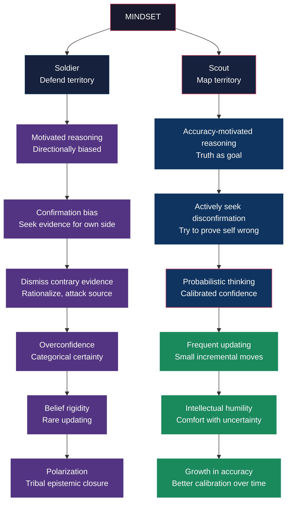

# Core Concepts

## Scout vs Soldier Mindset

The central metaphor of the book contrasts two modes of thinking:

| Dimension | **Soldier Mindset** | **Scout Mindset** |
|---|---|---|
| Goal | Defend beliefs, win arguments | Map reality accurately |
| Attitude to contrary evidence | Threat — attacked, dismissed, or rationalized | Data — incorporated into the map |
| Signature question | "Can I believe this?" or "Must I believe this?" | "Is this true?" |
| Emotional driver | Ego preservation, social belonging, identity defense | Curiosity, desire for accuracy |
| Relationship to being wrong | Humiliation, loss of status | Learning signal, course correction |
| Confidence expression | Categorical ("I know," "It's obvious") | Probabilistic ("70% likely," "My best guess is") |
| Response to criticism | Defensive, counter-attack | Welcoming, investigative |
| Updating behavior | Rare and reluctant — reinterprets contrary evidence | Frequent and incremental |
| Self-perception | "I'm objective and rational" | "I have blind spots and biases" |
| Utility | Motivation, social bonding, decisive action | Accuracy, learning, long-term judgment |

The metaphor is borrowed from Galef's 2016 TED Talk ("Why You Think You're Right — Even If You're Wrong") and expanded with examples from history, business, and personal life. The key insight: **neither mindset is inherently good or bad**. Soldiers win battles. Scouts win information wars. The problem is that most of us default to soldier mode in situations that call for scout mode.

The 2016 US election is a recurring case study: how both Trump supporters and Clinton supporters interpreted identical facts in opposite ways, each side convinced of its own objectivity.

---

## Motivated Reasoning

Galef builds on decades of social psychology research showing that our reasoning is typically **directionally motivated** — we work harder to find evidence for conclusions we want to be true than for conclusions we don't. The classic formulation comes from Ziva Kunda's 1990 paper "The Case for Motivated Reasoning": people access different beliefs, rules, and knowledge structures depending on what conclusion they want to reach.

**Research study**: In a 2006 study by Geoffrey Cohen, participants evaluated a welfare policy. When told their party supported it, they judged it favorably; when told their party opposed it, they judged it unfavorably — even though the policy text was identical. Participants denied being influenced by party cues.

**Example**: Smokers who read evidence linking smoking to lung cancer generate more counter-arguments and rate the evidence as less convincing than non-smokers do (Kunda, 1987). Intelligence doesn't prevent this — it helps you generate better rationalizations.

**Key distinction**: Directionally motivated reasoning ("Can I believe this?") vs accuracy-motivated reasoning ("Is this true?"). The former says yes to desired conclusions and demands mountains of proof for undesired ones. The latter applies the same standard regardless of which answer feels better.

---

## Self-Deception

Chapter 7 ("Coping with Reality") directly confronts the belief — common in pop psychology — that self-deception is adaptive. Galef cites three claims and rebuts each:

1. **"Self-deceived people are happier."** Galef reviews the literature on depressive realism (Alloy & Abramson, 1979): mildly depressed people were more accurate in estimating their control over outcomes than non-depressed people. But later studies found the effect is inconsistent, and the causal direction is unclear. More importantly, the question is not "does self-deception feel good?" but "does it serve you?" In domains that matter — health, relationships, finance — accurate perception is associated with better outcomes.

2. **"Entrepreneurs need overconfidence to succeed."** The popular narrative: entrepreneurs are irrationally optimistic, and that's why they take risks. Galef finds mixed evidence. Some studies show moderate optimists persist longer, but extreme optimists fail more often and lose more money. Jeff Bezos (featured in the book) explicitly cultivates a scout mindset at Amazon — "disagree and commit" is a policy designed to surface real disagreement, not suppress it.

3. **"Athletes and performers need delusional confidence."** Galef distinguishes between *self-efficacy* (belief that you can improve with effort) and *delusional overconfidence* (belief that you're better than you are). The former is supported by evidence; the latter backfires when you fail to prepare because you overestimate your current ability.

**Practical alternative**: Instead of "I'm going to succeed," scouts say "I'm going to give this my best effort, and I'm going to be honest with myself about the odds."

---

## Anomaly Hunting

One of the book's most practical techniques: scouts actively search for anomalies — pieces of evidence that don't fit their existing model. This is the opposite of the soldier's instinct to sweep counter-evidence under the rug.

**The technique**: When you encounter a fact that contradicts your belief, instead of explaining it away, treat it as a clue that your model needs revision. Ask: "If this anomaly turns out to be real, what would it mean for my worldview?"

**Example from the book**: Darwin collected anomalies. The peacock's tail — a costly, cumbersome ornament that seemed to reduce survival — didn't fit his theory of natural selection. Instead of dismissing it, he investigated and developed the theory of sexual selection. The anomaly became the foundation of a new insight.

**Application**: In daily life, anomaly hunting means paying special attention to data points that make you uncomfortable. When you feel the urge to dismiss a study, a statistic, or a personal story, pause and ask: "What if this is true?"

---

## Beta-Testing Beliefs

Galef suggests treating beliefs as hypotheses to be tested rather than positions to be defended. This is scout mindset at the level of daily practice.

**Practical framework**: For any belief you hold, ask:
- **Falsification**: What concrete evidence would change my mind?
- **Active search**: Have I genuinely looked for that evidence?
- **Prediction**: If this belief is true, what specific predictions follow? Have those predictions been tested?
- **Competing hypotheses**: What else could explain what I'm seeing?

**The "double standard" test**: Would I accept this level of evidence if it supported a conclusion I *disliked*? If not, the conclusion is likely a product of soldier mindset.

**Example from the book**: Investors like Warren Buffett and Charlie Munger explicitly practice belief beta-testing, maintaining a "too hard" pile for questions they can't answer and updating their positions as new evidence arrives. Buffett's admission of his mistake on Dexter Shoes (he paid $433 million in stock for a company that later went to zero) is presented as a model of scout behavior: no rationalization, just a clear-eyed post-mortem.

---

## Calibration

A calibrated thinker expresses confidence that matches their actual accuracy. Overconfidence (saying 90% when you're right 70% of the time) is the default human mode. Underconfidence (saying 60% when you're right 80% of the time) is less common but also a calibration error.

**The calibration exercise** (adapted from the book and CFAR workshops):
1. Pick a set of factual questions with objectively knowable answers.
2. For each question, write down your best guess and a probability (50% to 100%) for how sure you are.
3. After checking the answers, count: how many of the items you were 90% sure about did you actually get right? How about 80%? 70%?
4. A well-calibrated person gets 90% of their 90% confident answers right, 80% of their 80% confident answers right, etc.

**Why it matters**: Most people are dramatically overconfident on the first attempt. The exercise reveals the gap between felt certainty and actual accuracy, creating motivation to recalibrate.

**Ongoing practice**: Keep a prediction journal. Write down forecasts about events in your life, work, and current events with explicit probability estimates. Track your calibration curve over time. Galef argues that the very act of assigning probabilities — even without formal scoring — improves calibration because it forces you to engage with uncertainty.

---

## Identity and Belief

Chapter 13 ("How Beliefs Become Identities") is the emotional core of the book. Galef argues that beliefs become entangled with identity through a process of defensive investment: the more you have defended a belief publicly, the more it costs to abandon it.

**Research study**: In a 2016 study by Jay Van Bavel and colleagues, participants' neural reward centers lit up when they saw information supporting their political party — the same brain regions that respond to food, money, and social approval. The study suggests that processing belief-confirming information feels *rewarding*, not just comfortable.

**The identity-protective cognition trap**: When a belief becomes part of your identity ("I'm the kind of person who believes X"), contradictory evidence is processed as a threat to your very self. This is why political, religious, and cultural beliefs are so resistant to counter-evidence — the stake isn't just "am I wrong?" but "who am I?"

**Practical solution**: Separate the belief from the identity. Instead of "I'm a conservative who believes in free markets," think "I'm someone who currently holds the belief that free markets produce the best outcomes — and I'm open to evidence about edge cases." This creates psychological space for updating without identity threat.

---

## Social Accountability

Galef emphasizes that rationality is not just an individual skill — it's shaped by social context. The people you surround yourself with, the conversations you have, and the norms of your community all influence whether you default to soldier or scout mode.

**Echo chambers**: Groups that share your beliefs create a "soldier culture" where challenging the group consensus is punished. The more homogeneous your social network, the more confident and entrenched your beliefs become — regardless of their accuracy.

**Scout-friendly communities**: Galef points to communities like the Effective Altruist movement, LessWrong, and the /r/ChangeMyView subreddit as examples of cultures that reward accuracy-motivated reasoning. Key features: norms of good-faith disagreement, respect for updating, and social status given to people who change their minds.

**Practical advice**: Actively seek out smart people who disagree with you. Make it safe for people in your life to tell you when they think you're wrong. Explicitly model scout behavior — when someone changes your mind, tell them.

---

## Time-Shifting Perspective

Galef offers several counterfactual thought experiments designed to reveal when your beliefs are being driven by soldier mindset rather than evidence:

1. **The Double Standard Test**: Would I require the same amount of evidence if I wanted the *opposite* conclusion to be true?

2. **The Outsider Test**: If a neutral observer with no stake in this issue looked at the same evidence, what would they conclude?

3. **The Conformity Test**: If I weren't surrounded by people who share this belief, would I still hold it?

4. **The Status Quo Test**: If the current situation were reversed, would I fight to change it back?

5. **The Hindsight Test**: How will I feel about this decision in 10 years? Will "I was wrong" still feel shameful, or will "I learned something important" feel more relevant?

**Example**: If you're defending a controversial policy, ask: if my opponent proposed this exact policy, would I be arguing for or against it? If the answer is "against," your opposition is probably motivated by identity, not principle.

---

## Key Lessons

1. **The emotional barrier is the real barrier.** Knowing about biases doesn't help. What helps is building the emotional tolerance to feel wrong without crumbling. The scout mindset is an emotional skill.

2. **Motivated reasoning is not stupidity — it's motivation.** We are protecting legitimate needs: self-esteem, social belonging, motivation. The solution is not to shame ourselves but to find ways to meet those needs without distorting reality.

3. **Calibration is the fundamental skill.** Being confident about the things you actually know and uncertain about the things you don't — that's scout mindset in practice. Everything else follows.

4. **Identity is the deepest trap.** The beliefs you most identify with are the ones you can least think clearly about. Hold identity lightly.

5. **You don't need to be a scout in every situation.** Soldier mode is useful for motivation, for team cohesion, for quick decisions under pressure. The goal is situational awareness and flexibility.

6. **The best hedge against bias is social.** Build relationships with people who will tell you hard truths. Create cultures where being wrong is safe. Accountability to accuracy-seeking communities may be the single most powerful tool.

---

## Practical Applications

**For Individuals**: Start a "When I Was Wrong" journal. Once a week, record one instance where you realized you were wrong about something meaningful. Note what made it hard to see and what helped you change your mind. The act of writing trains the scout muscle.

**For Leaders**: Create a culture where being wrong is safe. Share your own mistakes. Reward employees who bring bad news early. When a decision turns out wrong, ask "what can we learn?" before "who is to blame?"

**For Teams**: Start meetings with a quick calibration exercise. Have everyone write down their prediction about a project outcome as a probability. Track accuracy over time. The practice alone improves judgment by surfacing overconfidence.

**For Relationships**: When a partner, friend, or colleague says something you disagree with, pause before responding. Ask yourself: am I reacting to the content or to the feeling of being challenged? Then say: "Tell me more — I want to understand your reasoning." This simple shift is scout mindset in conversation.

**For Anyone in a Polarized Debate**: Before arguing your position, state your opponent's position in its strongest form — and check with them that you got it right. This single rule prevents strawmanning and forces you to engage with the actual argument.

---

## Action Plan

1. **Notice your soldier mode.** When you feel defensive, angry, or dismissive of a new idea, label it: "Soldier mode activated." Awareness is the first step.

2. **Practice the double-standard test.** Once a day, pick one belief you feel strongly about and ask: "If the evidence were reversed, would I accept it?"

3. **Keep a calibration log.** Write 3 predictions per week with probability estimates. Review monthly. Track whether 80% of your 80% predictions come true.

4. **Cultivate dissenting voices.** Follow smart people you disagree with. Read their arguments in full before counter-arguing. Have conversations with people across political, religious, and cultural divides.

5. **Reward updating in public.** When someone changes your mind, tell them — explicitly. This creates social norms that make scout behavior contagious.

6. **Hold identity lightly.** When you catch yourself saying "I'm a [label]," pause and rephrase: "I currently lean toward [belief], but I'm open to changing."

7. **Reduce the cost of being wrong.** Treat errors as tuition for a clearer map. The faster you pay, the sooner you learn.
