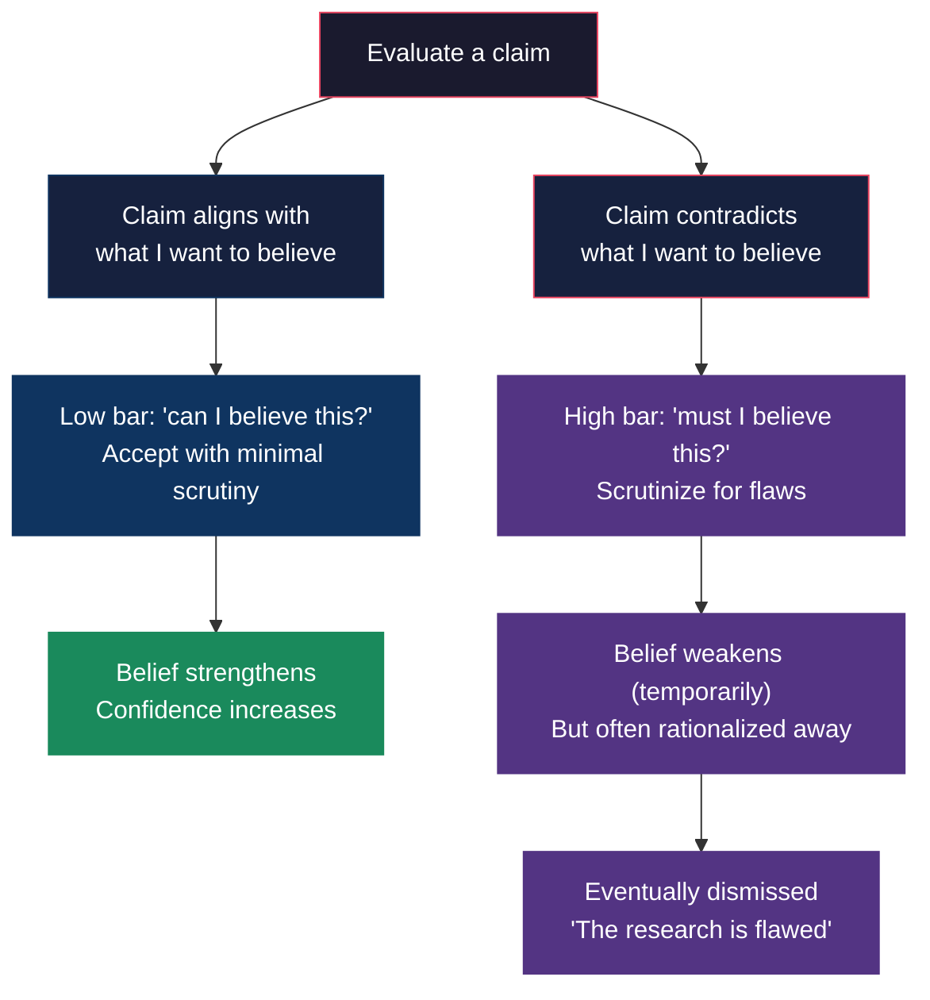
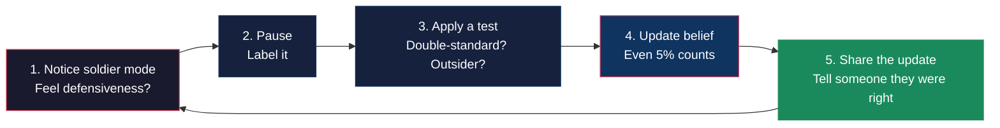

## 🎙️ Introduction

**Host**: Welcome back to *Rationally Speaking*. I'm your host, and today I'm joined by Dr. Elena Vasquez, a rationality trainer who has led workshops for CFAR and Good Judgment Project alumni. We're diving into Julia Galef's *The Scout Mindset* — a book that promises to help us see things more clearly by trading our "soldier" instincts for "scout" habits. Elena, let's start with the obvious question: is this just another "you're biased, here's a checklist" book, or is it something different?

**Elena**: It's genuinely different, and that's because Galef starts from the right diagnosis. The problem isn't that we don't *know* about confirmation bias or motivated reasoning. The problem is that knowing doesn't help. I've run workshops where people can recite the list of cognitive biases from memory — and then they go right back to rationalizing their political positions in the next session. Galef's insight is that the barrier is emotional, not intellectual.

**Host**: So what's her solution?

**Elena**: Two things. First, she reframes the goal. Instead of "be less biased" — which is a negative, shaming frame — she says "be a scout." A scout is someone who wants to draw an accurate map of reality. That's a positive identity, something to aspire to. Second, she gives concrete emotional skills: how to tolerate being wrong, how to separate your identity from your beliefs, how to treat confusion as a clue rather than a threat.

**Host**: Let's talk about that identity piece. Chapter 13 — "How Beliefs Become Identities" — that hit me hardest. The idea that I can't think clearly about something because it's *who I am*.

**Elena**: That's the core of the book. When a belief becomes part of your identity, contradictory evidence triggers the same neural response as a physical threat. You're not evaluating evidence anymore — you're defending yourself. The single highest-leverage move in the entire book is learning to hold identity lightly.

**Host**: How do you actually do that in practice?

**Elena**: You start with Galef's double-standard test. Pick a belief you feel strongly about and ask: "If the opposite were true, would I require more or less evidence to believe it?" If the answer is "more," you're defending an identity, not evaluating a proposition. Then you practice reframing: instead of "I'm a [label]," say "I currently hold the view that [position], but I expect to encounter evidence that will change my mind over time."

**Host**: That sounds like it could leave you unable to take a stand on anything.

**Elena**: That's the most common objection, and Galef addresses it directly. Scout mindset doesn't mean you can't hold convictions. It means you hold them probabilistically, with awareness of your uncertainty, and you update when the evidence warrants it. You can be 95% confident in a position and still be open to the 5% chance you're wrong. That's not weakness — it's epistemic honesty.

---

## 🧠 The Core Mechanism: Motivated Reasoning

**Host**: Let's go deeper into the psychology. Galef builds on Ziva Kunda's work on motivated reasoning. Can you explain what that research actually shows?

**Elena**: Kunda's 1990 paper is the reference point. She showed that when people are motivated to reach a particular conclusion, they access a different set of beliefs, rules, and knowledge structures than when they're motivated to be accurate. It's not that they're lying; it's that their cognitive machinery is being *directed* by their motivation. What's scary is that it doesn't feel like anything from the inside. It just feels like you're reasoning.

**Host**: And this is different from classic cognitive dissonance?

**Elena**: It's related but distinct. Dissonance theory (Festinger) says that holding two contradictory cognitions is uncomfortable, so we rationalize to reduce the discomfort. Motivated reasoning says that our reasoning is *biased from the start* by what we want to be true, not just after the fact. The soldier doesn't rationalize after being defeated — they march in the direction their motivation sends them.

**Host**: Galef uses the phrase "directionally motivated reasoning." What does that mean in practice?

**Elena**: Imagine you're evaluating a study about the effectiveness of a policy you support. If you're directionally motivated, you scrutinize the methodology more carefully when the results are negative than when they're positive. You find reasons to dismiss the negative study — small sample size, confounding variables, questionable measurement — while accepting the positive study at face value. The direction of your motivation determines where you aim your critical firepower.

---

## 💪 Practical Exercises

**Host**: Let's move to the practical side. What exercises from the book do you actually use with your workshop participants?

**Elena**: The calibration exercise is my go-to. I have people make 20 factual predictions with confidence levels, then score themselves. Almost everyone is overconfident. The experience of discovering that you're only right 60% of the time when you felt 90% sure — that creates a lasting impression.

**Host**: How long does that effect last?

**Elena**: That's the hard question. A single exercise creates a "wobble" — a moment of doubt about your own judgment. But wobbles fade. What creates lasting change is embedding the practice in your environment. That's why Galef emphasizes social accountability.

**Host**: She talks about finding scout-friendly communities. What does that look like practically?

**Elena**: You find people who will tell you hard truths. I have a friend — we call it our "scout pact" — we send each other the evidence that makes us uncomfortable about our own positions. When I change my mind about something, I tell him. When he changes his, he tells me. The social reward for updating is stronger than the emotional pain of being wrong, and that's the whole game.

**Host**: Galef also recommends betting markets and prediction platforms.

**Elena**: Absolutely. Betting markets are the ultimate scout technology. They force you to put money where your mouth is, and they give you immediate feedback when you're wrong. The Good Judgment Project showed that even a few hours of training on probabilistic thinking improved forecasting accuracy significantly. The training works because it changes the motivation: you're now trying to be *accurate*, not right.

---

## 🔄 Identity-Protective Cognition

**Host**: Let's talk about identity-protective cognition. The book helped me realize that I'm most irrational about the topics where I most identify with a group.

**Elena**: That's precisely the pattern. Dan Kahan's research at Yale showed that political ideology predicts how people interpret evidence about climate change, gun control, and vaccines much better than their numeracy or scientific literacy does. In fact, more numerate people were *more* polarized — they used their cognitive abilities to find reasons to dismiss evidence that threatened their identity.

**Host**: So intelligence makes it worse?

**Elena**: On identity-protective topics, yes. Because you're better at generating counter-arguments. That's the terrifying finding. If you want to predict who will be most biased on a politically charged topic, the best predictor is not "low intelligence" — it's high intelligence combined with strong group identity. Galef calls this a "soldier weapon" — a tool that helps you defend your beliefs more effectively.

**Host**: How do you break that cycle?

**Elena**: You can't break it from inside the identity. You have to step outside it. Galef's outsider test helps: imagine a neutral alien observing the same evidence — what would they conclude? Or the status quo test: if the current situation were reversed, would you be arguing for or against changing it? These mental moves create distance between you and your identity.

**Host**: That sounds exhausting to maintain all the time.

**Elena**: It is. And Galef doesn't say you should. She explicitly says scout mindset is a *tool*, not a permanent state. Sometimes you need soldier mode — when you're leading a team, when you need to act decisively, when morale depends on confidence. The skill is recognizing which mode you're in and being able to switch.

---

## 🚀 Cultivating Scout Mindset

**Host**: If a listener wants to start cultivating scout mindset tomorrow, what's the single most important thing they should do?

**Elena**: Start a "when I was wrong" journal. But it's not about recording what you got wrong — it's about recording *how it felt* and *what helped you see clearly*. That trains you to notice the emotional signals of soldier mode: defensiveness, irritation, the urge to dismiss. Learning to recognize those feelings as data — "oh, I'm in soldier mode right now" — is the foundation of everything else.

**Host**: And if they only read one chapter?

**Elena**: Chapter 14 — "Hold Your Identity Lightly." It's the most important idea in the book. Read it. Then take one belief that you've treated as central to who you are — your political affiliation, your professional identity, your moral stance on an issue — and practice holding it lightly for a week. Notice what changes.

**Host**: Last question. Is there a critique of the book you think readers should be aware of?

**Elena**: Yes. The book is aimed at individuals who *want* to think more clearly. But what about people who don't want to? What about situations where soldier mindset is reinforced by powerful social incentives — your tribe, your career, your relationships? The book doesn't have great answers there. It can help you become a better thinker, but it can't change the structures that reward you for being a soldier.

**Host**: That's a fair limit. Elena, thank you. For listeners: the book is *The Scout Mindset* by Julia Galef. Start with Chapter 14. Keep a journal. Find a scout partner. And remember: the goal is not to never have a soldier mindset — it's to be able to tell which one you're in.

**Elena**: And to have the courage to switch. Thanks for having me.

