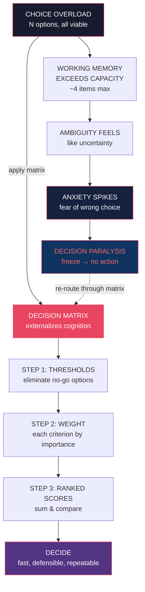
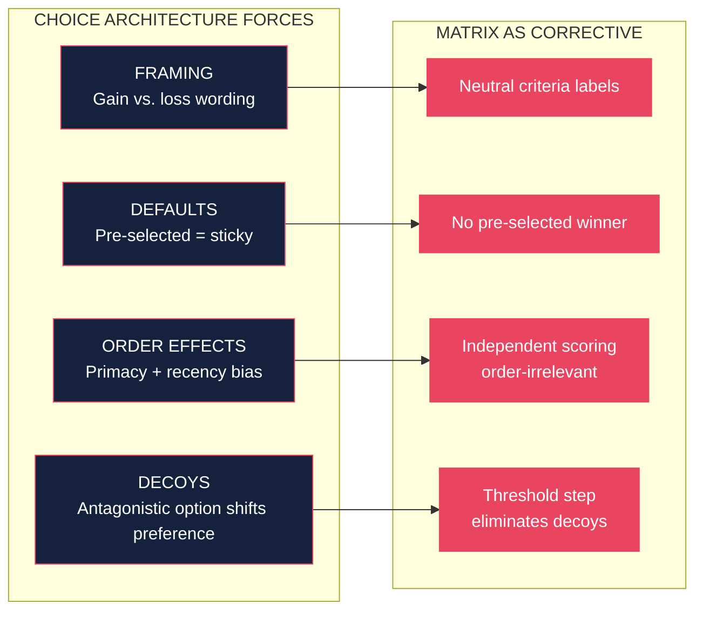
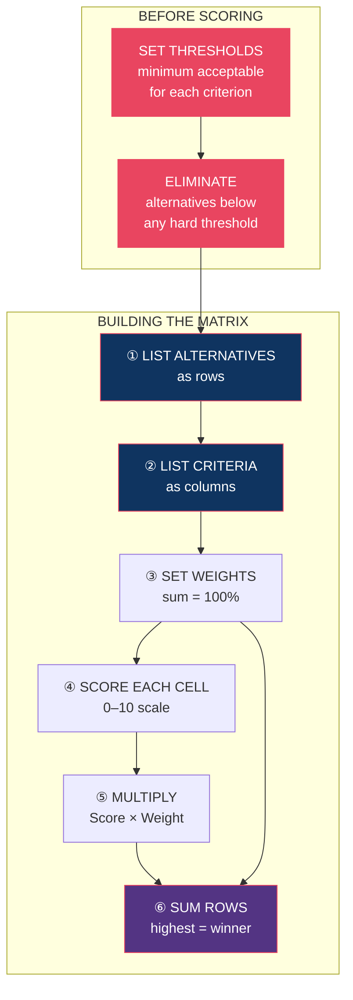
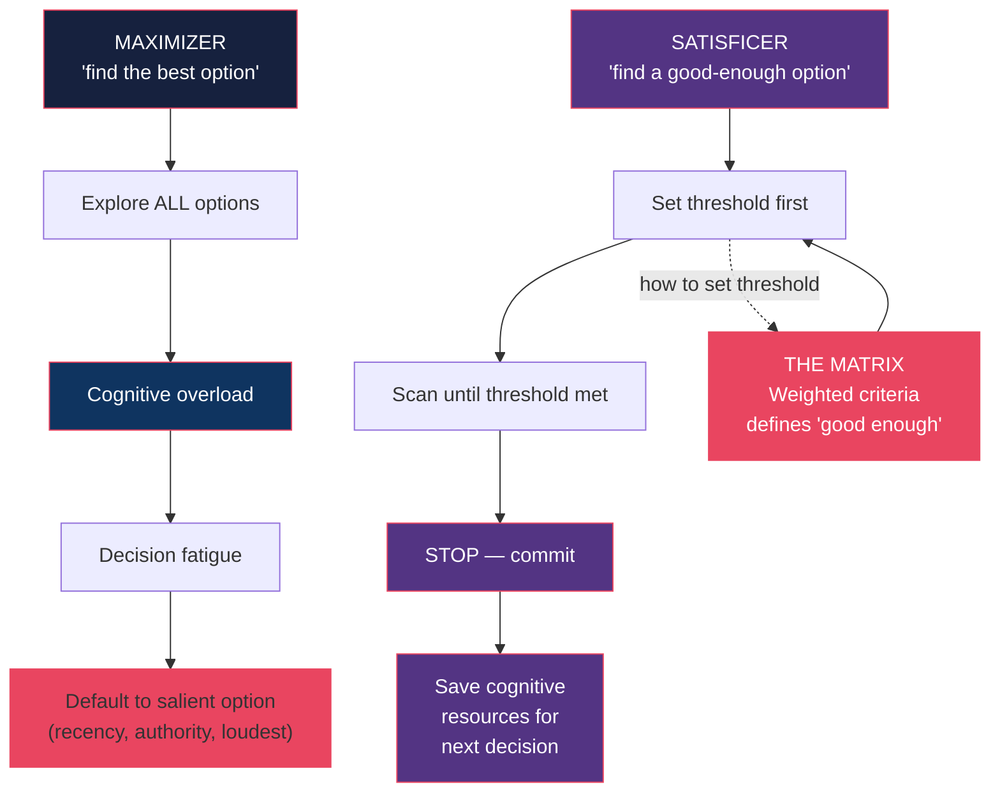
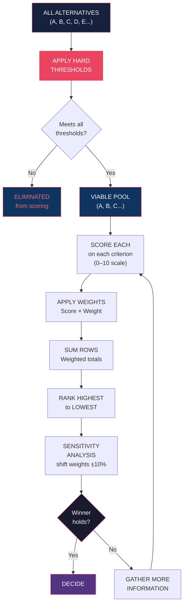
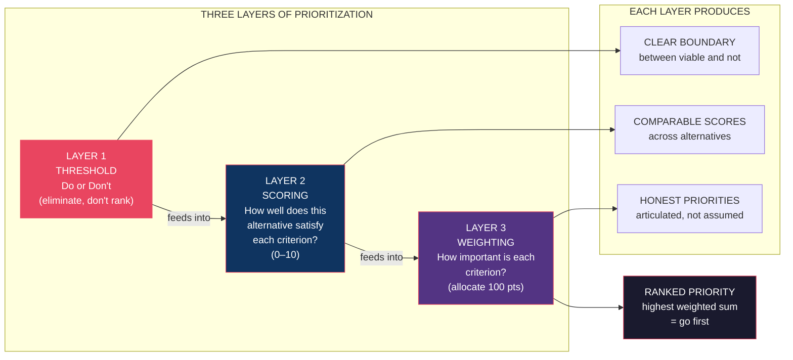
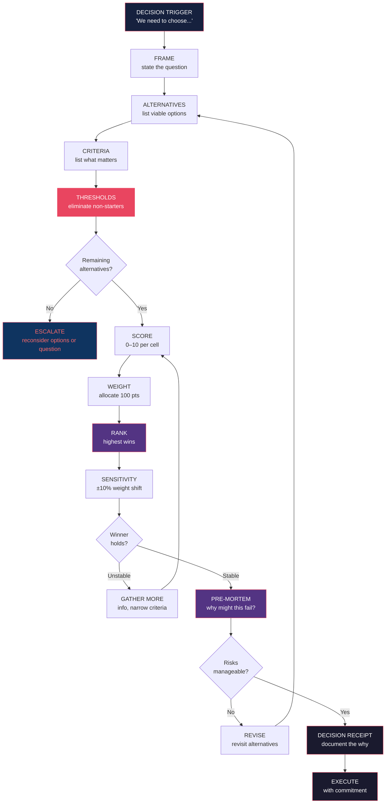

# Core Concepts — The Matrix Decision Making Framework

## 1. Decision Paralysis — The Architecture of Freeze

Decision paralysis occurs when a rational person cannot act despite having options available. The standard explanation is personal: "they couldn't make up their mind." Georgiy rejects this. Paralysis is **structural**.

The paralysis loop: too many options → criteria appear in conflict → working memory overload → anxiety spikes → people either freeze or default to the most salient option (recency, authority, loudest voice) — neither of which is the best outcome.

The diagram below maps the structural route from choice overload to a freeze state — and the exit point Georgiy proposes.



**Why the matrix breaks the loop**: A decision matrix is an external cognitive scaffold. Human working memory holds approximately 4 items in active focus. Twelve candidates, six criteria, and deadline pressure exceed this by an order of magnitude. The matrix stores the combinatorial complexity outside your head so you can reason about it rather than be overwhelmed by it.

**Real-world paralysis patterns:**

- **Hiring teams**: 6 interviewers, 3 finalists, 8 criteria, 24 hours to decide → nobody agrees, default to the person who spoke most recently.
- **Product prioritization**: 12 feature requests, 5 stakeholders, no agreed ranking → the thing the CEO mentioned last gets built.
- **Career choice**: 3 offers, 8 factors, 2 weeks to respond → analysis paralysis → accept the first offer out of fear.

**Georgiy's fix**: Build the matrix *before* the pressure, when cognition is cool. At decision time, only scoring and ranking remain — which the matrix makes fast and automatic.

---

## 2. Choice Architecture — How Options Are Framed Is the Decision

Choice architecture is the design of the decision environment — the way options are presented, sequenced, grouped, and named. Georgiy leads with this concept because it is the most underappreciated lever in decision-making.

Most people believe they evaluate options on their merits. Research shows they evaluate options as presented. Adding a "decoy" option changes what people pick. Changing the order of a list changes what feels most appealing. Making the default option "opt-out" vs. "opt-in" changes participation by 90%.

**The four forces of choice architecture:**

| Force | Effect on Decision | Matrix Correction |
|-------|-------------------|-------------------|
| Framing | Positively framed options feel better than identical negative ones | Criteria labels are neutral; scores are values, not narratives |
| Defaults | People stick with whatever is pre-selected | Matrix has no default — every option earns its score |
| Order effects | First and last options in a list are over-weighted | Randomize display order; scoring is the same regardless of position |
| Decoys | Adding a deliberately weak third option shifts preference to the "middle" option | Matrix eliminates decoy options during the threshold step |



**The practical implication**: If you are the one designing the decision process — as a manager, a hiring team lead, a founder — you are already a choice architect, whether you know it or not. Recognizing this changes everything. You are not "being objective"; you are shaping what gets chosen with every choice about how to present the options. The matrix is the accountable form of that shaping — everything is explicit, auditable, and traceable to the criteria you chose before you saw the candidates.

---

## 3. The Matrix Approach — Building the Decision Scaffold

The Decision Matrix is Georgiy's centerpiece tool. It is elegant in its simplicity: every cell is scored, every column is weighted, the highest total wins. But the simplicity is the point — the power comes from the discipline of building it correctly.

**Anatomy of a completed matrix:**

```
                 CAREER  CULTURE  COMP   GROWTH   TOTAL
                 Weight   30%    25%    20%     25%
Alternatives     (×100)   (×30)  (×25)  (×20)   (×25)
────────────────────────────────────────────────────────
Offer A – Startup 7    9       4      8            424
Offer B – Corp    8    7       8      5            395
Offer C – Freelance 5   8       3      9            382
```



**Scoring discipline**: Georgiy insists on independent scoring — each cell should be scored without reference to other cells or other criteria. Scoring in sequence ("we already gave her low marks for culture, so we'll be generous on technical skill") introduces anchoring bias and defeats the purpose of the matrix.

**Absence of evidence**: If a criterion cannot be evaluated for an alternative, record it explicitly as *unknown*, not as a default score. Unknown is a signal to gather more information, assign another evaluator, or reconsider whether that criterion is actually evaluable in this decision.

**When to use the matrix**: Georgiy recommends it for any decision with 3+ alternatives and 3+ criteria where the cost of a Wrong Decision exceeds one hour of matrix-building time. He explicitly warns against using it for trivial decisions (restaurant ordering, small daily choices) — the overhead is not worth it. The matrix is a tool, not a ritual.

---

## 4. Bounded Rationality — Know Your Limits, Design Around Them

Herbert Simon's bounded rationality is the philosophical backbone of the book: humans cannot optimize perfectly because optimization itself is computationally expensive. Given limited time, limited information, and limited cognitive capacity, the rational strategy is to *satisfice* — seek an option that meets a threshold of acceptability rather than maximize for the best possible outcome.

Georgiy's contribution is to operationalize satisficing. Most advice on bounded rationality ends at "don't push yourself too hard." Georgiy builds a system that makes satisficing the default.

**The three constraints every decision faces:**

```
        ┌──────────────────────────────┐
        │     BOUNDED RATIONALITY      │
        │      Three Hard Limits       │
        └─────────────┬────────────────┘
                      │
         ┌────────────┼────────────┐
         │            │            │
    ┌────▼───┐  ┌────▼───┐  ┌────▼────┐
    │ TIME   │  │INFO    │  │COGNITION│
    │LIMIT   │  │LIMIT   │  │ LIMIT   │
    │("when  │  │("what  │  │("4 chunks│
    │  must  │  │  do I  │  │ in working│
    │  I     │  │  know")│  │  memory")│
    │ decide")│  │        │  │         │
    └────────┘  └────────┘  └─────────┘
         │            │            │
         └────────────┼────────────┘
                      │
              ┌───────▼──────────┐
              │  SATISFICE       │
              │  (not maximize)  │
              │                  │
              │  "Good enough"   │
              │  above threshold │
              └──────────────────┘
```

**Bounded rationality violations to watch for:**

1. **The maximizer trap**: Insisting on exploring every option exhaustively, then running out of time and making a worse choice than a satisficer who stopped at the first good option.
2. **The intuition shortcut**: Defaulting to "what feels right" without mapping what "right" means in criteria terms — converting an implicit (and often biased) multi-criteria evaluation into an overt one.
3. **The escalation trap**: Spending more time trying to make a decision perfect rather than moving on — classic Sunk Cost applied to decision effort.



**How the matrix enforces satisficing**: The threshold step in the matrix is the satisficing mechanism. You are not asking "which option is best overall?" You are asking "which viable options meet the threshold, and among those, which scores highest?" This shifts the cognitive task from global optimization to threshold checking followed by local comparison — orders of magnitude easier for working memory.

**Practical tip**: When setting thresholds, Georgiy recommends using negative criteria — what would make you walk away from an option? — rather than positive goals. It is easier to say "if budget is over $50K, eliminate" than "budget should be low." Specific non-negotiables beat vague aspirations.

---

## 5. The Matrix Evaluation Framework — Step by Step

This is the operational core: the complete algorithm from alternatives list to decision. Georgiy presents this as a repeatable process, not a one-time tool.

**Phase 1: Frame**

Write the decision question in neutral, outcome-oriented language. "Which candidate to hire?" is worse than "Which candidate best satisfies [criteria] given [constraints]?" The frame determines the matrix's scope.

**Phase 2: List Alternatives**

Include all viable options. The temptation to add "wildcard" alternatives that aren't actually available wastes scoring time. Conversely, the temptation to omit a viable option because it seems hard to evaluate defeats the purpose. Be exhaustive within the real option set.

**Phase 3: List Criteria**

Every criterion should be:
- **Independent** (not redundant with another criterion)
- **Evaluable** (you can score all alternatives on it with available information)
- **Weightable** (you can distinguish its relative importance from others)

Georgiy's rule: if you can't write a one-sentence description of what "high score" means on a criterion, eliminate the criterion from this decision.

**Phase 4: Set Thresholds (Hard Filters)**

Before any scoring, identify criteria with hard minimums. Common examples: budget ceiling, minimum team size, regulatory compliance, deadline compatibility. Any alternative failing a hard threshold is eliminated, not scored.



**Phase 5: Assign Weights**

Weights express what the decision is actually optimizing for. This is where Georgiy's framework does its deepest work: forcing explicit priority-setting before scoring begins.

**Common weight mistakes:**
- Equal weights (everything matters equally = nothing matters) — easy but informative only for low-stakes decisions
- Over-weighting the most-evaluated criterion — you evaluated culture thoroughly, so it feels like it should matter more
- Over-weighting cost — cost is easy to measure, so it gets more attention than strategic factors
- Forgetting to sum to 100% — weights without a constraint drift toward arbitrariness

**Phase 6: Score, Multiply, Sum**

Score each cell 0–10. Multiply by the criterion weight. Sum each row. Rank. The highest total identifies the favored option.

**Phase 7: Sensitivity Analysis**

This is the step most decision-makers skip and Georgiy treats as mandatory. Shift each weight by ±10% and re-run the totals. If the winner changes, your decision is fragile — gather more discriminating information before committing. If the winner holds across reasonable weight variations, you have genuine signal.

**The Sensitivity Test Table:**

```
                  ±10% Weight Change
              ┌──────┬──────┬──────┐
              │ -10% │ Base │ +10% │
    Criteria  │ (low)│      │ (high)│
    ──────────┼──────┼──────┼──────┤
    Cost      │  B   │  A   │  A   │
    Culture   │  A   │  A   │  A   │
    Growth    │  A   │  A   │  A   │
    ──────────┼──────┼──────┼─────────────────────
              │ Base │      │      │
    Score     │ 424  │ 424  │ 420  │ ← A holds ✔
    B Score   │ 395  │ 395  │ 398  │
    C Score   │ 382  │ 382  │ 383  │
    ──────────┴──────┴──────┴──────┘
    Result: Winner is ROBUST. Decision is defensible.
```

---

## 6. Prioritizing Alternatives — From Long List to Decision

Most people approach prioritization backwards: score everything first, then try to decide which criteria matter. Georgiy flips this: decide what matters *before* you begin scoring. The prioritization process has three layers.

**Layer 1: Threshold (Do or Don't)**

Set hard minimums. An alternative that fails any threshold criterion is out. Period. No deflation, no managed expectations. This is the most important step and the one most teams skip because it feels "exclusionary" — but exclusion is the point. You cannot prioritize if you cannot eliminate.

**Layer 2: Scoring (How Well)**

For alternatives in the viable pool, score each criterion. Georgiy recommends highly structured scoring with rubrics: define what scores a 2, 5, and 8 on each criterion before evaluating any alternative. This inter-rater reliability step prevents the "mode of the evaluator" problem where different people score differently without agreeing on what the scale means.

**Layer 3: Weighting (How Much)**

Weights are set collectively when a team decides, individually when one person decides. Georgiy's weighting method: distribute 100 points across criteria. Everyone assigns points independently, then discuss only the criteria where the spread exceeds 15 points. This conversation surface is where hidden values emerge.



**Prioritization failures Georgiy addresses directly:**

1. **Recency bias**: The option mentioned most recently in discussion rank-orders highest. The matrix eliminates this because scoring happens after criteria are locked.
2. **Authority bias**: The most senior person's preference becomes the team's preference. The matrix makes decision arguments explicit and attributable to criteria, not people.
3. **The nodding dog**: Everyone agrees in the room; no one agrees honestly. The anonymous weighting step lets people disagree privately before the group converges publicly.
4. **The pareto illusion**: 80% of alternatives account for 20% of the discussion. The threshold step cuts this by eliminating irrelevant options before the group spends time on them.

---

## 7. Choice Overload — The Paradox of Too Many Options

Choice overload is the empirically documented effect that increasing the number of options beyond a threshold *reduces* decision quality, increases regret, and decreases follow-through. It is not a theory — it has been replicated in consumer behavior, healthcare (treatment options), and organizational decision-making.

**The Iyengar & Lepper jam study (2000):** Shoppers encountering 6 varieties of jam: 30% purchased. Shoppers encountering 24 varieties: 3% purchased. More options drove not better decisions but *no* decisions.

**Why overload destroys decisions:**

```
    DECISION QUALITY
         ▲
         │                        ╭──────╮
         │                   ╭────╯      ╰────╮
         │              ╭────╯                 ╰────╮
         │         ╭────╯                              ╰────╮
         │    ╭────╯                                        ╰────╮
    High │   │○                                              ○   │
         │   │                                                    │
         │   │                                                    │
    Low  │   │                                                    │
         │   └────────────────────────────────────────────────────┘
         │       2     6    12    20    30    50    100    options
         │
         │         (note: quality rises at low N,
         │          peaks 4–6 options, then falls)
```

**Overload produces three failure modes:**

| Failure Mode | How Overload Causes It | Matrix Corrective |
|-------------|----------------------|-------------------|
| Decision avoidance | Perceived cost of choosing exceeds value → no choice | Thresholds reduce set before scoring begins |
| Regret amplification | More options means more post-decision counterfactuals → "what if I picked..." | Prior commitment to criteria reduces counterfactual salience |
| Default selection | Overwhelmed → pick the pre-selected or noisiest option | Eliminate defaults; independent scoring prevents salience effects |
| Satisfaction drop | High-option environments produce lower satisfaction even with objectively good outcomes | Frames the decision around criteria to make chosen option feel evaluated, not reactive |

**The strategic implication**: Georgiy argues that most "broadening the funnel" advice — cast a wide net, consider more candidates, generate more ideas — is correct as exploration but wrong at selection. Exploration is for generating the option set. Selection requires reducing it. The matrix is a reduction tool, explicitly designed to shrink from N to 3 before scoring begins.

**Organizational design implication**: Decision meetings should be two-stage. Stage 1: expand (brainstorm, gather candidates, be inclusive). Stage 2: contract (apply thresholds, score, rank). Most organizations collapse these stages, using the same meeting to generate and narrow — producing overload exactly when people are tired and cognitive resources are depleted.

---

## 8. Structured Decision-Making — The Meta-Framework

A decision matrix is one tool in a broader structured decision-making system. Georgiy closes the content chapters by situating his framework within a family of complementary tools and showing how they compose.

**The decision quality stack:**

```
     ┌──────────────────────────────────────────────┐
     │         DECISION QUALITY STACK                │
     │         (Georgiy's meta-framework)            │
     ├──────────────────────────────────────────────┤
     │  LAYER 4: PRE-MORTEM                           │
     │  "Imagine we failed. Why?" → stress-test before │
     │  committing. Surfaces hidden risks.            │
     ├──────────────────────────────────────────────┤
     │  LAYER 3: SENSITIVITY ANALYSIS                │
     │  "Does the winner hold if weights shift?"       │
     │  Robustness check → decision confidence.        │
     ├──────────────────────────────────────────────┤
     │  LAYER 2: DECISION MATRIX                     │
     │  Score + Weight + Rank. Turns complex          │
     │  multi-criteria choice into a number.          │
     ├──────────────────────────────────────────────┤
     │  LAYER 1: THRESHOLDS                          │
     │  "What would make me walk away?" Hard           │
     │  filters applied before scoring begins.        │
     └──────────────────────────────────────────────┘
```

**Each layer serves a distinct function:**

| Layer | When to Use | What It Catches | Cost |
|-------|-------------|----------------|------|
| Thresholds | Always — before scoring | Wrong-options, non-starters | 15 min |
| Decision Matrix | 3+ alternatives, 3+ criteria | Subjective gut feel, inconsistency | 1–2 hours |
| Sensitivity Analysis | Medium/high stakes decisions | Fragile priorities, hidden conflicts | 30 min |
| Pre-mortem | High-stakes, irreversible decisions | Hidden risks, cascade failures | 15 min |

**Composing the system:** Use all four layers for a major strategic decision. Use threshold + matrix for routine team decisions. Use thresholds only for daily micro-decisions. The key is that the layers are nested and composable — you don't need all four for every decision, but each layer catches errors the layer below misses.

**The "decision receipt"**: Georgiy recommends writing a decision receipt after every non-trivial decision — a one-paragraph document listing: the alternatives considered, the criteria used, the weights assigned, the winner, and the reasoning. This serves as institutional memory and prevents the "we've had this argument five times" problem. Decision receipts turn organizational learning into organizational knowledge.



**Closing principle**: Georgiy's final thesis in the content chapters is that decision quality is not primarily a function of intelligence, experience, or willpower. It is a function of process design. Build good processes, and mediocre decision-makers produce good outcomes. Build no processes, and even smart people produce inconsistent, anxiety-driven outcomes. The matrix — and the stack of tools around it — is how you build that process.
