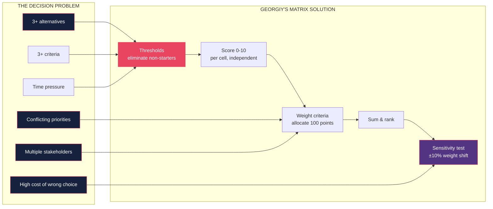

# The Matrix Decision Making Framework — The Podcast Episode

**Host**: Welcome back. Today we're talking about a book that asks a question most self-help books avoid: why, when faced with a list of perfectly good options, do we just… stop? Why does hiring take six months? Why do we swap tabs seventeen times before committing to a SaaS tool? Why do three job offers produce zero acceptances, not one good one? It's *The Matrix Decision Making Framework* by Georgiy S. And I have someone who has watched decision paralysis destroy meetings in real time. Priya, a product leader — welcome.

**Priya**: Thanks. I have so many stories.

**Host**: So Georgiy says paralysis is a process failure, not a personality failure. Walk me through what that means.

**Priya**: Most managers and founders I know have a theory of decision-making that is basically "be decisive." If your team is stuck, the manager gets louder, sets a deadline, or just makes the call unilaterally. That last one is common, and it works in the moment — but the team resents it, the decision gets re-litigated, and worst of all, the real problem reoccurs next time because nothing changed about how the decision was structured.

Georgiy says: you don't need a more decisive personality. You need a decision matrix. He's not being poetic — he's talking about a literal table. Rows are alternatives, columns are criteria, cells are scores, rows are weighted, highest total wins.

**Host**: That sounds… obvious. Why isn't everyone doing this?

**Priya**: Because there are about seven ways to do it wrong, and most people who try it without the full protocol do it wrong fast enough that they quit. Georgiy's version has two things most people miss.

**Marc**: Which are?

**Priya**: First: thresholds before scoring. Most people jump straight into scoring three job candidates or three project proposals. Georgiy says write down your non-negotiables first. Budget ceiling. Timeline constraint. Compliance requirement. Any alternative that fails a threshold — eliminated. Done. Not scored. Not ranked. Out. Everything before scoring is over, and the meeting is now about two or three candidates, not eight.

**Marc**: This is the insight that changed how I facilitate decisions. The threshold step is unglamorous. It feels bureaucratic. But it is where most bad decisions are made — because the team is discussing an option that should never have been in the room.

**Host**: And the second thing?

**Priya**: Sensitivity analysis. After you score and weight and rank, Georgiy says: now shift each criterion's weight by plus or minus ten percent and re-check whether the winner still wins. If the winner changes, your decision is fragile, and you need more information or a clearer priority. If the winner holds, you have signal, not noise. Most teams skip this step because it feels like math homework. It takes 20 minutes. It catches errors before they become commitments.

**Host**: Where would someone encounter this? Is this for hiring only?

**Priya**: Georgiy's example is hiring — it's the cleanest illustration — but he designed it for any decision with three or more alternatives and three or more criteria. Product prioritization, vendor selection, career choice, family decisions. Should my team go to conference A or B? Should we hire candidate X or Y? Should we adopt framework G or H?

**Host**: Georgiy names the problem — decision paralysis — and he names its opponent — bounded rationality. Help me understand bounded rationality in thirty seconds.

**Marc**: Herbert Simon said, basically, humans can't optimize perfectly. We have limited time, limited information, and limited working memory. So rational actors don't maximize — they satisfice. They look for an option that's good enough, then stop. Most decision advice celebrates maximizers — find the perfect option. Georgiy's entire framework is for people who realize they're bounded and want to satisfice well instead of just giving up.

**Host**: And the matrix makes satisficing a system.

**Priya**: Yes. And it's a system that survives social pressure. If you're the most junior person in a room and the CEO is pushing a candidate you think is wrong, having a matrix — with agreed-upon criteria, agreed-upon weights, documented scores — gives you something to point to. "Here's the score. Here's why it beat the other options." You're not arguing with the CEO. You're showing the decision the team already made together. That changes the power dynamic in hiring rooms.

**Host**: Which Georgiy seems very aware of. He talks about the matrix as a choice architecture intervention.

**Priya**: He spends the entire first chapter on choice architecture. The idea that the way you present options shapes what gets chosen — independent of the actual merits. You add a decoy option, and preference shifts. You put the CEO's preference first on the list, and it gets a higher score. The matrix is a deliberate, accountable choice architecture. Every step is explicit. You can audit it.

**Marc**: This is where the book becomes political in a good way. Informal decision-making is where informal power lives. The person who frames the question, names the options, nudges the criteria — they are shaping the outcome whether or not anyone notices. The matrix makes that shaping visible and shared. That's threatening to people who benefit from informal influence. You will get resistance. Georgiy should have written more about that.

---

**Host**: Let's push on the resistance point because I think that's where the book gets most interesting in practice. Organizations say they want better decisions but they also want to preserve the status of whoever is currently most influential. What happens when you introduce this framework into that environment?

**Priya**: You get what I call "matrix theater." The team builds a matrix, but the criteria are vague, the weights are negotiated after the scoring, and the winner was always going to be the CEO's preference. The process is real but the output is predetermined. This is a facilitation problem, not a framework problem. Georgiy gives you the tool. He doesn't give you a manual for fighting organizational politics.

**Marc**: And I'd add: this is not unique to Georgiy's framework. Any structured process surfaces power dynamics. What's distinctive about Georgiy's framework is that it makes the manipulation *legible*. If you see weights shift after the results come in, that's visible. In informal decision-making, the manipulation happens in private conversations. The matrix is a forcing function for transparency.

**Host**: So it's actually better as a political tool than as a decision tool in messy organizations?

**Priya**: No — it's better as both, eventually. The first few times you use it, the political processes contaminate it. The fifth or sixth time, the team has internalized "we set criteria before we see the options" as a norm, and it becomes self-reinforcing. The matrix becomes the institution's memory for how decisions were made. That institutional memory is the real payoff.

**Marc**: That's the underappreciated chapter. Georgiy talks about decision receipts — write down what you decided, why, how. That receipt becomes the answer to "why did we choose X six months ago" the next time someone asks. Institutional memory is the meta-skill here.

**Host**: Let me push on something that feels like the book's real blind spot. Georgiy is a research lead who studies choice architecture and decision paralysis. Everything in the book is for the person who knows the alternatives and knows the criteria. But the hardest decisions in life — should I leave my job? Should I start a company? Should I have a child? — are the ones where you don't know the criteria until you're in it. What does Georgiy say about that?

**Priya**: He acknowledges it, briefly. He says for criterion-emergent decisions — where the decision changes what the criteria even are — you need what he calls "exploratory framing" instead of the matrix. But he doesn't build that tool. He builds the matrix for the 80% of decisions that are structured: hiring, vendor selection, prioritization. The book's honest about that scope, but it's a real gap. The anxiety people feel about life decisions isn't solved by a matrix, and the book shouldn't pretend it is.

**Marc**: I'd also push on the pre-mortem. Georgiy recommends it — imagine the decision failed, why? — and includes it in the meta-framework. But he doesn't give it enough space. The pre-mortem is the most underused technique in organizational decision-making. Klein showed that prospective hindsight — simulating future failure — generates more identified risks than any other method. It takes ninety seconds. Most teams skip it. Georgiy should have made it mandatory, the way he makes sensitivity analysis mandatory.

**Host**: So the verdict?

**Priya**: If you're in product, management, consulting, or any role where you sit in decision meetings — read it. Apply the threshold step to your next prioritization meeting. Takes ten minutes. You will be shocked at how many options you eliminate instantly.

**Marc**: The value is in the protocol. Don't just read it. Actually use the four-layer process: threshold, score, weight, sensitivity. The full protocol transforms the quality of group decisions within a few uses.

**Priya**: And the meta-lesson: decision quality is under your control through process design, not personality. You don't have to be smarter or more decisive. You have to set up the decision environment so that a normal person makes a good choice. That's genuinely empowering.

**Host**: *The Matrix Decision Making Framework* by Georgiy S. Underrated, practical, and the kind of book that changes what happens in meeting rooms after you've read it.

**Priya**: That's the test, right? Does it change real behavior?

**Host**: This one does. Georgiy S., framework builder, not philosopher. If you participate in any group decision, this is your next read.

**Outro**: Thank you, Priya, thank you, Marc. If this episode made you think differently about the decisions you're facing right now, that counts as a win. We'll see you next week.
