```mermaid
graph TD
    subgraph COVER["THE MATRIX DECISION MAKING FRAMEWORK"]
        title["Georgiy S."]
        subtitle["A Structured System for<br/>Evaluating Alternatives<br/>Without Paralysis"]

        t1["DECISION PARALYSIS →<br/>process failure,<br/>not personality"]
        t2["CHOICE<br/>ARCHITECTURE"]
        t3["BOUNDED<br/>RATIONALITY"]
        t4["THE MATRIX<br/>FRAMEWORK"]
        t5["CHOICE<br/>OVERLOAD"]
        t6["SATISFICING<br/>PROTOCOL"]

        m["ALTERNATIVES × CRITERIA<br/>→ WEIGHT → SCORE → RANK"]
        arrow["✦ threshold → matrix → sensitivity → decide ✦"]
    end

    title --> subtitle
    subtitle --> t1
    t1 --> t2 --> t3 --> t4 --> m
    t4 --> t5 -.feedback.-> t1
    t3 --> t6 -.informs.-> t4
    m --> arrow

    style title fill:#0a0a1a,color:#e8e8e8,stroke:#e8e8e8,stroke-width:1px,font-size:18px
    style subtitle fill:#0a0a1a,color:#a0b4c8,stroke:#a0b4c8,stroke-width:1px,font-size:12px
    style t1 fill:#1a1a2e,color:#ff6b6b,stroke:#e94560,stroke-width:1.5px
    style t2 fill:#1a1a2e,color:#6bc5d0,stroke:#e94560,stroke-width:1.5px
    style t3 fill:#1a1a2e,color:#c9b1ff,stroke:#e94560,stroke-width:1.5px
    style t4 fill:#e94560,color:#ffffff,stroke:#ffffff,stroke-width:2px
    style t5 fill:#1a1a2e,color:#ffb347,stroke:#e94560,stroke-width:1.5px
    style t6 fill:#1a1a2e,color:#90ee90,stroke:#e94560,stroke-width:1.5px
    style m fill:#0f3460,color:#ffffff,stroke:#e94560,stroke-width:2px
    style arrow fill:#1a1a2e,color:#e8e8e8,stroke:#e8e8e8,stroke-width:1px
```

## Overview

*You are hiring. Three finalists. All qualified. The deadline is tomorrow morning. You have read every resume twice, conducted three rounds of interviews, collected twelve pages of notes — and you still cannot decide. File them all away. Priority A, Priority B, Priority C. An hour from now, Priority A looks different. You ask a colleague. She says "pick the one you feel best about." What does "feel best" mean when the metrics disagree?*

This is decision paralysis — and Georgiy S. argues it is not a failure of character. It is a failure of process. *The Matrix Decision Making Framework* is a tightly argued, practically oriented work by a research lead who spent years studying how high-performing organizations and individuals actually chose between difficult alternatives. The title is literal: Georgiy proposes a structured **matrix** — rows of alternatives, columns of weighted criteria, rows summed and compared — as the antidote to paralysis. It is not glamorous. It is not poetic. It works.

The book operates in the tradition of bounded rationality: Herbert Simon's observation that no human can optimize perfectly, so we must *satisfice* — find an option that meets our threshold. Georgiy extends this with an explicit framework for what "satisficing well" looks like when the options are numerous, the criteria conflict, and the stakes are non-trivial.

---
{}
------|-----------|-------------|
| Root cause of paralysis | Choice architecture | Paralysis is predictable when options outrank evaluation capacity |
| Core tool | The Decision Matrix | Annotate each alternative × each criterion → weighted score → ranked |
| Cognitive error | Bounded rationality violations | We either overthink (maximize) or underthink (default) — never satisfice well |
| Choice overload | The paradox of more options | Adding alternatives reduces decision quality, not increases it |
| Filtering | Threshold-first design | Set non-negotiable criteria before scoring — eliminate, don't rank |
| Prioritization | Weighted scoring + sensitivity | Weights reveal your true priorities; sensitivity analysis reveals fragility |
| Breaking ties | Decision rules | When scores are within noise, use tiebreaker heuristics — time, reversibility, regret |
| High-stakes mode | Matrix + pre-mortem | Simulate failure before committing; matrices survive stress tests |

---

## 10 Key Takeaways

1. **Decision paralysis is a systems problem, not a personality problem**: Georgiy's central argument is that people say "I can't decide" when no one gave them a process for deciding. The fix is structural — a pre-built matrix — not motivational.

2. **The Decision Matrix is your anti-paralysis tool**: List alternatives as rows. List criteria as columns. Score each cell. Weight the columns by importance. The row with the highest weighted sum is your best bet — not perfect, but defensible and fast.

3. **Set thresholds before you evaluate — not after**: Thresholds are the guardrails. If a candidate doesn't meet minimums on critical criteria (culture fit, budget, timeline), they are eliminated before scoring begins. This collapses the problem from "rank 12 options" to "rank 3 viable options."

4. **Choice overload is real and quantifiable**: Iyengar and Lepper's classic jam study (more options → fewer purchases) is not an anomaly — it is the default. The more alternatives you add without removing any, the worse every outcome gets. The matrix fights this by forcing you to bound the option set first.

5. **Bounded rationality demands satisfying, not maximizing**: Simon showed perfection is impossible given limited time, information, and cognition. Georgiy shows most "maximizers" — people who insist on the best option — have worse outcomes than "satisficers" who pick the first good-enough option after a cutoff.

6. **Your weights reveal your values — and your conflicts**: When you assign weights to criteria, you will discover hidden contradictions. "Career growth" and "family time" weighted equally produce no clear winner. This is not a bug — it is the point. The matrix makes your tradeoffs visible so you can own them.

7. **Sensitivity analysis is how you stress-test a decision**: What happens if you slightly re-weight cost vs. quality? If the winner changes, your decision is fragile and you need more information or a clearer priority. If the winner holds, you have genuine signal.

8. **When matrices tie, use pre-mortems, not coin flips**: Imagine it is six months post-decision and the outcome was bad. Why? The reason you identify in 90 seconds of pre-mortem storytelling tells you more than another hour of scoring. Coin flips forfeit the information a pre-mortem would extract.

9. **Decision fatigue is a process failure**: People make worse decisions late in the day not because willpower depletes, but because complex open-ended decisions consume cognitive resources. Pre-built matrices reduce the per-decision cost, preserving decision quality across your day.

10. **The best decision processes are repeatable**: Georgiy's final contribution is to show that the highest-ROI investment in organizational judgment is building decision infrastructure — matrices, checklists, threshold criteria — that work for the tenth decision as well as the first.

---

---

## Who Should Read

| Read this | Skip this |
|-----------|-----------|
| Anyone facing repeated non-trivial decisions at work | Readers seeking deep philosophical treatments of free will |
| Managers hiring, promoting, or prioritizing projects | People who prefer narrative case studies over structured frameworks |
| Founders and executives choosing between strategic alternatives | Readers allergic to tables and scoring systems |
| Decision science fans (Kahneman, Thaler, Ariely) | Anyone who believes "gut feel" should not be systematized |
| Productivity enthusiasts looking for practical tools | Those who confuse paralysis with careful thinking |
| Teams designing decision-making processes | People who want self-help platitudes, not systems |

---

## Core Themes

**Decision Paralysis as Architecture Failure**: The book's most distinctive move is to treat paralysis not as an individual failing but as a predictable structural outcome. When options are abundant, criteria are conflicting, and no process exists to navigate the tension, rational people freeze. The solution is not better thinking — it is a better system.

**Choice Architecture Shapes Choice**: Drawing on Thaler and Sunstein, Georgiy shows that the way alternatives are presented — framed, sequenced, grouped — directly determines what gets chosen and whether the chooser trusts the outcome. A matrix is an architectural intervention: it reshapes the decision environment before any scoring happens.

**Bounded Rationality Formalized**: Herbert Simon's "satisficing" is usually cited but rarely operationalized. Georgiy makes it actionable: set a threshold, score above threshold, pick the best above threshold. The threshold *is* the bound. The scoring *is* the satisficing mechanism. This transforms a philosophical position into an executable process.

**The Matrix as a Cognitive Scaffold**: Decision matrices serve as external working memory. The human prefrontal cortex can hold only ~4 items in active consideration. A matrix stores dozens of options and criteria without consuming working memory. The matrix is not a recording of what you already know — it is a tool that lets you think about decisions you could not otherwise hold.

**Prioritization Through Forced Tradeoffs**: When you list criteria but do not weight them, you have described the decision, not resolved it. Weights force tradeoffs: is budget 30% or 70% of the decision? This confrontation is uncomfortable but clarifying. The matrix does not eliminate value conflicts — it makes them tractable.

---

## Why It Matters

Decision science has spent decades cataloging how humans *fail* at choosing — Kahneman and Tversky's heuristics and biases, Ariely's irrationality experiments, Thaler's nudges. These are essential, but they are primarily descriptive: they explain why decisions go wrong. Georgiy's contribution is operational: he builds a tool that makes the descriptive insights practically actionable.

The gap this book fills is real. Management literature is full of strategic frameworks (SWOT, Porter's Five Forces, RICE scoring), but almost none treat "I just can't choose between these specific candidates/options" as a tractable first-class problem. Georgiy does. The decision matrix is simple enough that any individual can deploy it in an hour, specific enough that the output is defensible to stakeholders, and structured enough that the process survives high pressure.

The book also matters for a subtler reason: it reclaims bounded rationality from the status quo of accepting "good enough." Georgiy argues that most satisficing advice stops at "lower your standards." His framing says: lower your standards *strategically* — set them based on criteria, weight them by impact, and build a system that makes the "good enough" choice automatic rather than willpower-dependent.

---

## Related Books

| Book | Author | How It Connects |
|------|--------|-----------------|
| **Algorithms to Live By** | Brian Christian & Griffiths | Uses computer science for everyday decisions; the "overfitting" and "relaxation" chapters overlap directly |
| **Thinking, Fast and Slow** | Daniel Kahneman | The descriptive foundation: why we get decision architecture wrong in the first place |
| **Predictably Irrational** | Dan Ariely | How framing distorts choice; Georgiy's matrices are structural correctives to Ariely's documented failures |
| **Nudge** | Richard Thaler & Cass Sunstein | Choice architecture theory; Georgiy's matrix is a specific "choice architecture" tool |
| **Poor Charlie's Almanack** | Charlie Munger | Mental models and decision checklists; the matrix is a formal mental model in practice |
| **Superforecasting** | Philip Tetlock | Structured probability judgment; Georgiy's weighted scoring generalizes Tetlock's forecasting tables |
| **The Undoing Project** | Michael Lewis | Kahneman-Tversky biography; the historical context for why Georgiy's framework is needed |
| **How We Decide** | Jonah Lehrer | Neuroscience of choice; useful contrast with Georgiy's rational-process approach |
| **Good Strategy Bad Strategy** | Richard Rumelt | Strategic diagnosis and guiding policies; meta-level complement to Georgiy's tactical framework |

---

## Final Verdict

**Rating: 7.5/10**

*The Matrix Decision Making Framework* is a focused, no-waste book that delivers exactly what it promises: a repeatable tool for the most common decision failure mode — paralysis in the face of too many viable options. Georgiy's writing is sharp, direct, and never editorializes where a table would do.

**What it does best**: makes bounded rationality actionable by building a process around it rather than celebrating it as a philosophy. The matrix chapter alone is worth the read — it is the clearest, most implementable multi-criteria decision framework in the popular decision-science canon. The sensitivity analysis section is particularly strong: it teaches readers to test their decisions against weight shifts, which is the single most underused technique in personal decision-making.

**Where it falls short**: the book is narrow. It handles well-defined multi-alternative problems (hiring, vendor selection, project prioritization) excellently but gives relatively little guidance for the messier, single-alternative, high-ambiguity decisions (the ones where the matrix is hardest to build because you don't know all the criteria). Georgiy acknowledges this but doesn't fully resolve it. Some organizational readers may also find the early chapters on individual decision-making less relevant — the framework is equally useful for teams, but the book spends less time on facilitation than on personal use.

**Bottom line**: If you have ever stared at a spreadsheet of candidates or project proposals and felt your working memory overflow, this book gives you the tool that fixes the problem. Build the matrix. Set thresholds. Weight criteria. Rank. Decide. The framework works because it externalizes cognition, forces tradeoffs, and makes the decision before the anxiety can. Georgiy doesn't solve all decisions. He solves the ones that cause the most paralysis — and those are the ones that matter most.
