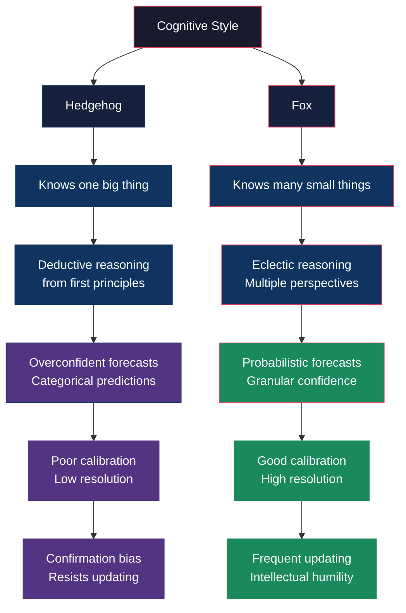
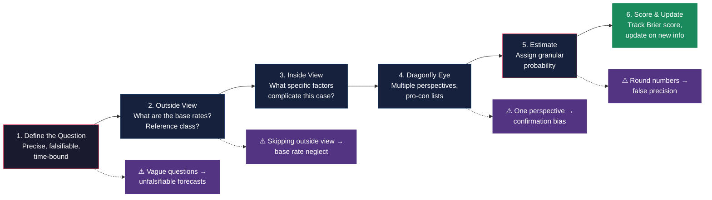

# Core Concepts

## Fox vs Hedgehog

Isaiah Berlin's 1953 essay "The Hedgehog and the Fox" — drawing from the
ancient Greek poet Archilochus ("the fox knows many things, but the hedgehog
knows one big thing") — provides the organizing metaphor for Tetlock's
analysis of cognitive style. In *Expert Political Judgment* (2005), Tetlock
applied this framework to 284 experts over 20 years and found that cognitive
style predicted forecasting accuracy far better than expertise, credentials,
or ideology.

| Dimension | **Hedgehog** | **Fox** |
|-----------|-------------|---------|
| Core belief | One Big Idea explains everything | Many forces interact; no single framework suffices |
| Cognitive style | Deductive, top-down | Eclectic, bottom-up |
| Reaction to disconfirming evidence | Discounts or reinterprets it | Updates incrementally |
| Forecast expression | Certain, categorical ("will happen") | Probabilistic ("65% likely") |
| Self-assessment | Overconfident | Calibrated |
| Preferred domains | Kind environments with clear rules | Wicked environments with ambiguity |
| Accuracy | Poor — especially in long-term forecasts | Good — sustained across time horizons |
| Vulnerability | Cognitive entrenchment, confirmation bias | Paralysis by analysis (rare) |

The key finding: **foxes beat hedgehogs on both calibration and resolution**
across every time horizon and topic domain. Hedgehogs sometimes make
spectacular correct calls — but their overall track record is worse, and
their spectacular misses (Iraq WMD, the "End of History") are catastrophic.

---

## The Forecasting Process

Superforecasters follow a structured mental process that can be broken into
distinct steps, each contributing to accuracy:

---

## Inside View vs Outside View

This distinction, drawn from Kahneman and Tversky, is the single most
powerful practical tool in the book.

| | **Inside View** | **Outside View** |
|---|---|---|
| Starting point | The specific case: its details, actors, and context | The reference class: what happens in similar situations |
| Thinking mode | Narrative, case-based | Statistical, distribution-based |
| Natural to | Everyone (default cognitive mode) | Almost no one (requires deliberate effort) |
| Key question | "What makes this case special?" | "How often do cases like this turn out that way?" |
| Risk | Overconfidence, base rate neglect | Underestimating unique factors |
| Superforecaster use | Second step, after outside view | Always first step |

**Example**: Asked whether a new authoritarian regime will fall within 2
years, the inside view examines the regime's specific vulnerabilities,
opposition strength, and recent protests. The outside view asks: what
percentage of authoritarian regimes fall within 2 years of taking power?
The base rate is roughly 15%. That becomes the anchor, adjusted up or
down based on case-specific factors.

---

## Base Rates and Reference Class Forecasting

Superforecasters relentlessly seek base rates. A base rate is simply the
relative frequency of an event in a relevant reference class. If 30% of
ceasefires in civil wars break down within 6 months, the base rate for a
new ceasefire is 30%.

**Finding the right reference class** is the skill. Too narrow and you
have no data. Too broad and the base rate is meaningless. Superforecasters
iterate: start broad, then narrow as they identify the most relevant
comparison set.

Reference class forecasting can be applied to virtually any domain:
- **Business**: What percentage of new startups in this sector succeed?
- **Politics**: How often do incumbents win re-election under these economic
  conditions?
- **Personal**: What is the base rate for completing a career change at age
  40?
- **Medicine**: What is the base rate for this diagnosis given these symptoms?

The outside view transforms forecasting from a guessing game into an
exercise in statistical reasoning.

---

## Bayesian Updating

Superforecasters think like Bayesians — even if they don't use the formula
explicitly. They start with a prior probability (often derived from the
base rate), then update incrementally as new evidence arrives.

**The Bayesian mindset in practice**:
- Before new evidence: assign a prior probability
- Evaluate new evidence for its diagnosticity (how much should it move the
  needle?)
- Update the probability accordingly — not to an extreme, but proportionally
- Repeat as each new piece of evidence arrives

**Common mistake**: treating new evidence as either decisive or irrelevant.
Superforecasters learn to assess the *weight* of evidence and adjust in
proportion. A small update (50% → 55%) is often more rational than a
dramatic revision (50% → 80%) in response to a single data point.

The Good Judgment Project found that superforecasters updated more
frequently and in smaller increments than average forecasters — they
didn't wait for "enough evidence" to change their minds.

---

## Granular Probabilities

Superforecasters avoid categorical language ("will happen," "unlikely")
and instead use the full 0-100% probability spectrum. This practice has
three benefits:

1. **Forces calibration**: You can't say "85%" without thinking about what
   85% means. It requires you to distinguish between "pretty confident"
   and "very confident" with numerical precision.

2. **Enables scoring**: Only numerical probabilities can be scored with
   proper scoring rules (Brier score). Verbal probabilities are unfalsifiable.

3. **Resists overconfidence**: Translating "I'm pretty sure" into "70%"
   is sobering. It exposes the gap between felt confidence and actual
   accuracy.

**The Brier Score** measures forecasting accuracy as the mean squared error
between predicted probabilities and actual outcomes. A score of 0 is perfect;
0.25 is chance; 0.5 means you're worse than random. Superforecasters
consistently achieved Brier scores below 0.20.

---

## Frequent Updating

One of Tetlock's most striking findings: superforecasters update their
forecasts nearly twice as often as average forecasters. They don't get
emotionally attached to a position. When new information arrives, they
recalibrate.

**Why this is hard**: Frequent updating requires admitting you were wrong
in small ways repeatedly. It threatens ego. Most people respond to
disconfirming evidence by reinterpreting it or waiting for "overwhelming"
proof. By then, the anchoring bias has set in, and full correction is rare.

**The superforecaster habit**: When a new piece of data shifts their
estimate by 5-10%, they update immediately — not because the evidence is
conclusive, but because Bayesian rationality requires it. They treat each
update as a small course correction, not a humiliating reversal.

---

## Team Forecasting and Aggregation

The Good Judgment Project found that groups consistently outperform
individuals — but only when structured correctly.

**The extremizing algorithm**: When team members' independent forecasts
were averaged, the aggregate was more accurate than the typical member.
An extremizing function then amplified the average when members agreed
strongly: if the average was 70%, the extremized estimate might be 80%.
If it was 55%, the extremized estimate might stay near 55%. This
mathematically exploits the signal in consensus while damping noise.

**Key conditions for team success**:
- **Independent judgment first**: Members estimate before discussing —
  otherwise groupthink dominates
- **Diverse perspectives**: Fox-like teams outperformed hedgehog teams
- **Accountability**: Members see their tracked scores and know they'll
  be compared
- **Psychological safety**: The best teams had norms encouraging
  disagreement

---

## The Good Judgment Project Methodology

The GJP was Tetlock's entry in IARPA's ACE tournament (2011-2015). It
involved:

1. **Recruitment**: ~20,000 volunteers recruited through online ads and
   networks of retirees, analysts, students, and enthusiasts
2. **Training**: A 1-hour online tutorial covering probabilistic thinking,
   base rates, the outside view, and cognitive biases
3. **Selection**: The top 2% of forecasters identified through Brier
   scores over the first year were designated superforecasters
4. **Team formation**: Superforecasters were grouped into collaborative
   teams with shared workspaces and discussion forums
5. **Sustained outperformance**: Superforecasters maintained their edge
   over all four years, consistently beating the competition (including
   intelligence community analysts with classified data)

GJP's success came from combining **training** (teachable skills),
**selection** (finding those with the right cognitive style), and
**team structure** (aggregation and accountability).

---

## Cognitive Styles of Superforecasters

Through personality testing and behavioral observation, Tetlock identified
the traits that distinguish superforecasters:

| Trait | Description | Why It Matters |
|-------|-------------|----------------|
| **Active open-mindedness** | Genuinely considers opposing views | Prevents confirmation bias |
| **Cognitive humility** | Acknowledges limits of own knowledge | Enables frequent updating |
| **Numeracy** | Comfort with numbers and probabilities | Necessary for granular estimation |
| **Curiosity** | Wants to understand how things work | Drives search for base rates |
| **Growth mindset** | Believes forecasting skill can improve | Sustains effort through failure |
| **Perspective-taking** | Can adopt others' viewpoints | Enables dragonfly eye approach |
| **Disciplined attention** | Focuses on the question without drift | Reduces noise in estimates |
| **Detachment from ego** | Cares about accuracy, not being right | Makes updating psychologically safe |

Notably absent: domain expertise, IQ (beyond a modest threshold), and
ideological commitment. Superforecasters come from all backgrounds and
political persuasions.

---

## The Ten Commandments for Aspiring Superforecasters

The Good Judgment Project distilled its findings into a practical code:

1. **Triage**: Focus on questions where forecasting is possible. Some
   questions are fundamentally unpredictable — don't waste effort.
2. **Break seemingly intractable problems into tractable sub-problems**.
   Decompose.
3. **Strike the right balance between inside and outside views**.
   Outside view first, always.
4. **Strike the right balance between under- and over-reacting to
   evidence**. Bayesian updating is the tool.
5. **Look for the clashing causal forces at work in each problem**.
   Dragonfly eye.
6. **Strive to distinguish as many degrees of doubt as the problem
   permits**. Be granular.
7. **Strike the right balance between confidence in your judgment
   and willingness to change it**. Attach to calibration, not positions.
8. **Identify and challenge your own sources of wishful thinking,
   fear, and other biases**. Self-criticality is the engine of improvement.
9. **Be precise about what you mean by the words you use**.
   Operational definitions prevent ambiguous forecasts.
10. **Use the language of probability**. "65%" not "likely."

---

## Key Lessons

1. **Forecasting accuracy is measurable, improvable, and uncorrelated
   with credentials.** Expertise does not imply predictive skill.
2. **The single best shortcut to better forecasts is the outside view.**
   Base rates trump case knowledge.
3. **Thinking in probabilities is a habit, not a gift.** It can be
   trained in an hour and refined over years.
4. **The best forecasters update most frequently.** Ego attachment to
   past predictions is the enemy of accuracy.
5. **Diverse teams beat brilliant individuals.** Aggregation of
   independent judgments amplifies signal and reduces noise.
6. **Humility is not epistemic weakness — it is a prerequisite for
   learning.** Superforecasters treat errors as data.
7. **The goal is not to predict everything — it is to be well-calibrated
   about what you can predict and honest about what you cannot.**

---

## Practical Applications

**For Individuals**: Start a prediction journal. Record one probability
forecast per day on something that will resolve within a month. Track your
Brier score. The act of quantifying uncertainty and scoring the result is
itself a training method.

**For Organizations**: Create structured forecasting processes. Require
numerical probabilities in all strategic assessments. Build teams of diverse
thinkers and aggregate their judgments. Track calibration over time.

**For Leaders**: When receiving a forecast, ask: "What is your base rate?
What would make you update that estimate? What is your track record?" The
questions alone improve the quality of judgment you receive.

**For Analysts and Strategists**: Formalize the outside view as the first
step in every assessment. Before analyzing the specific case, research the
reference class. This single rule will improve accuracy more than any other
change.

**For Citizens**: When consuming news and expert commentary, ask: "What is
this person's track record? Are they speaking in probabilities or
certainties? Have they changed their mind recently?" This inoculates
against overconfident punditry.

---

## Action Plan

1. **Start tracking forecasts today.** Pick 3-5 questions per week from
   current events. Assign a probability and a resolution date. Record
   your reasoning. Score yourself when the outcome is known.

2. **Practice the outside view.** For every decision or prediction,
   first ask: what happens in similar situations? Research the base rate
   before considering the details of your specific case.

3. **Use the full probability scale.** Eliminate words like "likely" and
   "unlikely" from your predictions. Force yourself to pick a number.

4. **Set an updating rule.** When new evidence would shift your estimate
   by 10% or more, update immediately. Don't wait for certainty.

5. **Join or form a forecasting team.** Share predictions with others.
   Compare your Brier scores. Disagree productively. The social
   accountability alone improves accuracy.

6. **Debrief every mistake.** When a forecast is wrong, don't move on.
   Ask: was it bad luck or bad process? What base rate did I miss?
   What would I do differently next time?

7. **Read broadly outside your domain.** Superforecasters are
   intellectually omnivorous. The more mental models you have, the more
   reference classes you can draw on.

8. **Practice intellectual honesty.** The moment you feel yourself
   defending a forecast instead of evaluating it, you've lost
   calibration. Step back and recenter on accuracy as the goal.
