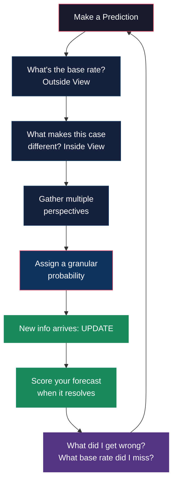

## 🎙️ Introduction

**Alex**: So we're both former Good Judgment Project participants. I joined
in 2012, year two of the tournament. You were in from the start in 2011.

**Maya**: Yeah. I saw an ad on a rationality forum — "wanted: people to
predict world events." I thought it would be a fun hobby. I had no idea it
would fundamentally change how I think.

**Alex**: Same. I mean, I was a grad student in public policy. I thought I
understood how the world worked. The GJP disabused me of that pretty
quickly.

**Maya**: Let's start with what people usually ask us: can anyone become a
superforecaster? The book says yes. Do we agree?

**Alex**: Mostly yes, with a big caveat. The Good Judgment Project showed
that a 1-hour training session improved average forecasting accuracy by
about 10%. That's real. Anyone can learn to think more probabilistically,
use base rates, update more frequently. These are teachable skills.

**Maya**: But the top 2% — the superforecasters — they had something extra.
It wasn't IQ. It wasn't domain expertise. It was a cluster of personality
traits: active open-mindedness, intellectual humility, a genuine appetite
for being wrong.

**Alex**: Right. Tetlock calls it a "growth mindset" for judgment. The
superforecasters I met weren't necessarily smarter than the average
forecaster. They were just much more willing to admit mistakes and learn
from them. That's trainable in theory, but in practice it's hard.

**Maya**: Let's talk about the single most useful technique from the book.

**Alex**: For me, it's the outside view. Before analyzing any specific case,
ask: what's the base rate? What happens in similar situations? It's so
simple. And almost nobody does it naturally.

**Maya**: The inside view is our default. We're narrative creatures. We
want to tell a story about why *this* case is different. The outside view
is boring — it's just statistics. But it works.

**Alex**: I remember when I first learned about reference class forecasting.
I was forecasting whether a particular rebel group would sign a peace deal
within 6 months. I had all these detailed reasons why they would — the
leader was pragmatic, international pressure was mounting, etc. Then I
checked the base rate: what percentage of rebel groups in similar
conflicts sign peace deals? It was about 22%. I adjusted my 80% down to
35%. The deal didn't happen.

**Maya**: That's the dragonfly eye approach the book talks about. Looking
at the problem from multiple angles. The inside view, the outside view,
what experts on all sides say, what the numbers say. Superforecasters
synthesize all of these.

---

---

## 🎙️ The Hedgehog Trap

**Maya**: The hardest thing for me was learning to distinguish between
hedgehog and fox thinking — and recognizing how much hedgehog I had in me.

**Alex**: The hedgehog knows one big thing. Every problem gets filtered
through that single lens. For political ideologues, it's "markets solve
everything" or "government is the answer." For academics, it's "my theory
explains it all."

**Maya**: The book describes hedgehogs as being more confident and less
accurate. And here's the kicker: hedgehogs' worst forecasts were on their
own topics of expertise. The more they knew, the more wrong they were.

**Alex**: Because they overfit. They have so much detailed knowledge that
they construct elaborate narratives — and narrative coherence feels like
truth. A fox, by contrast, has less invested in any single story. If the
data changes, the fox changes.

**Maya**: The most humbling moment in the tournament for me was when I
compared my forecasts on topics I knew well versus topics I knew nothing
about. I was barely more accurate on my "expertise" topics. The base rate
technique helped more than my domain knowledge.

**Alex**: That's exactly Tetlock's finding. And it's why the book's message
is so threatening to pundits and talking heads. Expertise makes you better
at explaining the past. It does not make you better at predicting the
future.

---

## 🎙️ The Inside/Outside View in Practice

**Alex**: Let me walk through how I actually use the inside/outside view
now. I was recently asked: will this startup I'm watching be acquired
within 2 years?

**Maya**: Okay. Walk me through it.

**Alex**: Outside view first. I looked up the base rate: what percentage
of VC-funded startups in this sector get acquired within 2 years? About
15% for their stage and sector. That's my anchor.

**Maya**: So you started at 15%, not your gut feeling.

**Alex**: Exactly. Then I looked at the inside view — things that make this
case different. Strong founding team, hot sector, recent revenue growth.
Each factor adjusted the probability upward a few points. But I didn't let
the inside view dominate. I ended at 25%. Without the outside view, I
probably would have said 60-70%.

**Maya**: And how did it resolve?

**Alex**: They weren't acquired. But here's the thing: my 25% was a better
forecast than the 70% I would have given without the outside view. I was
well-calibrated. The event didn't happen — that doesn't mean my forecast
was wrong. 25% means "it probably won't happen, but it's possible."

**Maya**: That's the hardest lesson for most people. A 25% forecast that
doesn't happen is a *good* forecast, if 25% of similar events don't happen.
But most people think "I was wrong" if the event didn't occur.

---

## 🎙️ Team Forecasting

**Maya**: The other thing that transformed my thinking was team forecasting.
I was placed in a group with five other superforecasters. We had a shared
forum, and we'd debate our estimates before submitting.

**Alex**: Did you find the extremizing algorithm worked?

**Maya**: Surprisingly well. The average of our independent estimates was
almost always better than any individual's. But the key word is
*independent*. If we discussed first and then estimated, groupthink
crept in. The process was: estimate independently, share, debate,
re-estimate independently, then average.

**Alex**: The book emphasizes that too. Aggregation only works if the
estimates are truly independent. Once you share reasons, the independence
erodes. But the debate is still valuable because it surfaces information
people hadn't considered — it's just that the final estimate should be
independent.

**Maya**: The extremizing algorithm was fascinating. If all six of us
estimated between 60-70%, the average was 65%. But the algorithm would
push it to 75% — because high agreement amplifies confidence. If our
estimates were spread from 30% to 70%, the average might be 50%, and the
algorithm would keep it near 50% — no amplification.

**Alex**: It's like a mathematical implementation of wisdom of crowds. The
more agreement, the more signal. More disagreement, more noise.

---

## 🎙️ The Limits

**Alex**: Let's be honest about where the book falls short. The biggest
problem: the Good Judgment Project tested forecasters on questions someone
else chose. The hardest part of real-world forecasting is deciding what
to forecast.

**Maya**: That's Taleb's black swan critique, and it's valid. Nobody in
the GJP predicted the Arab Spring — not because they couldn't, but because
nobody asked them to. The questions were about whether Assad would still
be in power in 6 months, not "will there be a wave of protests across the
Middle East?"

**Alex**: Superforecasters are good at answering questions within a defined
frame. But the most dangerous uncertainty is the stuff you're not even
thinking about.

**Maya**: The book acknowledges this — there's a whole chapter on limits.
Tetlock says the first of the Ten Commandments is "triage": don't forecast
what can't be forecasted. But triage itself is a skill the GJP didn't
really test.

**Alex**: The other limit is that most real-world forecasting happens in
organizations with politics. If your boss wants a confident yes/no answer,
and you give a probabilistic "65% likely," you look indecisive. The
incentives are against good forecasting.

**Maya**: That's why I think the book's most important contribution isn't
the method — it's the mindset. Thinking in probabilities, updating
frequently, treating being wrong as data. That's useful whether or not
you ever calculate a Brier score.

---

## 🎙️ Practical Techniques We Actually Use

**Alex**: What techniques from the book do you still use daily?

**Maya**: Granular probabilities. I never say "probably" or "unlikely"
anymore. I force myself to pick a number. It's uncomfortable at first,
but it reveals how vague my thinking was.

**Alex**: For me, it's the pre-mortem. Before making a decision, I imagine
it failed completely — what went wrong? That's the outside view applied
to personal decisions. It catches things I'd otherwise miss.

**Maya**: I do a version of the dragonfly eye. Before any significant
judgment, I consciously seek out the strongest argument against my
current position. Not to refute it — to genuinely understand it. Then I
update.

**Alex**: And we both keep prediction journals. That's the simplest, most
effective thing. Just write down a forecast with a number and a date.
When it resolves, score yourself. The act alone improves calibration.

**Maya**: The journal is brutal though. You see how often your 80%
forecasts are wrong. It hurts. But that pain is the learning signal.

**Alex**: Exactly. Tetlock says superforecasters are defined by their
relationship to being wrong. Most people rationalize it. They study it.

---

## 🎙️ Final Thoughts

**Maya**: So, final question we started with: is the book worth reading?

**Alex**: Absolutely. But not as a prediction manual. Read it as a
philosophy of uncertainty. It will change how you consume news, how you
evaluate experts, and how you make decisions. The specific forecasting
techniques are valuable, but the mindset shift is the real gift.

**Maya**: I'd pair it with *Thinking, Fast and Slow* for the cognitive
psychology foundation, and *The Black Swan* for the critical
counterargument. Those three books together give you a complete education
in the promise and limits of prediction.

**Alex**: The thing I keep coming back to: Tetlock's research showed that
the best forecasters weren't the ones who were right most often. They were
the ones who updated most frequently. Being right is overrated. Being
calibrated is undervalued.

**Maya**: And being willing to say "I don't know — but here's my best
estimate, and here's why I might be wrong" — that's the superforecasting
habit that would improve public discourse more than any other.

**Alex**: The book ends with a line I think about a lot: "Good judgment
is not something you're born with. It's something you build."

**Maya**: And we built it. Not perfectly. But measurably better.

**Alex**: That's the whole point of the book. Not perfection — improvement.

This has been a BookAtlas narration of *Superforecasting: The Art and
Science of Prediction* by Philip E. Tetlock and Dan Gardner. Thanks for
listening.
