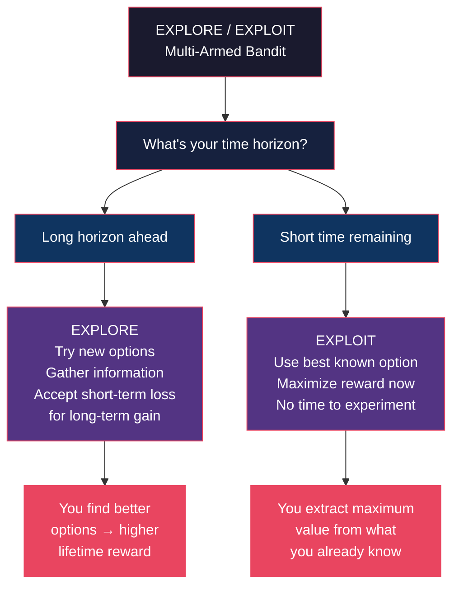

```mermaid
graph TD
    OS["OPTIMAL STOPPING"] --> R37["37% Rule:<br/>Observe 37%, then<br/>pick first best"]
    EE["EXPLORE / EXPLOIT"] --> GITTINS["Gittins Index:<br/>Balance info & reward"]
    SORT["SORTING"] --> TRADEOFF["Sort only if you<br/>search > log n times"]
    CACHE["CACHING"] --> LRU["LRU Eviction:<br/>Forget least-used"]
    SCHED["SCHEDULING"] --> RULES["EDD / SPT / Moore's"]
    BAYES["BAYES' RULE"] --> POST["Posterior ∝ Prior × Likelihood"]
    OVER["OVERFITTING"] --> SIMPLE["Simple > Complex<br/>Fewer params win"]
    RELAX["RELAXATION"] --> CONSTRAINTS["Remove constraints,<br/>solve, add back"]
    RANDOM["RANDOMNESS"] --> ANNEAL["Simulated Annealing:<br/>Heat then cool"]
    NET["NETWORKING"] --> BACKOFF["Exponential Backoff:<br/>Wait longer each time"]
    GAME["GAME THEORY"] --> DESIGN["Mechanism Design:<br/>Change the game"]

    style OS fill:#1a1a2e,color:#fff,stroke:#e94560
    style EE fill:#1a1a2e,color:#fff,stroke:#e94560
    style SORT fill:#1a1a2e,color:#fff,stroke:#e94560
    style CACHE fill:#1a1a2e,color:#fff,stroke:#e94560
    style SCHED fill:#1a1a2e,color:#fff,stroke:#e94560
    style BAYES fill:#1a1a2e,color:#fff,stroke:#e94560
    style OVER fill:#1a1a2e,color:#fff,stroke:#e94560
    style RELAX fill:#1a1a2e,color:#fff,stroke:#e94560
    style RANDOM fill:#1a1a2e,color:#fff,stroke:#e94560
    style NET fill:#1a1a2e,color:#fff,stroke:#e94560
    style GAME fill:#1a1a2e,color:#fff,stroke:#e94560
```

# Core Concepts — Algorithms to Live By

## 1. Optimal Stopping — When to Stop Looking

The optimal stopping problem: you see a sequence of options one at a time. After each, you must either accept (ending the search) or reject (losing it forever). You cannot go back. How do you maximize your chance of picking the best option?

**The 37% Rule** (the "look-then-leap" strategy): spend the first 37% of your options purely observing — do not select any. Then commit to the very next option that beats everything you've seen so far. This gives you a ~37% probability of picking the absolute best, which is the optimal guarantee for this problem class.

**Real-world applications**: hiring (interview ~37% of candidates, then hire the first who beats them all), dating/marriage (the classic "secretary problem"), apartment-hunting (spend 37% of your search time calibrating), parking (start looking seriously when you're ~37% into your acceptable distance), selling a house (set a threshold price in advance and accept the first offer above it).

**Example**: You have 30 days to find an apartment. Under the 37% rule, spend the first 11 days visiting apartments without committing. On day 12, rent the first apartment that is better than all the previous 11. The math says this gives you the best odds of ending up in your top choice.

**When to ignore it**: If you can recall past options, the strategy changes. If you have quantitative scores instead of rankings, use a threshold rule instead. And some problems — triple-or-nothing bets — have no safe stopping point. Walk away.

---

## 2. Explore/Exploit — The Latest vs. The Greatest

The explore/exploit tradeoff: every day you choose between trying something new (explore) and returning to a known favorite (exploit). This is the **multi-armed bandit problem** — a gambler in a casino with multiple slot machines, each with unknown payout rates. Pulling a lever gives you information (is this machine good?) or reward (this machine is good). You can't maximize both simultaneously.

**Gittins Index**: For each option, compute a "Gittins index" that combines expected reward with uncertainty. Always pick the option with the highest index. This automatically balances exploration and exploitation.

**The time horizon heuristic**: When you have a long time horizon (young age, new job, early in a project), explore aggressively — the long-term payoff of finding better options dwarfs short-term losses. When time is short, exploit what you know. This is why children explore and adults exploit.

**Example**: Choosing restaurants. In a new city, eat at a different place every night (explore). In your last week before moving, eat only at your favorites (exploit). The optimal strategy shifts as your horizon shrinks.

**Win-Stay, Lose-Shift**: A simpler heuristic for the explore/exploit dilemma: if an option worked, stick with it. If it failed, try something else. Elegant, satisficing, and often near-optimal.

---

---

## 3. Sorting — Making Order

Sorting theory has a fundamental result: comparison-based sorting requires at least n log n comparisons in the worst case. This is a lower bound, not just a limit on computers — it applies to any process that sorts by pairwise comparison, including human judges rating candidates.

**The sorting/searching tradeoff**: Sorting is only worth the effort if you'll search through the data more than log n times. If you rarely access a collection, leave it unsorted and just search linearly when needed.

**Real-world applications**: Filing systems (alphabetical filing is overkill for low-access documents), closets (sorting shirts by color looks organized but costs time you'll never recover), book collections (hardcover vs. paperback or alphabetical are expensive luxuries unless you search frequently).

**Example**: You have 100 books. If you look for a specific book ~once a week (52 times/year), the sorting cost pays for itself. If you look once a year, don't bother — linear search costs less total effort over the lifetime of the collection.

**Key insight**: The optimal level of organization depends on access frequency, not aesthetic preference. Martha Stewart's closet and a cache-optimized server rack follow the same math.

---

## 4. Caching — Forget About It

Caching solves the problem of accessing slow storage by keeping frequently used items in fast storage. The memory hierarchy (CPU cache → RAM → disk → network) is mirrored by human memory (working memory → long-term memory → external storage → asking someone).

**Least Recently Used (LRU) eviction**: When the cache is full, evict the item that has been unused the longest. This is provably optimal for many access patterns. Applied to life: when you need to forget something, forget the thing you've used least recently.

**Real-world applications**: Desk organization (keep active projects on your desk, archive old ones), kitchen layout (keep daily-use tools at hand, store holiday platters in the basement), inbox management (recent emails stay at top; archive or delete old ones), learning (recently studied material is most accessible — review before it gets evicted).

**Example**: The "memory wall" problem — computer processors are fast, but memory is slow relative to them. Your brain faces the same problem: retrieval takes time proportional to how far back the memory is. The "tip of the tongue" phenomenon is a cache miss. Brain farts = cache misses.

**Key insight**: Forgetting isn't a failure — it's a cache eviction policy operating on limited storage. Older adults forget more not because their memory is worse, but because their cache is fuller. The delay is a testament to how much you know.

---

## 5. Scheduling — First Things First

Scheduling is fundamentally about deciding which task to do next given limited time. Computer science has proven several optimal scheduling rules, each for a different objective.

**Earliest Due Date (EDD)**: Do the task with the earliest deadline first. This minimizes maximum lateness — the worst-case delay. Use this when deadlines are hard and missing any one is costly.

**Shortest Processing Time (SPT)**: Do the quickest task first. This minimizes total wait time across all tasks — the sum of how long each task sits in the queue. Use this when you want to clear the most items fastest.

**Moore's Algorithm**: To minimize the number of late tasks, ignore due dates and processing times — instead, schedule everything by earliest due date, then iteratively drop the longest task that will make you late. This is mathematically optimal.

**Example**: You have five tasks due at different times. If all deadlines are hard (paying bills, filing taxes), use EDD. If you want to clear your to-do list fastest, use SPT. If some tasks can be dropped (optional meetings, low-priority requests), use Moore's.

**Key insight**: The perfect schedule doesn't exist for all objectives simultaneously. Different goals need different algorithms. The first step is admitting what you're optimizing for.

---

## 6. Bayes' Rule — Predicting the Future

Bayes' rule tells you how to update your beliefs when new evidence arrives:

**Posterior ∝ Prior × Likelihood**

Your new belief (posterior) is proportional to your old belief (prior) multiplied by how likely the new evidence is under each hypothesis.

**The Copernican Principle**: For predicting the future duration of something that has already lasted t time, the median additional duration is also t. If a Broadway show has been running for 10 years, expect it to run another 10. If you're 30, expect to live to ~60. This is a Bayesian prior derived from the uniformity of time's passage.

**Real-world applications**: Medical diagnoses (test accuracy must account for disease prevalence — the prior), spam filtering (words are evidence, but the base rate of spam determines the threshold), dating (initial impressions get updated, but rationally — not too much from a single date), investing (prior beliefs about markets should shift slowly, not swing wildly on each headline).

**Example**: A disease affects 1 in 1000 people. The test is 99% accurate. You test positive. What is the probability you have the disease? Most people say 99%. Bayes says: (~0.1% × 99%) / (~0.1% × 99% + 99.9% × 1%) ≈ 9%. The prior saves you from a false alarm.

**Key insight**: Bayes' rule is the mathematics of not jumping to conclusions. It formalizes what it means to be open-minded but not credulous.

---

## 7. Overfitting — When to Think Less

Overfitting: fitting a model so precisely to your training data that it captures noise instead of signal. The model performs perfectly on past data but fails on new data.

**The intuition**: The more parameters you add, the better you fit the past — but the worse you predict the future. A simple linear model with two parameters may outperform a 50-parameter neural network on new data, even though the neural network matches every single historical data point.

**Real-world applications**: Decision-making (considering too many factors leads to worse decisions than following a simple rule), career choices (detailed 10-year plans overfit to current conditions; simple principles adapt better), investing (complex trading strategies that backtest beautifully often fail in live markets), relationships (holding people to complex sets of criteria ensures disappointment — simpler standards generalize better).

**Example**: Darwin made a list of pros and cons for marriage — but limited himself to one page. He intuited that adding more factors wouldn't improve the decision, just overfit his anxiety. The constraint prevented overthinking.

**Key insight**: Sometimes the most rational choice is to think less. Complexity is not sophistication. Restricting your options can improve your decisions. This is why timeboxing works — it prevents overfitting by limiting how many factors you can consider.

---

## 8. Relaxation — Let It Slide

Relaxation: when a problem is too hard (NP-hard, intractable), remove some constraints to make it solvable. Solve the simplified version, then gradually reintroduce constraints. The relaxed solution is a lower bound on the optimal solution to the full problem — and often a surprisingly good starting point.

**Lagrangian relaxation**: Instead of enforcing a constraint exactly, add a penalty term to the objective. This turns a constrained optimization problem into an unconstrained one — much easier to solve.

**Real-world applications**: Daily planning (when overwhelmed, ignore the "urgent" labels and just do the most important thing; add urgency back later), budgeting (relax the savings requirement, figure out what you actually spend, then add savings back as a constraint), travel planning (plan without budget first, then find ways to reduce cost), project management (solve without resource constraints, then figure out how to resource the critical path).

**Example**: Planning a wedding. The full problem is intractable (hundreds of decisions, dozens of constraints). Relax it: plan the perfect wedding with unlimited budget and time. Get the ideal shape. Then add budget and time constraints one at a time, adjusting. The relaxed plan anchors the real one.

**Key insight**: Done is better than perfect — but relaxation gives you a way to be done *and* be near-optimal.

---

## 9. Randomness — When to Leave It to Chance

Randomness is not failure — it's a problem-solving tool. Some problems are so hard that the best deterministic algorithm is worse than a randomized one.

**Simulated annealing**: Start with a "temperature" that allows random moves (even bad ones). Gradually cool the temperature, reducing randomness over time. This lets you escape local optima early and settle into a good solution later.

**Tempering analogy**: You want to find the lowest valley in a mountain range. If you always go downhill, you get stuck in the first valley you find (local optimum). Simulated annealing says: sometimes go uphill — the randomness lets you cross ridges to find deeper valleys. As you "cool," you stop uphill moves and settle into the best valley you've found.

**Real-world applications**: Creative work (try random approaches early in a project; refine as you converge), hiring (interview a random subset before focusing), problem-solving (when stuck, make a random change to break the logjam), life decisions ("sometimes take the random route home" — you discover things you'd never plan to find).

**Example**: A programmer debugging a bug for 3 hours. The deterministic approach (trace the logic in order) keeps hitting the same dead ends. Randomization: add print statements in random places, change one random variable. The disruption often reveals the bug.

**Key insight**: Controlled randomness is not giving up — it's a mathematically principled escape from local optima. The best time to be random is early, when you have time to recover from bad random moves.

---

## 10. Networking — How We Connect

Networking algorithms deal with congestion, reliability, and flow. The key insight: when a network is congested, pushing harder makes it worse. The optimal strategy is to back off.

**Exponential backoff**: After a collision (a failed transmission), wait a random time before retrying. Double the maximum wait after each failure. This prevents repeated collisions and lets the network stabilize.

**Bufferbloat**: When routers have too much buffer space, packets are delayed instead of dropped. The delay makes senders think the network is working, so they keep sending — making congestion worse. Dropping packets is better than delaying them.

**Real-world applications**: Email (if you don't get a reply, wait longer before following up — exponential backoff), arguments ("after a heated exchange, wait twice as long before re-engaging" = exponential backoff for human communication), traffic (roundabouts with no buffers flow better than traffic lights with long queues), project management (when a bottleneck appears, don't push more work at it — let it drain).

**Example**: If your email gets no reply, wait 1 day, then 2, then 4, then 8. This is provably optimal for avoiding congestion in communication channels. Most people do the opposite — they send follow-ups faster as anxiety increases.

**Key insight**: Congestion isn't solved by sending more. It's solved by backing off. This is counterintuitive because every participant's individual incentive (send now!) conflicts with the collective optimum (wait).

---

## 11. Game Theory — The Minds of Others

Game theory models strategic interactions: your optimal move depends on what others will do, and their optimal move depends on what they think you will do.

**Nash equilibrium**: A stable state where no player can improve their outcome by unilaterally changing their strategy. Everyone is doing the best they can given what everyone else is doing.

**Mechanism design**: If the game's rules produce bad outcomes, change the rules rather than trying to play better within them. This is "incentive engineering" — designing systems where self-interested behavior leads to collectively good outcomes.

**Real-world applications**: Negotiations (identify each party's incentives; structure the deal so cooperation is the Nash equilibrium), workplace culture (design incentives so individual and team goals align; don't blame people for acting rationally under bad incentives), auctions (different auction formats produce different outcomes — English vs. Dutch vs. sealed-bid), collaboration (the prisoner's dilemma shows when cooperation breaks down; repeated interactions enable trust).

**Example**: The prisoner's dilemma — two suspects are interrogated separately. If both stay silent, they each get 1 year. If one confesses and implicates the other, the confessor goes free and the other gets 10 years. If both confess, they each get 5 years. The Nash equilibrium is both confess — even though both staying silent is better for both. The solution: change the rules (repeated interaction, reputation effects, outside enforcement).

**Key insight**: In game theory, the structure of the game determines the outcome more than the skill of the players. The highest-leverage move is often to change the game, not play it better.

---

---

## Key Lessons

1. **The 37% rule is the most actionable math in the book** — use it for any finite search problem where you can't go back. Dating, hiring, apartment hunting, parking. Know the rule, use the rule.

2. **Exploration has an expiration date** — the value of new experiences declines as your remaining time shrinks. This is mathematically provable. Optimize accordingly.

3. **Organization is expensive** — the cost of sorting, filing, and tidying must be weighed against the cost of searching. Most people over-organize.

4. **Forgetting is necessary** — limited storage means you must evict. The optimal eviction policy is LRU. Let go of old information to make room for new.

5. **Simple beats complex** — overfitting is the most underappreciated cognitive bias. Adding factors to your decision model rarely improves it.

6. **Back off to move forward** — exponential backoff applies to human communication as much as network packets. When you're not getting through, wait longer.

7. **Change the game, not your strategy** — mechanism design > game playing. Bad incentives produce bad behavior. Change incentives, not people.

---

## Practical Applications

**Career**: Use explore/exploit — explore different roles early in your career (first 5-10 years), then exploit your best-fit role. The 37% rule for job searches: spend 37% of your search time applying broadly, then commit to the first role that beats your calibration set.

**Daily Productivity**: EDD scheduling for deadlines you can't miss. SPT for clearing your inbox. Timeboxing to prevent overfitting your decisions. Moore's Algorithm for deciding what to drop.

**Relationships**: Bayes' rule for interpreting ambiguous signals. The explore/exploit tradeoff for deciding between dating new people vs. deepening an existing relationship. Game theory for understanding conflicts of interest.

**Finances**: Optimal stopping for selling investments (set a threshold, don't look back). Overfitting awareness: simple index fund strategies beat complex trading systems. The Copernican Principle for lifetime spending estimates.

**Learning**: Caching principles: review recently learned material before it gets evicted. Spaced repetition is explicit cache management for the brain.

---

## Action Plan

1. **This week**: Apply the 37% rule to one search problem. Write your calibration threshold before you start looking.
2. **This month**: Audit your time horizon. Are you in an explore or exploit phase? Adjust your risk tolerance accordingly.
3. **This quarter**: Identify one area where you're overfitting — overthinking, overplanning, or overcomplicating. Cut the number of factors you consider by half.
4. **This year**: Use relaxation on one intractable problem: remove all constraints, plan the ideal, then add back one constraint at a time.
5. **Ongoing**: When communication fails, practice exponential backoff. Double your wait time before each follow-up.
