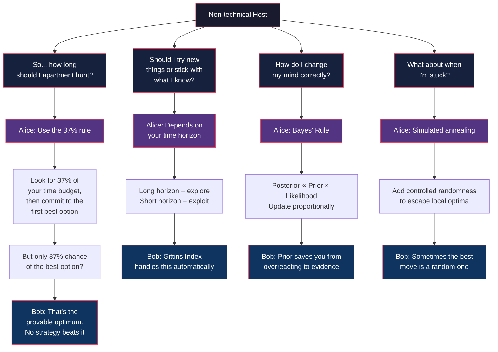

# Algorithms to Live By — The Podcast Episode

**Host**: Welcome back. Today's episode is about a book that made me rethink how I make basically every decision — from where to live to how long to wait for an email reply. It's *Algorithms to Live By* by Brian Christian and Tom Griffiths. And I have two computer scientists here to help me unpack it. Alice, Bob — welcome.

**Alice**: Thanks. Glad to be here.

**Bob**: Let's do it.

**Host**: So, the premise: algorithms — step-by-step problem-solving recipes from computer science — can help us make better decisions in everyday life. Skeptical?

**Bob**: I was. I mean, the phrase "algorithm for living" sounds like TED Talk bait. But the book won me over because it doesn't make grandiose claims. It says: look, these are provably optimal strategies for specific problem structures. If your life problem matches that structure, the math gives you an answer.

**Alice**: The key word is "structure." Once you learn to see the structure of a problem — oh, this is an optimal stopping problem, this is an explore/exploit tradeoff — the solution is almost automatic. The hard part isn't solving; it's recognizing.

**Host**: Give me the most useful one. The one I can use tomorrow.

**Alice**: The 37% rule. Let's say you're apartment hunting. You have 30 days. Most people look at apartments until they're exhausted or anxious, then grab one. The 37% rule says: spend the first 11 days just calibrating. Visit apartments, take notes, but do NOT commit to any. Then, on day 12, rent the first apartment that beats everything you saw in the first 11 days.

**Bob**: And the math guarantees you a ~37% chance of ending up in your absolute best option. Which sounds low, but it's the best you can do. No strategy gives a higher probability.

**Host**: Only 37%? That seems...

**Bob**: Low? Sure. But think about what the alternative strategies get you. If you pick randomly, you have 1/n chance — basically zero for any decent-sized pool. If you set an arbitrary threshold, you might get lucky or you might massively overpay. The 37% rule is the provable optimum. You can't beat it.

**Alice**: And the reframe is powerful too. Most people feel anxious and rushed during the last week of apartment hunting. The 37% rule tells you that anxiety is mathematically unnecessary. Your search horizon is predetermined. You have the exact right amount of time.

**Host**: What about bigger decisions? Careers? Relationships?

**Alice**: The 37% rule applies to any finite search problem where you can't go back. But the more interesting framework for long-term decisions is the explore/exploit tradeoff.

**Bob**: This is the big one for life planning. The multi-armed bandit problem: you're at a casino with slot machines, each has a different payout rate, and you don't know which is best. Every time you pull a lever, you either get money (exploit) or information about whether that machine is good (explore). You can't maximize both.

**Host**: So... try new things vs. stick with what works?

**Alice**: Exactly. And the optimal strategy depends almost entirely on your time horizon. If you have a long horizon — you're young, you just moved to a new city, you started a new job — you should explore a lot. Try different restaurants, different hobbies, different career paths. The short-term cost of suboptimal experiences is worth the long-term benefit of finding the best option.

**Bob**: But as your horizon shrinks, shift to exploitation. In your last year of college, in your last month in a city, in your last decade of work — focus on extracting maximum value from what you already know is good. Don't try a new restaurant on your last night in town.

**Host**: So the young should explore, the old should exploit.

**Alice**: The math says yes. And this has empirical support too. People do naturally explore more when they're young. The contribution of the book is showing that this isn't just conventional wisdom — it's mathematically optimal.

**Bob**: There's a beautiful extension too: the Gittins index. For each option, you compute a single number that combines its expected reward and its uncertainty. You always pick the option with the highest index. This automatically handles the explore/exploit tradeoff without you having to consciously decide. It's like having an internal compass for life choices.

**Host**: That feels... kind of cold. Algorithmically optimizing your life?

**Alice**: I think the opposite is true. The algorithms are liberating. They say: you don't have to get every decision right. The 37% rule gives you a 37% chance of the best outcome — and that's OK. That's optimal. There's no guilt, no "should have looked longer." The math says you did exactly right.

**Host**: OK, let's talk about changing your mind. Bayes' rule.

**Bob**: This is the rational way to update your beliefs. The formula is simple: your new belief (posterior) is proportional to your old belief (prior) times the likelihood of the new evidence. In practice: before you see new information, you have a prior probability. Then you observe something. Your posterior should move in the direction of the evidence, but not all the way.

**Alice**: Most people either ignore new evidence (confirmation bias) or overreact to it (recency bias). Bayes' rule gives you the mathematically correct middle ground.

**Host**: Example.

**Bob**: You're dating someone. First date goes great. Your prior: maybe 30% chance this person is a great match. Second date: they're late, rude to the waiter. The evidence is bad, but not conclusive — everyone has bad days. Bayes says: move your probability down, maybe to 20%. Not to zero. Not to 15%. A calibrated amount.

**Host**: That feels intuitive. And yet so many people would either dismiss the bad behavior entirely or break up immediately.

**Alice**: Right. Bayes' rule is the math of staying open-minded while still learning from experience. It's anti-dogmatic by design.

---

---

**Host**: Let's talk about when the book's advice gets weird. Because some chapters feel less "life-changing" and more "interesting CS fact."

**Bob**: The caching chapter is the best example. It argues that your bookshelf should work like a computer's memory cache: put recently accessed items at the front, and when you need to make space, evict the least recently used. And the authors present this as a radical alternative to organizing by category or alphabet.

**Alice**: Which is... fine as far as it goes. But the reason computers use LRU caching is that random access memory is fast but limited. Your bookshelf doesn't have that constraint. You can scan 200 book spines in about three seconds. Linear search is not the bottleneck.

**Host**: So the analogy is technically correct but practically useless?

**Bob**: That's a fair summary. And the book has a few of those. The networking chapter's advice on email — use exponential backoff for follow-ups — is genuinely useful and completely non-obvious. The caching advice is neither.

**Alice**: I think the weaker chapters still serve a purpose. They teach you the CS concept in a memorable way. Even if you never reorganize your bookshelf, understanding that "forgetting is cache eviction" changes how you think about memory and aging.

**Host**: That feels charitable. But the overfitting chapter — I've heard that one is actively misleading.

**Bob**: Yeah. Overfitting is a specific technical problem in machine learning: your model fits the training data too precisely and fails on new data. The book tries to map this onto everyday decisions — choosing a spouse, making a plan — and the mapping doesn't hold. Darwin's marriage list is not an overfitting example. It's just... thinking.

**Alice**: The frustrating part is that the *intuition* is right: simple models often beat complex ones, and adding factors to your decision process has diminishing returns. But the book doesn't earn this insight from the overfitting analogy. It would be better to just say "simplicity generalizes" without the CS wrapper.

**Host**: So what's the overall verdict? Should our listeners read this book?

**Bob**: Yes, absolutely. But read it critically. Read the optimal stopping chapter twice — it's genuinely excellent. The explore/exploit chapter is a close second. The scheduling chapter will change how you think about your to-do list. Apply those.

**Alice**: For the weaker chapters, treat them as interesting intellectual background, not practical advice. And don't feel bad if you don't reorganize your closet by LRU.

**Bob**: The real gift of the book isn't any specific algorithm. It's learning to see the computational structure in everyday problems. Once you start thinking "this is an explore/exploit problem" or "this is an optimal stopping problem," you've gained a decision-making framework that works across domains. The algorithms themselves are almost secondary to the pattern recognition.

**Host**: So the book's greatest value isn't the answers. It's the vocabulary.

**Alice**: Exactly. It gives you a language for talking about tradeoffs that most people can't even name. And naming a problem is the first step to solving it.

**Host**: The 37% rule I can actually use tomorrow. The explore/exploit tradeoff reframes my entire career. And Bayes' rule makes me a better thinker. That's a lot of value from one book, even if the caching chapter is a stretch.

**Bob**: That's a fair tradeoff. And you know what that is?

**Host**: Don't say it.

**Bob**: A tradeoff between chapter quality and number of chapters. You could call it the...

**Alice**: I think we're done here.

**Host**: *Algorithms to Live By* by Brian Christian and Tom Griffiths. Highly recommended. Read it, argue with it, and maybe — just maybe — let a little randomness into your life.

**Outro**: Thanks for listening. If this episode made you think differently about decision-making, share it with someone who needs to hear it. We'll be back next week.
