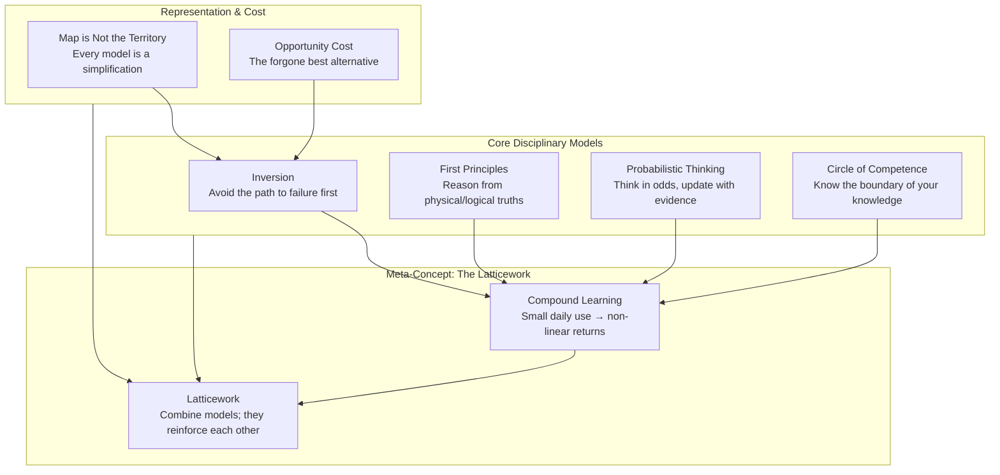
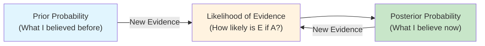
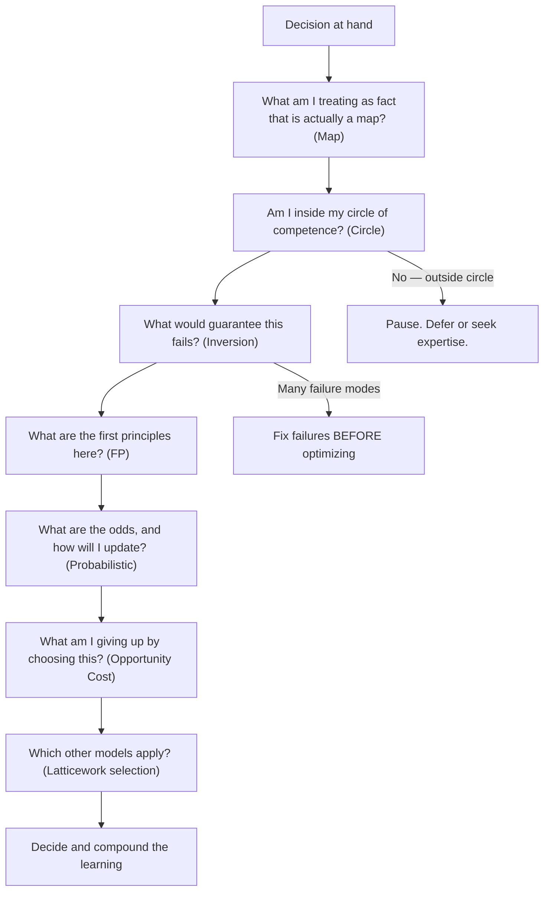

## The Models in This Volume — How They Connect

---

## Compound Learning

**Definition:** Knowledge, skills, and thinking tools compound when applied
consistently over time. A small daily investment in better thinking produces
non-linear returns — analogous to compound interest in finance, but applied to
your cognitive toolkit.

**Origin:** Charlie Munger popularized the concept in his speeches on worldly
wisdom — "the big money is not in the buying and selling, but in the waiting."
Parrish extends it explicitly to learning: it is not the quantity of models you
know but the frequency and quality of their application that determines the
compounding rate.

**Practical Example:** An investor who spends 15 minutes daily running
inversion + probabilistic thinking + circle-of-competence checks on portfolio
decisions will, over 5 years, develop a calibration that outperforms most
active fund managers. Not because they are smarter, but because they have
compounded disciplined application.

**When to Use:** Every day, on every decision of consequence. The book frames
this as a routine as simple as brushing your teeth.

**When to Avoid:** Do not compound toxic models. Applying a bad model
consistently (e.g., confirmation bias applied to investment selection) makes
you more confidently wrong over time. Compound only validated, disciplined
models.

---

## The Latticework as a System

**Definition:** A latticework is the interconnected structure formed when
multiple mental models support and correct each other. The lattice is stronger
than any single bar. The discipline is in knowing which bar to apply, and when
to switch.

**Origin:** Charlie Munger (1994 USC Law School speech). Munger described the
latticework of mental models as the core of worldly wisdom. Parrish and Beaubien
have spent the prior four volumes building individual bars; Volume 5 is the
blueprint for assembling them.

**Practical Example:** A founder evaluating a new market uses four models
simultaneously: first principles (what are the real constraints?), probabilistic
thinking (what are the odds this works?), inversion (what guarantees failure?),
and circle of competence (do I understand this domain?). Each model corrects
the blind spots of the others.

**When to Use:** Any decision where the stakes matter — investments, strategy
hires, major personal commitments.

**When to Avoid:** Low-stakes, reversible decisions do not need a full
latticework audit. Overthinking a trivial choice is its own failure mode.

---

## Inversion — Advanced Application

**Definition (advanced framing):** Inversion is not just "ask how to fail."
It is a systematic discipline of reversing every assumption in a plan and
testing whether the reversed version is also plausible. If "How do we grow?"
becomes "How do we shrink?" and the answer is "we can't," the original plan
has hidden dependencies that need surfacing.

**Origin:** Stoic *premeditatio malorum* + Carl Jacobi ("invert, always
invert"). The refinement in this volume is the systematic application: invert
the goal, invert the strategy, invert the metrics.

**Practical Example:** A product team sets a target of 1M users. Inversion:
"What would produce exactly 0 users?" Answer: a broken onboarding flow, no
multilingual support for your target market, and a sign-up form that asks for
too much. Now you have your anti-goals — fix those before optimizing for growth.

**When to Use:** At the strategy level, before committing resources. At the
tactical level, before any major launch or change.

**When to Avoid:** Inversion surfaces failure modes, not success paths. It is
a complement to forward planning, not a replacement.

---

## First Principles Thinking — Depth Practice

**Definition:** Reduce a problem to its fundamental truths — statements that
cannot be further broken down without losing meaning — then build the solution
up from there. This bypasses inherited assumptions and analogy-based reasoning.

**Origin:** Aristotle (Metaphysics). Modern popularization via Elon Musk
(SpaceX, Tesla). This volume adds the caution: first principles is expensive
cognitively. Use it when the existing solution is broken or when the physics
of a problem are tractable.

**Practical Example:** A SaaS company wants to reduce churn. Conventional
analogy: "What do other SaaS companies do?" First principles: "What would a
customer who never wants to leave need?" Answer: software that solves a real
pain point so completely that leaving becomes unthinkable. Churn is a symptom;
first principles points to diagnosis.

**When to Use:** When you have a physical or logical decomposition path. When
analogy has failed. When the problem is worth the cognitive cost.

**When to Avoid:** When the solution domain is abstractions stacked on
abstractions (software architecture, organizational design). First principles
works on problems with material constraints; many knowledge-work problems have
no material core to decompose.

---

## Probabilistic Thinking — From Concept to Practice

**Definition:** Assign calibrated probabilities to outcomes rather than binary
predictions. Update those probabilities as new evidence arrives. The goal is
not perfect foresight — it is consistently better calibration than the crowd.

**Origin:** Thomas Bayes (1763). This volume connects probabilistic thinking
explicitly to compound learning: a well-calibrated thinker avoids the large
losses that erase years of compound gains.

**Practical Example:** An investor assigns 70% probability to a thesis. When
new data contradicts a key assumption, they update to 35%. They do not hold
the original view out of pride — they reallocate to preserve capital. The
compounding investor's edge is in surviving long enough for probability to
work in their favor.

**When to Use:** Any situation with irreducible uncertainty. Before any bet,
investment, resource allocation, or strategic commitment.

**When to Avoid:** When an outcome is effectively predetermined (gravity, a
signed contract, an irreversible legal ruling). Binary thinking is acceptable
there — but question your confidence level carefully.

---

## Circle of Competence — Maintaining the Boundary

**Definition:** Know not only what you know well, but what you do not know.
The circle expands slowly, through deliberate practice and real feedback, not
through reading, reputation, or confidence.

**Origin:** Warren Buffett and Charlie Munger. Buffett: "I don't need to know
what every business does. I need to know what I understand." This volume
emphasizes that most boundary violations come from ego, not ignorance.

**Practical Example:** A tech executive with a strong track record in software
decides to invest in a restaurant franchise. The circle-of-competence check
asks: "Do you understand restaurant unit economics, supply chains, labor
management, and franchise law at the level you understand software?" If not,
defer or partner — do not invest alone.

**When to Use:** Before any resource-commitment outside your domain of
demonstrated competence.

**When to Avoid:** Never. The risk is always that you *think* you are inside
your circle when you are not. The Dunning-Kruger effect means the least
competent are the most confident they are inside their circle.

---

## The Map Is Not the Territory — Advanced Practice

**Definition:** All representations — models, metrics, narratives, data, even
this book — are simplified maps of a complex territory. The map is useful,
but the territory is always richer. Act as if the map is provisional.

**Origin:** Alfred Korzybski (1931, "Science and Sanity"). This volume
extends it: the danger is not that we use maps (we must), but that we forget
we are using them. The sophisticated thinker holds multiple maps and notices
when they contradict.

**Practical Example:** A company KPIs dashboard shows rising daily active
users (a map). The territory: users are active because a broken feature forces
repeated logins. The dashboard says "growth"; the territory says "friction."
Check the territory before celebrating the map.

**When to Use:** Every time you treat a metric, report, narrative, or model as
definitive. Whenever your confidence in a conclusion exceeds the grain of the
data supporting it.

**When to Avoid:** When the map IS the territory — a contract, a law, a
blueprint for construction you will execute. Here the representation *is* the
reality you are navigating.

---

## Opportunity Cost — Making the Invisible Visible

**Definition:** The true cost of any choice is not what you spend on it; it is
the value of the best alternative you did not choose. Every "yes" is a "no"
to something else.

**Origin:** Austrian economics (Friedrich von Wieser, 1914). This volume
brings it into the latticework as a forcing function: before committing to a
project, product, or relationship, name the alternative you are declining.

**Practical Example:** A founder spends a year on a product pivot. The
opportunity cost: the original product, which during that year generated its
best revenue ever, could have been doubled with the same team's effort. The
pivot was not wrong — but the founder never asked "what are we not doing?"

**When to Use:** Before committing major time or money. Before accepting a new
project, role, or commitment.

**When to Avoid:** When the alternative is equally unknown or equally bad.
Sometimes all paths are poor; opportunity cost then becomes a criterion for
least-worst selection.

---

## Integrated Decision Checklist

The book provides a unified checklist that combines all eight models. Run it
before any decision of consequence:

---

## Key Lessons

### 1. Compound learning is the hidden meta-model
It is not any single model that produces wisdom — it is sustained application.
The returns are nearly invisible at first and exponential later. Start now,
trust the compounding.

### 2. Inversion catches more errors than forward planning
Most failure modes are predictable in reverse. Ask "what would guarantee this
doesn't work?" and fix those things before you invest in the success plan.

### 3. Your circle of competence is smaller than your LinkedIn profile suggests
Credibility in one domain does not transfer to another. Be as rigorous about
where you *don't* have an edge as where you do.

### 4. First principles are expensive — spend the cognitive budget wisely
Not every problem needs breaking down. Most are solved by reasoning from analogy
to proven solutions. First principles are for when the current model is clearly
broken.

### 5. Probabilistic thinking compounds through survival
The investor who survives bad sequences stays in the game long enough for the
odds to work. Calibration is the skill that turns probability into survival.

### 6. The map is useful; the territory is what matters
Metrics, narratives, and models are indispensable, but always ask: what does
this map leave out? The answer changes the decision.

### 7. Opportunity cost is the invisible tax on every decision
Make it visible by naming the alternative you are declining. The practice takes
30 seconds and prevents year-long misallocations.

### 8. The latticework is not a fixed structure — it grows with use
Every decision is an opportunity to add bars and tighten connections. The more
you practice, the more complex problems you can handle simultaneously.

---

## Practical Applications

### Investing
- Before any investment: run the circle-of-competence check, then apply
  probabilistic thinking (assign a confidence number), then run inversion
  ("what makes this investment a 100% loss?").
- Use opportunity cost explicitly: "If I invest here, what am I not investing
  in?"

### Business Strategy
- Before any strategic shift: apply first principles to test whether the
  current strategy rests on real constraints or inherited assumptions.
- Run inversion on the new strategy: what guarantees it fails?
- Use the map-territory distinction on every strategic metric — ask what each
  KPI is leaving out.

### Learning and Skill Development
- Identify your current circles of competence in writing. Update quarterly.
- For each new domain, find the first principles before reading the popular
  summaries.
- Keep a decision journal: what model did you use? Was it the right one? What
  would you apply next time? This is the compound learning routine.

### Interpersonal and Communication
- When in conflict, check which map each party is operating from. Most
  disagreements are people using different simplified models of the same
  situation.
- Apply Hanlon's Razor (cross-referenced from Volume 1) before assuming
  strategic ill will.
- Use probabilistic thinking: "How confident am I that my interpretation is
  correct?" If less than 80%, seek disconfirming evidence before escalating.