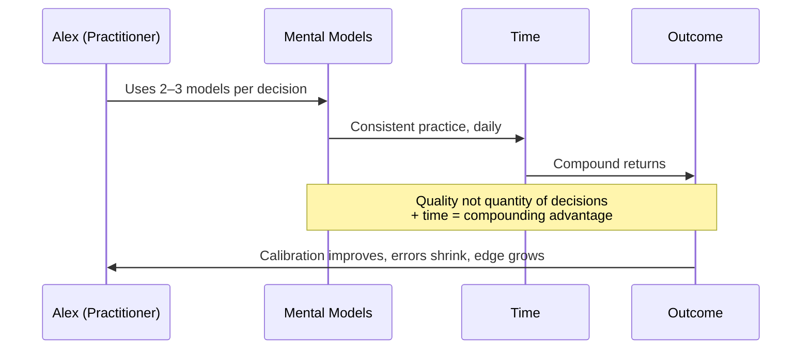
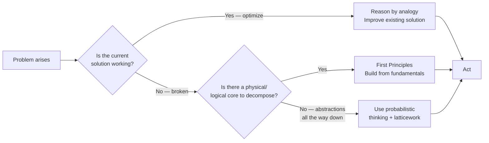
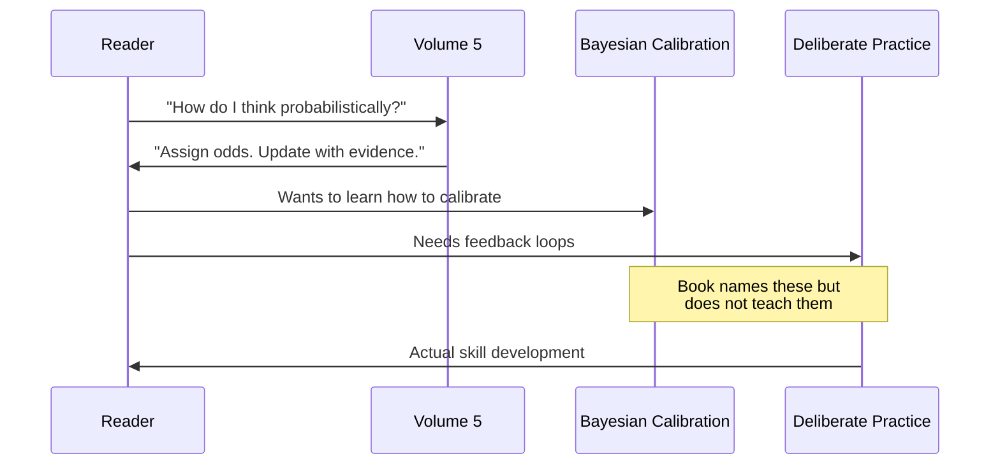

## Host Intro

Welcome to BookAtlas Conversations. Today we're discussing *The Great Mental
Models: General Thinking Concepts, Volume 5* by Shane Parrish and Rhiannon
Beaubien. This is the fifth and final integration volume in the Farnam Street
series that began life as a blog about decision-making and has become the most
influential popular introduction to multidisciplinary thinking of the past
decade.

I'm joined by Alex, who has read all five volumes and lives by the latticework
in his day-to-day, and Jordan, a skeptical systems engineer who thinks the
entire project is "common sense with better marketing."

Alex, Jordan — you two debated Volume 1 back in our archives. Let's see how
the conversation lands when we get to the capstone.

**Alex:** I'll be honest: Volume 5 is where the series actually delivers on
its promise. Volumes 1–4 are brilliant individual chapters. Volume 5 is the
symphony.

**Jordan:** Or it's a cash grab for five books when one might have done.

**Alex:** That's not entirely wrong, and we should talk about that. But first
— let me make the case.

---

## The Compound Learning Framing

**Host:** Let's start with what makes this volume different. Alex, what changed
between Volume 1 and Volume 5?

**Alex:** Volume 1 introduces nine models as separate tools. Volume 5 says:
the power is not in knowing nine tools. It is in using them together, every
day, over years. That's compound learning. The book reframes everything:

> "The advantage doesn't come from learning a model. It comes from the
> compounding effect of applying it repeatedly over a long time horizon."

That's a genuinely new idea in the series, and it changed how I actually
practice the models. Before Volume 5, I used them sporadically. After Volume
5, I run the latticework checklist every morning.

**Jordan:** Here's my problem with that framing. You're taking a metaphor from
finance — compound interest — and applying it to knowledge. But knowledge
doesn't compound like money. Money compounds passively if you leave it alone.
Knowledge requires active application, active updating, active pruning of
wrong models. If you compound bad knowledge, you don't get a bigger pile of
knowledge — you get a more confident wrongness.

**Alex:** That's a fair critique, and the book actually addresses it. It says
explicitly: compound only disciplined models with feedback. If you're
confidently wrong, that's not compound learning — that's compound error. The
book mentions Dunning-Kruger in this context specifically.

**Jordan:** It mentions it. It doesn't solve it. The feedback problem is the
hardest part of compound learning, and the book basically says "get good
feedback." Which is true and useless simultaneously.

---

## Inversion — The Most Consistent Tool

**Host:** Let's talk about inversion, which has been the series' most durable
model. Does the advanced framing in Volume 5 add anything?

**Alex:** Yes! In Volume 1, inversion is: "ask how to fail." In Volume 5, it
becomes a systematic discipline: invert the goal, invert the strategy, invert
the metrics. Every stage of planning gets the inversion treatment. That is
actually new, and it changed my planning process.

**Jordan:** I'll give you inversion. It's the one model in this entire series
that I genuinely use. Before any project at work, I run: "What would make
this a complete disaster?" Then I eliminate those things first. It works.
Every time.

**Alex:** Precisely. And Volume 5 adds: invert your metrics. Not just your
strategy. If your metric says "growth" but the inverted metric — "what would
produce zero growth?" — reveals the metric is measuring the wrong thing, you
catch it before you invest.

**Jordan:** OK, that's actually a good frame. I'll note it for my next
quarterly planning.

---

## The Circle of Competence Problem

**Host:** Let's talk about a model where I see real friction. Circle of
competence. Jordan, you've argued that this is harder to apply than the book
suggests.

**Jordan:** The idea is simple: know what you know. The application is hard.
Because the Dunning-Kruger effect means you don't know when you're outside
your circle. The book says "draw your circle honestly." How? The book doesn't
say. I'm a systems engineer. If I had a dollar for every software engineer who
thought they understood enough about finance to give investment advice — or
product people who thought they understood enough about backend architecture
to re-platform — I'd be retired.

**Alex:** I hear you. The book does address Dunning-Kruger explicitly. It says
the most dangerous people are those who don't know what they don't know but
act as if they do. But it doesn't give you a mechanism for CHECKING. That would
require external feedback, and the book punts on that.

**Jordan:** Exactly. The model is correct, but it's like a speed limit sign
with no enforcement mechanism. Knowing you should be honest about your circle
doesn't make you honest. Most people who think they're honest are wrong.

---

## First Principles — The Over-Rated Breakthrough Tool

**Host:** First principles gets a lot of attention in the series because of the
Elon Musk / SpaceX story. How does it hold up in Volume 5?

**Alex:** Volume 5 does something the earlier volumes didn't: it puts first
principles in context with the other models. It's not a universal tool. It's
expensive. It's for when the analogy is clearly broken — when "that's how
everyone does it" is no longer sufficient.

**Jordan:** That's a genuine improvement. Volume 1 presented first principles as
almost heroic. Volume 5 says "use it when the problem has physical constraints
and the existing solution is clearly inflated." That's a much more honest
framing. Most problems in knowledge work — designing APIs, writing policies,
running organizations — don't have physical cores you can decompose. So first
principles is often the wrong tool.

**Alex:** I agree, and I've seen people misuse this model the most. The moment
someone says "we need to think from first principles here," they usually mean
"we want to redo everything from scratch." Which is expensive and often wrong.

---

## Probabilistic Thinking — The Book's Honest Boundary

**Host:** This is where you've been most critical in past conversations.
Probabilistic thinking. Volume 5 returns to it. What do you think?

**Jordan:** My frustration stands. The book says "think in probabilities." It
does not tell you how to calibrate. It does not give you a practice regimen.
It gestures at Bayes and moves on. If the book is honest about anything, it
is honest about this: probabilistic thinking requires training you don't get
from reading a chapter.

**Alex:** The book doesn't claim to be that training. It claims to make you
aware that such a thing exists. Before I read Volume 1, I didn't think in odds.
I thought in "will it happen?" or "will it not?" The shift to "what are the
odds?" is the first step, and the book provides that step for people who
haven't encountered it.

**Jordan:** I'll grant you the awareness piece. But I wish the book had at
least named the right next book. It names Julia Galef and Annie Duke, which
is good. But it could have gone further and said: "This is a discipline. You
will need to practice it, track your calibration, refine it." It treats it as
a lens rather than a skill.

**Alex:** To be fair, you can't teach Bayesian calibration in one chapter of
a 200-page book. The book's job is the awareness. The training is up to the
reader.

---

## Map Is Not the Territory — Running on All Pages Now

**Host:** This model has become so baked into my thinking that I sometimes
forget it was a named concept before I read this series. Does Volume 5 add
depth?

**Alex:** It adds the most important thing: it makes map-territory awareness a
diagnostic you run on your models themselves, not just on external data. The
question becomes: "What is the model leaving out?" rather than just "What is
the report leaving out?"

**Jordan:** That's a real improvement. Volume 1 was more externally focused —
"don't confuse the map with the world." Volume 5 is internally focused — "don't
confuse the model with the problem." That subtle shift is significant.

---

## Opportunity Cost — The Invisible Tax

**Host:** Opportunity cost feels like an economics concept, not a general
thinking concept. Why is it in Volume 5?

**Alex:** Because it's the one model most people actively ignore. Inversion
tells you to avoid failure. First principles tells you to reason from
fundamentals. But neither of them asks: "What am I choosing not to do?" And
the cost of that ignorance is enormous.

**Jordan:** Fair. But it still feels like scope creep. This series is called
"General Thinking Concepts," not "General Thinking Concepts Plus Economics."
Having said that, it's a genuinely valuable model, and if you're going to
include it, Volume 5 is the right place — as an integration point with the
latticework, not as a standalone tool.

---

## The Latticework Checklist — The Book's Most Practical Output

**Host:** Let's talk about the latticework checklist at the end of the book.
This is the moment that either works or doesn't.

**Alex:** It works. It's an 8-step checklist:

1. What map am I treating as reality?
2. Am I inside my circle of competence?
3. What would guarantee this fails? (Inversion)
4. What are the first principles here?
5. What are the odds, and how will I update?
6. What am I giving up? (Opportunity cost)
7. Which other models apply? (Latticework selection)
8. Decide and compound the learning.

Three minutes. Before any important decision. I have been running this for
six months. It has caught errors I would not have caught otherwise.

**Jordan:** I ran it yesterday before a design review. It added about five
minutes of thinking and changed the decision I made. I will not say this
loudly, but: OK. It works.

**Host:** That is the highest praise I think we will get from Jordan today.

**Jordan:** Don't get used to it. I still have problems. But the checklist is
genuinely useful.

---

## Jordan's Final Assessment

**Jordan:** My problems remain three. First, the book doesn't give you a
mechanism for choosing which models to apply when. The checklist gives you the
prompt — "which models apply?" — but no method for answering that. I still
wing it.

Second, compound learning is real but unmeasurable in practice. How do you
know you're compounding and not just accumulating? The book doesn't give you
a test.

Third, this volume doesn't stand alone. If you pick it up without the prior
four, you'll find it opaque.

That said: if you've done the work, Volume 5 is genuinely the best summation
of the practical value of the entire series. It earns its place. The compound
learning framing and the latticework checklist are worth the shelf space.

**Alex:** I agree with all of that, with one addition: the compound learning
chapter alone should be required reading for anyone who cares about long-term
skill development. It reframes the whole enterprise from "learn things" to
"build a system that gets better over time." That shift is enormous.

---

## Outro

**Host:** Our verdict: *The Great Mental Models Volume 5* is not the place to
start, but it is an excellent place to arrive. For readers who have built the
latticework with the prior four volumes, this is the payoff. The compound
learning framing, the advanced inversion practice, and especially the
latticework checklist are lasting tools.

For the absolute beginner: start with Volume 1, treat Volumes 2–4 as deep
practice, and come back to Volume 5 when you have something to integrate.

For the practitioner: treat this as a calibration and integration session, and
then keep going — to Munger, to Bevelin, to Tetlock and Galef and Duke for
deeper dives on specific models.

This has been a BookAtlas narration of *The Great Mental Models: General
Thinking Concepts, Volume 5* by Shane Parrish and Rhiannon Beaubien. Thanks
for listening.