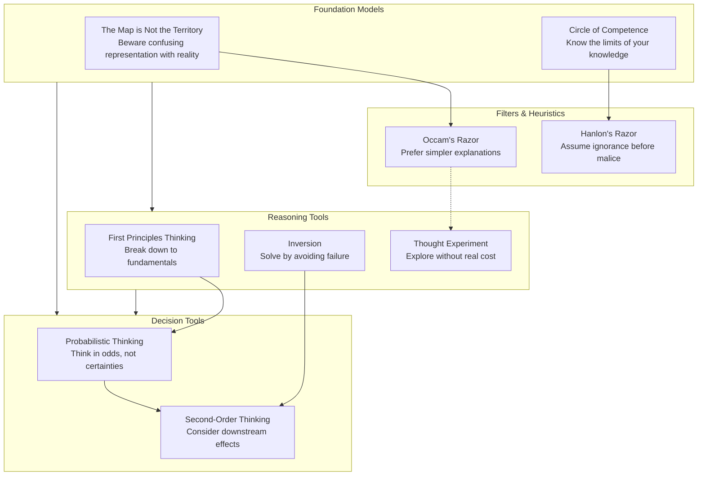

## How the Models Interconnect

---

## The Map is Not the Territory

**Definition:** Representations of reality (maps, models, data, narratives)
are always simplifications. They are useful tools, but they are not the
thing they represent. Confusing the two leads to distorted decisions.

**Origin:** Attributed to Alfred Korzybski (1931, "Science and Sanity").
Korzybski argued that human knowledge is inherently limited by our
neurobiology and language — we perceive an abstraction, not reality itself.

**Practical Example:** A financial model predicts steady growth, but
ignores black-swan risks. The trader who treats the model as reality (not a
simplification) gets destroyed when the territory surprises them. Similarly,
a resume is a map of a person — useful but never the full territory.

**When to Use:** Whenever you're analyzing data, models, reports, or
narratives. Ask: what is this map leaving out?

**When to Avoid:** When the map IS the territory (a blueprint for a building
you're constructing — the blueprint literally guides construction).

---

## Circle of Competence

**Definition:** You have a circle of competence — domains where your deep
knowledge gives you an edge. Outside that circle, you are at a disadvantage
and should defer to experts or tread carefully.

**Origin:** Warren Buffett and Charlie Munger. Buffett famously said "I
don't need to know what every business does. I need to know what I
understand." The concept was central to their investment partnership.

**Practical Example:** A tech founder who invests in biotech startups based
on a vague belief that "healthcare is the future" is operating outside
their circle. They lack the domain knowledge to evaluate the science,
regulatory path, and competitive landscape. Better to invest in what they
know or partner with someone who knows biotech.

**When to Use:** Before any significant decision. Draw your circle on paper.
Are you inside it? If not, pause.

**When to Avoid:** The circle of competence must be honestly bounded. The
Dunning-Kruger effect makes this hard — incompetence masks itself as
confidence.

---

## Inversion

**Definition:** Instead of asking "how do I achieve X?", ask "what would
guarantee failure?" Avoid the causes of failure, and success takes care of
itself.

**Origin:** The Stoics (Seneca, "On the Happy Life"). The *premeditatio
malorum* — the practice of imagining worst-case scenarios in advance to
prevent them. Later popularized by Charlie Munger and the mathematician Carl
Jacobi ("invert, always invert").

**Practical Example:** Instead of asking "how do I build a successful
company?", ask "what would destroy every company I've seen?" Then: avoid
those things. Bad hiring, misaligned incentives, ignoring customers, running
out of cash — now you have a to-avoid list that's more actionable than a
to-do list.

**When to Use:** When you're stuck on how to achieve a goal. When the
forward path is unclear. When everyone is asking the same question.

**When to Avoid:** When you need a specific plan of action, not just error
avoidance. Inversion tells you what NOT to do, not necessarily what TO do.

---

## Occam's Razor

**Definition:** All else being equal, the simplest explanation that accounts
for the facts is most likely correct. Do not multiply entities beyond
necessity.

**Origin:** William of Ockham (14th-century English friar and philosopher).
The principle was a tool for logical reasoning — don't add unnecessary
assumptions.

**Practical Example:** Your phone stops working. Possible explanations: (a)
the battery died, or (b) a government conspiracy is broadcasting
electromagnetic pulses targeted only at your device. Occam's razor says:
start with (a). The simpler explanation is overwhelmingly more probable.

**When to Use:** When evaluating competing explanations. The simpler one is
a better starting hypothesis.

**When to Avoid:** When "simpler" means "wronger." Simple explanations for
complex phenomena (e.g., single-cause theories of poverty) are often
inadequate. Occam is a heuristic, not a law.

---

## Hanlon's Razor

**Definition:** Never attribute to malice what can be adequately explained
by neglect, ignorance, or incompetence.

**Origin:** Robert J. Hanlon (1970s). The phrase appears in a book of
military jokes by "J. Z. Heart." It is sometimes confused with Occam's
Razor, but it specifies a particular kind of simplicity.

**Practical Example:** A colleague doesn't respond to your email. Malice
theory: they're ignoring you to undermine your project. Hanlon: they're
overwhelmed, forgot, or the email got buried. Nine times out of ten, Hanlon
is right.

**When to Use:** When you feel slighted, frustrated, or conspiratorial.
Assume ignorance first, check second, escalate third.

**When to Avoid:** When you have evidence of genuine malice (a pattern of
hostile behavior, documented intentional harm). Hanlon is a first look, not
a final verdict.

---

## Thought Experiment

**Definition:** Use your imagination to explore the consequences of a
hypothetical scenario. Thought experiments let you test ideas, expose
contradictions, and generate insights without real-world cost.

**Origin:** Ancient — Plato's allegory of the cave. Galileo used thought
experiments to refute Aristotelian physics (imagining a cannonball dropped
from a ship's mast). Einstein imagined riding a light beam.

**Practical Example:** Before launching a new product feature, run a thought
experiment: "If this feature is a massive success, what else changes in our
business? What breaks? What do customers stop doing that they currently
do?" This surfaces second-order effects before you commit resources.

**When to Use:** When real-world experimentation is expensive, dangerous, or
impossible. When testing assumptions. When generating creative solutions.

**When to Avoid:** Thought experiments cannot substitute for empirical
validation. Your imagination has blind spots — test your conclusions against
reality.

---

## First Principles Thinking

**Definition:** Break a problem down to its most fundamental truths (first
principles) — facts that cannot be further reduced — then reason up from
there. Bypass conventional wisdom and reasoning by analogy.

**Origin:** Aristotle (physics and metaphysics). In modern context,
popularized by Elon Musk: "Boil things down to the most fundamental truths
and then reason up from there."

**Practical Example:** Musk asked: "What are the raw materials in a
rocket?" Answer: aluminum alloys, copper, titanium. Commodity price:
~2% of the market rocket price. So why do rockets cost so much? Because
of manufacturing complexity and supply chain overhead. By reasoning from
first principles rather than analogy (other rocket prices), Musk realized he
could build rockets far cheaper — SpaceX was born.

**When to Use:** When you need genuine innovation. When conventional wisdom
is failing. When "that's how it's always been done" is the prevailing
argument.

**When to Avoid:** When an existing solution works well and optimization (not
reinvention) is the goal. First principles thinking is cognitively expensive.

---

## Probabilistic Thinking

**Definition:** Estimate the likelihood of possible outcomes and update your
beliefs as new evidence arrives. Replace binary thinking ("will this
happen?") with calibrated probability estimates.

**Origin:** Thomas Bayes (18th-century mathematician). Bayesian probability
updates prior beliefs with new evidence. Also deeply connected to
thermodynamics and quantum mechanics.

**Practical Example:** A startup founder asks: "Will we hit our revenue
target?" Probabilistic thinking reframes: "What's my confidence?" Say 60%.
"What would need to be true to raise it to 80%?" Now you have a clear set
of milestones to test — not a binary bet but a probabilistic forecast you
can update.

**When to Use:** Whenever uncertainty exists (which is almost always). When
making bets, allocating resources, or evaluating risk.

**When to Avoid:** When the outcome is effectively determined or when you
need to make a binary decision (yes/no) — but even then, probabilistic
thinking helps you decide the threshold.

---

## Second-Order Thinking

**Definition:** Every action has consequences. First-order effects are
immediate and obvious. Second-order effects are downstream, delayed, and
often counterintuitive. Second-order thinking means tracing the chain.

**Origin:** A core concept in systems thinking and economics. Howard Marks
(Oaktree Capital) writes extensively about it: "Second-level thinking is
different and better." Charlie Munger's question: "And then what?"

**Practical Example:** A company cuts costs by laying off engineers. First
order: lower expenses, higher profit. Second order: product quality drops,
customer satisfaction falls, churn increases. Third order: top talent leaves
because the product is deteriorating, recruitment becomes harder because
reputation is damaged. The cost cut backfires.

**When to Use:** Before any decision with consequences beyond the immediate.
Especially in strategy, policy, investing, and parenting.

**When to Avoid:** For trivial, reversible decisions. Spending an hour on
second-order thinking about which sandwich to order is not a good use of
time.

---

## Key Lessons

### 1. The map is not the territory
Every representation — every metric, model, or narrative — is a distortion.
The more you rely on it without checking reality, the more dangerous it
becomes. Stay humble about your models.

### 2. Knowing what you don't know is a superpower
Circle of competence is hard because ego resists it. The most dangerous
people are those who don't know what they don't know but act as if they do.

### 3. Inversion is the shortcut
When the path forward is unclear, ask: "How would I fail?" The answer is
often clearer and more actionable than the success plan.

### 4. Simpler is usually better
Occam's and Hanlon's razors eliminate most of the noise. Conspiracy
theories, interpersonal drama, and overcomplicated strategies all collapse
when you apply simplicity first.

### 5. Think in bets, not certainties
Probabilistic thinking shifts you from binary predictions to calibrated
estimates. You lose the illusion of certainty but gain accuracy.

### 6. Trace the chain
Second-order thinking reveals hidden consequences. Most bad decisions look
good at first order and bad at second order.

### 7. Break things down before building up
First principles thinking is how you escape the gravity of conventional
wisdom. But it's hard work — don't do it when analogy suffices.

### 8. Use thought experiments as cheap failure
A good thought experiment costs nothing and can save you from expensive
real-world mistakes. Practice running them daily.

### 9. Models work together, not alone
The power of this book is not any single model — it's having all nine in
your toolkit so you can switch lenses as the situation demands.

---

## Practical Applications

### Daily Decision-Making
- Before a significant decision, run through all 9 models mentally. Which
  one applies? Usually 2-3 will be relevant.
- Apply inversion weekly: "What three things, if they went wrong, would
  make this week a disaster?" Prevent them.

### Investing
- Draw your circle of competence. Only invest in businesses inside it.
- Use second-order thinking: "If this investment works, what happens next?
  If it fails, what happens next?"
- Use probabilistic thinking: express every thesis as a probability.

### Work and Strategy
- Before a strategy meeting, ask: "What are we assuming that's wrong?"
  (First principles + inversion)
- When someone proposes a complicated solution, apply Occam's Razor. Is
  there a simpler way?
- When someone attributes bad outcomes to malice, apply Hanlon's Razor.
  Is incompetence or neglect a more likely explanation?

### Interpersonal
- When you feel slighted, assume ignorance before malice. Send a clarifying
  message before reacting.
- When analyzing a conflict, check which "map" each person is operating
  from. They're likely working from different representations of reality.

### Innovation
- For a stubborn problem, list all the taken-for-granted assumptions. Then
  invert each one. This often reveals new paths.
- Run a thought experiment: "What would we do if we were starting from
  scratch?" (Zero-based thinking, related to first principles.)

### Learning
- Identify your circle of competence in writing. Update it yearly.
- When learning a new domain, look for the first principles — the core
  truths that everything else rests on. Learn those first.
