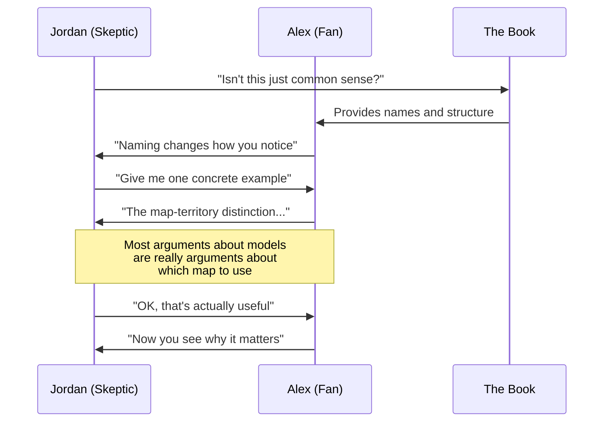

## Host Intro

Welcome to BookAtlas Conversations. Today we're discussing *The Great Mental
Models Volume 1: General Thinking Concepts* by Shane Parrish and Rhiannon
Beaubien. I'm joined by two friends: Alex, a longtime Farnam Street reader
who swears by these models, and Jordan, a skeptical engineer who thinks
this is just repackaged common sense. Alex and Jordan, welcome.

**Alex:** Thanks. I've been waiting to have this conversation.

**Jordan:** I'm sure you have. Let's see if you can convert me.

---

## The Central Premise

**Host:** Let's start with the big idea. Alex, what's this book actually
about?

**Alex:** It's an introduction to 9 mental models — thinking tools that
help you see the world more clearly. The argument is that most people only
have a few mental models from their training, and they try to force every
problem through those few lenses. If you're a hammer, everything looks like
a nail. By learning models from multiple disciplines — physics, biology,
philosophy, mathematics — you build a latticework of understanding that
lets you apply the right tool to the right situation.

**Jordan:** That sounds reasonable on the surface, but it's basically saying
"learn more things and be smarter." That's not a framework, that's a
platitude.

**Alex:** I'd push back. The value is in having a name for each tool. Once
you can name something, you can notice when you're not using it. Before I
read this book, I didn't have a term for "the map is not the territory" —
I just vaguely knew that reports and metrics weren't telling the full story.
Now I actively catch myself when I'm treating a dashboard as reality.

---

## The Map is Not the Territory

**Host:** Alex mentioned the map-territory distinction. Jordan, this is the
first model in the book. Does it pass your test?

**Jordan:** Honestly, this one is good. The idea that any representation
is a simplification — and that you should never confuse the two — is
genuinely useful. I've seen engineers obsess over benchmark numbers while
ignoring that the benchmarks don't reflect real user behavior. That's
exactly the map-territory error.

**Alex:** Right! And once you see it, you see it everywhere. A stock price
is a map of a company. A GPA is a map of a student. A performance review is
a map of an employee. None of them are the territory, but we make decisions
as if they are.

**Jordan:** OK, that one I'll grant you. But let's talk about a model I
think is overrated.

---

## Occam's Razor

**Jordan:** Occam's Razor. The simplest explanation is usually right.
Sure, but this is just "don't overcomplicate things." Did we need a whole
chapter to arrive at that?

**Alex:** The chapter makes it more precise. It's not "the simplest
explanation is correct" — it's "when you have two explanations that both
account for the facts, the one with fewer assumptions is more likely to be
correct." The key is "all else being equal." Most people ignore that
caveat. They pick the simplest explanation and stop thinking.

**Jordan:** That's fair. But here's my real problem: the book presents
these models as universally applicable rules. Occam's Razor is not a law
of the universe. Complex systems frequently require complex explanations.
If you apply Occam's Razor to the question of why poverty exists, you get
a simple wrong answer rather than a nuanced correct one.

**Alex:** The book actually says it's a heuristic, not a law. But I take
your point — it could be clearer about when NOT to use each model. That's
a weakness of the whole approach.

---

## Hanlon's Razor

**Host:** Let's talk about Hanlon's Razor — don't attribute to malice what
can be explained by ignorance or incompetence. Alex, do you find this one
holds up in practice?

**Alex:** It's the most useful model in the book for interpersonal
relationships. I'd say 80% of the conflicts I've seen at work could have
been avoided if someone applied Hanlon's Razor before reacting. Someone
doesn't respond to your email? You assume they're ignoring you, escalate,
and create drama. In reality, they were in back-to-back meetings. Hanlon's
Razor gives you a pause — check the benign explanation first.

**Jordan:** I agree it's useful as a first step. But I've also seen people
use Hanlon's Razor to avoid confronting genuine bad behavior. "Oh, they're
not malicious, they're just incompetent" — and then they let incompetence
slide for years. Sometimes malice IS the explanation, and Hanlon's Razor
becomes a way to be a doormat.

**Alex:** The book doesn't say never attribute to malice. It says don't
attribute to malice what can be ADEQUATELY explained by ignorance or
incompetence. "Adequately" is doing a lot of work there. If the person
keeps doing the same harmful thing after being corrected, ignorance is no
longer an adequate explanation.

**Jordan:** Fair. I'll concede that one too.

---

## Inversion

**Host:** Inversion — instead of asking how to succeed, ask what would
guarantee failure. Jordan, this is one Alex mentioned earlier. Thoughts?

**Jordan:** This is the model that changed my mind about the book, actually.
I came in skeptical, but inversion is genuinely powerful and nobody teaches
it. The idea that you should spend as much time on "how do I avoid failure?"
as on "how do I succeed?" is counterintuitive and immediately useful.

**Alex:** Exactly. Munger says it best: "It is remarkable how much long-term
advantage people have gotten by trying to be consistently not stupid,
instead of trying to be very intelligent." That's the whole philosophy.

**Jordan:** The practical application is straightforward. Before any
project, I now ask: "What would guarantee this project fails?" The answers
are always clearer than the success plan. No stakeholder alignment.
Unclear requirements. Too many features. No testing. Then I just prevent
those things. It works.

---

## First Principles Thinking

**Host:** SpaceX and first principles — the most famous example in the book.
Alex?

**Alex:** The example is famous because it's so powerful. Musk broke down
what a rocket costs in raw materials — aluminum, copper, titanium — and
realized the market price was 50x the material cost. That gap was the
inefficiency that SpaceX exploited. He didn't reason by analogy ("other
rockets cost this much, so ours will too"). He reasoned from fundamentals.

**Jordan:** This example is compelling, but it's also misleading. Most
problems don't have a raw-material decomposition. Try applying first
principles to "how should I design this API?" You can't break it down to
fundamental physics. You're building on abstractions built on abstractions.
First principles thinking works best when the problem has physical
constraints or when the existing solution is obviously inflated. Most
knowledge-work problems don't meet those criteria.

**Alex:** That's a good critique. I'd say first principles is the most
overrated model in the book for exactly that reason. It's for when you need
a breakthrough. Not for daily operations.

---

## Probabilistic Thinking

**Host:** Probabilistic thinking — think in odds, not certainties.

**Jordan:** This chapter frustrated me. It introduces the concept:
estimate probabilities, update with evidence. But it doesn't teach you HOW.
What's a well-calibrated probability estimate? How do I avoid overconfidence?
How do I update correctly? The book gestures at Bayes but gives no
practical method.

**Alex:** I think that's fair. There's a good book by Julia Galef called
*The Scout Mindset* and another by Annie Duke called *Thinking in Bets*
that go deeper here. This volume gives you the concept — "you should think
in probabilities" — and expects you to go deeper elsewhere.

**Jordan:** See, my problem is: if I need three other books to actually
apply what this chapter teaches, what did this chapter achieve?

**Alex:** It tells you the model exists. Before reading this, you might not
have known that probabilistic thinking is a thing you should practice. That
awareness is the first step.

---

## Second-Order Thinking

**Host:** Second-order thinking — "and then what?"

**Alex:** This is the one I use most. Before any decision with real stakes,
I trace the chain. "If we do X, what happens? Then what? Then what?" It's
amazing how many decisions look great at first order and terrible at second.

**Jordan:** The problem is infinite regress. How do you know when to stop?
If everything has third- and fourth-order effects, you can stay in the
chain forever and never decide anything.

**Alex:** You stop when the effects become speculative. At some point the
uncertainty is so high that further tracing is guessing. The book could
have addressed that, I agree.

---

## The Problems with the Book

**Host:** Jordan, you came in skeptical. What's your final assessment?

**Jordan:** The book is useful for what it is — a friendly introduction.
My main criticisms are three:

First, it presents these models as settled wisdom. They're not. Occam's
Razor has known failure modes. Probabilistic thinking without calibration
training can make you worse (you become confidently wrong about
probabilities). The book doesn't engage with these complexities.

Second, it gives no integration framework. Which model do I use when? How
do I combine them? The hardest skill in thinking about thinking is knowing
which lens to put on. This book doesn't help with that.

Third, there's no practice. You can't learn mental models by reading about
them. You need deliberate practice, feedback, and reflection. The book is
a catalog, not a curriculum.

**Alex:** I agree with most of that. But I'd argue the book doesn't claim
to be more than a catalog. It's volume 1 of 3. It's the appetizer. The
value is in knowing the models exist. Practice is on you.

**Jordan:** That's fair. I've shifted from "this book is pointless" to
"this book is a good starting point but insufficient." That's progress.

---

## The Daily Mental Checklist

**Host:** Let's end with something practical. If someone wants to apply
these 9 models daily, what should they do? Alex?

**Alex:** Here's a simple daily checklist:

1. **What map am I treating as reality?** (Map-Territory) — Check if you're
   over-indexing on metrics, reports, or narratives.

2. **Am I inside my circle?** (Circle of Competence) — For the day's
   decisions, are you qualified to make them?

3. **What if I inverted the problem?** (Inversion) — Take 2 minutes on a
   problem and ask what would guarantee failure.

4. **Is there a simpler explanation?** (Occam) — Before complicating
   something, check if a simple explanation suffices.

5. **Am I assuming malice?** (Hanlon) — If someone frustrated you, consider
   ignorance or incompetence first.

6. **What would a thought experiment reveal?** — Run a quick "what if"
   scenario before a decision.

7. **What are the first principles here?** — Are you reasoning by analogy
   when you should be breaking things down?

8. **What are the odds?** (Probabilistic Thinking) — Express a key
   uncertainty as a number.

9. **And then what?** (Second-Order) — Trace one decision to its
   second-order effects.

You can run through the whole thing in 5 minutes. Do it before the morning's
biggest decision.

---

## Outro

**Host:** That's it for this episode of BookAtlas Conversations. Alex,
Jordan, thanks for a genuinely great discussion.

**Alex:** Thanks. I'm glad we did this.

**Jordan:** Same. I still have criticisms, but I'll be running that
checklist tomorrow morning. That says something.

**Host:** The book is what it is: a beginner's guide, not an advanced
manual. If you're new to mental models, start here. If you're experienced,
move on to Bevelin or Munger. Either way, the models themselves are worth
learning.

This has been a BookAtlas narration of *The Great Mental Models Volume 1:
General Thinking Concepts* by Shane Parrish and Rhiannon Beaubien. Thanks
for listening.
