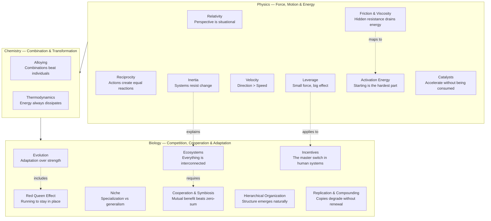

## How the Models Relate

---

## Velocity

**Definition:** Speed in a specific direction. Unlike speed (a scalar),
velocity is a vector — it has both magnitude and direction.

**Origin:** Classical physics, Newtonian mechanics. The distinction between
speed and velocity is one of the first conceptual leaps in physics.

**Real-life examples:** A company growing revenue (speed) while losing
market focus (wrong direction). A career advancing rapidly but toward
burnout. A product shipping features fast but solving the wrong problem.

**Application to decisions:** Before optimizing for speed, ask: are we even
heading the right way? The most efficient path to the wrong destination is
still wrong. Velocity forces you to define direction explicitly. In
strategy, this means clarity of purpose precedes clarity of execution. In
life, it means the busy person is not necessarily the effective person.

---

## Leverage

**Definition:** The amplification of force achieved by using a fulcrum and
lever. Small input force produces large output force.

**Origin:** Archimedes: "Give me a lever long enough and a place to stand,
and I will move the world." Classical mechanics.

**Real-life examples:** Warren Buffett's use of Berkshire Hathaway's
insurance float as leverage for acquisitions. A manager who trains one
person who trains ten others. A software platform whose marginal cost per
user approaches zero.

**Application to decisions:** Find the fulcrum. Where can a small effort
produce disproportionate results? Leverage exists wherever there is
asymmetry — between input and output, effort and effect, cost and benefit.
The classic business lever is scalability. The classic personal lever is
compounding knowledge. The ethical caveat: leverage amplifies intent. Used
well, it creates outsized good. Used poorly, it creates outsized harm.

---

## Inertia

**Definition:** An object at rest stays at rest, and an object in motion
stays in motion, unless acted upon by an external force (Newton's First
Law).

**Origin:** Newton's *Principia Mathematica* (1687).

**Real-life examples:** A large corporation that cannot pivot despite
obvious market shifts (organizational inertia). A bad habit that persists
long after you know it's harmful (behavioral inertia). A relationship that
continues on autopilot. Political systems that maintain policies past
their usefulness.

**Application to decisions:** Inertia is the hidden tax on the status quo.
When you encounter resistance to change, ask what mass is involved. The
longer something has been in motion (or at rest), the more energy required
to change its state. Small, frequent interventions are more effective than
occasional brute force. For personal change, reducing starting friction
(see Activation Energy) is often smarter than fighting inertia directly.

---

## Activation Energy

**Definition:** The minimum energy required to start a chemical reaction.
Once the threshold is crossed, the reaction proceeds spontaneously.

**Origin:** Physical chemistry, Arrhenius equation (1889).

**Real-life examples:** The first 10 minutes of a workout being the hardest.
The resistance to writing the first paragraph of an essay. The initial
cost of switching to a new software system. The energy required to have a
difficult conversation.

**Application to decisions:** Activation energy explains why good
intentions fail. The gap between wanting to do something and actually
starting is not laziness — it is an energy barrier. To make change happen,
either lower the barrier (make the first step trivial) or increase the
energy available (commitment devices, deadlines, social accountability).
The same principle in reverse: raise activation energy for habits you want
to stop (keep junk food out of the house, delete social media apps).

---

## Friction & Viscosity

**Definition:** Friction is the resistance that one surface or object
encounters when moving over another. Viscosity is a fluid's resistance to
flow.

**Origin:** Classical mechanics (friction), fluid dynamics (viscosity).

**Real-life examples:** Bureaucratic approval processes slowing innovation.
Complex checkout flows reducing conversion rates. Meeting-heavy cultures
that drain productive time. Poor user experience in software. Anything
that adds "drag" to a desired outcome.

**Application to decisions:** Friction is usually a better target than
force. Before asking how to push harder, ask what is creating resistance.
Reducing friction in systems — simpler workflows, clearer communication,
fewer approval gates — is reliably more effective than increasing effort.
In product design, removing friction is the highest-leverage activity. In
organizations, friction hides in handoffs, unclear ownership, and
excessive process.

---

## Feedback Loops

**Definition:** A system output that is routed back as input, creating a
cycle. Positive feedback amplifies change; negative feedback stabilizes
the system.

**Origin:** Cybernetics (Norbert Wiener, 1940s), systems theory.

**Real-life examples:** Social media algorithms that amplify outrage
(positive loop). Body temperature regulation via sweating/shivering
(negative loop). Compound interest (positive). Market corrections bringing
prices back to fundamentals (negative).

**Application to decisions:** Identify the loops you are in. Are you in a
virtuous cycle (good habits compounding) or a vicious one (stress causing
poor sleep causing more stress)? To change a system, find the loop and
intervene at the leverage point. Negative feedback loops are your friend
for stability. Positive loops are your friend for growth — but beware of
runaway.

---

## Evolution (Adaptation)

**Definition:** The process by which species change over generations in
response to environmental pressure. Fitness is not about strength — it is
about reproductive success in a specific context.

**Origin:** Darwin, *On the Origin of Species* (1859).

**Real-life examples:** The decline of once-dominant companies (Kodak,
Blockbuster) that failed to adapt. The shift from mainframes to cloud
computing. A professional who retools their skills as their industry
changes.

**Application to decisions:** Evolution rewards adaptation, not
optimization. The most "fit" organism at any moment is not necessarily the
one that will survive environmental change. In business and career, this
means diversification of skills and constant learning are not optional —
they are survival strategies. The corollary: in stable environments,
specialists thrive; in changing ones, generalists survive.

---

## Ecosystems

**Definition:** A biological community of interacting organisms and their
physical environment. No organism exists in isolation — every action
ripples through the network.

**Origin:** Ecology (Ernst Haeckel, 1866; Tansley, 1935).

**Real-life examples:** A startup ecosystem (founders, investors, mentors,
regulators, customers) where each player affects the others. A corporate
supply chain. Social media platforms as ecosystems. A city's economy.

**Application to decisions:** Ecosystems thinking kills simple causality.
Problems rarely have single causes; interventions always have side
effects. Before making a decision, map the stakeholders and consider how
each will respond. The most successful strategies in an ecosystem are
those that improve the health of the whole, not just the player. This is
why platform businesses (which grow the ecosystem) often beat product
businesses (which extract from it).

---

## Redundancy & Margin of Safety

**Definition:** Redundancy is the duplication of critical components to
increase reliability. Margin of safety is the deliberate inclusion of
extra capacity beyond expected needs.

**Origin:** Engineering (redundancy), investing (Benjamin Graham's margin
of safety).

**Real-life examples:** Airplanes have multiple engines. Bridges are built
to handle more weight than expected. Warren Buffett's requirement that
any investment have a "margin of safety" — a price well below intrinsic
value. Emergency savings. Backup generators in hospitals.

**Application to decisions:** Optimization and efficiency are overrated.
The most efficient system is also the most fragile — there is no slack to
absorb shock. Margin of safety is the price of resilience. In finance,
never bet more than you can afford to lose. In engineering, build for the
99th percentile, not the average. In life, keep a buffer — of time,
money, energy, and relationships.

---

## Game Theory (Cooperation & Competition)

**Definition:** The study of strategic decision-making in situations where
the outcome depends on the choices of multiple agents. Prisoner's
Dilemma, Nash Equilibrium, Zero-Sum vs Positive-Sum.

**Origin:** John von Neumann, John Nash (1940s-50s).

**Real-life examples:** Price wars between competitors (negative sum).
Open-source software development (positive sum — everyone benefits from
shared improvements). Diplomatic negotiations. Dating. Office politics.

**Application to decisions:** Most real-world interactions are not zero-sum.
The most successful long-term strategy in iterated games is tit-for-tat:
start cooperative, reciprocate both cooperation and defection, and be
forgiving. In business, look for positive-sum moves — partnerships,
platforms, and markets where a rising tide lifts all boats. Avoid the
trap of treating every interaction as a competition.

---

## Key Lessons

1. Direction matters more than speed. Velocity before acceleration.
2. Friction is a better lever than force. Reduce resistance before
   increasing effort.
3. Starting is the hardest part. Lower activation energy for what you
   want, raise it for what you don't.
4. Adaptation beats optimization in changing environments.
5. Nothing exists in isolation. Think in ecosystems, not silos.
6. Incentives are the master switch. Change the incentives, change the
   behavior.
7. Efficiency is fragile. Margin of safety is the price of resilience.
8. Positive-sum games exist. Look for them. Play them.
9. The Red Queen is real. If you are not improving, you are declining.
10. Catalysts compound your effectiveness. Invest in leverage points.

---

## Action Plan

1. **Map friction points** — In your workflow, identify the top 3 sources
   of resistance. Eliminate one this week.
2. **Set direction before speed** — Write one sentence that defines where
   you (or your team) are going. Use it as a filter for every decision.
3. **Lower one activation energy barrier** — What have you been avoiding
   starting? Make the first step take less than 2 minutes.
4. **Identify your ecosystem** — Draw a simple map of the key players
   that affect your goals. Find one cooperation opportunity.
5. **Build a margin of safety** — In your finances, calendar, or
   relationships, create one buffer that did not exist before.
6. **Find your catalysts** — Which people, tools, or habits produce
   disproportionate results? Invest more in them.
7. **Audit your feedback loops** — Identify one vicious cycle and one
   virtuous cycle you are in. Break the first; reinforce the second.
8. **Check your niche** — Are you a specialist or a generalist? Is your
   environment stable or changing? Adjust your strategy accordingly.
